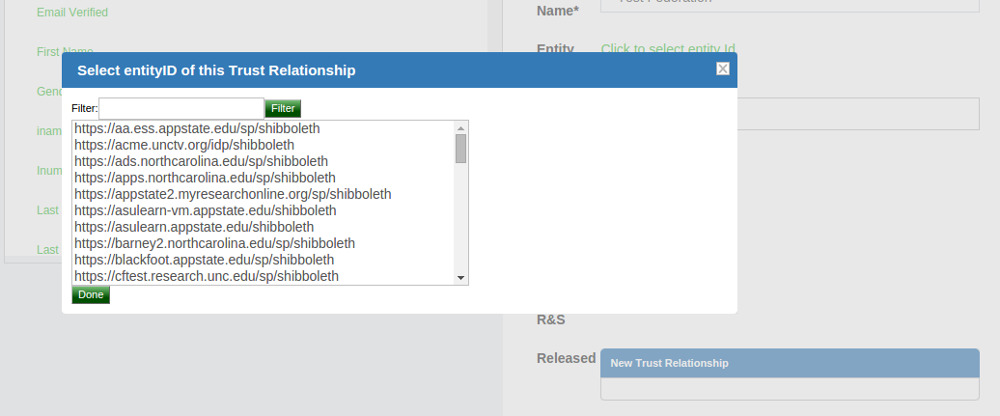

# SAML
## Overview
SAML is an XML-based, open-standard data format for exchanging 
authentication and authorization data between an identity provider 
(like the Gluu Server) and a service provider (like Dropbox, O365, etc.). 
SAML is a stable and mature standard, and is well supported at many of the 
Internet's largest domains. However, the last major release of SAML was in 2005! 
Therefore it is important to understand when to use SAML and when to use a 
newer protocol like OpenID Connect to achieve your identity goals. 

Refer to these four considerations to determine which protocol 
to use for single sign-on (SSO):

- If you have an application that already supports SAML, use SAML.
- If you need to support user login at an external IDP (like a customer or partner IDP), use SAML.
- If you have a mobile application, use OpenID Connect.
- If you are writing a new application, use OpenID Connect.

If you are continuing with the SAML documentation it is presumed your use case aligns with one or both of the first two bullet points above. If not, we recommend that you review the [OpenID Connect](./openid-connect.md) portion of the Gluu Server docs. 

### Outbound vs. Inbound SAML 
There are two main SAML authentication workflows: outbound SAML and inbound SAML. 

Outbound SAML can also be called SP-initiated Single Sign-On (SSO) or traditional SAML. 
In an outbound SAML transaction a website or application (SP) redirects a user to a 
designated Identity Provider (IDP) for authentication and authorization. 
The IDP asks for the user's credentials and upon successful authentication redirects the user to the protected content. 

Inbound SAML enables an organization to offer SAML authentication as a front door to their digital service. Inbound SAML is a common requirement for SaaS providers who need to support the authentication requirements of large enterprise customers.

The typical user flow for inbound SAML is as follows: 

1. User tries to access your protected resource;    
2. User is redirected to a discovery page (presented by your IDP) that presents one or more external IDP's that they may have existing credentials at (their "home IDP");   
3. User selects their home IDP and is sent for authentication;   
4. Upon successful authentication at their home IDP, user is redirected back to your service with access to the protected resource. 

The Gluu Server bundles separate components to support both workflows (installation of each component is optional during Gluu Server deployment):

- For outbound SAML, the Gluu Server bundles the Shibboleth SAML IDP. 

- For inbound SAML, the Gluu Server bundles the Asimba SAML Proxy. 

Documentation for each service follows in the sections below. 
 
## Outbound SAML (Shibboleth)
Outbound SAML can also be called SP-initiated Single Sign-On (SSO) 
or traditional SAML. In an outbound SAML transaction a website or application (SP) 
redirects a user to a designated Identity Provider (IDP) for authentication 
and authorization. The IDP will ask for the user's credentials and upon successful 
authentication, the user is sent back to the SP logged in. 

In order for this transaction to happen successfully there must be pre-established 
trust between the IDP and the SP. In the Gluu Server, the IDPs SSO configuration is 
called a Trust Relationship (TR). The following sections cover how to create a TR in the Gluu Server. 

!!! Note
    For any outbound SAML transaction, a trust relationship must be created in the IDP.

### Trust Relationship Requirements     
Each Trust Relationship requires the infomation listed below.

**Metadata of the SP**       
Metadata is an XML file which has configuration data used to establish trust between the website (SP) and IDP (Gluu Server). Websites (SP) can provide metadata via a URL or as a separate file. Metadata can change, so a static URL typically requires the least amount of ongoing maintenance. 
  
**Required Attributes**      
Each SP may require one or many attributes in order to grant a user access. 
Required attributes vary depending on the application, and should be 
explicitly listed in the application's documentation. The Gluu Server ships with 
certain preconfigured attributes and also supports the creation of custom attributes. 
Once the attributes are available in the Gluu Server, the administrator only needs 
to click on the desired attribute(s) and it will be released to the SP upon 
successful user authentication.

### Create a Trust Relationship in the Gluu Server       
* Go to `SAML` > `Trust Relationships`
* Click on `Add Trust Relationship`
* A new page will appear where you can provide all the required information to create a Trust
  Relationship(TR).


* _Display Name_: Name of the Trust Relationship (it should be unique for every trust relationship)     
* _Description_: Little description. Purpose and SSO link can be added here.    
* _Metadata Type_: There are four available options to choose from. The correct Type depends on how the SP is delivering Metadata to your IDP.      
    * _File_: Choose File if the SP has provided an uploadable metadata document in XML format.
    * _URI_: Chose URI if the SP metadata is hosted on a URI that is accessible from the Internet.
    * _Generate_: Choose Generate if the SP is an "inhouse application" or the “Shibboleth SP” is going to be installed in the target application (SP). This option will generate a how-to guide for installing the Shibboleth SP. If you plan on using the Generate method, please note the following:          
            * _URL_ : This is the hostname of the SP.     
            * _Public certificate_ : You must provide the certificate, which is a Base64 encoded ASCII file, and contain "-----BEGIN CERTIFICATE-----" and "-----END CERTIFICATE-----". This certificate **can not** be password protected.               
            * After creating the Trust Relationship, download the generated configuration files from the `Download Shibboleth2 configuration files` link and place these configuration files inside your SP configuration.         
    * _Federation_: Choose this option if the target application (SP) is affiliated with a federation service (e.g. InCommon, NJEdge etc.). Once you select “Federation” as the Metadata Type, another drop down menu called “Select Federation” will appear. From this drop menu you can select the appropriate federation. After selecting the “Federation Name”, a new link called “Click to select
entity id” will appear. Use this link to find and select the SP entityIDs that you wish to create SSO with. Learn how to establish trust with a federation [below](#federation-configuration).     

* _Released_: The SPs required attributes must be added to this panel. The required attributes can be selected from the menu on the left with the heading “Release Additional Attributes”.     

The Trust Relationship(TR) is added by clicking the `Add` button located in the lower left side of the page.     

### Relying Party Configuration     
If the target application does not already support SAML, the Relying Party software must be configured. The relying party configuration is accessible on the TR Creation page. The checkbox `Configure specific Relying Party` must be checked.     

     

The checkbox will result in a link which can be accessed to find information about configuring the relying party for the TR. The image below shows the relying party config panel from which the administrator can add the specific option.     

     

!!! Note     
    If the target application does not already support a federation standard like SAML, and you or the developer are planning on adding federation to the application, we strongly recommend using OpenID Connect rather than SAML. OpenID Connect is newer, easier to use, and follows modern best practices. Learn more in our blog: [OAuth vs. SAML vs. OpenID Connect](http://gluu.co/oauth-saml-openid).
    
### Federation Configuration     
If the SP is part of an identity federation such as InCommon, the administrator must add the federation as an SP in the Gluu Server. This will enable the administrator to more easily create TRs with SPs in the federation. The example below shows how an administrator would add a TR for the InCommon Federation.


Once a TR has been established with the federation, the Gluu Server administrator can easily create TRs with any SP included in the federation by selecting the federation from the `Federation Name` drop down menu and selecting the entity-id for the SP.



## Inbound SAML (Asimba)
Inbound SAML allows users from external domains to login at their home identity provider to gain access to resources protected by the Gluu Server. The Gluu Server uses an open source product called [Asimba](http://www.asimba.org/site/) to normalize inbound SAML. 

The following documentation provides a step-by-step guide for configuring Asimba with two (2) IDPs and a single (1) SP. The guide includes use of a SAML interception script which is shipped with the Gluu Server and simplifies the process of using Asimba. The administrator can add multiple IDPs or SPs (as required) using the method outlined below. Each SP and IDP must be connected to the IDP that has the Asimba module enabled.

!!! Note 
    A description of the SAML interception script is available [here](https://github.com/GluuFederation/oxAuth/tree/master/Server/integrations/saml).


  
### Notes
  - For this documentation and we used three demo servers:
     - `https://[proxy_hostname]` is the proxy Gluu server with Shibboleth and Asimba installed.
     - `https://[idp_hostname]` is the remote authentication Gluu server with Shibboleth installed.
     - `https://[sp_hostname]` is the remote SP Gluu Server with the Shibboleth SP installed.
  - For this documentation we use the Gluu Server version 2.4.4.2 and the Shibboleth SP version 2.6.
  

### Gluu-Asimba Server Configuration

#### Custom Interception script named saml/asimba configuration

 - Log into oxTrust
 - Configuration -> Manage Custom Scripts
 - Script name 'saml'
   - Custom property ( key/value ):
     - asimba_entity_id: `https://[proxy_hostname]/saml`
     - enforce_uniqueness_attr_list: issuerIDP, uid
     - saml_deployment_type: enroll_all_attr
     - saml_idp_attributes_mapping: { "attribute_name": ["attribute_name", "SAML2 URI"] }
       - example: ``` {"uid": ["uid", "urn:oid:0.9.2342.19200300.100.1.1"], "mail": ["mail", "urn:oid:0.9.2342.19200300.100.1.3"], "issuerIDP": ["issuerIDP" ] } ```
     - saml_idp_sso_target_url: `https://[proxy_hostname]/asimba/profiles/saml2/sso/web`
     - saml_update_user: true
     - user_object_classes: gluuPerson, ox-1A1EAA99F942902300012AE17F0A [ This 'ox-1A1EAA99F942902300012AE17F0A' OC value is different for your server. To get your own value, search for 'gluuAttributeOrigin' in ldap ]
     - saml_use_authn_context: false
     - saml_generate_name_id: true
     - asimba_saml_certificate_file: /etc/certs/saml.pem [ You need to create a 'saml.pem' cert inside /etc/certs/ location. The ingredient of this pem will be asimba.crt without 'BEGIN' and 'END' tag. Permissin of this pem will be tomcat:tomcat ]
     - saml_validate_response: false
   - Script: Script is attached below. named 'SAML script'.

#### SP Requestor

 - SAML -> SP Requestors
 - 'Add SP Requestor'
   - ID: `https://[proxy_hostname]/saml`
   - Friendly Name: oxAuth SAML
   - Metadata URL: Not required
   - Metadata Timeout: -1
   - Metadata File: Create a SAML metadata like below and save it as 'saml_oxauth_metadata.xml'. Upload this metadata. Replace entityID and ACS Location with your hostname.
      - Sample metadata attached below. Named 'SAML oxAuth metadata'
    - Trust Certificate File: Not required
    - Properties: Not required
    - Enabled: Yes
    - Signing: No

#### Add External IDP

 - SAML -> IDPs
 - 'Add IDP'
   - ID: EntityID of remote IDP. i.e. `https://[idp_hostname]/idp/shibboleth`
   - Friendly Name: Remote AuthN Server 1
   - Metadata URL: Not required
   - Metadata Timeout: -1
   - Metadata File: Upload metadata
   - Trust Certificate File: Grab SAML metadata from remote IDP and upload that. This certificate must be no password protected and x509 format crt. If remote IDP is another Gluu Server                                                 then grab 'shibIDP.crt' from /etc/certs/ of that server.
   - NameIDFormat: urn:oasis:names:tc:SAML:2.0:nameid-format:transient
   - Enabled: Yes
   - Send Scoping: Yes
   - AllowCreate: Yes
   - Disable SSO for IDP: No
   - ACS Index: Yes
   - Send NameIDPolicy: Yes
   - Avoid Subject Confirmations: No
   - Add

 #### asimba.xml file configuration

  - SSH into VM
  - Log into Gluu Server container
  - As user 'tomcat', open 'asimba.xml'. Location: /opt/tomcat/webapps/asimba/WEB-INF/conf
  - Uncomment
  
       ```
       <gather>
           <attribute name="whitelist-attribute-name" />
       </gather>
       ```
       
   - Add `attribute name="*"` in attribute release class and restart tomcat

```
        <attributerelease class="com.alfaariss.oa.engine.attribute.release.configuration.ConfigurationFactory">
                <policy id="asimba.releasepolicy.1" friendlyname="Default Attribute Release policy" enabled="true">
                        <attribute name="firstname" />
                        <attribute name="lastname" />
                        <attribute name="email" />
                        <attribute name="role" />
                        <attribute name="country" />
                        <attribute name="*" />
                        
 ```

#### Create custom attribute named 'issuerIDP'

  - Log into oxTrust
  - Configuration -> Attributes
  - 'Add Attribute'
    - Name: issuerIDP
    - SAML1 URI: nothing
    - SAML2 URI: nothing
    - Display Name: issuerIDP
    - Type: Text
    - Edit Type: admin
    - View Type: admin + user
    - Usage Type: Not defined
    - Multivalued: False
    - oxAuth claim name: blank
    - SCIM Attribute: False
    - Description: Custom attribute to grab issuerIDP info
    - Status: Active
    - 'Update'

### Remote Authentication Server configuration

#### Create Trust Relationship

  - Download you Asimba server's metadata with `https://[proxy_hostname]/asimba/profiles/saml2` and save it as 'gluu_asimba_server_metadata.xml'
  - Log into Authentication Server's oxTrust
  - Create a new trust relationship with this metadata which you just downloaded.
  - RelyingParty configuration:
    - SAML2SSO profile:
      - signResponses: conditional
      - signAssertions: never
      - signRequests: conditional
      - encryptAssertions: never
      - encryptNameIds: never
  - Attribute: Release transientID and Username attribute


#### New test user registration

##### Enable 'User Registration' module

 - Log into oxTrust
 - 'Manage Custom Scripts'
 - 'User Registration' tab
   - Custom property: enable_user = true
   - 'Enabled' it
   - Hit 'Update'

##### New user registration

  - Hit `https://[idp_hostname]/identity/register`
  - Fill up the form and new user will be registered
  - We will use this user to test SSO.

### Remote SP configuration

#### Shibboleth SP installation

 - Install SP by following: https://gluu.org/docs/ce/2.4.4/integration/saml-sp/#super-quick-ubuntu-shib-apache-install doc

#### shibboleth2.xml configuration

 - Download Shibboleth metadata of your Gluu-Asimba Server with `https://[proxy_hostname]/idp/shibboleth`
 - Put it inside /etc/shibboleth/ location
 - Modify shibboleth2 xml file like below:
    - SSO entityID:
```
   <SSO entityID="https://[proxy_hostname]/idp/shibboleth"
       discoveryProtocol="SAMLDS" discoveryURL="https://ds.example.org/DS/WAYF">
       SAML2 SAML1
   </SSO>
```

   - Metadata provider:

```
<MetadataProvider type="XML" validate="true" file="proxy_server_metadata.xml"/>
```

- Restart shibd and apache2

 ### Trust relationship in Gluu-Asimba server

 We need to create a trust relationship in Gluu-Asimba server with Shibboleth SP metadata.

  - Log into Gluu-Asimba server
  - Grab Shibboleth SP metadata. You can get that with `https://[sp_hostname]/Shibboleth.sso/Metadata`


 ### Test SSO

  - Log into Gluu-Asimba server and enable 'basic' script from 'Manage Custom Scripts' section.
  - Go to 'Manage Authentication'
    - 'Default Authentication Method'
      - Authentication mode: saml
      - oxTrust authentication mode: basic
      - Hit 'Update'
   - Try SP SSO link ( for our case it's `https://[sp_hostname]/protected/printHeaders.py` ). Note: for testing you need to use the test user you registered in auth.gluu.org.


* [Youtube Video Link](https://youtu.be/YEyrOWJu0yo)

### Scripts

#### SAML script:

```
# oxAuth is available under the MIT License (2008). See http://opensource.org/licenses/MIT for full text.
# Copyright (c) 2016, Gluu
#
# Author: Yuriy Movchan
#

from org.jboss.seam.contexts import Context, Contexts
from org.jboss.seam.security import Identity
from org.jboss.seam import Component
from javax.faces.context import FacesContext
from org.jboss.seam.faces import FacesMessages
from org.jboss.seam.international import StatusMessage
from org.xdi.model.custom.script.type.auth import PersonAuthenticationType
from org.xdi.oxauth.service import UserService, ClientService, AuthenticationService, AttributeService
from org.xdi.oxauth.service.net import HttpService
from org.xdi.util import StringHelper, ArrayHelper, Util
from org.gluu.saml import SamlConfiguration, AuthRequest, Response
from java.util import Arrays, ArrayList, HashMap, IdentityHashMap
from org.xdi.oxauth.model.common import User
from org.xdi.ldap.model import CustomAttribute
from java.lang import String, StringBuilder

from jarray import array
import java

try:
    import json
except ImportError:
    import simplejson as json

class PersonAuthentication(PersonAuthenticationType):
    def __init__(self, currentTimeMillis):
        self.currentTimeMillis = currentTimeMillis

    def init(self, configurationAttributes):
        print "Asimba. Initialization"

        asimba_saml_certificate_file = configurationAttributes.get("asimba_saml_certificate_file").getValue2()
        saml_idp_sso_target_url = configurationAttributes.get("saml_idp_sso_target_url").getValue2()
        asimba_entity_id = configurationAttributes.get("asimba_entity_id").getValue2()
        saml_use_authn_context = StringHelper.toBoolean(configurationAttributes.get("saml_use_authn_context").getValue2(), True)
        if (saml_use_authn_context):
            saml_name_identifier_format = configurationAttributes.get("saml_name_identifier_format").getValue2()
        else:
            saml_name_identifier_format = None

        asimba_saml_certificate = self.loadCeritificate(asimba_saml_certificate_file)
        if (StringHelper.isEmpty(asimba_saml_certificate)):
            print "Asimba. Initialization. File with x509 certificate should be not empty"
            return False

        samlConfiguration = SamlConfiguration()

        # Set the issuer of the authentication request. This would usually be the URL of the issuing web application
        samlConfiguration.setIssuer(asimba_entity_id)

        # Tells the IdP to return a persistent identifier for the user
        samlConfiguration.setNameIdentifierFormat(saml_name_identifier_format)

        # The URL at the Identity Provider where to the authentication request should be sent
        samlConfiguration.setIdpSsoTargetUrl(saml_idp_sso_target_url)

        # Enablediable RequestedAuthnContext
        samlConfiguration.setUseRequestedAuthnContext(saml_use_authn_context)

        # Load x509 certificate
        samlConfiguration.loadCertificateFromString(asimba_saml_certificate)

        self.samlConfiguration = samlConfiguration

        self.generateNameId = False
        if configurationAttributes.containsKey("saml_generate_name_id"):
            self.generateNameId = StringHelper.toBoolean(configurationAttributes.get("saml_generate_name_id").getValue2(), False)
        print "Asimba. Initialization. The property saml_generate_name_id is %s" % self.generateNameId

        self.updateUser = False
        if configurationAttributes.containsKey("saml_update_user"):
            self.updateUser = StringHelper.toBoolean(configurationAttributes.get("saml_update_user").getValue2(), False)

        print "Asimba. Initialization. The property saml_update_user is %s" % self.updateUser

        self.userObjectClasses = None
        if configurationAttributes.containsKey("user_object_classes"):
            self.userObjectClasses = self.prepareUserObjectClasses(configurationAttributes)

        self.userEnforceAttributesUniqueness = None
        if configurationAttributes.containsKey("enforce_uniqueness_attr_list"):
            self.userEnforceAttributesUniqueness = self.prepareUserEnforceUniquenessAttributes(configurationAttributes)

        self.attributesMapping = None
        if configurationAttributes.containsKey("saml_idp_attributes_mapping"):
            saml_idp_attributes_mapping = configurationAttributes.get("saml_idp_attributes_mapping").getValue2()
            if (StringHelper.isEmpty(saml_idp_attributes_mapping)):
                print "Asimba. Initialization. The property saml_idp_attributes_mapping is empty"
                return False

            self.attributesMapping = self.prepareAttributesMapping(saml_idp_attributes_mapping)
            if (self.attributesMapping == None):
                print "Asimba. Initialization. The attributes mapping isn't valid"
                return False

        self.samlExtensionModule = None
        if (configurationAttributes.containsKey("saml_extension_module")):
            saml_extension_module_name = configurationAttributes.get("saml_extension_module").getValue2()
            try:
                self.samlExtensionModule = __import__(saml_extension_module_name)
                saml_extension_module_init_result = self.samlExtensionModule.init(configurationAttributes)
                if (not saml_extension_module_init_result):
                    return False
            except ImportError, ex:
                print "Asimba. Initialization. Failed to load saml_extension_module: '%s'" % saml_extension_module_name
                print "Asimba. Initialization. Unexpected error:", ex
                return False

        self.debugEnrollment = False

        print "Asimba. Initialized successfully"
        return True

    def destroy(self, configurationAttributes):
        print "Asimba. Destroy"
        print "Asimba. Destroyed successfully"
        return True

    def getApiVersion(self):
        return 1

    def isValidAuthenticationMethod(self, usageType, configurationAttributes):
        return True

    def getAlternativeAuthenticationMethod(self, usageType, configurationAttributes):
        return None

    def authenticate(self, configurationAttributes, requestParameters, step):
        context = Contexts.getEventContext()
        authenticationService = Component.getInstance(AuthenticationService)
        userService = Component.getInstance(UserService)

        saml_map_user = False
        saml_enroll_user = False
        saml_enroll_all_user_attr = False
        # Use saml_deployment_type only if there is no attributes mapping
        if (configurationAttributes.containsKey("saml_deployment_type")):
            saml_deployment_type = StringHelper.toLowerCase(configurationAttributes.get("saml_deployment_type").getValue2())

            if (StringHelper.equalsIgnoreCase(saml_deployment_type, "map")):
                saml_map_user = True

            if (StringHelper.equalsIgnoreCase(saml_deployment_type, "enroll")):
                saml_enroll_user = True

            if (StringHelper.equalsIgnoreCase(saml_deployment_type, "enroll_all_attr")):
                saml_enroll_all_user_attr = True

        saml_allow_basic_login = False
        if (configurationAttributes.containsKey("saml_allow_basic_login")):
            saml_allow_basic_login = StringHelper.toBoolean(configurationAttributes.get("saml_allow_basic_login").getValue2(), False)

        use_basic_auth = False
        if (saml_allow_basic_login):
            # Detect if user used basic authnetication method
            credentials = Identity.instance().getCredentials()

            user_name = credentials.getUsername()
            user_password = credentials.getPassword()
            if (StringHelper.isNotEmpty(user_name) and StringHelper.isNotEmpty(user_password)):
                use_basic_auth = True

        if ((step == 1) and saml_allow_basic_login and use_basic_auth):
            print "Asimba. Authenticate for step 1. Basic authentication"

            context.set("saml_count_login_steps", 1)

            credentials = Identity.instance().getCredentials()
            user_name = credentials.getUsername()
            user_password = credentials.getPassword()

            logged_in = False
            if (StringHelper.isNotEmptyString(user_name) and StringHelper.isNotEmptyString(user_password)):
                userService = Component.getInstance(UserService)
                logged_in = userService.authenticate(user_name, user_password)

            if (not logged_in):
                return False

            return True

        if (step == 1):
            print "Asimba. Authenticate for step 1"

            currentSamlConfiguration = self.getCurrentSamlConfiguration(self.samlConfiguration, configurationAttributes, requestParameters)
            if (currentSamlConfiguration == None):
                print "Asimba. Prepare for step 1. Client saml configuration is invalid"
                return False

            saml_response_array = requestParameters.get("SAMLResponse")
            if ArrayHelper.isEmpty(saml_response_array):
                print "Asimba. Authenticate for step 1. saml_response is empty"
                return False

            saml_response = saml_response_array[0]

            print "Asimba. Authenticate for step 1. saml_response: '%s'" % saml_response

            samlResponse = Response(currentSamlConfiguration)
            samlResponse.loadXmlFromBase64(saml_response)

            saml_validate_response = True
            if (configurationAttributes.containsKey("saml_validate_response")):
                saml_validate_response = StringHelper.toBoolean(configurationAttributes.get("saml_validate_response").getValue2(), False)

            if (saml_validate_response):
                if (not samlResponse.isValid()):
                    print "Asimba. Authenticate for step 1. saml_response isn't valid"

            saml_response_attributes = samlResponse.getAttributes()
            print "Asimba. Authenticate for step 1. attributes: '%s'" % saml_response_attributes

            if (saml_map_user):
                saml_user_uid = self.getSamlNameId(samlResponse)
                if saml_user_uid == None:
                    return False

                # Use mapping to local IDP user
                print "Asimba. Authenticate for step 1. Attempting to find user by oxExternalUid: saml: '%s'" % saml_user_uid

                # Check if the is user with specified saml_user_uid
                find_user_by_uid = userService.getUserByAttribute("oxExternalUid", "saml:%s" % saml_user_uid)

                if (find_user_by_uid == None):
                    print "Asimba. Authenticate for step 1. Failed to find user"
                    print "Asimba. Authenticate for step 1. Setting count steps to 2"
                    context.set("saml_count_login_steps", 2)
                    context.set("saml_user_uid", saml_user_uid)
                    return True

                found_user_name = find_user_by_uid.getUserId()
                print "Asimba. Authenticate for step 1. found_user_name: '%s'" % found_user_name

                user_authenticated = authenticationService.authenticate(found_user_name)
                if (user_authenticated == False):
                    print "Asimba. Authenticate for step 1. Failed to authenticate user"
                    return False

                print "Asimba. Authenticate for step 1. Setting count steps to 1"
                context.set("saml_count_login_steps", 1)

                post_login_result = self.samlExtensionPostLogin(configurationAttributes, find_user_by_uid)
                print "Asimba. Authenticate for step 1. post_login_result: '%s'" % post_login_result

                return post_login_result
            elif (saml_enroll_user):
                # Convert SAML response to user entry
                newUser = self.getMappedUser(configurationAttributes, requestParameters, saml_response_attributes)

                saml_user_uid = self.getNameId(samlResponse, newUser)
                if saml_user_uid == None:
                    return False

                self.setDefaultUid(newUser, saml_user_uid)
                newUser.setAttribute("oxExternalUid", "saml:%s" % saml_user_uid)

                # Use auto enrollment to local IDP
                print "Asimba. Authenticate for step 1. Attempting to find user by oxExternalUid: saml: '%s'" % saml_user_uid

                # Check if there is user with specified saml_user_uid
                find_user_by_uid = userService.getUserByAttribute("oxExternalUid", "saml:%s" % saml_user_uid)
                if find_user_by_uid == None:
                    # Auto user enrollment
                    print "Asimba. Authenticate for step 1. There is no user in LDAP. Adding user to local LDAP"

                    print "Asimba. Authenticate for step 1. Attempting to add user '%s' with next attributes: '%s'" % (saml_user_uid, newUser.getCustomAttributes())
                    user_unique = self.checkUserUniqueness(newUser)
                    if not user_unique:
                        print "Asimba. Authenticate for step 1. Failed to add user: '%s'. User not unique" % newUser.getUserId()
                        facesMessages = FacesMessages.instance()
                        facesMessages.add(StatusMessage.Severity.ERROR, "Failed to enroll. User with same key attributes exist already")
                        FacesContext.getCurrentInstance().getExternalContext().getFlash().setKeepMessages(True)
                        return False

                    find_user_by_uid = userService.addUser(newUser, True)
                    print "Asimba. Authenticate for step 1. Added new user with UID: '%s'" % find_user_by_uid.getUserId()
                else:
                    if self.updateUser:
                        print "Asimba. Authenticate for step 1. Attempting to update user '%s' with next attributes: '%s'" % (saml_user_uid, newUser.getCustomAttributes())
                        find_user_by_uid.setCustomAttributes(newUser.getCustomAttributes())
                        userService.updateUser(find_user_by_uid)
                        print "Asimba. Authenticate for step 1. Updated user with UID: '%s'" % saml_user_uid

                found_user_name = find_user_by_uid.getUserId()
                print "Asimba. Authenticate for step 1. found_user_name: '%s'" % found_user_name

                user_authenticated = authenticationService.authenticate(found_user_name)
                if (user_authenticated == False):
                    print "Asimba. Authenticate for step 1. Failed to authenticate user: '%s'" % found_user_name
                    return False

                print "Asimba. Authenticate for step 1. Setting count steps to 1"
                context.set("saml_count_login_steps", 1)

                post_login_result = self.samlExtensionPostLogin(configurationAttributes, find_user_by_uid)
                print "Asimba. Authenticate for step 1. post_login_result: '%s'" % post_login_result

                return post_login_result
            elif (saml_enroll_all_user_attr):
                # Convert SAML response to user entry
                newUser = self.getMappedAllAttributesUser(saml_response_attributes)

                saml_user_uid = self.getNameId(samlResponse, newUser)
                if saml_user_uid == None:
                    return False

                self.setDefaultUid(newUser, saml_user_uid)
                newUser.setAttribute("oxExternalUid", "saml:%s" %  saml_user_uid)

                print "Asimba. Authenticate for step 1. Attempting to find user by oxExternalUid: saml:%s" % saml_user_uid

                # Check if there is user with specified saml_user_uid
                find_user_by_uid = userService.getUserByAttribute("oxExternalUid", "saml:%s" %  saml_user_uid)
                if (find_user_by_uid == None):
                    # Auto user enrollment
                    print "Asimba. Authenticate for step 1. There is no user in LDAP. Adding user to local LDAP"

                    print "Asimba. Authenticate for step 1. Attempting to add user '%s' with next attributes: '%s'" % (saml_user_uid, newUser.getCustomAttributes())
                    user_unique = self.checkUserUniqueness(newUser)
                    if not user_unique:
                        print "Asimba. Authenticate for step 1. Failed to add user: '%s'. User not unique" % newUser.getUserId()
                        facesMessages = FacesMessages.instance()
                        facesMessages.add(StatusMessage.Severity.ERROR, "Failed to enroll. User with same key attributes exist already")
                        FacesContext.getCurrentInstance().getExternalContext().getFlash().setKeepMessages(True)
                        return False

                    find_user_by_uid = userService.addUser(newUser, True)
                    print "Asimba. Authenticate for step 1. Added new user with UID: '%s'" % find_user_by_uid.getUserId()
                else:
                    if self.updateUser:
                        print "Asimba. Authenticate for step 1. Attempting to update user '%s' with next attributes: '%s'" % (saml_user_uid, newUser.getCustomAttributes())
                        find_user_by_uid.setCustomAttributes(newUser.getCustomAttributes())
                        userService.updateUser(find_user_by_uid)
                        print "Asimba. Authenticate for step 1. Updated user with UID: '%s'" % saml_user_uid

                found_user_name = find_user_by_uid.getUserId()
                print "Asimba. Authenticate for step 1. found_user_name: '%s'" % found_user_name

                user_authenticated = authenticationService.authenticate(found_user_name)
                if (user_authenticated == False):
                    print "Asimba. Authenticate for step 1. Failed to authenticate user"
                    return False

                print "Asimba. Authenticate for step 1. Setting count steps to 1"
                context.set("saml_count_login_steps", 1)

                post_login_result = self.samlExtensionPostLogin(configurationAttributes, find_user_by_uid)
                print "Asimba. Authenticate for step 1. post_login_result: '%s'" % post_login_result

                return post_login_result
            else:
                if saml_user_uid == None:
                    return False

                # Check if the is user with specified saml_user_uid
                print "Asimba. Authenticate for step 1. Attempting to find user by uid: '%s'" % saml_user_uid

                find_user_by_uid = userService.getUser(saml_user_uid)
                if (find_user_by_uid == None):
                    print "Asimba. Authenticate for step 1. Failed to find user"
                    return False

                found_user_name = find_user_by_uid.getUserId()
                print "Asimba. Authenticate for step 1. found_user_name: '%s'" % found_user_name

                user_authenticated = authenticationService.authenticate(found_user_name)
                if (user_authenticated == False):
                    print "Asimba. Authenticate for step 1. Failed to authenticate user"
                    return False

                print "Asimba. Authenticate for step 1. Setting count steps to 1"
                context.set("saml_count_login_steps", 1)

                post_login_result = self.samlExtensionPostLogin(configurationAttributes, find_user_by_uid)
                print "Asimba. Authenticate for step 1. post_login_result: '%s'" % post_login_result

                return post_login_result
        elif (step == 2):
            print "Asimba. Authenticate for step 2"

            sessionAttributes = context.get("sessionAttributes")
            if (sessionAttributes == None) or not sessionAttributes.containsKey("saml_user_uid"):
                print "Asimba. Authenticate for step 2. saml_user_uid is empty"
                return False

            saml_user_uid = sessionAttributes.get("saml_user_uid")
            passed_step1 = StringHelper.isNotEmptyString(saml_user_uid)
            if (not passed_step1):
                return False

            credentials = Identity.instance().getCredentials()
            user_name = credentials.getUsername()
            user_password = credentials.getPassword()

            logged_in = False
            if (StringHelper.isNotEmptyString(user_name) and StringHelper.isNotEmptyString(user_password)):
                logged_in = userService.authenticate(user_name, user_password)

            if (not logged_in):
                return False

            # Check if there is user which has saml_user_uid
            # Avoid mapping Saml account to more than one IDP account
            find_user_by_uid = userService.getUserByAttribute("oxExternalUid", "saml:%s" % saml_user_uid)

            if (find_user_by_uid == None):
                # Add saml_user_uid to user one id UIDs
                find_user_by_uid = userService.addUserAttribute(user_name, "oxExternalUid", "saml:%s" % saml_user_uid)
                if (find_user_by_uid == None):
                    print "Asimba. Authenticate for step 2. Failed to update current user"
                    return False

                post_login_result = self.samlExtensionPostLogin(configurationAttributes, find_user_by_uid)
                print "Asimba. Authenticate for step 2. post_login_result: '%s'" % post_login_result

                return post_login_result
            else:
                found_user_name = find_user_by_uid.getUserId()
                print "Asimba. Authenticate for step 2. found_user_name: '%s'" % found_user_name

                if StringHelper.equals(user_name, found_user_name):
                    post_login_result = self.samlExtensionPostLogin(configurationAttributes, find_user_by_uid)
                    print "Asimba. Authenticate for step 2. post_login_result: '%s'" % post_login_result

                    return post_login_result

            return False
        else:
            return False

    def prepareForStep(self, configurationAttributes, requestParameters, step):
        context = Contexts.getEventContext()
        authenticationService = Component.getInstance(AuthenticationService)

        if (step == 1):
            print "Asimba. Prepare for step 1"

            httpService = Component.getInstance(HttpService)
            request = FacesContext.getCurrentInstance().getExternalContext().getRequest()
            assertionConsumerServiceUrl = httpService.constructServerUrl(request) + "/postlogin"
            print "Asimba. Prepare for step 1. Prepared assertionConsumerServiceUrl: '%s'" % assertionConsumerServiceUrl

            currentSamlConfiguration = self.getCurrentSamlConfiguration(self.samlConfiguration, configurationAttributes, requestParameters)
            if (currentSamlConfiguration == None):
                print "Asimba. Prepare for step 1. Client saml configuration is invalid"
                return False

            # Generate an AuthRequest and send it to the identity provider
            samlAuthRequest = AuthRequest(currentSamlConfiguration)
            external_auth_request_uri = currentSamlConfiguration.getIdpSsoTargetUrl() + "?SAMLRequest=" + samlAuthRequest.getRequest(True, assertionConsumerServiceUrl)

            print "Asimba. Prepare for step 1. external_auth_request_uri: '%s'" % external_auth_request_uri

            context.set("external_auth_request_uri", external_auth_request_uri)

            return True
        elif (step == 2):
            print "Asimba. Prepare for step 2"

            return True
        else:
            return False

    def getExtraParametersForStep(self, configurationAttributes, step):
        if (step == 2):
            return Arrays.asList("saml_user_uid")

        return None

    def getCountAuthenticationSteps(self, configurationAttributes):
        context = Contexts.getEventContext()
        if (context.isSet("saml_count_login_steps")):
            return context.get("saml_count_login_steps")

        return 2

    def getPageForStep(self, configurationAttributes, step):
        if (step == 1):
            saml_allow_basic_login = False
            if (configurationAttributes.containsKey("saml_allow_basic_login")):
                saml_allow_basic_login = StringHelper.toBoolean(configurationAttributes.get("saml_allow_basic_login").getValue2(), False)

            if (saml_allow_basic_login):
                return "/login.xhtml"
            else:
                return "/auth/saml/samllogin.xhtml"

        return "/auth/saml/samlpostlogin.xhtml"

    def logout(self, configurationAttributes, requestParameters):
        return True

    def isPassedStep1():
        credentials = Identity.instance().getCredentials()
        user_name = credentials.getUsername()
        passed_step1 = StringHelper.isNotEmptyString(user_name)

        return passed_step1

    def loadCeritificate(self, asimba_saml_certificate_file):
        asimba_saml_certificate = None

        # Load certificate from file
        f = open(asimba_saml_certificate_file, 'r')
        try:
            asimba_saml_certificate = f.read()
        except:
            print "Asimba. Failed to load certificate from file: '%s'" % asimba_saml_certificate_file
            return None
        finally:
            f.close()

        return asimba_saml_certificate

    def getClientConfiguration(self, configurationAttributes, requestParameters):
        # Get client configuration
        if (configurationAttributes.containsKey("saml_client_configuration_attribute")):
            saml_client_configuration_attribute = configurationAttributes.get("saml_client_configuration_attribute").getValue2()
            print "Asimba. GetClientConfiguration. Using client attribute: '%s'" % saml_client_configuration_attribute

            if (requestParameters == None):
                return None

            client_id = None
            client_id_array = requestParameters.get("client_id")
            if (ArrayHelper.isNotEmpty(client_id_array) and StringHelper.isNotEmptyString(client_id_array[0])):
                client_id = client_id_array[0]

            if (client_id == None):
                eventContext = Contexts.getEventContext()
                if (eventContext.isSet("sessionAttributes")):
                    client_id = eventContext.get("sessionAttributes").get("client_id")

            if (client_id == None):
                print "Asimba. GetClientConfiguration. client_id is empty"
                return None

            clientService = Component.getInstance(ClientService)
            client = clientService.getClient(client_id)
            if (client == None):
                print "Asimba. GetClientConfiguration. Failed to find client '%s' in local LDAP" % client_id
                return None

            saml_client_configuration = clientService.getCustomAttribute(client, saml_client_configuration_attribute)
            if ((saml_client_configuration == None) or StringHelper.isEmpty(saml_client_configuration.getValue())):
                print "Asimba. GetClientConfiguration. Client '%s' attribute '%s' is empty" % ( client_id, saml_client_configuration_attribute )
            else:
                print "Asimba. GetClientConfiguration. Client '%s' attribute '%s' is '%s'" % ( client_id, saml_client_configuration_attribute, saml_client_configuration )
                return saml_client_configuration

        return None

    def getCurrentSamlConfiguration(self, currentSamlConfiguration, configurationAttributes, requestParameters):
        saml_client_configuration = self.getClientConfiguration(configurationAttributes, requestParameters)
        if (saml_client_configuration == None):
            return currentSamlConfiguration

        saml_client_configuration_value = json.loads(saml_client_configuration.getValue())

        client_asimba_saml_certificate = None
        client_asimba_saml_certificate_file = saml_client_configuration_value["asimba_saml_certificate_file"]
        if (StringHelper.isNotEmpty(client_asimba_saml_certificate_file)):
            client_asimba_saml_certificate = self.loadCeritificate(client_asimba_saml_certificate_file)
            if (StringHelper.isEmpty(client_asimba_saml_certificate)):
                print "Asimba. BuildClientSamlConfiguration. File with x509 certificate should be not empty. Using default configuration"
                return currentSamlConfiguration

        clientSamlConfiguration = currentSamlConfiguration.clone()

        if (client_asimba_saml_certificate != None):
            clientSamlConfiguration.loadCertificateFromString(client_asimba_saml_certificate)

        client_asimba_entity_id = saml_client_configuration_value["asimba_entity_id"]
        clientSamlConfiguration.setIssuer(client_asimba_entity_id)

        saml_use_authn_context = saml_client_configuration_value["saml_use_authn_context"]
        client_use_saml_use_authn_context = StringHelper.toBoolean(saml_use_authn_context, True)
        clientSamlConfiguration.setUseRequestedAuthnContext(client_use_saml_use_authn_context)

        return clientSamlConfiguration

    def prepareAttributesMapping(self, saml_idp_attributes_mapping):
        saml_idp_attributes_mapping_json = json.loads(saml_idp_attributes_mapping)

        if len(saml_idp_attributes_mapping_json) == 0:
            print "Asimba. PrepareAttributesMapping. There is no attributes mapping specified in saml_idp_attributes_mapping property"
            return None

        attributeMapping = IdentityHashMap()
        for local_attribute_name in saml_idp_attributes_mapping_json:
            localAttribute = StringHelper.toLowerCase(local_attribute_name)
            for idp_attribute_name in saml_idp_attributes_mapping_json[local_attribute_name]:
                idpAttribute = StringHelper.toLowerCase(idp_attribute_name)
                attributeMapping.put(idpAttribute, localAttribute)

        return attributeMapping

    def prepareUserObjectClasses(self, configurationAttributes):
        user_object_classes = configurationAttributes.get("user_object_classes").getValue2()

        user_object_classes_list_array = StringHelper.split(user_object_classes, ",")
        if (ArrayHelper.isEmpty(user_object_classes_list_array)):
            return None

        return user_object_classes_list_array

    def prepareUserEnforceUniquenessAttributes(self, configurationAttributes):
        enforce_uniqueness_attr_list = configurationAttributes.get("enforce_uniqueness_attr_list").getValue2()

        enforce_uniqueness_attr_list_array = StringHelper.split(enforce_uniqueness_attr_list, ",")
        if (ArrayHelper.isEmpty(enforce_uniqueness_attr_list_array)):
            return None

        return enforce_uniqueness_attr_list_array

    def prepareCurrentAttributesMapping(self, currentAttributesMapping, configurationAttributes, requestParameters):
        saml_client_configuration = self.getClientConfiguration(configurationAttributes, requestParameters)
        if (saml_client_configuration == None):
            return currentAttributesMapping

        saml_client_configuration_value = json.loads(saml_client_configuration.getValue())

        clientAttributesMapping = self.prepareAttributesMapping(saml_client_configuration_value["saml_idp_attributes_mapping"])
        if (clientAttributesMapping == None):
            print "Asimba. PrepareCurrentAttributesMapping. Client attributes mapping is invalid. Using default one"
            return currentAttributesMapping

        return clientAttributesMapping

    def samlExtensionPostLogin(self, configurationAttributes, user):
        if (self.samlExtensionModule == None):
            return True
        try:
            post_login_result = self.samlExtensionModule.postLogin(configurationAttributes, user)
            print "Asimba. ExtensionPostlogin result: '%s'" % post_login_result

            return post_login_result
        except Exception, ex:
            print "Asimba. ExtensionPostlogin. Failed to execute postLogin method"
            print "Asimba. ExtensionPostlogin. Unexpected error:", ex
            return False
        except java.lang.Throwable, ex:
            print "Asimba. ExtensionPostlogin. Failed to execute postLogin method"
            ex.printStackTrace()
            return False

    def checkUserUniqueness(self, user):
        if (self.userEnforceAttributesUniqueness == None):
            return True

        userService = Component.getInstance(UserService)

        # Prepare user object to search by pattern
        userBaseDn = userService.getDnForUser(None)

        userToSearch = User()
        userToSearch.setDn(userBaseDn)

        for userAttributeName in self.userEnforceAttributesUniqueness:
            attribute_values_list = user.getAttributeValues(userAttributeName)
            if (attribute_values_list != None) and (attribute_values_list.size() > 0):
                userToSearch.setAttribute(userAttributeName, attribute_values_list)

        ldapEntryManager = Component.getInstance("ldapEntryManager")

        # TODO: Replace with userService.findEntries in CE 2.4.5
        users = ldapEntryManager.findEntries(userToSearch, 1, 1)
        if users.size() > 0:
            return False

        return True

    def getMappedUser(self, configurationAttributes, requestParameters, saml_response_attributes):
        # Convert Saml result attributes keys to lover case
        saml_response_normalized_attributes = HashMap()
        for saml_response_attribute_entry in saml_response_attributes.entrySet():
            saml_response_normalized_attributes.put(StringHelper.toLowerCase(saml_response_attribute_entry.getKey()), saml_response_attribute_entry.getValue())

        currentAttributesMapping = self.prepareCurrentAttributesMapping(self.attributesMapping, configurationAttributes, requestParameters)
        print "Asimba. Get mapped user. Using next attributes mapping '%s'" % currentAttributesMapping

        newUser = User()

        # Set custom object classes
        if self.userObjectClasses != None:
            print "Asimba. Get mapped user. User custom objectClasses to add persons: '%s'" % Util.array2ArrayList(self.userObjectClasses)
            newUser.setCustomObjectClasses(self.userObjectClasses)

        for attributesMappingEntry in currentAttributesMapping.entrySet():
            idpAttribute = attributesMappingEntry.getKey()
            localAttribute = attributesMappingEntry.getValue()

            if self.debugEnrollment:
                print "Asimba. Get mapped user. Trying to map '%s' into '%s'" % (idpAttribute, localAttribute)

            localAttributeValue = saml_response_normalized_attributes.get(idpAttribute)
            if (localAttributeValue != None):
                if self.debugEnrollment:
                    print "Asimba. Get mapped user. Setting attribute '%s' value '%s'" % (localAttribute, localAttributeValue)

                newUser.setAttribute(localAttribute, localAttributeValue)

        return newUser

    def getMappedAllAttributesUser(self, saml_response_attributes):
        user = User()

        # Set custom object classes
        if self.userObjectClasses != None:
            print "Asimba. Get mapped all attributes user. User custom objectClasses to add persons: '%s'" % Util.array2ArrayList(self.userObjectClasses)
            user.setCustomObjectClasses(self.userObjectClasses)

        # Prepare map to do quick mapping
        attributeService = Component.getInstance(AttributeService)
        ldapAttributes = attributeService.getAllAttributes()
        samlUriToAttributesMap = HashMap()
        for ldapAttribute in ldapAttributes:
            saml2Uri = ldapAttribute.getSaml2Uri()
            if (saml2Uri == None):
                saml2Uri = attributeService.getDefaultSaml2Uri(ldapAttribute.getName())
            samlUriToAttributesMap.put(saml2Uri, ldapAttribute.getName())

        customAttributes = ArrayList()
        for key in saml_response_attributes.keySet():
            ldapAttributeName = samlUriToAttributesMap.get(key)
            if ldapAttributeName == None:
                print "Asimba. Get mapped all attributes user. Skipping saml attribute: '%s'" %  key
                continue

            if StringHelper.equalsIgnoreCase(ldapAttributeName, "uid"):
                continue

            attribute = CustomAttribute(ldapAttributeName)
            attribute.setValues(saml_response_attributes.get(key))
            customAttributes.add(attribute)

        user.setCustomAttributes(customAttributes)

        return user

    def getNameId(self, samlResponse, newUser):
        if self.generateNameId:
            saml_user_uid = self.generateNameUid(newUser)
        else:
            saml_user_uid = self.getSamlNameId(samlResponse)

        return saml_user_uid

    def getSamlNameId(self, samlResponse):
        saml_response_name_id = samlResponse.getNameId()
        if (StringHelper.isEmpty(saml_response_name_id)):
            print "Asimba. Get Saml response. saml_response_name_id is invalid"
            return None

        print "Asimba. Get Saml response. saml_response_name_id: '%s'" % saml_response_name_id

        # Use persistent Id as saml_user_uid
        return saml_response_name_id

    def generateNameUid(self, user):
        if (self.userEnforceAttributesUniqueness == None):
            print "Asimba. Build local external uid. User enforce attributes uniqueness not specified"
            return None

        sb = StringBuilder()
        first = True
        for userAttributeName in self.userEnforceAttributesUniqueness:
            if not first:
                sb.append("!")
            first = False
            attribute_values_list = user.getAttributeValues(userAttributeName)
            if (attribute_values_list != None) and (attribute_values_list.size() > 0):
                first_attribute_value = attribute_values_list.get(0)
                sb.append(first_attribute_value)

        return sb.toString()

    def setDefaultUid(self, user, saml_user_uid):
        if StringHelper.isEmpty(user.getUserId()):
            user.setUserId(saml_user_uid)
```

#### SAML oxAuth metadata:

```
    <md:EntityDescriptor xmlns:md="urn:oasis:names:tc:SAML:2.0:metadata" entityID="https://[proxy_hostname]/saml">
      <md:SPSSODescriptor protocolSupportEnumeration="urn:oasis:names:tc:SAML:2.0:protocol">
        <md:AssertionConsumerService Binding="urn:oasis:names:tc:SAML:2.0:bindings:HTTP-POST" Location="https://[proxy_hostname]/oxauth/postlogin" index="0"/>
      </md:SPSSODescriptor>
      <md:Organization>
        <md:OrganizationName xml:lang="en">Gluu</md:OrganizationName>
        <md:OrganizationDisplayName xml:lang="en">Gluu - Open Source Access Management</md:OrganizationDisplayName>
        <md:OrganizationURL xml:lang="en">http://www.gluu.org</md:OrganizationURL>
      </md:Organization>
      <md:ContactPerson contactType="technical">
        <md:GivenName>Administrator</md:GivenName>
        <md:EmailAddress>support@gluu.org</md:EmailAddress>
      </md:ContactPerson>
    </md:EntityDescriptor>
    
```


