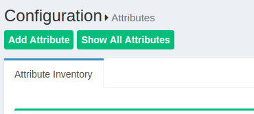

# Gluu Server Administrative Interface

The administration interface (oxTrust) is accessible by navigating
to `https://hostname` (the hostname you provided in the prompt from the 
setup script.) The default username is `admin` and you use the password 
for the `LDAP superuser`.

## Welcome Page

This page displays some basic information about the Gluu Server, like 
free memory, disk space, and activity. The photo icon in the upper-right 
corner routes to the admin profile, and can be used to logout. The left 
menu is used to navigate the admin interface for Gluu Server. 

## Configuration

General Gluu Server configuration is managed in this section. 

### Organization Configuration
There are three sections in the organization configuration page which 
are [System Configuration](#system-configuration), 
[SMTP Server Configuration](#smtp-server-configuration) and
 [OxTrust Settings](#oxtrust-settings). These sections are detailed 
 below with screenshots.

**System Configuration**

Gluu Server CE is shipped with a optional features which 
can be enabled from the system configuration page:
 * `Self-Service Password Reset` Enable users to reset their password 
 via email. Not really recommended but can be used for low assurance
 deployments.
 
 * `SCIM Support` [SCIM](http://www.simplecloud.info/) is a JSON/REST 
 API for user management. Remember, the Gluu Server has an LDAP server
 which needs a full set of users. If you are not synchronizing with an
 existing LDAP server, you need to push users to the Gluu LDAP
 server, and SCIM is a good interface to do that. For example, if you 
 have an identity management platform, or you have a registration
 process on your website, you may want to use SCIM. If don't have this
 requirement--don't enable SCIM! 
 
 * `Passport Support` [Passport](http://passportjs.org) is a tool for 
 social login. You'll need to configure for certain strategies, like
 Facebook or Google. For more information see the Passport authentication
 section.
 
 * `DNS Server(s)` Use only if you want the Gluu Server to use a
 specific DNS server in the chroot container.
 
 * `Maximum Log Size` Is used to control the log file size for oxTrust
 and oxAuth. 
 
 * `User Can Edit Own Profile` Not a widely used features, but could 
  be handy for smaller deployments. 
  
 * `Contact Email` Address that will be used in form displays and email 
 messages.

**SMTP Server Configuration**
The mail server used by the Gluu Server to send notification to the 
pre-selected email address is configured in this page/panel. All the 
fields in this page are manadory and the configuration can be tested 
before confirmation. The fields are self-explanatory and simple such 
as hostname, user, password, ssl-requirement, authentication requirement, 
sending name and address.

**OxTrust Settings**
Some basic information abouht the administrator interface is 
available in this page. The administrator can find out the oxTrust 
build date and number by accessing the oxTrust settings page. The 
administrator can change the organization name, logo and favicon 
settings from this page as well. Finally oxTrust Settings page contains 
the name of the administrator group for Gluu Server. The users added in 
this group will have administrator access in Gluu Server where they will 
be able to maintain/configure the server.

### JSON Configuration
The configuration files are accessible from the administrator interface 
(oxTrust). There are three tabs under the `JSON Configuration` menu

The oxtrust JSON configuration file is accessible from this tab and it 
can be edited from this page. The changes are updated by clicking on the 
`Update` button on the bottom of the page. The details of the file is 
given later in this documentation.

The oxAuth JSON configuration page gives easy access to the different 
endpoints used by Gluu Server CE. This page also contains the supported 
response, grants and algorithms among other information. The details will 
follow later on this documentation.

The oxTrust Import Person Configuration page contains the configuration 
for the file method of importing users into Gluu Server CE. The 
administrator can import users from a `xls` file which must be defined 
in this tab to import data in the LDAP attributes. The default format 
should contain the following fields

### Manage Authentication
The `Manage Authentication` page contains the internal OpenDJ settings 
for Gluu Server CE. The `Default Authentication Method` defines the 
authentication mechanism used for general authentication and oxTrust 
authentication. The separation is introduced because the users logging 
into Service Providers (SP) do not see the administrative console. The 
`oxTrust authentication mode` decides the authentication mechasims for 
the users logging into the oxTrust admin interface.

### Manage Custom Scripts
It will not be an understatement to say that the custom script 
feature makes Gluu Server CE so robust and dynamic. The scripts are 
available for all intents and purposes the major being multi-factor 
authentication. There are many custom scritps included with the vanilla 
Gluu Server CE which can be enabled by clicking the check box.

The details about the custom scripts are given later in this guide.

### Manage Registration
Gluu Server CE is shiped with the feature to register users via the 
user-registration endpoint. The registry feature contains a Captcha 
which can be disabled from this page. Additionally it is possible to 
enable registration configuration from attributes.

### Attributes
The attributes that are avalaible in the Gluu Server CE is found in this 
page. The administration can only see the active attributes when this 
page is accessed. The `Show All Attributes` button will show the inactive 
attributes too. Custom attributes can be added by clicking the `Add 
Attribute` button and filling up a simple form. This section is further 
explained in detail in other section under 
[User Management/attributes](/admin-guide/attribute.md)

### Cache Refresh
Cache Refresh is the mechanism used by Gluu Server CE to import users 
from a backend LDAP/AD data source. The entire configuration is handled 
from this page. The `Cache Refresh` will notify the administrator of any 
problem with cache refresh the last time it was run. The frequency of 
cache refresh is also set from this page with the `Polling interval 
(minutes)` form. The key attributes, object class and the source 
attributes can be defined from the `Customer  BackendKey/Attributes` tab. 
The backend server address, bind DN and other information must go to the 
`Source Backend LDAP Servers` tab. The details about performing 
[cache refresh](/admin-guide/user-group.md) will follow later in this guide.

### Configure Log Viewer
The logs for oxauth, oxtrust, cache refresh and the tomcat log can be 
configured from this tab. The log paths are given with the functionality 
to define any new log template with log file path.

### View Log File
The log files are listed in the `View Log File` page under the 
`Allowed Log Files` tab. The individual logs can be tailed by clicking 
them. The `Configuration` contains the last line count which will show 
the number of lines specified from the log in the `Tail of Log File` 
tab. This section is an alternative to getting into the Gluu `chroot` 
and tailing the log files.

### Server Status
This page will give some basic information about the Gluu Server such as 
the hostname, IP address, free memory & disk space. The number of users 
in the backend is also available in this page.

### Certificates
The certificate page will give the certificate information for Gluu 
Server. The issuer info along with the algorithm used and the expiry 
date is also available.

## SAML
Gluu Server CE contains all SAML related functionalities under the `SAML` 
tab divided into outbound and inbound SAML transactions. Inbound SAML is 
also known as ASIMBA. 

### Outbound

The `Trust Relationships` page, as the name suggests, will allow the 
administrator to view the created trust relationships (TRs) by searching 
using the search button. There is a button to add relationship with the 
same name. All the available TRs can be searched by using two (2) spaces 
in the search bar. There are some information that the administrator needs 
to gather before creating any new TR in Gluu Server. The metadata of the 
Service Provider (SP) connected using TR must be gathered along with the 
required attributes. The creation of TR will be covered in detail later.

## OpenID Connect
OpenID Connect is another protocol supported by Gluu Server CE following 
the [openID Connect specifications](http://openid.net/specs/openid-connect-core-1_0.html). The scopes page contains the `Add Scope` button which can be used to add new scopes in Gluu Server. Additionally the available scopes can be searched by name or listed using two (2) spaces in the search bar.

The OpenID Connect clients are accessible from the `Clients` page under 
`OpenID Connect` tab. The structure is similar to the scopes page with the 
functionality to search by name or use two (2) spaces to list all the 
available clients. New clients can be added by clicking the `Add Client` 
button.

## UMA
UMA or (User-Managed Access) is an access management protocol supported 
by Gluu Server.The available scopes can be searched using the search bar 
on the top of the page. New scope descriptions can be added using the 
`Add Scope Description` button.

UMA resources page also has a searchbar on the top of the page and can be 
used to search for resource sets. New resource sets can be added by 
clocking on the `Add Resource Set` button.

## Users
Users tab allows Gluu admin to do various task, including add admin, 
search users, Cache Refresh, Import users from file, User registration, 
SCIM, and Lock user. This tab is detailed in [User Management](../admin-guide/user-group.md)

## Personal
Personal tab allows the individual person to view his basic profile and 
modify certain fields. This section is detailed under User Management 
in [Personal](../admin-guide/user-group.md)
