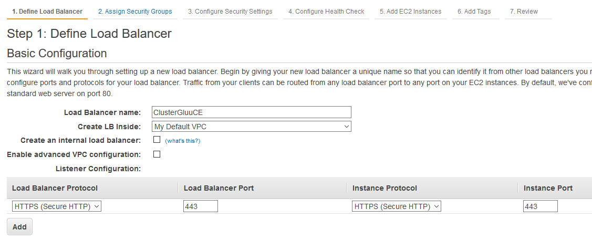
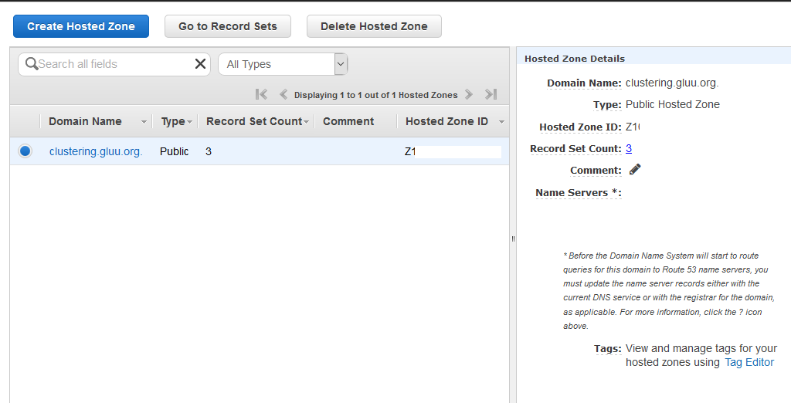
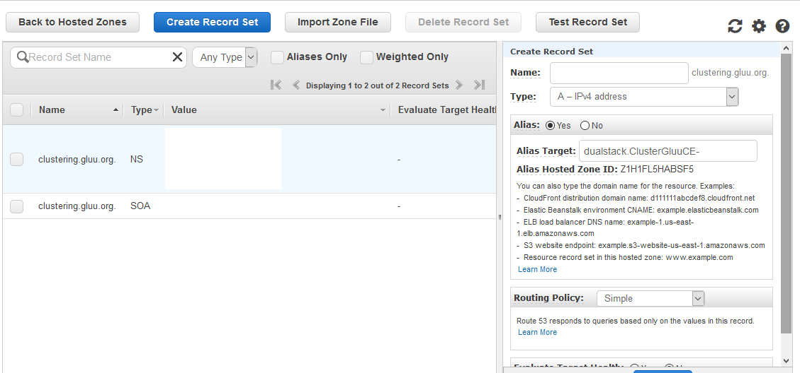

# Load Balancer configuration for Gluu CE Cluster

## Using Amazon ELB

We are going to configure a Load Balancer with hostname 'clustering.gluu.org'. 

  - Select 'Classic Load Balancer' 
    - 
  - Click on 'Create Load Balancer'
    - 
  - Define Load Balancer settings: 
     - 
     - Load Balancer Name: Anything deployer prefer
     - Create LB Inside: My Default VPC ( by default )
     - Load Balancer Protocol: HTTPS/443 
     - Instance Protocol: HTTPS/443
  - Assign Security Groups: Default
     - 
  - Configure Security Settings: We can either use 'ACM' to generate cert or can update existing certificate and key. For this documentation, we are using our existing cert/key. 
  - Configure Health Check: 
     - 
     - Ping Protocol: HTTPS
     - Ping Port: 443
     - Pint Path: /monitoring.html ( We need to create 'monitoring.html' inside all Gluu Server containers:/var/www/html/ )
     - Advanced Details: Default
  - Add EC2 Instances: Here we need to add all our Gluu Servers which are included in cluster. 
     - 
  - If everything goes well, we will observe such confirmations from Amazon ELB. 
  - Configuration of custom hostname: By default Amazon ELB generates a long hostname which is harder to remember and use. In this configuration we are going to setup a human readable hostname for our Load balancer. 'clustering.gluu.org' is the hostname of our cluster so we have to add this name in Amazon ELB. To do that: 
     - Go to: https://console.aws.amazon.com/route53/home
     - Hit 'Hosted Zone'
     - We will see a new page like this
        - 
     - From above page, let's click on 'Go To Record Sets'
     - 'Create Record Set' page: 
        - 
        - From right panel: 
           - Name: Keep it blank. 'clustering.gluu.org' is auto selected. 
           - Type: 'A - IPv4 address'
           - Alias Target: From drop down menu, select Load balancer which we just created
           - Routing Policy: Simple
           - Save
     - Wait for 10-15 mins to complete Amazon ELB's configuration and DNS propagation.
     - After the successful completion of above setup, Configure Stickiness for ELB. 
        - 
