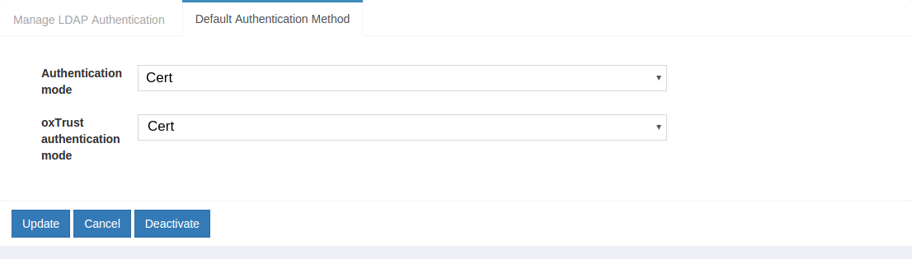

# Certificate Authentication
Gluu Server CE offers a person authentication module enabling Certificate Authentication.

## Overview
The image below contains the design diagram for this module.

The script has a few properties:

|       Property        |Description|   Allowed Values                  |example|
|-------|--------------|------------|-----------------|
|chain_cert_file_path   |mandatory property pointing to certificate chains in [pem][pem] format |file path| /etc/certs/chain_cert.pem   |
|map_user_cert          |specifies if the script should map new user to local account           |true/false| true|
|use_generic_validator  |enable/disable specific certificate validation                         |true/false| false|
|use_path_validator     |enable/disable specific certificate validation                         |true/false| true|
|use_oscp_validator|enable/disable specific certificate validation                              |true/false| false|
|use_crl_validator|enable/disable specific certificate validation                               |true/false| false|
|crl_max_response_size  |specifies the maximum allowed size of [CRL][crl] response              | Integer > 0| 2|

## Installation
The following steps prepare the GLuu Server for Certificate Authentication.

### Configure oxTrust
Follow the steps below to configure the certificate authentication in the oxTrust Admin GUI.

1. Go to Manage Custom Scripts

2. Click on the add custom script button

3. Fill up the from and add the [Certificate Authentication Script](https://raw.githubusercontent.com/GluuFederation/oxAuth/master/Server/integrations/cert/UserCertExternalAuthenticator.py)

4. Enable the script by ticking the check box

5. Change the default authentication method to Certificate/Cert.

