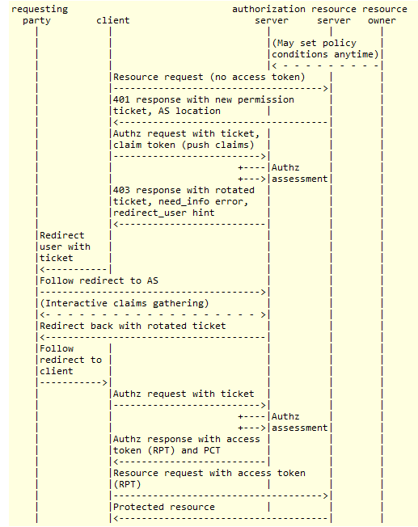

# SCIM protected by UMA

User-managed access (UMA) is a profile of [OAuth2.0](http://tools.ietf.org/html/rfc6749) and is focused on defining standardized flows and constructs for coordinating the protection of an API or existing web resource. For more information on UMA please visit the corresponding [page](uma.md) in the docs - the specification can be found at [kantara website](https://docs.kantarainitiative.org/uma/rec-uma-core.html).

Gluu Server CE supports UMA protection for SCIM endpoints from version 2.4.0 onwards. This functionality is built-in and does not require any special package or installation. 

As usual in open specs, concepts are abstract and hard to grasp at first, as such, the following section condenses some of the most important aspects to be aware of when protecting your SCIM API by UMA.

If you are really in a hurry, you can proceed straight to the [enabled section](#enable-protection) to activate UMA protection.

## Actors involved in protection

!!! Note
    Current Gluu server version supports UMA 1.0.1. Currently, latest version of the standard is 2.0 and will be included for our next release.

The image shown [here](../api-guide/uma-api.md#uma-api-document) summarizes the phases and actors involved in UMA. While you don't need to get through to that complex flow in Gluu server for SCIM setup, it is important to familiarize yourself with the different parties interacting there, namely a resource owner, a client, a resource server, and an authorization server.

* For the case of SCIM, the "resource" is what we are intended to protect, i.e. our database of users and groups stored in LDAP. More exactly we are interested in protecting the set of URLs that expose our data, in other words, the so-called "SCIM endpoint" - something that looks like this: `http://<your_host>/identity/seam/resource/restv1/scim/v2/`.

* The resource owner is normally a legal entity (e.g. your company), or someone acting on its behalf (the administrator of Gluu CE installation). The owner should be capable of granting access to protected resources.

* Requesting party is generally an end-user that seeks access to a protected resource. Only in certain use cases the requesting party and resource owner are the same person. To achieve the task, the requesting party uses a client.

* The client is usually an application capable of making requests for protected resources on the requesting party's behalf. In this setting, Gluu Server already has a ready-to-use client available, namely the [SCIM-client](https://github.com/GluuFederation/SCIM-Client). If you don't feel comfortable with Java but still like coding, you may create your own client as well.

* The resource server hosts the resources to be protected, and thus is capable of dealing with requests for them. We can think of oxTrust as the resource server (at least as a front-end resource server because users and groups are not hosted per se by oxTrust though it has functionalities to able to access and modify data stored in LDAP)

* The authorization server is where real protection takes place. This server issues authorization data according to policies of protection set by the resource owner. In this scenario, it maps directly to oxAuth.

Now you may have a richer perspective of what the protection process entails, so let's proceed with a real setup.

## Enable protection

To make your SCIM endpoint be protected by UMA, you just have to activate a couple of features via oxTrust. Most complexity is hidden by configurations already setup in your default server installation. The [setup script](../installation-guide/setup_py.md) does a lot so that you can start quickly!

* If you haven't done so, enable SCIM from the oxTrust admin GUI. Simply Go to `Configuration` > `Organization Configuration` and choose "enabled" for the SCIM support attribute


* Activate UMA custom script in oxTrust admin GUI: Go to `Configuration` > `Manage Custom Scripts`, and in the tab for `UMA Authorization policies` check "Enabled" at the bottom. Finally press the "Update" button.


In the following section we willgo for a deeper insight and see how configurations correlate to concepts already shown.


## Built-in configurations

!!! Note:
    Throughout this section you will have to inspect LDAP entries. You may export your LDAP contents to an `ldif` file but it's desirable (and more practical) if you can connect to your Gluu Server LDAP using a GUI client such as [Apache DS](https://directory.apache.org/studio/downloads.html).

### Configurations triggered by resource owner

For accuracy's sake, UMA is not concerned with protecting a single resource but a collection of resources, this is called a "resource set" in terms of the spec. The first thing a resource owner should do is configuring the authorization server with policies associated with those resource sets. 

**Policies** are defined by means of **scopes** - think of them as verbs like "read", "write", etc. For SCIM there is a single scope that conveys total access. You can see it at LDAP entry

`inum=<org-inum>!0010!8CAD.B06D,ou=scopes,ou=uma,o=<org-inum>,o=gluu`

it's called "SCIM access".

And the resource set we are interested in is represented by the entry

`inum=<org-inum>!0012!B23E.0517,ou=resource_sets,ou=uma,o=<org-inum>,o=gluu`

So if you inspect its attributes, we have a resource named "SCIM resource set" associated to the scope previously seen, and to a couple of URLs: the SCIM endpoints for version 1 and 2.

For a deeper insight into resource sets, scopes, and policies visit the [UMA page](uma.md#resource-registration) in the docs.

Below is the figure of the UMA spec we referenced earlier. Up to this point we have already covered what is labeled there with *A* and *C*:



### Authorization steps

Before a client tries to access a resource at the resource server (see arrow labeled *D*), it must "talk" first to the authorization server to obtain authorization data (tokens basically). For this authorization to take place, some credentials must be presented, of course. SCIM does not require any form of interactive username + password presentation of credentials for this step. This is achieved by using a pre-registered OpenId client, the so called "SCIM Requesting Party Client".

See it yourself at entry:

`inum=<org-inum>!0008!0CAE.85F8,ou=clients,o=<org-inum>,o=gluu`

Suffices to say that this party will authenticate against oxAuth using Json Web Token (JWT) - a profile of OAuth2.0 - For this, a public key is needed: it's stored in the `oxAuthJwks` attribute of the entry. The private key is stored on disk inside a JSON Web Key Store (JWKS) whose location is `/install/community-edition-setup/output/scim-rp.jks` or `/install/community-edition-setup/output/scim-rp-openid-keys.json` for Gluu versions earlier than 2.4.4.

!!! Note:
    This file is important for SCIM-Client usage, so you may grab a copy of it to your local computer. You will also need the keystore password. You can find it in the file `/install/community-edition-setup/setup.properties.last`. Try run `cat setup.properties.last | grep "scim_rp_client"`

When authorization is obtained successfully, the client receives in response a token called **RPT** or requesting party token. This is the token that the client will present to the resource server to be able to access the protected resource set. See arrow labeled *E* in the figure.

### Resource and authorization servers communication

So far we have covered most practical aspects of UMA 1.0.1 for SCIM protection. The arrow labeled *B* is concerned with a protection API the authorization server presents to resource server and is used in cases where the client's request at the protected resource has no RPT, or has an invalid RPT.

In this setting, authorization is carried out using an additional OpenId client, the "SCIM Resource Server Client". You can see it at entry

`inum=<org-inum>!0008!DE77.3DBA,ou=clients,o=<org-inum>,o=gluu`

As with the requesting party client, authentication is also performed using the JWT profile.

When you login to oxTrust, and navigate to `Configuration` > `JSON configuration` you will a see a group of UMA/SCIM properties related to this client, such as `scimUmaClientId` and `scimUmaClientKeyStoreFile`, among others.

!!! Warning:
    Take into consideration that when you re-install Gluu CE, UMA parameters and JWKS files are regenerated.

## Testing with the SCIM-Client

The following instructions show how to interact with the UMA-protected SCIM service using [SCIM-Client](https://github.com/GluuFederation/SCIM-Client) - a Java library also developed by Gluu.

### Requisites

* In the following we will use Java as programming language. Entry-level knowledge is enough. Make sure you have Java Standard Edition installed. The use of maven as build tool is recommended
* Copy the requesting party JKS file to your local machine (see [auhorization steps](#authorization-steps) section)
* Have the requesting party client ID and password at hand (see [auhorization steps](#authorization-steps) section). Default password is *secret*
* Ensure you have enabled SCIM and UMA as shown [above](#enable-protection)
* Add the SSL certificate of your Gluu server to the `cacerts` keystore of your local Java installation. There are lots of articles around the Web on how to import a certificate to the keystore. An utility called [Key Store Explorer](http://keystore-explorer.sourceforge.net) makes this task super-easy. You can find your certificate at /opt/gluu-server-<glu-version>/etc/certs/httpd.crt
* Online Java-docs for SCIM-Client are available [here](https://ox.gluu.org/scim-javadocs/apidocs/index.html). You can generate java-docs locally using maven; just run `mvn javadoc:javadoc`

### Start a simple project

Create a project in your favorite IDE, and if using maven add the following snippet to your pom.xml file:

```
<properties>
	<scim.client.version>3.0.2</scim.client.version>
</properties>
...
<repositories>
  <repository>
    <id>gluu</id>
    <name>Gluu repository</name>
    <url>http://ox.gluu.org/maven</url>
  </repository>
</repositories>
...
<dependency>
  <groupId>gluu.scim.client</groupId>
  <artifactId>SCIM-Client</artifactId>
  <version>${scim.client.version}</version>
</dependency>
```

As a good practice, the SCIM-Client version should match your Gluu CE version. For example, 
if you are running CE v3.0.2, you must also use SCIM-Client v3.0.2.

If you don't want to use Maven, you can download the jar file for SCIM-Client here: [https://ox.gluu.org/maven/gluu/scim/client/SCIM-Client](https://ox.gluu.org/maven/gluu/scim/client/SCIM-Client). This may require you to add other libraries (jar files dependencies) manually.


### Simple retrieval

Create a Java class using the code shown below. Replace with proper values between the angle brackets for private attributes:

```
import java.io.IOException;
import javax.ws.rs.core.MediaType;
import javax.xml.bind.JAXBException;
import org.codehaus.jackson.JsonGenerationException;
import org.codehaus.jackson.map.JsonMappingException;
import gluu.scim.client.ScimClient;
import gluu.scim.client.ScimResponse;
import gluu.scim2.client.Scim2Client;

public class TestScimClient {

    private static final String domain = "https://<host-name>/identity/seam/resource/restv1";
    private static final String umaMetaDataUrl = "https://<host-name>/.well-known/uma-configuration";
    private static final String umaAatClientId = "<requesting-party-client-id>";
    private static final String umaAatClientJksPath = "<path-to-RP-jks>/scim-rp.jks";
    private static final String umaAatClientJksPassword = "<jks-password>";
    private static final String umaAatClientKeyId = "";

    private static void simpleSearch(String domain, String umaMetaDataUrl, String umaAatClientId, String umaAatClientJksPath, String umaAatClientJksPassword, String umaAatClientKeyId) throws IOException, JAXBException {

        final Scim2Client scim2Client = Scim2Client.umaInstance(domain, umaMetaDataUrl, umaAatClientId, umaAatClientJksPath, umaAatClientJksPassword, umaAatClientKeyId);
        String filter = "userName eq \"admin\"";
        ScimResponse response = scim2Client.searchUsers(filter, 1, 1, "", "", null);
        System.out.println(response.getResponseBodyString());

    }
}
```

You can suply an alias from `scim-rp.jks` for `umaClientKeyId`. The first key from the file is used automatically when this value is left empty.

Create a main method for class `TestScimClient` and call `simpleSearch` from there. When running you will see the output of retrieving one user whose `userName` is *admin*.

### Adding a user

#### Required Parameters
|Parameter|Description|
|---------|-----------|
|userName | The intended username for the end-user|
|givenName| The first name of the end-user|
|familyName| The last name of the end-user|
|displayName| The name of the user, suitable for display to end-users|
|_groups_| Optional parameter if the user is added to any specific group|

There are two methods to add users:

1. [JSON String](#json-string)
2. [User Object](#user-object)


#### JSON String

A user can be added by supplying a JSON string representation with appropriate attributes. The following is an example of such a JSON written to a `properties` file:

```
json_string = {	\
  "schemas": ["urn:ietf:params:scim:schemas:core:2.0:User"],	\
  "externalId": "12345",	\
  "userName": "newUser",	\
  "name": { "givenName": "json", "familyName": "json", "middleName": "N/A", "honorificPrefix": "", "honorificSuffix": ""},	\
  "displayName": "json json",	\
  "nickName": "json",	\
  "profileUrl": "http://www.gluu.org/",	\
  "emails": [	\
    {"value": "json@gluu.org", "type": "work", "primary": "true"},	\
    {"value": "json2@gluu.org", "type": "home", "primary": "false"}	\
  ],	\
  "addresses": [{"type": "work", "streetAddress": "621 East 6th Street Suite 200", "locality": "Austin", "region": "TX", "postalCode": "78701", "country": "US", "formatted": "621 East 6th Street Suite 200  Austin , TX 78701 US", "primary": "true"}],	\
  "phoneNumbers": [{"value": "646-345-2346", "type": "work"}],	\
  "ims": [{"value": "test_user", "type": "Skype"}],	\
  "userType": "CEO",	\
  "title": "CEO",	\
  "preferredLanguage": "en-us",	\
  "locale": "en_US",	\
  "active": "true",	\
  "password": "secret",	\
  "roles": [{"value": "Owner"}],	\
  "entitlements": [{"value": "full access"}],	\
  "x509Certificates": [{"value": "cert-12345"}]	\
}
```

Here, backslashes "\\" allow us to span the contents in several lines.

Assuming you named the file as `scim-client.properties`, the following Java code will create the new user:

```
Properties p= new Properties();
p.load(new FileInputStream("scim-client.properties"));
ScimResponse response = scim2Client.createPersonString(p.getProperty("json_string"), MediaType.APPLICATION_JSON);
```

#### User Object

You may also use an "*objectual*" approach to dealing with users. The following code snippet employs the class `org.gluu.oxtrust.model.scim2.User` of SCIM-Client.

```
User user = new User();

Name name = new Name();
name.setGivenName("Given Name");
name.setFamilyName("Family Name");
user.setName(name);

user.setActive(true);

user.setUserName("newUser_" +  + new Date().getTime());
user.setPassword("secret");
user.setPreferredLanguage("US_en");

List<Email> emails = new ArrayList<Email>();
Email email = new Email();
email.setPrimary(true);
email.setValue("a@b.com");
email.setDisplay("a@b.com");
email.setType(Email.Type.WORK);
email.setReference("");
emails.add(email);
user.setEmails(emails);

List<PhoneNumber> phoneNumbers = new ArrayList<PhoneNumber>();
PhoneNumber phoneNumber = new PhoneNumber();
phoneNumber.setPrimary(true);
phoneNumber.setValue("123-456-7890");
phoneNumber.setDisplay("123-456-7890");
phoneNumber.setType(PhoneNumber.Type.WORK);
phoneNumber.setReference("");
phoneNumbers.add(phoneNumber);
user.setPhoneNumbers(phoneNumbers);

List<Address> addresses = new ArrayList<Address>();
Address address = new Address();
address.setPrimary(true);
address.setValue("test");
address.setDisplay("My Address");
address.setType(Address.Type.WORK);
address.setReference("");
address.setStreetAddress("My Street");
address.setLocality("My Locality");
address.setPostalCode("12345");
address.setRegion("My Region");
address.setCountry("My Country");
address.setFormatted("My Formatted Address");
addresses.add(address);
user.setAddresses(addresses);

ScimResponse response = scim2Client.createUser(user, new String[]{});
System.out.println("response HTTP code = " + response.getStatusCode());
System.out.println("response body = " + response.getResponseBodyString());
```

### Delete a user

To delete a user only his id (the `inum` LDAP attribute) is needed. You can see the `id` of the user just created by inspecting the JSON response.

```
ScimResponse response = scim2Client.deletePerson("<inum-value>");
assertEquals(response.getStatusCode(), 200, "User could not be deleted, status != 200");
```
