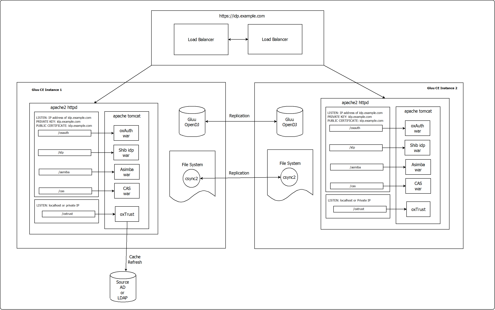

# Manual Cluster
## Design
The following diagram outlines the design of the cluster.

## Requirements

For complete deployment requirements and instructions, please see the [Deployment Page](../installation-guide/index.md).
The requirements for Clusters vary only in the RAM requirement. Clusters require at least 8GB RAM for smooth performance. The requirements below are specific for Cluster Installation VMs.


|   Number of VMs   |CPU Units  |   RAM |Root Partion   |   Port Requirements   |
|-----------------------|---------------|---------------|---------------|-------------------------------|
|   2       |   2 CPU ea.   |   8 GB    |   40 GB   |   4444 and 8989 (LDAP replication), 30865 (file system syncing)|

**NOTE: Above three ports should be opened in such a way that Node-1/host-1 can talk to Node-2/host-2 through these ports and vice versa**

**Note:** For convenience, the VMs are identified as `host-1` and `host-2`

### Timezone Requirements
It is mandatory to keep the date and time synced between all the nodes of a cluster. It is recommended to change the timzone from UTC to local timezone where the cluster is situated or use a single timezone if the cluster spans multiple timezones. The timezone requirement is applicable to both the VM and the `chroot` container.

!!! Note
    It is recommended to use a single timezone for all the nodes of the cluster in both VM and chroot.
    
Gluu strongly recommends using `ntpd` in the VMs and run the `ntp` daemon from `cronjob` to sync time. It is preferable if the cronjob is run every second to ensure smooth performance of the cluster.

## Preparing VMs
### Preparing Node-1 of cluster: 
   - Install Gluu CE following the [Deployment Page](../installation-guide/index.md) in `host-1`. 
       - **NOTE: you must provide hostname of the cluster itself to `setup.py` script (`idp.gluu.org` in this example), not hostnames of individual nodes!**

### Preparing Node-2 of cluster: 
   - Grab `setup.properties.last` from Node-1/host-1 ( location: /install/community-edition-setup/ )
   - Change attribute 'ip': Provide node-2/host-2 IP address here. 
   - Rename `setup.properties.last` to  `setup.properties`
   - Put this new file inside 2nd node's Gluu Server container ( location: /install/community-edition/setup/ )
   - Enter into Gluu Server Container
   - Run `setup.py` 
      - **NOTE: As it won't be running in interactive mode this way, make sure you'll provide all optional components (like Shibboleth, Asimba etc) you need to be installed explicitly with keys (run `# ./setup.py -h` for full list of them) Please be sure to read [this part](./index.md#optional-actions-in-case-setuppropertieslast-method-of-installation-didnt-work-for-you) in case you failed to setup the 2nd node using `setup.properties.last` file from the 1st one for some reason, and resorted to installing it from scratch, that will call for additional steps.**

## LDAP Replication

**TODO: setup a multi-master LDAP replication topology. link a replication-mgr doc here**

## File System Replication

<sub>*`(!)` Be advised that backup feature is broken in some of earlier versions of csync2 you may get installed from your distribution's repo. In that case you will need either to disable it by commenting out `backup-*` clauses in tool's configuration file, or to build csync2 of version 2.0+ from sources and use key `-l` in your xinetd.d's config (like `server_args     = -i -l -N idp1.gluu.org`) on both nodes.*</sub>   
<sub>*`(!)` Be sure to verify all pathes (for executables, keys etc) in configuration files' examples before using them in your production instance, as they may differ for different linux distros.*</sub>

`csync2` is used for file system syncing between `host-1` and `host-2`. The following locations are synced in between the two VMs.

1. /opt/idp/conf
2. /opt/idp/metadata
3. /opt/idp/ssl
4. /opt/tomcat/conf
5. /etc/csync2/csync2.cfg

### Csync2 installation

Please follow steps provided in next articles to install csync2 on 
both nodes: [CentOS 6.x](./csync-installation.md#centos-6x), [CentOS 7.x](./csync-installation.md#centos-7x), 
[Ubuntu 14.x (from repo)](./csync-installation.md#ubuntu-14x-from-repo), 
[Ubuntu 14.x (compiling from sources)](./csync-installation.md#ubuntu-14x-compiling-from-sources).

#### Csync2 configuration for host-1

1. Log into Gluu-Server container

2. Generate `csync2` private key by running `csync2 -k csync2.key` and put it into `/etc/csync2/csync2.key` file

3. Copy the private key to `host-2` and put it into the same file there

4. Generate certificate/key pair that will be used to establish SSL protection layer for incoming connections by running next commands on <code>host-1</code> (location of the files and their names are hardcoded into executable). Don't fill any fields, just hit `Enter` accepting default values:

```
openssl genrsa -out /etc/csync2_ssl_key.pem 1024
openssl req -new -key /etc/csync2_ssl_key.pem -out /etc/csync2_ssl_cert.csr
openssl x509 -req -days 600 -in /etc/csync2_ssl_cert.csr -signkey /etc/csync2_ssl_key.pem \
-out /etc/csync2_ssl_cert.pem
```
In case you've compiled csync from sources you may opt to just run `# make cert` 
while in the sources' directory, it will do everything for you.

<ol start ="5">
<li> Add IP and hostnames in the <code>hosts</code> file. In the hosts file example below <code>host-1</code> is called <code>idp1.gluu.org</code> and <code>host-2</code> is called <code>idp2.gluu.org</code></li>
</ol>
```
127.0.0.1       localhost
::1             ip6-localhost ip6-loopback
ff02::1         ip6-allnodes
ff02::2         ip6-allrouters
192.168.6.1     idp.gluu.org idp1.gluu.org
192.168.6.2     idp2.gluu.org  
```
<ol start ="6">
<li> Modify <code>csync2</code> in the <code>/etc/xinetd.d/</code> folder (some packages may reqire you to install it first; run <code># yum install xinetd</code>, then <code># chkconfig xinetd on</code>):</li>
</ol>
```
# default: off
# description: csync2
service csync2
{
        flags           = REUSE
        socket_type     = stream
        wait            = no
        user            = root
        group           = root
        server          = /usr/sbin/csync2
        server_args     = -i -N idp1.gluu.org
        port            = 30865
        type            = UNLISTED
        #log_on_failure += USERID
        disable         = no
        # only_from     = 192.168.199.3 192.168.199.4
}
```

<ol start ="7">
<li> Run the following commands</li>
</ol>
```
service xinetd restart
chkconfig xinetd on
```
**Note:** The status can be checked by running `chkconfig xinetd –list` and `iptables -L -nv | grep 30865`. For confirmation, telnet 30865 port from the VMs.

<ol start="8">
<li> Configure <code>csync2.cfg</code> to reflect the configuration below (Please note that csync2 doesn't allow to use symlinks in this file; you'll may need to correct full paths to certain directories as they may change in future Gluu's CE packages)</li>
</ol>
```
#nossl * *;
group cluster_group
{

        host idp1.gluu.org;
        host idp2.gluu.org;

        key /etc/csync2/csync2.key;
        include /etc/csync2/csync2.cfg;
        include /opt/idp/conf;
        include /opt/idp/metadata;
        include /opt/idp/ssl;
        include /opt/apache-tomcat-7.0.65/conf;

        exclude *~ .*;


        action
        {

                logfile "/var/log/csync2_action.log";
                do-local;
        }

        action
        {
                pattern /opt/apache-tomcat-7.0.65/conf/*;

                exec "/sbin/service tomcat restart";
                logfile "/var/log/csync2_action.log";
                do-local;
        }

        backup-directory /var/backups/csync2;
        backup-generations 3;

        auto younger;
} 
```
<ol start ="9">
<li> Start <code>csync2</code> by running <code>csync2 -cvvv -N idp2.gluu.org</code></li>
</ol>

<ol start ="10"> 
<li>Run <code>mkdir -p /var/backups/csync2</code></li>
</ol>

<ol start ="11">
<li> Add cronjob to automate csync2 run. The cronjob example is given below:</li>
</ol>
```
1,3,5,7,9,11,13,15,17,19,21,23,25,27,29,31,33,35,37,39,41,43,45,47,49,51,53,55,57,59 * * * *    /usr/sbin/csync2 -N idp1.gluu.org -xv 2>/var/log/csync2.log 
```

#### Csync2 configuration for host-2

1. Log into Gluu-Server container

2. (If you haven't done it yet) Copy the private key you generated on `host-1` previously to `host-2` and put it into `/etc/csync2/csync2.key` file 

3. Generate certificate/key pair that will be used to establish SSL protection layer for incoming connections by running next commands on `host-2` (location of the files and their names are hardcoded into executable). Don't fill any fields, just hit "Enter" accepting default values:
```
openssl genrsa -out /etc/csync2_ssl_key.pem 1024
openssl req -new -key /etc/csync2_ssl_key.pem -out /etc/csync2_ssl_cert.csr
openssl x509 -req -days 600 -in /etc/csync2_ssl_cert.csr -signkey /etc/csync2_ssl_key.pem \
-out /etc/csync2_ssl_cert.pem
```
In case you've compiled csync from sources you may opt to just run `# make cert` while in the sources' directory, it will do everything for you.

<ol start ="4">
<li>Add IP and hostnames in the <code>hosts</code> file. In the hosts file example below <code>host-1</code> is called <code>idp1.gluu.org</code> and <code>host-2</code> is called <code>idp2.gluu.org</code></li>
</ol>
```
127.0.0.1       localhost
::1             ip6-localhost ip6-loopback
ff02::1         ip6-allnodes
ff02::2         ip6-allrouters
192.168.6.1     idp1.gluu.org
192.168.6.2     idp.gluu.org idp2.gluu.org
```

<ol start ="5">
<li> Modify <code>csync2</code> in the <code>/etc/xinetd.d/</code> folder (some packages may reqire you to install it first; run <code># yum install xinetd</code>, then <code># chkconfig xinetd on</code>):</li>
</ol>
```
# default: off
# description: csync2
service csync2
{
        flags           = REUSE
        socket_type     = stream
        wait            = no
        user            = root
        group           = root
        server          = /usr/sbin/csync2
        server_args     = -i -N idp2.gluu.org
        port            = 30865
        type            = UNLISTED
        #log_on_failure += USERID
        disable         = no
        # only_from     = 192.168.199.3 192.168.199.4
}
```

<ol start ="6">
<li> Run the following commands</li>
</ol>
```
service xinetd restart
chkconfig xinetd on
```
**Note:** The status can be checked by running `chkconfig xinetd –list` and `iptables -L -nv | grep 30865`. For confirmation, telnet 30865 port from the VMs.

<ol start ="7">
<li> Configure <code>csync2.cfg</code> to reflect the configuration below (Please note that csync2 doesn't allow to use symlinks in this file; you'll may need to correct full paths to certain directories as they may change in future Gluu's CE packages):</li>
</ol>
```
#nossl * *;
group cluster_group
{

        host idp1.gluu.org;
        host idp2.gluu.org;

        key /etc/csync2/csync2.key;
        include /etc/csync2/csync2.cfg;
        include /opt/idp/conf;
        include /opt/idp/metadata;
        include /opt/idp/ssl;
        include /opt/apache-tomcat-7.0.65/conf;

        exclude *~ .*;


        action
        {

                logfile "/var/log/csync2_action.log";
                do-local;
        }

        action
        {
                pattern /opt/apache-tomcat-7.0.65/conf/*;

                exec "/sbin/service tomcat restart";
                logfile "/var/log/csync2_action.log";
                do-local;
        }

        backup-directory /var/backups/csync2;
        backup-generations 3;

        auto younger;
} 
```

<ol start ="8">
<li> Start <code>csync2</code> by running <code>csync2 -cvvv -N idp2.gluu.org</code></li>
</ol>

<ol start ="9"><li> Run <code>mkdir -p /var/backups/csync2</code></li></ol>

<ol start ="10">
<li> Add cronjob to automate csync2 run. The cronjob example is given below:</li></ol>

```
1,3,5,7,9,11,13,15,17,19,21,23,25,27,29,31,33,35,37,39,41,43,45,47,49,51,53,55,57,59 * * * *    /usr/sbin/csync2 -N idp2.gluu.org -xv 2>/var/log/csync2.log 
```

## Certificate Management

Certificates are not being synced automatically in the proposed setup. They must be initially copied by hand from one node to the other, and must be synced in this manner each time they are being updated.
in each host, when required. Move to `/etc/certs/` on the 1st node (inside the container). Copy all keys, certs and key storages conforming to these masks: `httpd.*`, `asimba.*`, `asimbaIDP.*`, `idp-encryption.*`, `idp-signing.*`, `shibIDP.*`, `oxauth-keys.*` and ` scim-rs.*` - to the same directory on the 2nd node (overwriting files that exist there; you may opt to backup them first, just in case).

After that's done you still will need to update default system storage (`cacerts` file) at the 2nd node with these newly copied certificates. The [Certificate Page](../admin-guide/certificates.md) contains the details about available certificates and how to update certificates are detailed in the [update-certificate page](../operation/update-certificate.md).

### [Optional] Actions in case setup.properties.last method of installation didn't work for you

In this case jks keystores you'll be moving to the 2nd node will be protected by passwords hardcoded into different configuration files on the 1st node, which are different from the similar passwords hardcoded into the same files on the 2nd node.

Thus you MUST ensure that the 1st node will be the one that will initialize the 2nd node during first csync's run (i.e., that it will win any conflicts due to changes in files that csync may detect during its very first run), as otherwise different components won't be able to decrypt these keystores and will fail.

To achieve this you should run initial sync manualy after completing configuring it, but before you install cron jobs:

1. Comment out `auto younger;` string in `csync2.cfg` on both nodes to disable autoresolution of conflicts

2. Run `# csync2 -crvvv -N idp1.gluu.org /` on the 1st node

3. Run `# csync2 -crvvv -N idp2.gluu.org /` on the 2nd node

4. Previous commands did initial scan and filled metadata database. Now run `# csync2 -xrvvv -N idp1.gluu.org /` on the 1st node. That will try to sync files with the 2nd node, and most likely will fail to replicate all files due to some conflicts.

5. You should be now in a state of conflict, as certain files in directories to be synced differ between nodes and tool can't decide which to prefer. Run this `# csync2 -frvvv -N idp1.gluu.org /` on the 1st node to mark its files that are still in dirty state as the ones that will win any conflict next time.

6. Run `# csync2 -xrvvv -N idp1.gluu.org /` on the 1st node to complete your initial sync. Now all your 2nd node's directories covered by csync should be identical to the 1st node's.

7. Uncomment `auto younger;` string and proceed to installing cron jobs
