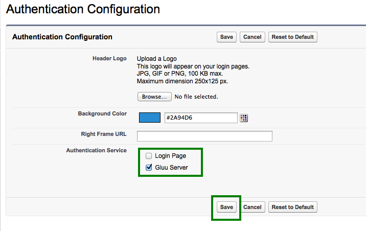

# SAML SSO to Salesforce.com

By default Salesforce suggest deployers to implement IDP-initiated SSO.
The initialization of IDP-initiated SSO is little bit complex as it
requires a big hostname which includes IDP's SSO link as well as SP's
login uri. So we prefer SP-initiated SSO and here in this documentation
we are presenting a very simple SP-initiated SSO steps with Salesforce
and Gluu Server. Still, you can go for IDP-initiated SSO if you prefer.
Further documentation is available at the Salesforce.com site.

## Prepare Salesforce.com

* Log into Salesforce.com with your administrative account.
* Click on _Setup_ in the right upper corner of the page.
* You need to add a custom domain name for your Salesforce.com site if
  you do not have any yet.
  * Go to _Domain Management_ –> _My Domain_
  * Add your custom domain
  * Wait for some time. Salesforce.com will register this domain name
  for you. As an example we use `testgluu-dev-ed.my.salesforce.com` here.

  

* Register your Gluu Server information in Salesforce.com
   * Go to _Security Controls_ –> _Single Sign On Settings_
   * Click _New_

  

   * Now you need to add the information of your Gluu Server here
     * _Name_: Anything, whichever is easier for you to recognize this
       setup, i.e. `Gluu Server`
     * _API Name_: Gluu Server.
     * _Issuer_: EntityID of your Gluu Server, i.e. `https://test.gluu.org/idp/shibboleth`
     * _EntityID_: Your Salesforce.com custom domain name as chosen
       above, i.e. `https://testgluu-dev-ed.my.salesforce.com`
     * _Identity Provider Certificate_: Grab your Gluu Server's SAML
       certificate. SAML certificate can be grabbed from your Gluu Sever's
       metadata. Save the certificate and upload it.
     * _Request Signing Certificate_: Default certificate
     * _Request Signature Method_: RSA-SHA1
     * _Assertion Decryption Certificate_: Assertion not encrypted.
     * _SAML Identity Type_: Assertion contains user's Salesforce.com username
     * _SAML Identity Location_: Identity is in an Attribute element
     * _Attribute Name_: Provide 'SAML2 URI' of your attribute. For our test case we are using Gluu Server's Email attribute. How to check the information of your attribute is available [here](http://www.gluu.org/docs/admin-guide/configuration/#attributes).
     * _NameID Format_: Leave this field empty.
     * _Identity Provider Login URL_: `https://test.gluu.org/idp/profile/SAML2/Redirect/SSO`
     * _Service Provider Initiated Request Binding_: HTTP-Redirect
     * Here is how our example setup looks like:

     

## Prepare Gluu Server

* How to create SAML trust relationship is available [here](../admin-guide/saml.md). 
* Grab Salesforce.com metadata from the Salesforce.com website. There is
  an option named 'Download Metadata':
  * Modify Salesforce.com metadata a bit:
    * Remove _AuthnRequestsSigned=“true”_ from metadata.
    * Save metadata
* Create Trust Relationship:
  * _Display Name_: Anything, whichever is easier for you to recognize this trust relationship.
  * _Description_: Anything, whichever is easier for you to recognize this trust relationship
  * _Metadata Type_: 'File'
  * Upload salesforce's metadata (your modified one)
  * Releases attributes: TransientID and Email
  * 'Add' this trust
  * Configure Specific Relying: It can be done from Gluu Server's GUI (named: oxTrust)
    * Select 'SAML2SSO'
        * includeAttributeStatement: Enabled
        * assertionLifetime: keep the default one
        * assertionProxyCount: keep the default one
        * signResponses: conditional
        * signAssertions: never
        * signRequests: conditional
        * encryptAssertions: never
        * encryptNameIds: never
        * Save it
  * 'Update' the trust relationship
  * Here is how it looks like in our example setup:

  

## Test SSO

* Go back to Salesforce.com setup
* Security Controls –> Single Sign On Settings
* Enable 'Federated Single Sign-On Using SAML'
* Go to 'Domain Management'
* Configure 'Authentication Configuration'
  * Select 'Gluu Server'
  * Save it
  * Here is how the 'Authentication Configuration' looks like:

* This is SP-initiate SSO. So hit your Salesforce.com website link to
initiate the SSO.

* [Here](https://www.youtube.com/watch?v=VehuRJr647E&feature=youtu.be)
is a video link of this SSO.

