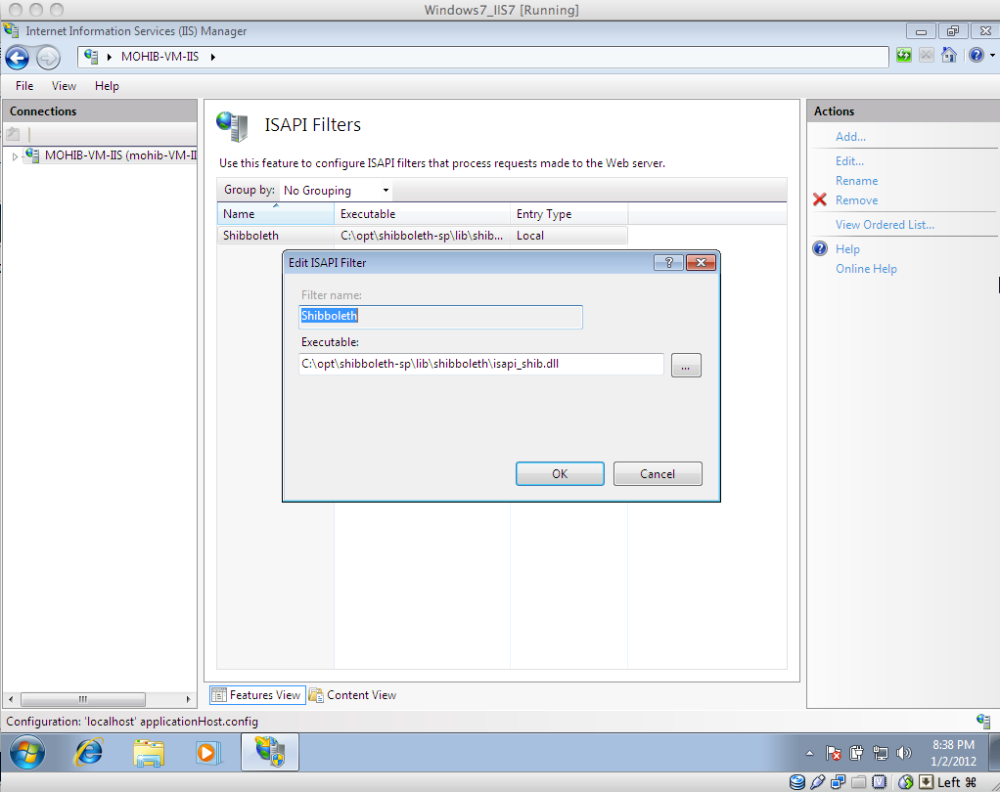
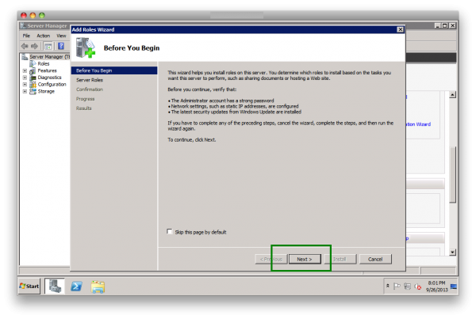

# SAML SP Integration

## Apache SAML

## Configuring Apache Shibboleth SP in CentOS

### System Preparation

__Add Shibboleth repository for CentOS__

* The file `shib.repo` contains the following entry:

```
[security_shibboleth]
name=Shibboleth (CentOS_CentOS-6)
type=rpm-md
baseurl=http://download.opensuse.org/repositories/security:/shibboleth/CentOS_CentOS-6/
gpgcheck=1
gpgkey=http://download.opensuse.org/repositories/security:/shibboleth/CentOS_CentOS-6/repodata/repomd.xml.key
enabled=1
```

* Download the Shibboleth security repo key from here:

```
http://download.opensuse.org/repositories/security:/shibboleth/CentOS_CentOS-6/security:shibboleth.repo
```

### Shibboleth SP Installation

To install the Shibboleth SP, run the following commands in a terminal:

```
# yum install shibboleth
# service shibd start
# chkconfig shibd on
```

### Install and Configure httpd
#### Installation

The following commands will both install, and start the Apache web
server on your machine/Linux environment:

```
# yum install httpd
# service httpd start
# service iptables stop 
```

#### Configuration

Edit the file `httpd.conf`, and do the following changes:

* Change the `ServerName` directive to the server name of the SP.

* Set `UseCanonicalName On`.

* Restart the httpd service using the command `service httpd restart`.

#### Httpd Testing

* Create an `index.html` file inside the directory `/var/www/html`.

* Restart the httpd service using the command `service httpd restart`.

* Check from your browser if the file `index.html` is visible.

#### SP Key Certificate

* Create both a private key, and a certificate, and place those in the
  file `/etc/shibboleth`.

* Change the permissions of these files so that the web server can read
  the files.

### Shibboleth SP Configuration

This section describes how to configure the file `shibboleth2.xml`.

* Provide the `entityID` of the according SP in:
	
	* `<ApplicationDefaults entityID="http://sp.example.org/Shibboleth"> section`

* Provide the `entityID` of the IdP in:

	* `<SSO entityID="https://idp.gluu.org/idp/shibboleth"> section`

* Adjust the entry of the metadata provider. In most cases this is the
  Gluu IdP metadata link:

	* `<MetadataProvider type="XML" uri="https://idp.gluu.org/idp/shibboleth"> section`

* Provide both the key and certificate of the SP in:

	* `<CredentialResolver type="File" key="spkey.key" certificate="spcrt.crt"> section`

### Shibboleth Manual Configuration (one Physical SP):

* Create a directory named under `/var/www/secure`.

* Change the permissions for that directory `secure` to
  `apache:apache` (owner and group of the web server).

* `httpd.conf`

	* change the ServerName `<hostname_of_server>`

	* Define the Location, and the authorization type:

		```
		<Location /secure>
			AuthType shibboleth
			ShibRequestSetting requireSession 1
			ShibUseHeaders on
			Require valid-user
		</Location>
		```

* configure `shibboleth2.xml`

	* Set the EntityID of the SP: `ApplicationDefaults entityID="http://hostname/secure"`

	* Provide the EntityID of the IDP: `SSO entityID="https://idp.gluu.org/idp/shibboleth"`

	* Set both the Metadata Provider, and the IDP: `MetadataProvider type="XML" uri="https://idp.gluu.org/idp/shibboleth"`

* Restart both shibd and Apache2 using these lines:

```
service shibd restart
service httpd restart
```

* Create a Trust Relationship for this SP in your desired IdP.

## Super Quick Ubuntu Shib Apache Install

Need to protect a test Apache folder using SAML on an Ubuntu server?
Hate to read? This article is for you. Replace both `minnow` and
`minnow.gluu.info` with your desired website hostname.

## Configure Apache

These are the steps to configure your Apache webserver properly:

```
# apt-get install apache2 libshibsp6 libapache2-mod-shib2
# a2enmod cgi
# a2enmod ssl
# a2enmod shib2
# a2ensite default-ssl
# mkdir /etc/certs
# cd /etc/certs
# openssl genrsa -des3 -out minnow.key 2048
# openssl rsa -in minnow.key -out minnow.key.insecure
# mv minnow.key.insecure minnow.key
# openssl req -new -key minnow.key -out minnow.csr
# openssl x509 -req -days 365 -in minnow.csr -signkey minnow.key -out minnow.crt
# shib-metagen -c /etc/certs/minnow.crt -h minnow.gluu.info > /etc/shibboleth/minnow-metadata.xml
# service apache2 start
# service shibd start
```

Download `minnow-metadata.xml` to your machine. You will need this file
later when you create the Trust Relationship in the Gluu Server.

```
# mkdir /var/www/protected
# touch /var/www/protected/printHeaders.py
# chmod ugo+x /var/www/protected/printHeaders.py
```
Edit `printHeaders.py`, and add this simple script. It will show you the
HTTP headers:

```
#!/usr/bin/python

import os

d = os.environ
k = d.keys()
k.sort()

print "Content-type: text/html\n\n"

print "<HTML><HEAD><TITLE>Print Env Variables</TITLE></Head><BODY>"
print "<h1>Environment Variables</H1>"
for item in k:
	print "<p><B>%s</B>: %s </p>" % (item, d[item])
print "</BODY></HTML>"
```


Edit the default site at `/etc/apache2/sites-available/default-ssl.conf`, 
and add this part:

```
ScriptAlias /protected/ /var/www/protected/
<Directory /var/www/protected>
	AddHandler cgi-script .py
	Options +ExecCGI
	SSLOptions +StdEnvVars
	AuthType shibboleth
	ShibRequestSetting requireSession 1
	Require valid-user
</Directory>
```


# Configure the Shibboleth SP

Use this for `shibboleth2.xml` and replace `squid.gluu.info` with the
hostname of your SP, and `albacore.gluu.info` with the hostname of your
IDP.

```
<SPConfig xmlns="urn:mace:shibboleth:2.0:native:sp:config"
    xmlns:conf="urn:mace:shibboleth:2.0:native:sp:config"
    xmlns:saml="urn:oasis:names:tc:SAML:2.0:assertion"
    xmlns:samlp="urn:oasis:names:tc:SAML:2.0:protocol"    
    xmlns:md="urn:oasis:names:tc:SAML:2.0:metadata"
    logger="syslog.logger" clockSkew="180">
    <OutOfProcess logger="shibd.logger"></OutOfProcess>
    <UnixListener address="shibd.sock"/>
    <StorageService type="Memory" id="mem" cleanupInterval="900"/>
    <SessionCache type="StorageService" StorageService="mem" cacheAssertions="false"
                  cacheAllowance="900" inprocTimeout="900" cleanupInterval="900"/>
    <ReplayCache StorageService="mem"/>
    <RequestMapper type="Native">
        <RequestMap>
            <Host name="squid.gluu.info">
                <Path name="protected" authType="shibboleth" requireSession="true"/>
            </Host>
        </RequestMap>
    </RequestMapper>
    <ApplicationDefaults entityID="https://squid.gluu.info/shibboleth"
                         REMOTE_USER="uid"
                         metadataAttributePrefix="Meta-"
                         sessionHook="/Shibboleth.sso/AttrChecker"
                         signing="false" encryption="false">

        <Sessions lifetime="28800" timeout="3600" checkAddress="true"
            handlerURL="/Shibboleth.sso" handlerSSL="true" cookieProps="https" relayState="ss:mem">
          
            <SessionInitiator type="Chaining" Location="/Login" isDefault="true" id="Login"
                              entityID="https://albacore.gluu.info/idp/shibboleth">
                <SessionInitiator type="SAML2" template="bindingTemplate.html"/>
            </SessionInitiator>
            
            <md:AssertionConsumerService Location="/SAML2/POST-SimpleSign" index="2"
                Binding="urn:oasis:names:tc:SAML:2.0:bindings:HTTP-POST-SimpleSign"/>
            <md:AssertionConsumerService Location="/SAML2/POST" index="1"
                Binding="urn:oasis:names:tc:SAML:2.0:bindings:HTTP-POST"/>

            <LogoutInitiator type="Chaining" Location="/Logout">
                <LogoutInitiator type="SAML2" template="bindingTemplate.html"/>
                <LogoutInitiator type="Local"/>
            </LogoutInitiator>

            <md:SingleLogoutService Location="/SLO/Redirect" conf:template="bindingTemplate.html"
                Binding="urn:oasis:names:tc:SAML:2.0:bindings:HTTP-Redirect"/>
            <md:SingleLogoutService Location="/SLO/POST" conf:template="bindingTemplate.html"
                Binding="urn:oasis:names:tc:SAML:2.0:bindings:HTTP-POST"/>

            <Handler type="Status" Location="/Status"/>
            <Handler type="Session" Location="/Session" showAttributeValues="false"/>
            <Handler type="AttributeChecker" Location="/AttrChecker" template="attrChecker.html"
                attributes="uid" flushSession="true"/>
        </Sessions>

        <Errors supportContact="root@localhost"
            helpLocation="/about.html"
            styleSheet="/shibboleth-sp/main.css"/>
        
        <MetadataProvider type="XML" file="albacore.xml"/>
        <TrustEngine type="ExplicitKey"/>
        <TrustEngine type="PKIX"/>
        <AttributeExtractor type="XML" validate="true" reloadChanges="false" path="attribute-map.xml"/>
        <AttributeExtractor type="Metadata" errorURL="errorURL" DisplayName="displayName"/>
        <AttributeResolver type="Query" subjectMatch="true"/>
        <AttributeFilter type="XML" validate="true" path="attribute-policy.xml"/>
        <CredentialResolver type="File" key="/etc/certs/squid.key" certificate="/etc/certs/squid.crt"/>
    </ApplicationDefaults>
    <SecurityPolicyProvider type="XML" validate="true" path="security-policy.xml"/>
    <ProtocolProvider type="XML" validate="true" reloadChanges="false" path="protocols.xml"/>

</SPConfig>
```

Copy this file into `/etc/shibboleth/attribute-map.xml`:
```

<Attributes xmlns="urn:mace:shibboleth:2.0:attribute-map" xmlns:xsi="http://www.w3.org/2001/XMLSchema-instance">
    <Attribute name="urn:oid:2.5.4.42" id="givenName"/>
    <Attribute name="urn:oid:2.5.4.4" id="sn"/>
    <Attribute name="urn:oid:2.16.840.1.113730.3.1.241" id="displayName"/>
    <Attribute name="urn:oid:0.9.2342.19200300.100.1.1" id="uid"/>
</Attributes>
```

Now you need to create a Trust Relationship in your Gluu Server. Login,
go to SAML / Trust Relationships, and "Add Relationship":


Then, configure for SAML2SSO profile. Click on the checkbox to
"Configure specific RelyingParty":


Then, click to add the SAML2SSO profile:


Then "Save" and "Update." Wait 5 minutes for the Shibboleth IDP to detect reload the metadata or
stop and start Jetty.

```
service identity stop
service identity start
```

## Test

Test the CGI script at `https://minnow.gluu.info/protected/printHeaders.py`.
Enter both the valid username and password (like `admin` and your
initial admin password). The output will contain something like this:

    **Environment Variables**
    
    AUTH_TYPE: shibboleth
    CONTEXT_DOCUMENT_ROOT: /var/www/protected/
    CONTEXT_PREFIX: /protected/
    DOCUMENT_ROOT: /var/www/html
    GATEWAY_INTERFACE: CGI/1.1
    HTTPS: on
    HTTP_ACCEPT: text/html,application/xhtml+xml,application/xml;q=0.9,image/webp,*/*;q=0.8
    HTTP_ACCEPT_ENCODING: gzip, deflate, sdch
    HTTP_ACCEPT_LANGUAGE: en-US,en;q=0.8
    HTTP_CONNECTION: keep-alive
    HTTP_COOKIE: _shibsession_64656661756c7468747470733a2f2f6d696e6e6f772e676c75752e696e666f2f73686962626f6c657468=_6aab7e287072bcc123989d8bf5f0ed5e
    HTTP_DNT: 1
    HTTP_HOST: minnow.gluu.info
    HTTP_UPGRADE_INSECURE_REQUESTS: 1
    HTTP_USER_AGENT: Mozilla/5.0 (Windows NT 6.1; WOW64) AppleWebKit/537.36 (KHTML, like Gecko) Chrome/45.0.2454.85 Safari/537.36
    PATH: /usr/local/sbin:/usr/local/bin:/usr/sbin:/usr/bin:/sbin:/bin
    QUERY_STRING:
    REMOTE_ADDR: 192.168.88.1
    REMOTE_PORT: 52140
    REMOTE_USER: mike
    REQUEST_METHOD: GET
    REQUEST_SCHEME: https
    REQUEST_URI: /protected/printHeaders.py
    SCRIPT_FILENAME: /var/www/protected/printHeaders.py
    SCRIPT_NAME: /protected/printHeaders.py
    SERVER_ADDR: 192.168.88.133
    SERVER_ADMIN: webmaster@localhost
    SERVER_NAME: minnow.gluu.info
    SERVER_PORT: 443
    SERVER_PROTOCOL: HTTP/1.1
    SERVER_SIGNATURE:
    Apache/2.4.7 (Ubuntu) Server at minnow.gluu.info Port 443
    SERVER_SOFTWARE: Apache/2.4.7 (Ubuntu)
    SHIB_Shib_Application_ID: default
    SHIB_Shib_Authentication_Instant: 2015-09-17T01:13:23.278Z
    SHIB_Shib_Authentication_Method: urn:oasis:names:tc:SAML:2.0:ac:classes:PasswordProtectedTransport
    SHIB_Shib_AuthnContext_Class: urn:oasis:names:tc:SAML:2.0:ac:classes:PasswordProtectedTransport
    SHIB_Shib_Identity_Provider: https://brookie.gluu.info/idp/shibboleth
    SHIB_Shib_Session_ID: _6aab7e287072bcc123989d8bf5f0ed5e
    SHIB_Shib_Session_Index: _40e4b17668a13e0d406e41cc9f6bf116
    SHIB_displayName: Mike Schwartz
    SHIB_givenName: Michael
    SHIB_mail: mike@gmail.com
    SHIB_sn: Schwartz
    SHIB_uid: mike
    SSL_CIPHER: ECDHE-RSA-AES128-GCM-SHA256
    SSL_CIPHER_ALGKEYSIZE: 128
    SSL_CIPHER_EXPORT: false
    SSL_CIPHER_USEKEYSIZE: 128
    SSL_CLIENT_VERIFY: NONE
    SSL_COMPRESS_METHOD: NULL
    SSL_PROTOCOL: TLSv1.2
    SSL_SECURE_RENEG: true
    SSL_SERVER_A_KEY: rsaEncryption
    SSL_SERVER_A_SIG: sha256WithRSAEncryption
    SSL_SERVER_I_DN: emailAddress=mike@gluu.org,CN=minnow.gluu.info,O=Gluu,L=Austin,ST=TX,C=US
    SSL_SERVER_I_DN_C: US
    SSL_SERVER_I_DN_CN: minnow.gluu.info
    SSL_SERVER_I_DN_Email: mike@gmail.com
    SSL_SERVER_I_DN_L: Austin
    SSL_SERVER_I_DN_O: Gluu
    SSL_SERVER_I_DN_ST: TX
    SSL_SERVER_M_SERIAL: 9F5E4F891590BB53
    SSL_SERVER_M_VERSION: 1
    SSL_SERVER_S_DN: emailAddress=mike@gluu.org,CN=minnow.gluu.info,O=Gluu,L=Austin,ST=TX,C=US
    SSL_SERVER_S_DN_C: US
    SSL_SERVER_S_DN_CN: minnow.gluu.info
    SSL_SERVER_S_DN_Email: mike@gmail.com
    SSL_SERVER_S_DN_L: Austin
    SSL_SERVER_S_DN_O: Gluu
    SSL_SERVER_S_DN_ST: TX
    SSL_SERVER_V_END: Sep 10 18:46:32 2016 GMT
    SSL_SERVER_V_START: Sep 11 18:46:32 2015 GMT
    SSL_SESSION_RESUMED: Initial
    SSL_TLS_SNI: minnow.gluu.info
    SSL_VERSION_INTERFACE: mod_ssl/2.4.7
    SSL_VERSION_LIBRARY: OpenSSL/1.0.1f
    
## Troubleshooting 

 - Make sure you update your hosts file on the Gluu Server, Apache
   server, and your workstation--this won't work with IP addresses,
   only.

 - Check the Shibboleth log file `/opt/idp/logs/idp-process.log` if you
   don't see the headers or REMOTE_USER environment variables. Also,
   restart the Jetty service by `service identity restart` to 
   make sure the new Shibboleth IDP xml files were loaded.

 - Clear the cookies in your web browser for both the Apache site, and 
   the Gluu Server if you are logging in and logging out a lot with 
   lots of server restarts.

## IIS SAML Configuration

### IIS Configuration in Windows 7

1. Start --> Control Panel --> Programs --> "Turn Windows features on or off"

2. Select (i) IIS (ii) Web Management Tools (iii) II6 Management Compatibility (iv) IIS Management Console (v) IIS Management Scripts and Tools (vi) IIS Management Service

3. Select (i) World Wide Web Services (ii) CGI (iii) ISAPI Filters (iv) ISAPI Extensions --> Press OK.


4. Test IIS to see if it is installed in your system with "127.0.0.1" in the web browser. For our test case, we used IIS7.


## ISAPI Filter Configuration

1. Open IIS Manager (Start --> Administrative Tools --> Internet Information Service/IIS Manager)

2. Double click on "ISAPI and CGI Restrictions"


3. Add a new Filter

  a. Click Actions --> Add (upper right corner)

  b. Select "\opt\shibboleth-sp\lib\shibboleth\isapi_shib.dll"

  c. Description: "Shibboleth"

  d. Click "Allow" (from the right hand side)


  e. Back to IIS Manager --> ISAPI Filters


        1. Click "Add" (upper right corner)

        2. Filter Name: Shibboleth

        3. Executable: "\opt\shibboleth-sp\lib\shibboleth\isapi_shib.dll"



  f. SSO file extension mapping

        1. Click on "Handler Mapping" from main page


        2. Click "Add Script Map" from Action


        3. Request Path :".sso"

        4. Executable should be pointed to "isapi_shib.dll"


  g. Restart IIS

  h. Check Status

  Check Status by typing in "http://127.0.0.1/Shibboleth.sso/Status" in the web browser. If it displays an XML document, then the Shibboleth SP Installation in Windows IIS7 in complete.


## Shibboleth SP Setup in Windows 2008 R2 with IIS7

1. Open up "Server Manager", scroll down and click on "Add Roles".


2. Hit "Next"



3. Select "Web Server (IIS)", hit "Next"


4. Select (i) CGI

(ii) ISAPI Extensions

(iii) ISAPI Filters

(iv) Management Tools

  (a) IIS Management Console

  (b) IIS Management Scripts and Tools

  (c) Management Service

(v) All IIS6 Management Compatibility


5. Hit "Next", for the confirmation, check the list of plugins.


6. Hit "Install" and Windows 2008 will complete the installation. A confirmation window shall appear which resembles the screenshot below.


7.Test IIS7 setup from the Internet.


### Shibboleth SP 2.5.x Setup

1. Down the [Shibboleth SP 2.5.x](http://www.shibboleth.net/downloads/service-provider/latest/)

2. Start the installation, keep the default path, Select "Install ISAPI modules into IIS", IIS Script Extension must be ".sso" and Hit "Next".


3. After the completion of the installation, the system will ask to reboot the system; hit "Yes".


4. Test the Shibboleth SP installation from the SP VM using the URL "localhost/Shibboleth.sso/Status" in the address bar of the Web Browser.


### Trust Relationship in IdP

1. Create a Trust Relationship for the new SP in the IdP. It is necessary to upload the Public Certificate of the new SP in the IdP. Please note that the CN of the public certificate MUST BE the same as _Hostname_ of the SP. Hit "Add".


2. Download the IdP generated configuration files for Shib SP modification.


### SP Configuration

1. The files from the IdP must be placed in the SP Configuration.

2. Before placing them inside the SP Configuration please check

  (a) The "spcert.crt" file has the CN same as the SP hostname.

  (b) The "spcert.crt" and "spkey.key" has the same _md5sum_ value.

  (c) The IdP-metadata is perfectly placed inside the SP Configuration.

  (d) The downloaded "shibboleth2.xml" file has values resembling the file content below.

3. For testing purpose, we are going to protect a directory named "secure" with the IdP.  Create a folder/directory in the IIS Root Directory and restart Shibd and IIS.


### SSO Testing

1. Place the following URL in the web browser: "https://SP_Name/secure"

2. It will redirect the user to the IdP for authentication.

3. After the authentication is complete, the user will be shown the protected page. For this case, the page is the IIS7 index page.


	<SPConfig xmlns="urn:mace:shibboleth:2.0:native:sp:config"
    	  xmlns:conf="urn:mace:shibboleth:2.0:native:sp:config"
    	  xmlns:saml="urn:oasis:names:tc:SAML:2.0:assertion"
    	  xmlns:samlp="urn:oasis:names:tc:SAML:2.0:protocol"    
    	  xmlns:md="urn:oasis:names:tc:SAML:2.0:metadata"
    	  logger="syslog.logger" clockSkew="180">

	  <!-- The OutOfProcess section contains properties affecting the shibd daemon. -->
    	  <OutOfProcess logger="shibd.logger">
    	  </OutOfProcess>

	  <!-- The InProcess section conrains settings affecting web server modules/filters. -->
    	  <InProcess logger="native.logger">
        	<ISAPI normalizeRequest="true" safeHeaderNames="true">
            	  <Site id="1" name="SP_HOSTNAME_WITHOUT_HTTP_OR_HTTPS"/>
        	</ISAPI>
    	  </InProcess>

	  <!-- Only one listener can be defined, to connect in-process modules to shibd. -->
    	  <TCPListener address="127.0.0.1" port="1600" acl="127.0.0.1"/>
    	  <!-- <UnixListener address="shibd.sock"/> -->

	  <!-- This set of components stores sessions and other persistent data in daemon memory. -->
    	  <StorageService type="Memory" id="mem" cleanupInterval="900"/>
    	  <SessionCache type="StorageService" StorageService="mem" cacheTimeout="3600" inprocTimeout="900" cleanupInterval="900"/>
    	  <ReplayCache StorageService="mem"/>
    	  <ArtifactMap artifactTTL="180"/>

	  <!-- To customize behavior, map hostnames and path components to applicationId and other settings. -->
    	  <RequestMapper type="Native">
        	<RequestMap applicationId="default">
            	    <Host name="SP_HOSTNAME_WITHOUT_HTTP_OR_HTTPS">
                	<Path name="secure" authType="shibboleth" requireSession="true"/>
            	    </Host>
          	</RequestMap>
    	  </RequestMapper>

	  <!--
    	  The ApplicationDefaults element is where most of Shibboleths SAML bits are defined.
    	  Resource requests are mapped by the RequestMapper to an applicationId that
    	  points into to this section.
    	  -->
	  <ApplicationDefaults id="default" policyId="default"
          	entityID="DAxxxxxxxxxxxxxxxxxxxxxxxxxxxxxxxxxx867"
          	REMOTE_USER="eppn persistent-id targeted-id uid mail"
          	signing="false" encryption="false" attributePrefix="AJP_">

		<!--
        	Controls session lifetimes, address checks, cookie handling, and the protocol handlers.
        	You MUST supply an effectively unique handlerURL value for each of your applications.
        	The value can be a relative path, a URL with no hostname (https:///path) or a full URL.
        	The system can compute a relative value based on the virtual host. Using handlerSSL="true"
        	will force the protocol to be https. You should also add a cookieProps setting of "; path=/; secure"
        	in that case. Note that while we default checkAddress to "false", this has a negative
        	impact on the security of the SP. Stealing cookies/sessions is much easier with this disabled.
        	-->
		<Sessions lifetime="28800" timeout="3600" checkAddress="false"
            	    handlerURL="https://SP_HOSTNAME/Shibboleth.sso" handlerSSL="false"
            	    exportLocation="http://localhost/Shibboleth.sso/GetAssertion" exportACL="127.0.0.1"
            	    idpHistory="false" idpHistoryDays="7" cookieProps="; path=/; secure; httpOnly">

		    <!--
            	    SessionInitiators handle session requests and relay them to a Discovery page,
            	    or to an IdP if possible. Automatic session setup will use the default or first
            	    element (or requireSessionWith can specify a specific id to use).
            	    -->

		    <!-- Default example directs to a specific IdPs SSO service (favoring SAML 2 over Shib 1). -->
            	    <SessionInitiator type="Chaining" Location="/Login" isDefault="true" id="gluu"
                    	    relayState="cookie" entityID="https://IDP_HOSTNAME/idp/shibboleth">
                       <SessionInitiator type="SAML2" acsIndex="1" template="bindingTemplate.html"/>
                       <SessionInitiator type="Shib1" acsIndex="5"/>
            	    </SessionInitiator>

		    <!--
            	    md:AssertionConsumerService locations handle specific SSO protocol bindings,
            	    such as SAML 2.0 POST or SAML 1.1 Artifact. The isDefault and index attributes
            	    are used when sessions are initiated to determine how to tell the IdP where and
            	    how to return the response.
            	    -->
		    <md:AssertionConsumerService Location="/SAML2/POST" index="1"
                	Binding="urn:oasis:names:tc:SAML:2.0:bindings:HTTP-POST"/>
            	    <md:AssertionConsumerService Location="/SAML2/POST-SimpleSign" index="2"
                	Binding="urn:oasis:names:tc:SAML:2.0:bindings:HTTP-POST-SimpleSign"/>
            	    <md:AssertionConsumerService Location="/SAML2/Artifact" index="3"
                	Binding="urn:oasis:names:tc:SAML:2.0:bindings:HTTP-Artifact"/>
            	    <md:AssertionConsumerService Location="/SAML2/ECP" index="4"
                	Binding="urn:oasis:names:tc:SAML:2.0:bindings:PAOS"/>
            	    <md:AssertionConsumerService Location="/SAML/POST" index="5"
                	Binding="urn:oasis:names:tc:SAML:1.0:profiles:browser-post"/>
            	    <md:AssertionConsumerService Location="/SAML/Artifact" index="6"
                	Binding="urn:oasis:names:tc:SAML:1.0:profiles:artifact-01"/>

		    <!-- LogoutInitiators enable SP-initiated local or global/single logout of sessions. -->
            	    <LogoutInitiator type="Chaining" Location="/Logout" relayState="cookie">
                	<LogoutInitiator type="SAML2" template="bindingTemplate.html"/>
                	<LogoutInitiator type="Local"/>
            	    </LogoutInitiator>

		    <!-- md:SingleLogoutService locations handle single logout (SLO) protocol messages. -->
            	    <md:SingleLogoutService Location="/SLO/SOAP"
                	Binding="urn:oasis:names:tc:SAML:2.0:bindings:SOAP"/>
            	    <md:SingleLogoutService Location="/SLO/Redirect" conf:template="bindingTemplate.html"
                	Binding="urn:oasis:names:tc:SAML:2.0:bindings:HTTP-Redirect"/>
            	    <md:SingleLogoutService Location="/SLO/POST" conf:template="bindingTemplate.html"
                	Binding="urn:oasis:names:tc:SAML:2.0:bindings:HTTP-POST"/>
            	    <md:SingleLogoutService Location="/SLO/Artifact" conf:template="bindingTemplate.html"
                	Binding="urn:oasis:names:tc:SAML:2.0:bindings:HTTP-Artifact"/>

		    <!-- md:ManageNameIDService locations handle NameID management (NIM) protocol messages. -->
            	    <md:ManageNameIDService Location="/NIM/SOAP"
                	Binding="urn:oasis:names:tc:SAML:2.0:bindings:SOAP"/>
            	    <md:ManageNameIDService Location="/NIM/Redirect" conf:template="bindingTemplate.html"
                	Binding="urn:oasis:names:tc:SAML:2.0:bindings:HTTP-Redirect"/>
            	    <md:ManageNameIDService Location="/NIM/POST" conf:template="bindingTemplate.html"
                	Binding="urn:oasis:names:tc:SAML:2.0:bindings:HTTP-POST"/>
            	    <md:ManageNameIDService Location="/NIM/Artifact" conf:template="bindingTemplate.html"
                	Binding="urn:oasis:names:tc:SAML:2.0:bindings:HTTP-Artifact"/>

		    <!--
            	    md:ArtifactResolutionService locations resolve artifacts issued when using the
            	    SAML 2.0 HTTP-Artifact binding on outgoing messages, generally uses SOAP.
            	    -->
            	    <md:ArtifactResolutionService Location="/Artifact/SOAP" index="1"
                	Binding="urn:oasis:names:tc:SAML:2.0:bindings:SOAP"/>

		    <!-- Extension service that generates "approximate" metadata based on SP configuration. -->
            	    <Handler type="MetadataGenerator" Location="/Metadata" signing="false"/>

            	    <!-- Status reporting service. -->
            	    <Handler type="Status" Location="/Status" acl="127.0.0.1"/>

            	    <!-- Session diagnostic service. -->
            	    <Handler type="Session" Location="/Session" showAttributeValues="false"/>

		</Sessions>

		<!--
        	Allows overriding of error template filenames. You can also add attributes with values
        	that can be plugged into the templates.
        	-->
        	<Errors supportContact="support@gluu.org"
            	    logoLocation="/shibboleth-sp/logo.jpg"
            	    styleSheet="/shibboleth-sp/main.css"/>

		<!-- Uncomment and modify to tweak settings for specific IdPs or groups. -->
        	<RelyingParty Name="IDP_HOSTNAME_WITHOUT_HTTP_OR_HTTPS" keyName="IDP_HOSTNAME_WITHOUT_HTTP_OR_HTTPS"/>

		<!-- Chains together all your metadata sources. -->
        	<MetadataProvider type="Chaining">
			<MetadataProvider type="XML" file="C:\opt\shibboleth-sp\etc\shibboleth\idp-metadata.xml"/>
        	</MetadataProvider>

		<!-- Chain the two built-in trust engines together. -->
        	<TrustEngine type="Chaining">
            		<TrustEngine type="ExplicitKey"/>
            		<TrustEngine type="PKIX"/>
        	</TrustEngine>

		<!-- Map to extract attributes from SAML assertions. -->
        	<AttributeExtractor type="XML" validate="true" path="attribute-map.xml"/>
        
        	<!-- Use a SAML query if no attributes are supplied during SSO. -->
        	<AttributeResolver type="Query" subjectMatch="true"/>

        	<!-- Default filtering policy for recognized attributes, lets other data pass. -->
        	<AttributeFilter type="XML" validate="true" path="attribute-policy.xml"/>

		<!-- Simple file-based resolver for using a single keypair. -->
			<!-- <CredentialResolver type="File" key="sp-key.pem" certificate="sp-cert.pem"/> -->

			<!-- TODO is password needed? -->
			<CredentialResolver type="File" key="C:\opt\shibboleth-sp\etc\shibboleth\spkey.key"
							certificate="C:\opt\shibboleth-sp\etc\shibboleth\spcert.crt" />

	    </ApplicationDefaults>

	    <!-- Each policy defines a set of rules to use to secure messages. -->
    	    <SecurityPolicies>
        	<!--
        	The predefined policy enforces replay/freshness, standard
        	condition processing, and permits signing and client TLS.
        	-->
		<Policy id="default" validate="false">
            		<PolicyRule type="MessageFlow" checkReplay="true" expires="60"/>
            		<PolicyRule type="Conditions">
                		<PolicyRule type="Audience"/>
                		<!-- Enable Delegation rule to permit delegated access. -->
                		<!-- <PolicyRule type="Delegation"/> -->
            		</PolicyRule>
            		<PolicyRule type="ClientCertAuth" errorFatal="true"/>
            		<PolicyRule type="XMLSigning" errorFatal="true"/>
            		<PolicyRule type="SimpleSigning" errorFatal="true"/>
        	</Policy>
    	    </SecurityPolicies>

	</SPConfig>

## Configuring Apache Shibboleth SP in Windows

### Shibboleth SP Installation

1. Download the MSI of Shibboleth-SP from:
   http://www.shibboleth.net/downloads/service-provider/latest/ .

2. Start the installation


3. Define the destination folder (by default it is: C:\opt\shibboleth-sp).


4. Select the Shibboleth Daemon port. By default it is 1600, and you may
   keep it for testing it, locally.


5. Now, there are two options. According to your target you will have to
choose one.

	1. Option 1: If you install Shibboleth for the Apache Web Server

	2. Option 2: If you install Shibboleth for Microsoft IIS Web Server

		a. For the Microsoft IIS Web Server, CHECK “Install ISAPI filter
		and configure IIS”. Remember to put the file Extension ”.sso” --
		this is necessary.


		
		b. For the Apache Web Server, UNCHECK "Install ISAPI filter and
		configure IIS".


	3. UAC of Windows 7 may block this program, so allow it.


## Apache Configuration

1. Download the Apache HTTP server MSI Installer with OpenSSL:
   http://httpd.apache.org/download.cgi#apache22 .


2. Select the destination. You can keep the default destination for your
local testing. But, make sure that there is no other “Apache Software
Foundation” directory in your current “C:\Program Files\” location.


3. Provide the Server Information. For local testing you can use
   `localdomain/localhost`.


4. Test whether the Apache web server is installed or not. Open your web
browser and use `localhost`. If you see something like the image shown
below--you are done!

a

### Shibboleth and Apache Configuration

1. Change the permission of the Apache installation directory, and
   provide “write” access.

2. `httpd.conf` configuration

	1. Change “ServerName localhost:80” (for your local testing)

	2. Copy `apache22.conf` from the Shibboleth directory to `~/apache/conf/extra/`

3. `Shibboleth2.xml` configuration

	1. Change: Host name=“localhost” (for local testing)
    
	2. Change: entityID=“https://localhost/shibboleth” (for local testing)
    
	3. Change: ApplicationOverride id=“admin” entityID=“https://localhost/shibboleth/”

4. Reboot your windows machine.

## Test SP Installation with Windows and Apache

1. Open the web browser, and provide the address:
   `localhost/Shibboleth.sso/Status`
2. If you can see some XML page like the one shown below--you are done
   with your SP installation in Windows through Apache2.

 a


