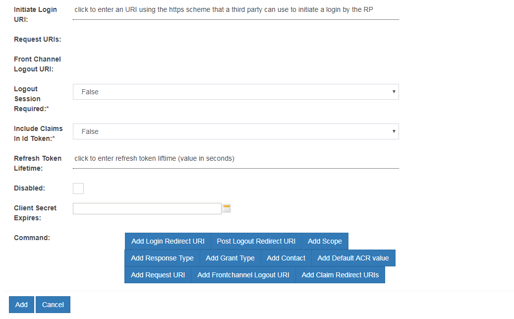

# OpenID Connect 

## Protocol Overview

OpenID Connect is an identity layer that profiles and extends OAuth 2.0. 
It defines a sign-in flow that enables an application (client) to 
authenticate a person, and to obtain authorization to obtain 
information (or "claims") about that person. For more information, 
see [http://openid.net/connect](http://openid.net/connect)

It's handy to know some OpenID Connect terminology:

- The *end user* or *subject* is the person being authenticated.

- The *OpenID Provider* or *OP* is the equivalent of the SAML IDP. It 
holds the credentials (like a username/ password) and information about 
the subject. The Gluu Server is an OP.

- The *Relying Party* or  *RP*  or *client* is software, like a mobile application 
or website, which needs to authenticate the subject. The RP is an OAuth 
client. 

!!! Note
    To learn more about the differences between OAuth, SAML and OpenID Connect, read [this blog](http://gluu.co/oauth-saml-openid).

## Gluu Server OpenID Connect Provider (OP)
The Gluu Server passes all [OpenID Provider conformance profiles](http://openid.net/certification/) and supports the following OpenID Connect specifications: Core, Dynamic Client Registration, Discovery, Form Post Response Mode, Session Management, and the draft for Front Channel Logout.

### OpenID Connect APIs

Review the Gluu Server's OpenID Connect API endpoints in the [API Guide](../api-guide/openid-connect-api.md). 

### OpenID Connect Flows

The Gluu Server supports all flows defined in the [Core spec](http://openid.net/specs/openid-connect-core-1_0.html), including
implicit, code, and hybrid flows. The implicit flow, where the token and
id_token are returned from the authorization endpoint, should only 
be used for applications that run in the browser, like a Javascript 
client. 

The code flow or hybrid flow should be used for server side
applications, where code on the web server can more securely call
the token endpoint to obtain a token. The most useful response type 
for the hybrid flow is "code id_token". Using this flow, you can verify
the integrity of the code by inspecting the `c_hash` claim in the 
id_token.

If you are using the code flow, the response type should only be code.
There is no point in using response type "code token id_token"--the extra
tokens returned by the authorization endpoint will only create additional
calls to the LDAP server and slow you down. If you are going to trade
the code at the token endpoint for a new token and id_token, you don't
need them from the authorization endpoint too.

|Step   |  Authorization code flow 	| Implicit flow	 | Hybrid flow |
|----------|----------|-------------------------------|----------------|
|1|User accesses an application.|User accesses an application.|User accesses an application.|
|2|The application/relaying party (RP) prepares an authentication request containing the desired request parameters and sends it to the OpenID Provider (Gluu Server). The `response_type requested` is `code`.|The application/replaying party (RP) prepares an authentication request containing the desired request parameters and sends it to the OpenID Provider (Gluu Server). The `response_type requested` is `id_token` or `id_token token`.|The application/replaying party (RP) prepares an authentication request containing the desired request parameters and sends it to the OpenID Provider (Gluu Server). The `response_type` requested is `code id_token`, `code token`, or `code id_token token`.|
|3|The OpenID Provider (Gluu Server) verifies the user’s identity and authenticates the user.|The OpenID Provider (Gluu Server) verifies the user’s identity and authenticates the user.|The OpenID Provider (Gluu Server) verifies the user’s identity and authenticates the user.|
|4|The OpenID Provider (Gluu Server) sends the user back to the application with an authorization code.|The OpenID Provider (Gluu Server) sends the user back to the application with an ID Token (`id_token` or `id_token token`) and an Access Token (`token`).|The OpenID Provider (Gluu Server) sends the user back to the application with an authorizatio code (`code id_token`, `code token`, or `code id_token token`) and an Access Token (`token`).|
|5|The application sends the code to the Token Endpoint to receive an Access Token and ID Token in the response.|The application uses the ID Token to authorize the user. At this point the application/RP can access the `UserInfo endpoint` for claims.|The application sends the code to the Token Endpoint to receive an Access Token and ID Token in the response.|
|6|The application uses the ID Token to authorize the user. At this point the application/RP can access the `UserInfo endpoint` for claims.||The application uses the ID Token to authorize the user. At this point the application/RP can access the `UserInfo endpoint` for claims.|
 


### Configuration / Discovery 

A good place to start when you're learning about OpenID Connect is
the configuration endpoint, which is located in the Gluu Server
at the following URL: `https://{hostname}/.well-known/openid-configuration`.

The Gluu Server also supports [WebFinger](http://en.wikipedia.org/wiki/WebFinger), as specified in the [OpenID Connect discovery specification](http://openid.net/specs/openid-connect-discovery-1_0-21.html). 

### Client Registration / Configuration

OAuth clients need a client_id, and need to supply a login redirect uri--
where the Authorization Server should redirect the end user to, post
authorization. The Gluu Server enables an administrator to manually create
a client via the oxTrust web interface. However, OpenID Connect also
defines a standard API where clients can register themselves--
[Dynamic Client Registration](http://openid.net/specs/openid-connect-registration-1_0.html). You can
find the registration URL by calling the configuration endpoint 
(`/.well-known/openid-configuration`).        

You may not want clients to dynamically register themselves! To disable this endpoint, in the oxAuth JSON properties, set the 
`dynamicRegistrationEnabled` value to False.                 

If you want to add a client through oxTrust, you can use the manual form:
by click the `Add Client` button.            




There are many client configuration parameters. Most of these are specified in the OpenID Connect [Dynamic Client Registration](http://openid.net/specs/openid-connect-registration-1_0.html) specification.

There are two configurations params which can only be configured via oxTrust by an administrator. These include:

 - Pre-Authorization -- Use this if you want to suppress the end user
 authorization prompt. This is handy for SSO scenarios where the clients
 are your own (not third party), and there is no need to prompt the 
 person to approve the release of information.      
 
 - Persist Client Authorizations -- Use this option if you only want 
 to prompt the end user once to authorize the release of user 
 information. It will cause the data to be persisted under the person's
 entry in the Gluu LDAP server.                

### Custom Client Registration

Using the Client Registration custom interception scripts,
you can implement post-registration business logic. You have access to 
the data that the client used to register. You could validate data, 
populate extra client claim, or modify the scope registrations. You
could even call API's to determine if you want to allow the 
registration at all. To access the interface for custom scripts in 
oxTrust, navigate to Configuration --> Custom Scripts --> Client Registration.

           

The script is [available here](./sample-client-registration-script.py)     

### Scopes

In OAuth, scopes are used to specify extents of access. For a sign-in 
flow like OpenID Connect, scopes end up corresponding to the release of
user claims. The Gluu Server supports the 
[standard scopes](http://openid.net/specs/openid-connect-core-1_0.html#ScopeClaims) defined 
in the OpenID Connect specification. You can also define your own scopes,
and map them to any user attributes which you have registered. 

To add Scope and Claims in OpenID Connect

1. Click on `Configuration` > `OpenID Connect`           
     
    

2. Click on Add scope on the screen to the right            
    
3. You will presented the screen below to the enter the Scope Details                      
    
    

4. To add more claims, simply click "Add Claim" and you will be presented
with the following screen:                     

    

| Field | Description |
|---| ---|
| Display Name | Name of the scope which will be displayed when searched |
| Description | Text that will be displayed to the end user during approval of the scope |
| Scope Type | OpenID, Dynamic or OAuth  |
| Default Scope | If True, the scope may be added to clients' registrations created via Dynamic Client Registration protocol |

Scope Type "OpenID" specifies to the Gluu Server that this scope will
be used to map user claims; "Dynamic" specifies to the Gluu Server that
the scope values will be generated from the result of the Dynamic Scopes 
custom interception script; "OAuth" specifies that the scope will have
no claims, it will be meaningful to an external resource server. 

Specifying a scope as "Default" means that any OIDC client using Dynamic 
Client Registration protocol is allowed to enlist it amongst scopes 
that will be requested by RP(s) the client represents. As this may result in  
sensitive users' data being leaked to unauthorized parties, thorough assessment 
of all claims which belong to scopes about to be marked as "Default" is advised.
Right after the installation, the only default scope is `openid`, 
which is required by the OpenID Connect specification. Gluu server's 
administrator can always explicitly add additional scopes some client is allowed 
to request by editing its registration metadata manually in web UI later on.

### Multi-Factor Authentication for Clients

The OpenID Connect `acr_values` parameter is used to specify a specific workflow for authentication. The value of this parameter, or the `default_acr_values` client metadata value, corresponds to the "Name" of a custom authentication script in the Gluu Server.

Out-of-the-box the Gluu Server includes custom authentiation scripts with the following `acr` values: 

|  ACR Value  	| Description			|
|---------------|-------------------------------|
|  u2f		| [FIDO U2F Device](../authn-guide/U2F.md)|
|  super_gluu	| [Multi-factor authentication](../authn-guide/supergluu.md)|
|  duo		| [Duo soft-token authentication](../authn-guide/duo.md)|
|  cert	| [Smart card or web browser X509 personal certificates](../authn-guide/cert-auth/)|
|  cas	| External CAS server|
|  gplus	| [Google+ authentication](../authn-guide/google.md)|
|  OTP	| [OATH one time password](../authn-guide/otp.md) |
|  asimba	| Use of the Asimba proxy for inbound SAML |
|  twilio_sms	| Use of the Twilio Saas to send SMS one time passwords |
|  passport	| Use of the [Passport component for social login](../ce/authn-guide/passport.md/) |
|  yubicloud	| Yubico cloud OTP verification service |
|  uaf	| experimental support for the FIDO UAF protocol |
|  basic_lock	| [Enables lockout after a certain number of failures](../authn-guide/intro.md/#configuring-account-lockout) |
|  basic	| [Sample script using local LDAP authentication](../ce/authn-guide/basic.md/) |

To use any of these `acr_values`, login to your Gluu Server admin interface and navigate to Configuration > Manage Custom Scripts. Find the desired script, tick the `Enabled` check box, scroll to the bottom of the page and click `Update`. Learn more in the [authentication guide](../authn-guide/intro.md).  

### Logout

The OpenID Connect [Session Management](http://openid.net/specs/openid-connect-session-1_0.html) specification is still marked as draft, and new mechanisms for logout are in the works. The current specification requires JavaScript to detect that the session has been ended in the browser. It works... unless the tab with the JavaScript happens to be closed when the logout event happens on another tab. Also, inserting JavaScript into every page is not feasible for some applications. 

The Gluu Server also support the draft for [Front Channel Logout](http://openid.net/specs/openid-connect-frontchannel-1_0.html). This
is our recommended logout strategy. Using this mechanism, an html page is rendered which contains one iFrame for each application that 
needs to be notified of a logout. The Gluu Server keeps track of which clients are associated with a session (i.e. your browser). This 
mechanism is not perfect. If the end user's web browser is blocking third party cookies, it may break front channel logout. Also, the Gluu Server has no record if the logout is successful--only the browser knows. This means that if the logout fails, it will not be logged or retried. The good thing about front channel logout is that the application can clear application cookies in the end user's browser. To use front channel logout, the client should register logout_uri's, or `frontchannel_logout_uri` for clients using the Dynamic Client Registration API. 

### Disable OpenID Connect Scope
Gluu Server 3.1.1 provides you an option to disable OpenID connect instead of having to deleting the configuration
and settings of OpenID Connect created.
To disable OpenID Connect

1. Navigate to `configiration` > `OpenID Connect`

2. Scroll to the end of the page and check the `Disabled` checkbox


## OpenID Connect Relying Party (RP)

In order to leverage your Gluu Server OpenID Provider (OP) for central authentication, your web and mobile apps will need to support OpenID Connect. In OpenID Connect jargon, your app will need to act as an OpenID Connect Relying Party (RP) or "client". 

There are many ways to go about supporting OpenID Connect in your apps, however we do not recommend writing your own OpenID Connect client. Rather, it is best to use existing client software implementations that have been verified to implement OpenID Connect properly (and securely!). A good OpenID Connect client will do much of the heavy lifting for you. 

!!! Note
    Although you can use generic OAuth client libraries, you would have to write some extra code to take advantage of the security features baked into OpenID Connect. For example, there is no `id_token` in OAuth, so you won't find any code for `id_token` validation in an OAuth library. 

### Single Page Applications 
To support OpenID Connect in a single page application (SPA), we recommend using Identity Model's [OpenID JS Client](https://github.com/IdentityModel/oidc-client-js).

You'll have to add the client manually to the Gluu Server via the GUI. 
When completing the `add client` form, you can use the following 
configuration:

```
Client Name: Implicit Test Client
response_type: token id_token
Application Type: Web
Pre-Authorization: Enabled
Subject Type: public
Scopes: openid, profile, email
Response Types: token id_token
Grant Types: implicit
```

Once you have registered the client in the Gluu Server, all you need to 
do is update the `client_id`, `redirect_uri`, and `providerInfo` values 
in the login page html. Assuming you've checked out the project into a 
web accessible folder, then navigate to the page and test! 

### Server-Side Web Applications
Many applications are "server-side", meaning the web page displays content but most of the dynamic business logic resides on the web server. Two design patterns have emerged for securing server-side web applications: (1) use of web server filters and reverse proxies, and (2) leveraging OAuth2 directly in your application. Which approach to use depends on the trade-off between easier devops (option 1), and how deeply you want to integrate centralized security policies into your application (option 2).

#### Add OpenID Connect in the Application
Calling the OpenID Connect API’s directly will enable “smarter” applications. For example, transaction level security can be more easily implemented by calling the APIs directly. This can have a positive impact on usability. Giving developers more ability to leverage centralized policies may also increase re-use of policies, and ultimately result in better security. 

The OpenID Foundation maintains a list of client libraries on [their website](http://openid.net/developers/libraries). However, our experience has been that the quality of these libraries varies widely. Some are not well documented, other are not updated frequently, and some do not implement essential security features available in OpenID Connect. In addition, if a wide array of client libraries are used it becomes difficult to monitor and patch security vulnerabilities. 

For these reasons, we recommend using our OpenID Connect middleware software called [oxd](http://oxd.gluu.org) to secure and integrate web applications with your Gluu Server.  

oxd is not open source software, but it is very reasonably priced. The code is available on [GitHub](https://github.com/gluufederation/oxd). There are libraries available for PHP, Java, Python, C#, Node, 
Ruby, Perl and Go. There are also plugins available for several popular open source applications.

[Watch the oxd demo](http://gluu.co/oxd-demo).

[Get an oxd license for free](http://oxd.gluu.org)

#### Use Web Server Plugins
Web Server filters are a tried and true approach to achieving single sign-on with web applications. The web server filter enforces the presence of a token in a HTTP Request. If no token is present, the Web server may re-direct the person, or return a meaningful code or message to the application. The web server with the filter may directly serve the application, or may proxy to a backend service.

One of the advantages of the web server filter approach is that the application developer does not need to know that much about the 
security protocols--if the request makes it through to the application, the person has been authenticated and the request is authorized. Another advantage is that the application security is administered by the system administrators, not by developers. For example, it may be easier to manage and audit apache configuration than to read a bunch of code. 

##### Apache Filter
One of the best OpenID Connect relying party implementations was written 
by Hans Zandbelt, called [mod_auth_openidc](https://github.com/pingidentity/mod_auth_openidc). It is an authentication and authorization module for the Apache 2.x HTTP server that authenticates users against an OpenID Connect Provider (OP). The software can be found on GitHub and is included in the package management system for several Linux distributions. There are binary packages available, and if you are good at compiling C code, you can build it yourself from the source. 

##### Nginx Filter
If you are an Nginx fan, there is a similar [Lua implementation](https://github.com/pingidentity/lua-resty-openidc) to make NGINX operate as an OpenID Connect RP or OAuth 2.0 RS. 

### Mobile Applications

One of the most compelling reasons to use Connect is to authenticate 
people from a mobile application. The IETF draft 
[OAuth 2.0 for Native Apps](https://tools.ietf.org/html/draft-ietf-oauth-native-apps-06) 
provides an overview of an improved design for mobile security. In 
addition to the security features of OpenID Connect, this draft suggests 
the use of a PKCE and custom URI schemes (i.e. an application can 
register a URI such as myapp:// instead of https://).

In 2016, Google released and then donated code to the OpenID Foundation 
called AppAuth for [Android](https://github.com/openid/AppAuth-android) 
and [iOS](https://github.com/openid/AppAuth-iOS). The AppAuth projects 
also include sample applications. Simulataneously, Google announced that 
it was deprecating the use of WebViews--a strategy used by mobile app 
developers which is vulnerable to malicious application code. Not only 
does AppAuth provide secure authentication, it enables SSO across the 
system browser and mobile applications. It accomplishes this by 
leveraging new operating system features that enable the system browser 
to be called by an application in an opaque view that does not enable 
an app developer to steal a person's credentials, or other applications 
to steal codes or tokens. Using this approach, mobile app developers can 
use the authorization code or hybrid flow (as described earlier). 

The Gluu Server is the only free open source OpenID Connect Provider 
that currently supports AppAuth. 

## oxAuth RP

The Gluu Server ships with an optional OpenID Connect RP web application, 
which is handy for testing.  It's called oxauth-rp. During Gluu Server 
setup, you'll be asked if you want to install it--which you should on 
a development environment. It will be deployed on `https://<hostname>/oxauth-rp`. 
Using this tool you can exercise all of the OpenID Connect API's, 
including discovery, client registration, authorization, token, 
userinfo, and end_session. 

