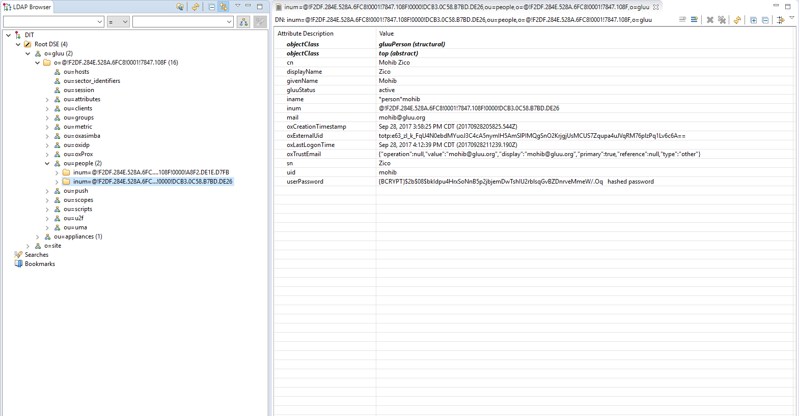

# Local User Management
In this document we cover managing people, groups and user registration in oxTrust, the graphical user interface for your Gluu Server. 

While the Gluu Server does expose a generic user registration page at `https://<hostname>/identity/register`, we almost always recommend writing a registration page in your app, and using the Gluu Server's SCIM APIs to register and add new users to your IAM service. You can learn more about using SCIM in the [user management with SCIM 2.0](./user-scim.md) docs. 

## Manage People
To manage people, navigate to `User` > `Manage People`.

From this interface you can add and search users. Because the user database can potentially be very large, a value is required in the search field. In other words, you can not click search with a blank entry to populate all users. If you need to see all users, this would be best performed manually within the Gluu LDAP server. Upon performing a user search in oxTrust a list will be populated with all users that match the search.

To edit a user, simply click on any of the hyperlinks associated with
that user and you will be taken to a user management interface where you
can modify specific attributes relating to that user.

## Manage Groups
Out of the box, the Gluu Server includes one group: the Gluu Manager
Group (`gluuManager`). Groups can be added and populated as
needed. By using the `Manage Groups` feature, the Gluu Server
Administrator can add, delete or modify any group or user within a
group. The list of available groups can be viewed by hitting the
`Search` button with a blank search box.

The Gluu Server Administrator can modify information such as Display
Name, Group Owner, Visibility type etc. The Server Administrator can
also add or delete users within existing groups. The group information
is represented as shown below.

If any member of the Organization is required to be added in any
specific group, this can be achieved be clicking on the Add Member
button. The flow is _Add Member --> Search the name/email of the user
--> Select the user --> Click OK --> Update._

## Import People
Gluu Server allows the administrator to import users from a file. 
This can be accessed by navigating to `Users` > `Import People`.

* Click on the `Add` button to select the file from which the users will be imported. 
This feature has been tested with a `xls` file.

* The file needs to be validated before it can be imported. Click on the `Validate` button.

* Click on the `Import` button to complete the import of users.

## Manage user in Gluu Server LDAP

If you are interested to explore the ldap tree which is inside Gluu Server then it's possible to do that as well. You just need to establish a tunnel from your computer to target Gluu Server's ldap. This tunneling is required because Gluu Server's LDAP port, 1636, is not exposed to internet.

In below example we are showing how you can connect and use Gluu Server's internal LDAP server with any ldap browser. 

 - Create tunnel: 
   - `ssh -L 5901:localhost:1636 root@[ip_of_Gluu_server]`
 - Open LDAP browser
   - Create new connection 

   - Perform authentication. 'Password' is the the password of 'admin' user. 

   - Browse ldap and go to 'ou=people'. 

   

### File Structure

The file needs to contain the following fields from which the user data will be pulled. 
Please remember to use the exact spelling as shown here.

* Username

* First Name

* Last Name

* Email

## User Registration
The Gluu Server is shipped with a user registration script that can be used to enable basic user registration. 

When possible we recommend handling user registration locally in your app, then pushing the user information to the Gluu Server via SCIM. This will give you more control and flexibility in defining the exact registration process. Also, since oxTrust was primarily designed as an admin interface, it is frequently not Internet facing and therefore the registration page may not be available to a user on the web.

!!! Note 
    When user registration is handled via oxTrust, users can **not** be added to a backend LDAP or Active Directory server. This means that self-registration via oxTrust is only effective if users are authenticated by GluuLDAP (and not a backend LDAP or AD server).     

To enable user registration via the Gluu Server, follow these steps:

1. Navigate to `Custom Scripts` and select the `User Registration` tab;   
2. Find the `Enabled` field and check the box;     
3. Click the `Update` button at the bottom of the page;      
4. New users will now be able to register for accounts at: `https://<hostname>/identity/register`.  

### Adding Attributes to Registration
A limited number of attributes are present in the default registration form. If more attributes are needed they can be added via the GUI by navigating to `Organization Configuration` > `Manage Registration`. Learn how to [add attributes](../admin-guide/oxtrust-ui.md#manage-registration) to the default registration form. 

### Manual Approval of New Users
By default the `Custom property (key/value)` field will include the value: `enable_user` and `true`. This enables new users to login as soon as registration is complete. If you want to manually review and approve new user registrations, you can set this value to `false` as shown in the screenshot below.

