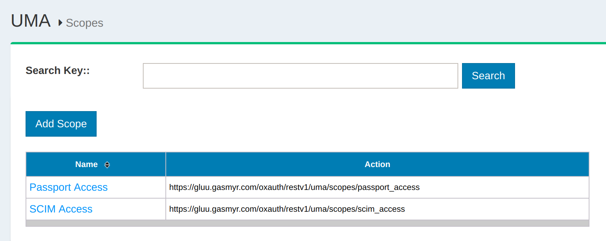
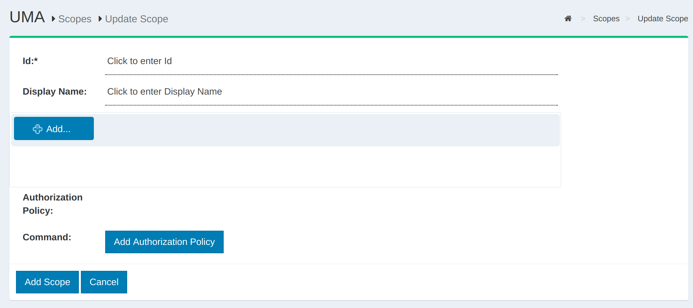

# User Managed Access 2.0 ("UMA 2") Authorization Server (AS)

## Overview

As a profile of OAuth 2.0 that is complementary to OpenID Connect, UMA 2 defines RESTful, 
JSON-based, standardized flows and constructs for coordinating the protection of APIs and 
web resources.

UMA 2 defines interfaces between authorization servers (AS), like Gluu, and resource servers (RS) that enable centralized policy decision-making for improved service delivery, auditing, policy administration, and accountability, even in a very loosely coupled "public API" environment. 

UMA 2 does not standardize a policy expression language, enabling flexibility in 
policy expression and evaluation through XACML, other declarative policy languages, 
or procedural code as warranted by conditions. 

UMA 2 inherits authentication agnosticism from OAuth. It concentrates on authorization, not authentication. 
It has been profiled to work with OpenID Connect to gather identity claims from whoever is attempting access, 
and enables attribute-based ("claims" in OAuth2) authorization (with group-based or role-based policies a natural subset).
 
## Terminology

UMA 2 introduces new terms and enhancements to OAuth term definitions. A few important terms include:

Resource Owner (RO): An entity capable of granting access to a protected resource--the "user" in User-Managed Access. This is typically an end-user, but it can also be non-human entity that is treated as a person for limited legal purposes, such as a corporation.

Resource Server (RS): A server that hosts resources on a resource owner's behalf, registers resources for protection at an authorization server, and is capable of accepting and responding to requests for access to protected resources.

Authorization Server (AS)_*_: A server that protects resources managed at a resource server, on behalf of the resource owner.

_*_ _Gluu Server is an UMA AS_.

Learn more in the UMA 2 [Federated Authorization](https://docs.kantarainitiative.org/uma/ed/oauth-uma-federated-authz-2.0-07.html) and [Grant](https://docs.kantarainitiative.org/uma/ed/oauth-uma-grant-2.0-06.html) specifications.

## Scopes

UMA 2 scopes are used to grant a client permission to do an action on a protected resource. Different scopes can grant access to the same action. For example, a "read" action can be allowed with scope "read" or "all". 

For some actions the Resource Server (RS) may want multiple scopes at the same time. For instance, a "read" action should only be allowed if the authorization request includes the "read" **and** "all" scopes. UMA 2 scopes are bound to resources and are used to fetch policies that check whether the specified user or client should have access to the resource. 

The scopes are described in JSON and have the following properties:

- name
- icon\_uri

An example of the scope JSON:

```
{
  "name": "Add photo",
  "icon_uri": "https://<hostname>/icons/add_photo_scope.png"
}
```

!!! Note
    The scope JSON may contain custom properties.

The following is an example of an UMA 2 Scope URL:

```
https://<hostname>/uma/scopes/view
```

!!! Note
    The scope endpoint has to be present in UMA configuration to make it discoverable.

The `ldif` for both an internal and external scope is given below:

**Sample ldif**
```
dn: inum=@!1111!8990!BF80,ou=scopes,ou=uma,o=@!1111,o=gluu
displayName: View
inum: @!1111!8990!BF80
objectClass: oxAuthUmaScopeDescription
objectClass: top
oxId: View
oxIconUrl: http://<hostname>/uma/icons/view_scope.png
```

### List of UMA Scopes
A list of UMA scopes can be found in Gluu Server oxTrust Admin UI under `UMA` > `Scopes` section.



### Add UMA Scope
A new UMA scope can be added by navigating to `UMA` > `Scopes` and then click the **Add Scope** button.



Additionally there is an option to add one or more authorization policies to the new scope.

## Resource Management

As stated in the [Federated Authorization spec](https://docs.kantarainitiative.org/uma/wg/rec-oauth-uma-federated-authz-2.0.html), the AS exposes a protected API that the RS can use to manage resources intended for protection. Gluu Server, as an AS, implements this specification and ships with a protected API that the RS can use to:

1. Create resource   
1. Update resource   
1. Delete ressource   
1. List protected resources    
 
For more information about the resources protection API check [the UMA API doc](https://gluu.org/docs/ce/api-guide/uma-api/#uma-2-resource-registration-api).

Out-of-the-box the Gluu Server uses UMA to protect SCIM resources. Learn more in the [SCIM protected by UMA documentation](../user-management/scim2#scim-protected-by-UMA). 

## UMA RPT Authorization Policies
UMA RPT Authorization Policies are associated with UMA scopes. An authorization request has a resource_id and scope(s). Each scope can point to one or more policies. If all policies associated with all scopes return `true`, then access is granted. 

For example, let's say we have the following resource, `GET /photo`. In order to access it the Resource Server (RS) requires the `read` scope to be present. If we have a policy that always return `true`, then any authorization request to `/photo` that includes the `read` scope will result in access granted. 

If we wish to have more sophisticated logic, for example to grant access only to a specific client, then we can add something like `client_id = "@1111"` to the policy. This means that an authorization request to `/photo` will only be granted if the scope includes `read` and is coming from `client_id = "@1111"`.

There are three (3) main properties of a policy:

1. scopes: policy protects resources by scopes; 
2. authorization script: script that is evaluated in order to grant/deny access;  
3. name: a human readable name to the UMA policy.   

The following section outlines how to define UMA RPT Authorization Policies from the Custom Script menu. The Custom Script page is accessed by navigating to `Configuration` > `Custom Scripts` > `UMA RPT Policies`.


### Sample RPT Authorization Policy script

```
# Call sequence
# 1. First is call constructor of the Script __init__
# 2. Next init() method
# 3. Next getRequiredClaims() - method returns required claims, so UMA engine checks whether
#    in request RP provided all claims that are required. Pay attention that there can be
#    multiple scripts bound to the scopes, means that UMA engine will build set of required claims
#    from all scripts. If not all claims are provided need_info error is sent to RP.
#    During need_info construction getClaimsGatheringScriptName() method is called
# 4. authorize() method is called if all required claims are provided.
# 5. destroy()

from org.xdi.model.custom.script.type.uma import UmaRptPolicyType
from org.xdi.model.uma import ClaimDefinitionBuilder
from java.lang import String

class UmaRptPolicy(UmaRptPolicyType):
    def __init__(self, currentTimeMillis):
        self.currentTimeMillis = currentTimeMillis

    def init(self, configurationAttributes):
        print "RPT Policy. Initializing ..."
        print "RPT Policy. Initialized successfully"

        return True

    def destroy(self, configurationAttributes):
        print "RPT Policy. Destroying ..."
        print "RPT Policy. Destroyed successfully"
        return True

    def getApiVersion(self):
        return 1

    # Returns required claims definitions.
    # This method must provide definition of all claims that is used in 'authorize' method.
    # Note : name in both places must match.
    # %1$s - placeholder for issuer. It uses standard Java Formatter, docs : https://docs.oracle.com/javase/7/docs/api/java/util/Formatter.html
    def getRequiredClaims(self, context): # context is reference of org.xdi.oxauth.uma.authorization.UmaAuthorizationContext
        json = """[
        {
            "issuer" : [ "%1$s" ],
            "name" : "country",
            "claim_token_format" : [ "http://openid.net/specs/openid-connect-core-1_0.html#IDToken" ],
            "claim_type" : "string",
            "friendly_name" : "country"
        },
        {
            "issuer" : [ "%1$s" ],
            "name" : "city",
            "claim_token_format" : [ "http://openid.net/specs/openid-connect-core-1_0.html#IDToken" ],
            "claim_type" : "string",
            "friendly_name" : "city"
        }
        ]"""
        context.addRedirectUserParam("customUserParam1", "value1") # pass some custom parameters to need_info uri. It can be removed if you don't need custom parameters.
        return ClaimDefinitionBuilder.build(String.format(json, context.getIssuer()))

    # Main authorization method. Must return True or False.
    def authorize(self, context): # context is reference of org.xdi.oxauth.uma.authorization.UmaAuthorizationContext
        print "RPT Policy. Authorizing ..."

        if context.getClaim("country") == 'US' and context.getClaim("city") == 'NY':
            print "Authorized successfully!"
            return True

        return False

    # Returns name of the Claims-Gathering script which will be invoked if need_info error is returned.
    def getClaimsGatheringScriptName(self, context): # context is reference of org.xdi.oxauth.uma.authorization.UmaAuthorizationContext
        context.addRedirectUserParam("customUserParam2", "value2") # pass some custom parameters to need_info uri. It can be removed if you don't need custom parameters.
        return "sampleClaimsGathering"
```

### UMA 2 Claims-Gathering

Sometimes an RPT Authorization Policy may require additional claims to be provided by the user. In this case the Claims-Gathering Flow can be used to gather such information. The logic is coded as a custom script and can be added by navigating to `Configuration` > `Custom Scripts` > `UMA Claims-Gathering`.


### Sample Claims-Gathering script

```
from org.xdi.model.custom.script.type.uma import UmaClaimsGatheringType

class UmaClaimsGathering(UmaClaimsGatheringType):

    def __init__(self, currentTimeMillis):
        self.currentTimeMillis = currentTimeMillis

    def init(self, configurationAttributes):
        print "Claims-Gathering. Initializing ..."
        print "Claims-Gathering. Initialized successfully"

        return True

    def destroy(self, configurationAttributes):
        print "Claims-Gathering. Destroying ..."
        print "Claims-Gathering. Destroyed successfully"
        return True

    def getApiVersion(self):
        return 1


    # Main gather method. Must return True (if gathering performed successfully) or False (if fail).
    # Method must set claim into context (via context.putClaim('name', value)) in order to persist it (otherwise it will be lost).
    # All user entered values can be access via Map<String, String> context.getPageClaims()
    def gather(self, step, context): # context is reference of org.xdi.oxauth.uma.authorization.UmaGatherContext
        print "Claims-Gathering. Gathering ..."

        if step == 1:
            if (context.getPageClaims().containsKey("country")):
                country = context.getPageClaims().get("country")
                print "Country: " + country

                context.putClaim("country", country)
                return True

            print "Claims-Gathering. 'country' is not provided on step 1."
            return False

        elif step == 2:
            if (context.getPageClaims().containsKey("city")):
                city = context.getPageClaims().get("city")
                print "City: " + city

                context.putClaim("city", city)
                print "Claims-Gathering. 'city' is not provided on step 2."
                return True

        return False

    def getNextStep(self, step, context):
        return -1

    def prepareForStep(self, step, context):
        if step == 10 and not context.isAuthenticated():
            # user is not authenticated, so we are redirecting user to authorization endpoint
            # client_id is specified via configuration attribute.
            # Make sure that given client has redirect_uri to Claims-Gathering Endpoint with parameter authentication=true
            # Sample https://sample.com/restv1/uma/gather_claims?authentication=true
            # If redirect to external url is performated, make sure that viewAction has onPostback="true" (otherwise redirect will not work)
            # After user is authenticated then within the script it's possible to get user attributes as
            # context.getUser("uid", "sn")
            # If user is authenticated to current AS (to the same server, not external one) then it's possible to
            # access Connect session attributes directly (no need to obtain id_token after redirect with 'code').
            # To fetch attributes please use getConnectSessionAttributes() method.

            print "User is not authenticated. Redirect for authentication ..."
            clientId = context.getConfigurationAttributes().get("client_id").getValue2()
            redirectUri = context.getClaimsGatheringEndpoint() + "?authentication=true" # without authentication=true parameter it will not work
            authorizationUrl = context.getAuthorizationEndpoint() + "?client_id=" + clientId + "&redirect_uri=" + redirectUri + "&scope=openid&response_type=code"
            context.redirectToExternalUrl(authorizationUrl) # redirect to external url
            return False
        if step == 10 and context.isAuthenticated(): # example how to get session attribute if user is authenticated to same AS
            arc = context.getConnectSessionAttributes().get("acr")

        return True

    def getStepsCount(self, context):
        return 2

    def getPageForStep(self, step, context):
        if step == 1:
            return "/uma2/sample/country.xhtml"
        elif step == 2:
            return "/uma2/sample/city.xhtml"
        return ""
```

### UMA 2 RPT Authorization Policy Algorithm
The UMA 2 policy algorithm has two rules that must be followed:

1. UMA policies protect resources based on scopes. If a scope is protected by a policy, then the policy script must reutrn `true` in order to authorize access during RPT authorization. 

2. Multiple policies can protect a single scope. In such a case, all the policies must retun `true` to authorize access or else access will be denied.

 

### UMA 2 Client Authentication

UMA 2 is a regular OAuth 2 Token Endpoint. Therefore it supports the same client authentications as standard OAuth2/OpenID Connect.

There is one special client authentication method which uses the `access_token` obtained by the user to authenticate the client. This means the client that was used during user authentication is used for client authentication. Of course the `access_token` must be valid.

Non-normative example: 

```json
POST /token HTTP/1.1
Host: server.example.com
Content-Type: application/x-www-form-urlencoded
Authorization: AccessToken czZCaGRSa3F0MzpnWDFmQmF0M2JW
...
```


## Scopes Expressions

UMA 2 Scope expressions is a Gluu-specific extension of UMA 2 which offers a flexible way to 
combine scopes and thus support more robust ways to grant access.

### Register resource with scope_expression

RS registers resource 

!!! Note
        new `scope_expression` field, `resource_scopes` is ignored in this case

```json
{  
   "resource_scopes":[],
   "description":"Collection of digital photographs",
   "icon_uri":"http://www.example.com/icons/flower.png",
   "name":"Photo Album",
   "type":"http://www.example.com/rsrcs/photoalbum",
   "scope_expression": {
      "rule": {
         "and": [
            {
               "or": [
                   {"var": 0},
                   {"var": 1}
               ]
            },
            {"var": 2}
         ]
      },
      "data": [
         "http://photoz.example.com/dev/actions/all",
         "http://photoz.example.com/dev/actions/add",
         "http://photoz.example.com/dev/actions/internalClient"
      ]
   }
}

```

### Ticket registration

RS registers tickets with all scopes mentioned in "data" (we need all scopes in order to evaluate expression--all or nothing principle)

```json

{  
   "resource_id":"112210f47de98100",
   "resource_scopes":[  
       "http://photoz.example.com/dev/actions/all",
       "http://photoz.example.com/dev/actions/add",
       "http://photoz.example.com/dev/actions/internalClient"
   ]
}
```

### Evaluation

UMA Engine iterates over each scope and fetches and evaluates ALL policies for each scope:

1. not enough claims - return need_info error
1. enough claims - evaluate results from ALL policies with "AND" rule for ONE given scope.
   1. `http://photoz.example.com/dev/actions/all` -  `policyA AND policyB` => false
   1. `http://photoz.example.com/dev/actions/add` -  `policyA AND policyD` => true
   1. `http://photoz.example.com/dev/actions/internalClient` - `policyD AND policyE and policyK` => true

Results in expression : `(false OR true) AND true` => `true`

Below is an example of including all scopes except `http://photoz.example.com/dev/actions/all` scope (because for this part of expression `false` is returned). 

```json
{  
   "active":true,
   "exp":1256953732,
   "iat":1256912345,
   "permissions":[  
      {  
         "resource_id":"112210f47de98100",
         "resource_scopes":[  
            "http://photoz.example.com/dev/actions/add",
            "http://photoz.example.com/dev/actions/internalClient"
         ],
         "exp":1256953732
      }
   ]
}
```


## UMA RS Implementation
To secure apps with OpenID Connect RP and UMA 2 RS code we recommend taking a look at our [oxd client software](http://oxd.gluu.org).

## UMA API

Gluu server ship with two UMA Authorization Server APIs:

1. The client API documented [here](https://gluu.org/docs/ce/api-guide/uma-api/#uma-2-token-endpoint-api): used by clients to obtains RPT.    
1. The Protection API documented [here](https://gluu.org/docs/ce/api-guide/uma-api/#uma-2-resource-registration-api): used by Resource Server to request resources protection on behalf of the Ressource Owner(RO)   


