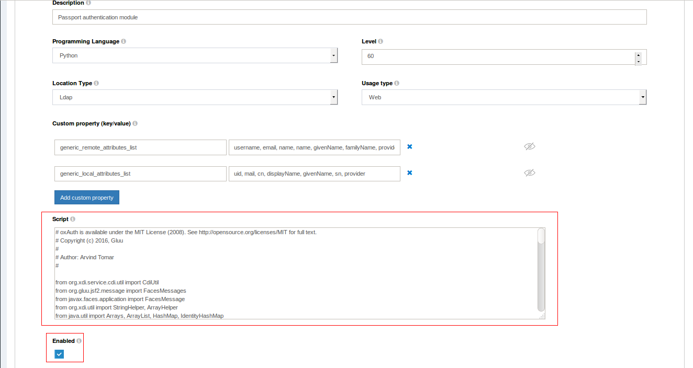

# Inbound SAML using Passport.js 
## Overview

The Gluu Server can be configured to delegate user authentication to one or more external SAML IDPs using the Passport.js authentication middleware. Passport is an MIT licensed, Express-based web application which Gluu has modified to call oxTrust APIs for its non-static configuration. 

### User Provisioning
After authentication at an external IDP, if there is no existing user record in Gluu, one will be created dynamically. Once personal data has been obtained and added to Gluu's local LDAP directory service, it can be used to offer SSO to all applications leveraging Gluu for authentication. 

## Prerequisites
- Gluu Server CE 3.1.2 with Passport.js   

## Sequence Diagram


1. The user-agent (usually a web browser) requests one of the Gluu Server's endpoints' url after being redirected there by a remote party asking for release of user's personal data. The remote party has an option of pre-selecting remote IDP that must be used to authenticate the user by passing base64-encoded JSON object of specified format (described in details further in this paper) in `state` url query parameter of OpenID Connect authorization request. For example, the JSON object may take the following form: `{"salt":"<SALTVALUE>","provider":"<idp_name>"}`(base64-encoded)

1. As a session for the user doesn't exist in the Gluu Server yet, the user-agent is redirected to its oxAuth component for authentication, triggering the SAML Passport Authenticator script; depending on how it was called, the script either retrieves the target IDP's id from the `state` parameter, or just presents an IDP selection page to the user, waiting for him to select it

1. The script arranges a call to the Gluu Server's Passport module requesting a JWT token

1. The Passport module generates a JWT token and returns it back to the Gluu Server

1. The script constructs an URL which the Passport module will need in order the delegate user's authentication to the selected IDP

1. The script makes a request to the Gluu Server's Passport module including the JWT token, and initiates the authentication flow

1. The Passport module redirects the user to the specified external SAML IDP

1. After successful authentication user is redirected back to the Passport module, and their personal data is passed within SAML response to module's callback endpoint

1. The Passport module redirects user  back to the Passport's custom interception script submitting the user's attributes and access token to its `passportpostlogin.xhtml` page

1. The interception script verifies whether such user exists in Gluu's OpenLDAP server:
   a. If the user exists then the user is logged into the system; in case some of their attributes are changed, they will be updated in existing user entry as well
   b. If the user does not exist, the interception script will first create a new user entry in the Gluu OpenLDAP server's tree and then will log in the user into the system.

## Instructions
The steps for configuring Gluu Server for inbound SAML scenario using Passport.js are as follows:

1. [Enable Passport in Gluu](#enable-passport)
1. [Configure trust](#configure-trust)
1. [Testing the resulting setup](#testing)
1. [Implement IDP discovery ("WAYF")](#implement-idp-discovery-wayf)
1. [Troubleshooting tooltips](#troubleshooting-tooltips)

## Enable Passport

Make sure you have deployed Passport.js during installation of your Gluu Server. 

Then follow the next steps:

1. Navigate to `Configuration `> `Manage Custom Scripts`;
2. In the `Person Authentication` tab, find and enable the `passport_saml` script;


!!! Note
    This script is updated from time to time. We recommend checking the [SAML Passport Authenticator script](https://github.com/GluuFederation/oxAuth/blob/master/Server/integrations/saml-passport/SamlPassportAuthenticator.py) and confirming it matches the script included in your distribution of Gluu.

3. Click the "Update" at the bottom of the page.
   

4. Navigate to `Configuration `>` Manage Authentication` > `Passport Authentication Method`   

5. Select "Enabled" from `Passport Support` drop-down list and click "Update"
    

6. Once initial configuration is completed, restart the `passport` service by following the below instructions:   

    6.1. Login to chroot container

    6.2. Stop the service: `service passport stop`

    6.3. Start the service: `service passport start`

!!! Note 
    In case if Passport is not available as a service, you can also restart the Gluu Server's main service itself.

## Configure Trust
 
### Register external IDPs with home IDP

Some basic information is required to make Passport aware of the supported external IDPs. By default Passport expects to find this configuration in the `/etc/gluu/conf/passport-saml-config.json` file. Each supported external IDP should be added as a JSON object. 

Once the file is updated, the `passport` service must be restarted in order to apply the changes and trigger generation of new metadata files: 

`# service passport restart`

A sample configuration containing entries for two external IDPs is provided below:
 
```
{"idp1": {"entryPoint": "https://idp.example.com/idp/profile/SAML2/POST/SSO",
                "issuer": "urn:test:example",
                "identifierFormat": "urn:oasis:names:tc:SAML:2.0:nameid-format:transient",
                "authnRequestBinding": "HTTP-POST",
                "additionalAuthorizeParams": "<Some additinal params json>",
                "skipRequestCompression": "true",
                "logo_img":"{Provider Logo url #1}",
                "enable":"true",
                "cert":"MIIDbDCCAlQCCQCuwqx2PNP...........YsMw==",
                "reverseMapping": {
                        "email" : "email",
                        "username": "urn:oid:0.9.2342.19200300.100.1.1",
                        "displayName": "urn:oid:2.16.840.1.113730.3.1.241",
                        "id":  "urn:oid:0.9.2342.19200300.100.1.1",
                        "name": "urn:oid:2.5.4.42",
                        "givenName": "urn:oid:2.5.4.42",
                        "familyName": "urn:oid:2.5.4.4",
                        "provider" :"issuer"
                }
        },
 "idp2":{"entryPoint": "https://idp2.example.com/idp/profile/SAML2/POST/SSO",
                        "issuer": "urn:test2:example",
                        "identifierFormat": "urn:oasis:names:tc:SAML:2.0:nameid-format:transient",
                        "authnRequestBinding": "HTTP-POST",
                        "additionalAuthorizeParams": "",
                        "skipRequestCompression": "true",
                        "logo_img":"{Provider Logo url #1}",
                        "enable":"true",
                        "cert":"AVDVfsgsdafkmiaAFJiasdfmpaf...........YsMw==",
                        "reverseMapping": {
                                "email" : "email",
                                "username": "urn:oid:0.9.2342.19200300.100.1.1",
                                "displayName": "urn:oid:2.16.840.1.113730.3.1.241",
                                "id":  "urn:oid:0.9.2342.19200300.100.1.1",
                                "name": "urn:oid:2.5.4.42",
                                "givenName": "urn:oid:2.5.4.42",
                                "familyName": "urn:oid:2.5.4.4",
                                "provider" :"issuer"
                        }
                }       
}
```
 
!!! Note 
    All parameters listed in the configuration above must be included in the file for it to be validated by Passport. An empty string value can be used when some are not actually needed for a specific external IDP, for example the `additionalAuthorizeParams` parameter of `idp2` in the example above.
 
Placeholder URLs like `https://idp.example.com` must be replaced with the URLs of actual remote IDPs. A description of each property is below:

* `entryPoint` - URL where Passport should redirect the user for authentication. You can use either the Post or Redirect request binding. If you were sent IDP, you can find the URL in the following XML elements:

```xml
<SingleSignOnService  
Binding="urn:oasis:names:tc:SAML:2.0:bindings:HTTP-POST"  
Location="https://idp.example.com/idp/profile/SAML2/POST/SSO"/> 
```

or, if using the redirect method:

```xml
<SingleSignOnService  
Binding="urn:oasis:names:tc:SAML:2.0:bindings:HTTP-Redirect"     
Location="https://idp.example.com/idp/profile/SAML2/Redirect/SSO"/>     
```

* `issuer` - A string specifying the `entityid` of the IDP. The value for each `entityid` should be unique.
* `identifierFormat` - uri specifying name identifier's ("nameid's") format to request/expect from this remote IDP
* `authnRequestBinding` - "HTTP-POST" for Post binding or "HTTP" for redirect binding. 
* `cert` - The IDP's PEM-encoded X.509 certificate with the `BEGIN CERTIFICATE` and `END CERTIFICATE` separator lines stripped and all line breaking characters (new line, carriage return, space etc) removed from it. Effectively this means a single base64-encoded string representing body of a certificate. Next command can be used to transform an existing X.509, PEM-encoded certificate into string of the required format: `# cat ~/your_cert.crt | grep -v '^---' | tr -d '\n'`.
   The certificate supplied here is the one intended for signing. For instance, if you are using Shibboleth bundled in a Gluu Server instance, visit `https://<gluu-host>/idp/shibboleth` and see the contents of XML tag `KeyDescriptor` where `use="signing"` inside `IDPSSODescriptor` tag. 
* `enable` - If set to "true", then this IDP is allowed to be used by users that try to get authenticated at this Gluu Server 
* `additionalAuthorizeParams` - A dictionary of additional query parameters which can be added in order to 'authorize' requests
* `skipRequestCompression` - If set to "true", then the SAML request to this service provider will not be compressed.
* `logo_img` - A URL pointing to the IDP's logo used by the Gluu's Passport login page. Can be an empty string if not required
* `reverseMapping` - An embedded JSON object defining how the SAML attributes' names must be mapped to attributes that are used internally by the Passport module:
    * `email` - the user's email
    * `username` - the user's username (uid) 
    * `displayName` - a display name for the user
    * `id` - the user's userid
    * `name` - the user's full name
    * `givenName` - the user's first name
    * `familyName` - the user's last name

### Register home SP with external IDPs

Passport will generate SAML SP metadata for every IDP listed in the `passport-saml-config.json` file once it successfully validates configuration. After this is achieved, the next step is to register its SP at all remote external IDPs.

The metadata is published as URLs similar to this format: `https://<hostname>/passport/auth/meta/idp/<IDP-id-from-passport-saml-config>`. It can also be found under `/opt/gluu/node/passport/server/idp-metadata` directory within Gluu's chroot container, copied to your local machine, then uploaded to remote external IDPs.

The actual process of creating trust will differ across IDP implementations. For example, for cases when the remote IDP is another Gluu Server CE instance, the relevant [documentation page](https://gluu.org/docs/ce/3.1.2/admin-guide/saml/#create-a-trust-relationship) should be followed. In case of other SAML IDP implementations, consult the corresponding documentation.

#### Required attributes
When registering the Passport SP at each remote IDP, the IDP will need to release at least the following attributes for each user:

- `username` or `uid`    
- `email`   

## Testing
A simple test can be performed by composing an OpenID Connect authorization request to trigger Gluu's Passport interception script. Insert a specific IDP in the `state` URL query parameter to "pre-select" which IDP to send the user to for authentication. For example:

`https://example.myco.org/oxauth/authorize?response_type=code+id_token&client_id=%40%215C0B.B148.7E63.326C%210001%21562E.F01E%210008%21664D.7760.0EC3.762D&scope=openid+profile&redirect_uri=https:%2F%2Flocalhost:8080&state=eyJwcm92aWRlciI6ImlkcDEifQ%3D%3D&nonce=S3M3R4nd0M&acr_values=passport_saml`

For Passport-SAML scenarios, a "Proxy-client" Demo app is described below.

### Testing with the Demo app

The `Proxy-client` demo application relies on the Node.js framework and has been developed by Gluu to provide an easy way to test the Inbound SAML scenario. The project requires the latest version of `Node.js` to be installed on the machine where the app will be running.

For the sake of simplicity, we recommend re-using the `Node.js` setup your Gluu Server's Passport module uses to run the Demo app. Optionally, a separate machine could be used to achieve a more production-ready setup. 

Follow the guidelines below to install the Demo app at your Gluu Server host. Configuration steps are separated in two mandatory parts: (1) web UI phase and (2) console phase.

#### Web UI configuration steps

1. Log in to oxTrust web UI as an administrator user
2. Navigate to the `OpenID Connect` > `Clients` page, and register a new OIDC client to your Gluu Server with following required properties:    
    * "Redirect login uri" contains `http://passport-saml-demo-app.example.com:3000/profile/`    
    * "Grant types" contains `authorization_code` and `implicit`    
    * "Response types" contains `code` and `id_token`    
    * "Scopes" must contain `openid`, `email`, `user_name` and `profile`   
    * "Client secret" must not be empty    


#### Console configuration steps

1. Connect to the Gluu Server via SSH    
2. Login to the chroot container: `# service gluu-server-3.1.2 login`       
3. Ensure incoming connections to TCP port 3000 are allowed to reach applications running on this machine     
4. Download the [project files](https://github.com/GluuFederation/Inbound-SAML-Demo) manually and upload them to this machine, or clone the project using `git`: `# git clone https://github.com/GluuFederation/Inbound-SAML-Demo`     
5. Move the downloaded files into "node" user home directory: `# cp -R ./Inbound-SAML-Demo /home/node/`       
6. Ensure correct permissions are set for the directory: `# chown -R node:node /home/node/Inbound-SAML-Demo/`    
7. Switch to "node" user: `# su - node`
8. Copy the finalized `passport-saml-config.json` file used during the [registering external IDPs](#configure-trust) step into the app's directory: `$ cp /etc/gluu/conf/passport-saml-config.json ~/Inbound-SAML-Demo/`     
9. Edit the `~/Inbound-SAML-Demo/client-config.json` file and provide proper values for: `ClientID` (the `inum` attribute found in the client's properties after it has been registered in Gluu), `clientSecret`, and `hostname` (FQDN of this Gluu Server instance)      
10. Initialize the Demo app:      
    * `$ cd ~/Inbound-SAML-Demo/`
    * `$ npm install`
11. Run the application: `$ node server.js` You can stop the server by hitting `Ctrl`+`C` key combo    

!!! Note 
    Starting the server as described above will effectively render this SSH session unusable while allowing to observe a useful debug output it will redirect to stdout. Consider starting another SSH session in a separate console window to be able to modify different parts of configuration and study other logs at the same time.

!!! Warning 
    The Demo application is a simplistic web application developed with a sole purpose of showcasing the Passport-SAML authentication strategy. Leaving any such application running on mission critical servers for a prolonged period of time can potentially lead to security vulnerabilities and is strongly discouraged! 


#### Test steps

1. Add a mapping entry that points to `passport-saml-demo-app.example.com` name to IP address of the Gluu Server where the Demo app is installed to "hosts" file of Operating System where your browser runs. For Unix based OS the usual location of the file is `/etc/hosts`.  
2. Open a web browser on the same machine and navigate to `http://passport-saml-demo-app.example.com:3000`.    
3. Select one of the displayed IDPs to initiate the authentication flow at the chosen remote external IDP.     
        
4. After logging in at the IDP, you will be redirected back to the Gluu instance where you might be prompted to authorize release of your personal data to the Demo app.      
    
5. After consenting to release the requested claims, you'll be sent to the Demo app with an authorization code which is needed for retrieving your personal data
6. The application will display retrieved claims on its "/profile" page   
  

A video of the Demo app in action can be found [here](https://www.youtube.com/watch?v=ubhDgGU8C8s&feature=youtu.be)

### Generation of authorization urls

### Generation of suitable authorization urls

This section describes composition of an OIDC authorization url which is generated by an application and used for its integration with Gluu. The underlying authentication method is Inbound SAML. The method can be used in authenticating users, or in manually testing the Passsport-SAML authentication scenario (for the latter scenario, the OIDC client registration must still exist in your Gluu Server so it can be referenced in the URL itself). 

Applications can be presented with the Inbound SAML authentication either by passing its ID into `acr_values` url query parameter, or by assigning it as the default `acr_value` for this client. In a correctly configured instance, such a request will trigger the login flow presenting Gluu's IDP chooser login page. 

This page allows users to select their desired authentication method. In case that the Passport-SAML strategy is used along with the ID of a remote IDP (that is provided via the `state` url query parameter), the login page is not displayed and the user is redirected to the pre-selected remote IDP immediately.

This article describes the [API](https://gluu.org/docs/ce/api-guide/openid-connect-api/#requestauthorizationget) which can be used in learning additional features around the URL's query parameters. Additional information around OIDC specification can also be found at [OIDC core spec paper](http://openid.net/specs/openid-connect-core-1_0.html).

A brief summary of the available URL's query parameters are described below:

1. `clientid` (required) - the id of the OIDC client that sends the request (its `inum` attribute in the Gluu Server; the client's registration entry must already exist in the Gluu Server)    
2. `state` (required) - either an opaque random string, or a base64 encoded JSON with the following format: {"salt":"<salt_value>","provider":"<idp_id>"}; if the latter approach is used and a remote IDP with such an id is registered with the Passport module (server), it will be automatically used in the Inbound SAML scenario (no IDP selection page is displayed)   
3. `nonce` (required) - a String value used to associate an OIDC client's session with an issued `id_token`, and to mitigate replay attacks; the value is passed through unmodified from authorization request to `id_token`; a sufficient entropy MUST be applied over the `nonce` values in order to prevent possible attackers from guessing them.   
4. `acr_values` (optional) - a String value used to request a specific authentication method from Gluu's oxAuth component; it holds the id (name) of the custom authentication (Jython) script; in this case the id of the Passport custom script.  

Optionally, instead of composing the authorization URL manually, the following Java code snippet can be used for the same purpose.

```
      //Example Java code for generation of OIDC authorization request
    
   
        import com.google.common.collect.Lists;
        import org.xdi.oxauth.client.AuthorizationRequest;
        import org.xdi.oxauth.model.common.ResponseType;
        
        import java.util.Random;
        
        public class OpenIdGenerator {
        
            static String clientid = "your_client_id"; //your OIDC client id
            static String redirect_uri = "redirect_uri"; 
            static String host = "your_glue host";
            static String acr_valur = "acr_value"; 
        
        
            public static void main(String[] args) throws Exception {
                String nounce = String.valueOf(randInt(100000000, 999999999));
                AuthorizationRequest authorizationRequest = new AuthorizationRequest(Lists.newArrayList(ResponseType.CODE, ResponseType.ID_TOKEN)
                        , clientid
                        , Lists.newArrayList("openid", "profile")
                        , redirect_uri, String.valueOf(randInt(100000000, 999999999)));
                authorizationRequest.setRedirectUri(redirect_uri);
                authorizationRequest.setState("You state value"); //base64 of json {"salt":"<salt_value>","provider":"<idp_name>"}
                authorizationRequest.setAcrValues(Lists.newArrayList(acr_valur));
                String queryString = "https://" + host + "/oxauth/authorize?" + authorizationRequest.getQueryString();
                System.out.println(queryString);
            }
        
            public static int randInt(int min, int max) {
        
                // Usually this can be a field rather than a method variable
                Random rand = new Random();
        
                // nextInt is normally exclusive of the top value,
                // so add 1 to make it inclusive
                int randomNum = rand.nextInt((max - min) + 1) + min;
        
                return randomNum;
            }
        }
```

A final authorization url may look like:

`https://example.myco.org/oxauth/authorize?response_type=code+id_token&client_id=%40%215C0B.B148.7E63.326C%210001%21562E.F01E%210008%21664D.7760.0EC3.762D&scope=openid+profile&redirect_uri=https:%2F%2Flocalhost:8080&state=eyJwcm92aWRlciI6ImlkcDEifQ%3D%3D&nonce=S3M3R4nd0M&acr_values=passport_saml`

## Implement IDP discovery (“WAYF”)

IDP Discovery refers to process of determining which IDP users should be sent to for authentication (also known as: "Where Are You From", or WAYF). There are many ways to achieve this, but the following methods are most commonly used in practice.

### Discovery based on supplied email address

Email-based discovery, or "identifier-first" login, relies on an email address to discover where to send an user for authentication. It can be implemented as follows:

1. Users are asked for an email address which they usually use for logging in their home IDP.  
2. The domain name part of the email address is parsed and evaluated; the domain name part is a sub-string of the email address following the "@" character.
3. Check if such IDP is allowed to be used with this application is done. The list of allowed IDPs will usually be derived from IDP entries in `passport-saml-config.json` file of target Gluu Server.
4. If it is found, then an OpenID Connect authorization request is composed passing with id of this IDP passed via the `state` parameter (as described in the 'Generation of suitable authorization urls' previous section).
5. The user is redirected to the composed URL, triggering the Passport Inbound SAML scenario
6. The Passport's custom authentication script parses the `state` parameter, recovers id of the IDP chosen for this user, searches its configuration stored in `passport-saml-config.json` file locally, prepares SAML request for designated IDP and redirects user there

### Landing page discovery

If you do not mind exposing list of your external IDP partners, you can opt for allowing your users to choose which IDP suites their needs best by displaying list of all IDPs you've established trusts with. Gluu provides a basic IDP selection capabilities inbuilt to its standard authentication method's selection page shipped with its Passport module as well, which is displayed in case no IDP's id was sent in `state` parameter during flows powered by Passport module.

1. A Landing page listing all trusted IDPs can be presented to unauthenticated users trying to get access to a protected resource. Page then prepares OpenID Connect authorization request to Gluu Server instance requesting for Passport-SAML authentication method and sending id of selected remote IDP encoded into `state` parameter of the request. The list of allowed IDPs will usually be derived from IDP entries in `passport-saml-config.json` file of target Gluu Server.

2. The Passport's custom authentication script parses the `state` parameter, recovers id of the IDP chosen for this user, searches its configuration stored in `passport-saml-config.json` file locally, prepares SAML request for designated IDP and redirects user there.

###  Discovery based on sub-domain or sub-directory

If you provide a dedicated sub-domain or sub-path namespace to your customers or partners (urls like `https://customer1.mydomain.com` or `https://mydomain.com/customer1` illustrate this approach), then you can perform discovery based on this factor as well. When an unauthenticated user tries to access any protected resources related to those dedicated namespaces, an appropriate IDP related to it can be looked up in a configuration file and its id encoded into `state` parameter before redirecting the user to Gluu Server providing Passport-SAML authentication strategy.

## Troubleshooting tooltips

In case there are issues during the Passport-SAML flow next suggestions should be considered before asking for help at Gluu Support Boards:

1. Make sure that the system clocks are synchronized between all the machines that participate in the flow (NTP is the way to go). When clocks are out of sync, it's known to cause a hard to troubleshoot state of an "infinite loop" (non-ending redirection across a given set of pages).

2. Make sure that the `uid` and `mail` attributes sent by a remote IDP do not match any corresponding attributes of any other user entry that already exists in the Gluu Server instance where Passport-SAML script is running, otherwise auto-enrolment will fail. By default, the OpenLDAP requires both of these attributes to stay unique for each user entry.

3. Some IDPs may choose to encrypt assertions in their SAML responses in a way that the Passport module is not able to understand. In case of any issues with the flow (especially the ones following the reception of SAML response from remote IDP by the Passport module) try to disable assertions' encryption at involved IDP in order to verify whether this is the cause of it (the response will still normally being passed over the encrypted channel via the SSL/TLS providing strong enough security).

4. The Passport module keeps its logs in the `/opt/gluu/node/passport/server/logs/` directory. These files can be very useful source of clues about what is going on deeper under the hood, as well as oxAuth's own log files, `oxauth.log` and `oxauth_script.log` in particular. When creating a support ticket please provide all related logs' entries you've managed to discover to speed up the resolution process.


