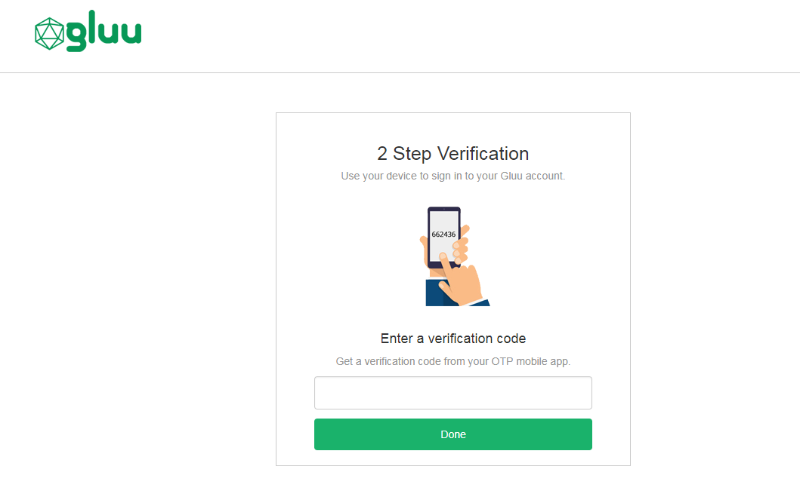

# One-Time Password (OTP) Authentication

## Overview
A one-time password (OTP) is a password that is valid for only one login session or transaction, on a computer system or other digital device.

This document explains how to use the Gluu Server's included 
[OTP interception script](https://raw.githubusercontent.com/GluuFederation/oxAuth/master/Server/integrations/otp/OtpExternalAuthenticator.py) 
to implement a two-step, two-factor authentication (2FA) process with username / password as the first step, and any OTP app as the second step. 

!!! Note
    Gluu's OTP interception script uses the two-factor event/counter-based HOTP algorithm [RFC4226](https://tools.ietf.org/html/rfc4226) and the time-based TOTP algorithm [RFC6238](https://tools.ietf.org/html/rfc6238).

## Prerequisites
- A Gluu Server ([installation instructions](../installation-guide/index.md));
- [HOTP / TOTP authentication script](https://raw.githubusercontent.com/GluuFederation/oxAuth/master/Server/integrations/otp/OtpExternalAuthenticator.py) (included in the default Gluu Server distribution);
- An Android or iOS device with a mobile app installed that supports HOTP/TOTP, like [Google Authenticator](https://play.google.com/store/apps/details?id=com.google.android.apps.authenticator2).   

### Recommended OTP apps
- Google Authenticator for [Android](https://play.google.com/store/apps/details?id=com.google.android.apps.authenticator2&hl=en) or [iOS](https://itunes.apple.com/us/app/google-authenticator/id388497605?mt=8)
- [FreeOTP](https://freeotp.github.io/)

## Properties
The OTP authentication script has the following properties: 

|	Property	|	Description		|	Example	|
|-----------------------|-------------------------------|---------------|
|issuer	|Issuer of the OTP service|Gluu Inc|
|label  |The name of the application | Gluu OTP| 
|otp_conf_file   | Location of the OTP configuration file | `/etc/certs/otp_configuration.json`|
|otp_type| Type of OTP in use | totp|
|qr_options| Size of the QR code that is used for device enrollment|{ size: 400, mSize: 0.05 }|
|registration_uri | Registration endpoint of the IDP| https://idp.example.com/identity/register| 
    
## Enable OTP
Follow the steps below to enable Super Gluu authentication:

1. In oxTrust, navigate to `Configuration` > `Manage Custom Scripts`.
1. Click on the `Person Authentication` tab
1. Find the OTP script
1. Enable the script by checking the box 
1. Scroll to the bottom of the page and click `Update`

Now OTP is an available authentication mechanism for your Gluu Server. This means that, using OpenID Connect `acr_values`, applications can now request OTP authentication for users. 

## Make OTP the Default

If OTP should be the default authentication mechanism, follow these instructions: 

1. Navigate to `Configuration` > `Manage Authentication`. 

1. Select the `Default Authentication Method` tab. 

1. In the Default Authentication Method window you will see two options: `Default acr` and `oxTrust acr`. 

 - `oxTrust acr` sets the authentication mechanism for accessing the oxTrust dashboard GUI (only managers should have acccess to oxTrust).    

 - `Default acr` sets the default authentication mechanism for accessing all applications that leverage your Gluu Server for authentication (unless otherwise specified).    

If OTP should be the default authentication mechanism for all access, change both fields to OTP.  

## OTP Login Pages
The Gluu Server includes two default login pages for OTP:

1. An **enrollment** page that is displayed the first time a user is prompted for OTP authentication;
                  

1. A **login** page that is displayed for all subsequent OTP authentications. 

## Using OTP

### Device Enrollment

OTP device enrollment happens during the first authentication attempt. The initial enrollment page displays a QR code that needs to be scanned with the OTP app. 

### Subsequent Logins
All subsequent authentications will require the user to retreive and enter an OTP from the application.

## Credential Management
A user's OTP device(s) can be removed by a Gluu administrator either via the oxTrust UI in `Users` > `Manage People`, or in LDAP under the user entry. In LDAP, navigate to appliances and search for an attribute `oxExternalUid`. Remove the values of this attribute. Upon the next OTP login attempt, the user will be prompted to enroll a new device. 
