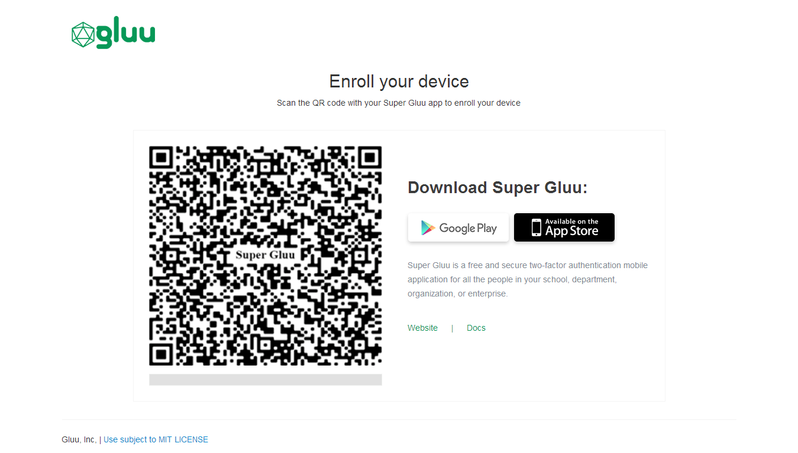

# Super Gluu
## Overview
[Super Gluu](https://super.gluu.org) is a free and secure two-factor authentication mobile application.

This document explains how to use the Gluu Server's included Super Gluu interception script to implement a two-step, two-factor authentication (2FA) process with username / password as the first step, and Super Gluu as the second step. 

Complete docs for Super Gluu, including a User Guide and Developer Guide, can be found on the [Super Gluu docs site](https://gluu.org/docs/supergluu). 

### Security
Super Gluu uses the Gluu Server's FIDO U2F endpoints to enroll a public key. When authentication happens, there is a challenge response to ensure that the device has the respective private key. 

Learn more about FIDO U2F in the [spec](https://fidoalliance.org/specifications/overview/)

### Open source 
Super Gluu is based on the free open source [oxPush 3](https://github.com/GluuFederation/oxPush3) source code. 

## Prerequisites 
- A Gluu Server ([installation instructions](../installation-guide/index.md));
- [Super Gluu interception script](https://github.com/GluuFederation/oxAuth/blob/master/Server/integrations/super_gluu/SuperGluuExternalAuthenticator.py) (included in the default Gluu Server distribution);
- An Android or iOS device with Super Gluu installed.

### Download Super Gluu
Super Gluu is available on the iOS and Android app marketplaces:

- [Super Gluu for iOS](https://itunes.apple.com/us/app/super-gluu/id1093479646?mt=8)     
- [Super Gluu for Android](https://play.google.com/store/apps/details?id=gluu.org.super.gluu)       

## Properties
The Super Gluu authentication script has the following properties: 

|	Property	|	Description		|	Example	|
|-----------------------|-------------------------------|---------------|
|authentication_mode	|Determine factor of authentication|two_step|
|credentials_file	|JSON file for SuperGluu 		|/etc/certs/super_gluu_creds.json|
|label  |The name of the application |   Super Gluu| 
|notification_service_mode   | Service used to enable push notifications | gluu|
|qr_options| Size of the QR code that is used for enrollment and/or authentication|{ size: 500, mSize: 0.05 }|
|registration_uri | Registration endpoint of the IDP| https://idp.example.com/identity/register| 
|supergluu_android_download_url| Android app download link, used in the login page | https://play.google.com/store/apps/details?id=gluu.super.gluu|
|supergluu_ios_download_url| iOS app download link, used in the login page | https://itunes.apple.com/us/app/super-gluu/id1093479646|


## Enable Super Gluu

Follow the steps below to enable Super Gluu authentication:

1. In oxTrust, navigate to `Configuration` > `Manage Custom Scripts`.
1. Click on the `Person Authentication` tab
1. Find the Super Gluu script
1. Enable the script by checking the box 
1. Scroll to the bottom of the page and click `Update`


Now Super Gluu is an available authentication mechanism for your Gluu Server. This means that, using OpenID Connect `acr_values`, applications can now request Super Gluu authentication for users. 

!!! Note 
    To make sure Super Gluu has been enabled successfully, you can check your Gluu Server's OpenID Connect configuration by navigating to the following URL: `https://<hostname>/.well-known/openid-configuration`. Find `"acr_values_supported":` and you should see `"super_gluu"`. 

## Make Super Gluu the Default

If Super Gluu should be the default authentication mechanism, follow these instructions: 

1. Navigate to `Configuration` > `Manage Authentication`. 

1. Select the `Default Authentication Method` tab. 

1. In the Default Authentication Method window you will see two options: `Default acr` and `oxTrust acr`. 


 - `oxTrust acr` sets the authentication mechanism for accessing the oxTrust dashboard GUI (only managers should have acccess to oxTrust).    

 - `Default acr` sets the default authentication mechanism for accessing all applications that leverage your Gluu Server for authentication (unless otherwise specified).    

If Super Gluu should be the default authentication mechanism for all access, change both fields to Super Gluu.  

## Super Gluu Login Pages

The Gluu Server includes two default login pages for Super Gluu:

1. An **enrollment** page that is displayed the first time a user is prompted for Super Gluu authentication;
                  

1. A **login** page that is displayed for all subsequent Super Gluu authentications. 


The designs are being rendered from the [Super Gluu xhtml page](https://github.com/GluuFederation/oxAuth/blob/master/Server/src/main/webapp/auth/super-gluu/login.xhtml). To customize the look and feel of the pages, follow the [customization guide](../operation/custom-design.md). 
 
## Using Super Gluu

### Device Enrollment

Super Gluu device enrollment happens during the first authentication attempt. The initial enrollment page displays a QR code that needs to be scanned with the Super Gluu app. 

### Subsequent Logins
If you use the default Super Gluu interception script, all subsequent authentications will trigger a push notification to the enrolled device which can be approved or denied as needed. 

For more information about using Super Gluu, visit the [Super Gluu User Guide](https://gluu.org/docs/supergluu/user-guide/).

## Credential Management

A user's Super Gluu device(s) can be removed by a Gluu administrator either via the oxTrust UI in `Users` > `Manage People`, or in LDAP under the user entry:  
    
1. Find the `DN` of the user in ldap; 
    
1. Find the `oxID DN` associated with the user;
    
1. Remove the `oxID DN`. 

For example, let's say user `abc` loses their device and wants to enroll a new device to use Super Gluu. 

The Gluu Server admin will do the following: 

1. Get the DN of user `abc` which will be something like this:      
`dn: inum=@!ABCD.1234.XXX.XXX.YYYY.8770,ou=people,o=@!DEFG.5678.XXX.XXX.ZZZ,o=gluu”`     
 
1. Now find the `oxID` DN which is associated with this user’s DN. It might be something like:      

```
dn: oxId=1487683146561,ou=fido,inum=@!ABCD.1234.XXX.XXX.YYYY.8770,ou=people,o=@!DEFG.5678.XXX.XXX.ZZZ,o=gluu
objectClass: oxDeviceRegistration
objectClass: top
oxDeviceData: {"uuid":"b82abc-a1b2-3abc-bcccc-2222222222222","type":"normal","platform":"android","name":"zico","os_name":"kitkat","os_version":"4.4.4","push_token":"dddddddddd:aaaaaa_58_cccccc_4t_bbbbbbbbbbbbb_aaaaaaaaaaaaaa_ggggggggg"}
oxDeviceKeyHandle: fyyyyyyyyyyyyy_jaaaaaaaaaaaa_mKJw
oxStatus: active
oxApplication: https://test.gluu.org/identity/authentication/authcode
oxCounter: 2
creationDate: 20170221131906.559Z
oxId: 11111111111111111
oxDeviceRegistrationConf: {"publicKey":"BIGbwF…………….","attestationCert":"MIICJjCCAcygAwIBAgKBgQDzLA-......L5ztE"}
oxLastAccessTime: 20170
```       

3. Delete the oxID DN. 

Now the old device is gone and the user can enroll a new device following the above instructions for [registering a new device](#device-enrollment). 
 
## FIDO SCIM APIs
See the [SCIM documentation](../user-management/scim2.md#fido-devices) for a discussion on how to manage FIDO devices, including Super Gluu, using the SCIM protocol. 
