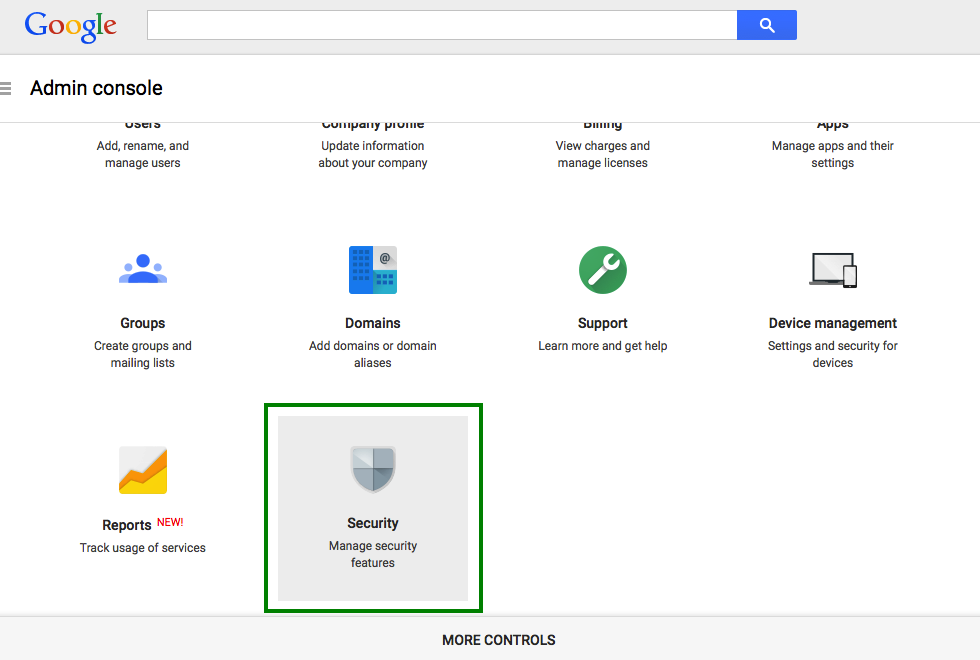

# Single Sign-On (SSO) to GSuite(formely Google apps)
GSuite is a brand of cloud computing, productivity and collaboration tools, software and products developed by Google.
GSuite comprises Gmail, Hangouts, Calendar, and Google+ for communication; Drive for storage; Docs, Sheets, Slides, Forms, and Sites for collaboration and supports SAML.

This document will explain how to configure GSuite and the Gluu Server for single sign-on (SSO).

!!! Note
    It is highly recommended to use Google's staging apps environment before migrating to production.
    
## :arrow_right: Create a GSuite account for you organization

   You can do that [here](https://gsuite.google.com/signup/basic/welcome). Don't forget to add at least one user account(we are going to used that user to test that SSO is working.
   If you already have an account skip to the next section.
   
!!! Note
    You need a valid and not used domain name
   
## :arrow_right: Configuring G Suite


- Login to your GSuite admin dashboard [here](admin.google.com).



- From the list of options choose the `Security` tab.

- A new page will open. Select `Set up single sign-on(SSO)` from the
options.


- Single Sign-On setting page will appear. 


  This page contains a number of selection, and entry fields.

   * __Setup SSO with third party Identity Provider__: This
     refers to your Gluu Server instance. Enable this box.

   * __Sign-in Page URL__: Enter the uri of the sign-in page, for
     example `https://idp_hostname/idp/profile/SAML2/Redirect/SSO`.

   * __Sign-out Page URL__: Enter the uri of the logout page, for
     example `https://idp_hostname/idp/logout.jsp`.

   * __Change Password URL__: The uri an user is redirected if he wants
     to change his password. It is recommended that an organization 
     provides such a link for its end users.

   * __Verification certificate__: Upload the SAML certificate of your
     Gluu Server. The SAML certificates are available in the `/etc/certs` folder inside the Gluu Server `chroot` environment.
     At the time of writting, the cert file is `/etc/certs/idp-signing.crt`

   * __Use a domain specific issuer__: Enable this box to use a
     domain-specific issuer.

   * Save your data using the `Save changes` button on the lower right
     of the page.

Refer [Google SSO](https://support.google.com/a/answer/60224?hl=en) to know more.

## :arrow_right: Configuring the Gluu Server

Now we need to get the Google Metadata and create a SAML Trust Relationship in the Gluu Server. Trust Relationships are created so that the IDP (your Gluu Server) can authorize/authenticate the user to the service provider (SP)--in this case, GSuite. 

### :black_small_square: Google Metadata
In order to create a Trust Relationship, we need to grab the metadata of
GSuite. This metadata can be collected from Google. It's generally
specific to an organization account. The following is a template of the Google metadata.
Replace `domain.com` with your own domain name(the one used when creating Gsuite account).

```
<EntityDescriptor entityID="google.com/a/domain.com" xmlns="urn:oasis:names:tc:SAML:2.0:metadata">
<SPSSODescriptor protocolSupportEnumeration="urn:oasis:names:tc:SAML:2.0:protocol">
<NameIDFormat>urn:oasis:names:tc:SAML:1.1:nameid-format:unspecified</NameIDFormat>
<AssertionConsumerService index="1" Binding="urn:oasis:names:tc:SAML:2.0:bindings:HTTP-POST"
Location="https://www.google.com/a/domain.com/acs" ></AssertionConsumerService>
</SPSSODescriptor>
</EntityDescriptor>
```

Got the metadata? Great, we are ready to move forward. 

### :black_small_square: Create a SAML Trust Relationship
- Create Trust Relationship for Google Apps: 

   - How to create a trust relationship can be found [here](../../admin-guide/saml.md#trust-relationship-requirements). We need to follow the "File" method for Google Apps trust relationship.
    - Required attributes: 
    A nameID attribute is required. Follow the [custom nameID](../../admin-guide/saml.md#custom-nameid) documentation. When configuring namedID attribute, we recommend to follow the manual method.  
    You need to release the following attribute: mail, username and the custom attritue created early(as nameID).
    - Relying Party Configuration: SAML2SSO should be configured. 
        * includeAttributeStatement: check
        * assertionLifetime: default 
        * assertionProxyCount: default
        * signResponses: conditional
        * signAssertions: never
        * signRequests: conditional
        * encryptAssertions: never
        * encryptNameIds: never 
        
## :arrow_right: Configure Shibboleth to support `unspecified` nameId format required by Gsuite.
    
 The `unspecified` mean the SP don't care about the nameID format. But in our case we know that Gsuite require an email(`user@yourdomain`) address. This is why we are going to configure shibboleth to support `email`.
  
 Edit the file `/opt/gluu/jetty/identity/conf/shibboleth3/idp/relying-party.xml.vm` and set the namedIDFormatPrecedence to `urn:oasis:names:tc:SAML:2.0:nameid-format:email`.
   
 See example below 
   
  > #if($trustRelationship.specificRelyingPartyConfig and (not $trustRelationship.isFederation()))
                #foreach ($mapEntry in $profileConfigMap.entrySet())
                    #set($profileConfig = $mapEntry.value)
                    #if($mapEntry.key == "SAML2SSO")
                    <bean parent="SAML2.SSO"
                          p:includeAttributeStatement="$profileConfig.includeAttributeStatement"
                          p:assertionLifetime="$profileConfig.assertionLifetime"
                          p:nameIDFormatPrecedence="urn:oasis:names:tc:SAML:2.0:nameid-format:email" 
        
     
## :arrow_right: Test phase
  
   :one: Create a user in Gluu Server representing the Gsuite account you want to log into.
   
   :two: In the Trust relationShip make sure you have release the following attributes: `email, yourcustomAttribute and username`
   
   :three: Make sure the user created in step one has the field named `yourcustomAttribute` and `email` populate with a right email(example `user@yourdomain`).
   
    
   :four: Open a different browser and point it at [this](https://accounts.google.com/signin/v2/identifier?continue=https%3A%2F%2Fmyaccount.google.com%2Fintro%3Futm_source%3DOGB%26utm_medium%3Dapp&followup=https%3A%2F%2Fmyaccount.google.com%2Fintro%3Futm_source%3DOGB%26utm_medium%3Dapp&osid=1&service=accountsettings&flowName=GlifWebSignIn&flowEntry=ServiceLogin) link and provide the user email(example `user@yourdomain`).
   
   :five: Enjoy :clap: :clap:
    


