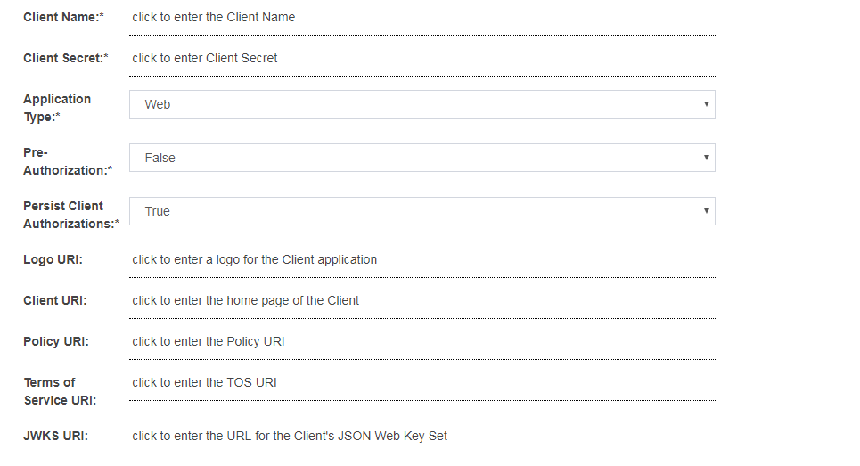

# OpenID Connect Provider (OP)
The Gluu Server is a [fully certified OpenID Provider (OP)](http://openid.net/certification/) that supports the following OpenID Connect specifications: 

- Core [(spec)](http://openid.net/specs/openid-connect-core-1_0.html)
- Dynamic Client Registration [(spec)](https://openid.net/specs/openid-connect-registration-1_0.html)
- Discovery [(spec)](https://openid.net/specs/openid-connect-discovery-1_0.html)
- Form Post Response Mode [(spec)](https://openid.net/specs/oauth-v2-form-post-response-mode-1_0.html)
- Session Management [(spec)](http://openid.net/specs/openid-connect-session-1_0.html)
- Front Channel Logout [(draft)](http://openid.net/specs/openid-connect-frontchannel-1_0.html)

## Protocol Overview
OpenID Connect is an identity layer that profiles and extends OAuth 2.0.
It defines a sign-in flow that enables an application (client) to
authenticate a person, and to obtain authorization to obtain
information (or "claims") about that person. For more information,
see [http://openid.net/connect](http://openid.net/connect)

It's handy to know some OpenID Connect terminology:

- The *end user* or *subject* is the person being authenticated.

- The *OpenID Provider (OP)* is the equivalent of a SAML Identity Provider (IDP). It holds end user credentials (like a username/ password) and personally identifiable information. During a single sign-on (SSO) login flow, end users are redirected to the OP for authentication. 

- The *Relying Party* or  *RP*  or *client* is software, like a mobile application
or website, which needs to authenticate the subject. The RP is an OAuth
client.

!!! Note
    To learn more about the differences between OAuth, SAML and OpenID Connect, read [this blog](http://gluu.co/oauth-saml-openid).

## OpenID Connect APIs

Review the Gluu Server's OpenID Connect API endpoints in the [API Guide](../api-guide/openid-connect-api.md).

## OpenID Connect Flows

The Gluu Server supports all flows defined in the [OpenID Connect Core spec](http://openid.net/specs/openid-connect-core-1_0.html), including implicit, authorization code, and hybrid flows.

### Implicit Flow
The implicit flow, where the token and id_token are returned from the authorization endpoint, should only
be used for applications that run in the browser, like a Javascript client.

### Authorization Code / Hybrid Flow
The code flow or hybrid flow should be used for server side
applications, where code on the web server can more securely call
the token endpoint to obtain a token.

The most useful response type for the hybrid flow is `code id_token`. Using this flow, you can verify
the integrity of the code by inspecting the `c_hash` claim in the `id_token`.

If you are using the code flow, the response type should only be code.
There is no point in using response type `code token id_token`--the extra
tokens returned by the authorization endpoint will only create additional
calls to the LDAP server and slow you down.

If you are going to trade the code at the token endpoint for a new token and `id_token`, you don't
need them from the authorization endpoint too.

### Flow Comparison Chart
|Step   |  Authorization code flow 	| Implicit flow	 | Hybrid flow |
|----------|----------|-------------------------------|----------------|
|1|User accesses an application.|User accesses an application.|User accesses an application.|
|2|The application/relaying party (RP) prepares an authentication request containing the desired request parameters and sends it to the OpenID Provider (Gluu Server). The `response_type requested` is `code`.|The application/replaying party (RP) prepares an authentication request containing the desired request parameters and sends it to the OpenID Provider (Gluu Server). The `response_type requested` is `id_token` or `id_token token`.|The application/replaying party (RP) prepares an authentication request containing the desired request parameters and sends it to the OpenID Provider (Gluu Server). The `response_type` requested is `code id_token`, `code token`, or `code id_token token`.|
|3|The OpenID Provider (Gluu Server) verifies the user’s identity and authenticates the user.|The OpenID Provider (Gluu Server) verifies the user’s identity and authenticates the user.|The OpenID Provider (Gluu Server) verifies the user’s identity and authenticates the user.|
|4|The OpenID Provider (Gluu Server) sends the user back to the application with an authorization code.|The OpenID Provider (Gluu Server) sends the user back to the application with an ID Token (`id_token` or `id_token token`) and an Access Token (`token`).|The OpenID Provider (Gluu Server) sends the user back to the application with an authorizatio code (`code id_token`, `code token`, or `code id_token token`) and an Access Token (`token`).|
|5|The application sends the code to the Token Endpoint to receive an Access Token and ID Token in the response.|The application uses the ID Token to authorize the user. At this point the application/RP can access the `UserInfo endpoint` for claims.|The application sends the code to the Token Endpoint to receive an Access Token and ID Token in the response.|
|6|The application uses the ID Token to authorize the user. At this point the application/RP can access the `UserInfo endpoint` for claims.||The application uses the ID Token to authorize the user. At this point the application/RP can access the `UserInfo endpoint` for claims.|

## Configuration / Discovery

A good place to start when you're learning about OpenID Connect is the configuration endpoint, which is located in the Gluu Server
at the following URL: `https://{hostname}/.well-known/openid-configuration`.

The Gluu Server also supports [WebFinger](http://en.wikipedia.org/wiki/WebFinger), as specified in the [OpenID Connect discovery specification](http://openid.net/specs/openid-connect-discovery-1_0-21.html).

## Client Registration / Configuration

OAuth clients need a `client_id` and `login_redirect_uri` to indicate to the Authorization Server where users should be redirected post
authorization.

Clients can be dynamically registered or created manually in oxTrust.

### Dynamic client registration
OpenID Connect defines a standard API where clients can register themselves--
[Dynamic Client Registration](http://openid.net/specs/openid-connect-registration-1_0.html). The registration URL can be found at the configuration endpoint: `https://<hostname>/.well-known/openid-configuration`.

It may be prefereable to **not allow** clients to dynamically register themselves! To disable this endpoint, in the oxAuth JSON properties, set the `dynamicRegistrationEnabled` value to False.

### Manual clent registration
To add a client manually in oxTrust, navigate to `OpenID Connect` > `Client` and click the `Add Client` button to expose the following form:

There are many client configuration parameters. Most are specified in the [Client Registration](http://openid.net/specs/openid-connect-registration-1_0.html#ClientRegistration) section of the OpenID Connect specification.

There are two configurations params which can only be configured via oxTrust by an administrator. These include:

1. Pre-Authorization: If the OAuth authorization prompt should not be displayed to end users, set this field to `Enabled`. This is useful for SSO to internal clients (not third party) where there is no need to prompt the person to approve the release of information.
 
1. Persist Client Authorizations: If end users should only be prompted for authorization the *first* time they access the client, set this field to `True`. All data will be persisted under the person's entry in the Gluu LDAP and the end user will not be prompted to release informationd during subsequent logins.

### Customizing client registration

During client registration, custom interception scripts can be used to implement custom business logic. For instance, data could be validated, extra client claims could be populated, scopes could be modified, or APIs could be called to determine whether the client should get registered at all.

Client registration custom script interfaces can be found by navigating to `Configuration` > `Custom Scripts` > `Client Registration`.

The sample client registration script is [available here](./sample-client-registration-script.py)

### Disable client entry
Setting up clients can be cumbersome and time consuming. Instead of deleting clients that should be inactive, it may be preferable to simply disable the client. To achieve this:

1. Navigate to `OpenID Connect` > `Clients`
1. Find and click the target client
1. Scroll to the end of its settings' list and check the `Disabled` checkbox
1. Click the "Update" button

## Scopes

In OAuth, scopes are used to specify the extent of access. For an OpenID Connect sign-in flow, scopes correspond to the release of
user claims. Out-of-the-box, Gluu supports the [standard scopes](http://openid.net/specs/openid-connect-core-1_0.html#ScopeClaims) defined in the OpenID Connect specification.

Custom scopes can be defined and mapped to any registered user attributes.

To add OpenID Connect Scopes and Claims:

1. Navigate to `Configuration` > `OpenID Connect` > `Scopes`

1. Click the `Add scope` button

1. To add more claims, simply click "Add Claim" and you will be presented
with the following screen:

A description of the fields in the add scope page:

- Display Name: Name of the scope which will be displayed when searched.

- Description: Text that will be displayed to the end user during approval of the scope.

- Scope Type:
   - OpenID: specifies to the Gluu Server that this scope will be used to map user claims.
   - Dynamic: specifies to the Gluu Server that scope values will be generated from the result of the Dynamic Scopes custom interception script.
   - OAuth: specifies to the Gluu Server that the scope will have no claims, it will be meaningful to an external resource server.
       
- Default Scope: If True, the scope may be added to clients' registrations created via Dynamic Client Registration protocol. Specifying a scope as "Default" means that any OIDC client using Dynamic Client Registration can enlist it among requested scopes. Because this may result in sensitive user data being leaked to unauthorized parties, thorough assessment of all claims associated with "Default" scopes is advised. Out-of-the-box, the only default scope is `openid`, which is required by the OpenID Connect specification. Additional scopes can be explicitly add added as needed by editing client registration metadata manually in oxTrust.

### Customizing scopes
Similar to client registration, scopes can be customized using interception scripts. The interface can be found in oxTrust by navigating to `Configuration` > `Custom Scripts` > `Dynamic Scopes`. 

The sample dyanmic scope script is [available here](./sample-dynamic-script.py).

## Subject Identifier Types

A Subject Identifier is a locally unique and never reassigned identifier within the Issuer for the End-User, which is intended to be consumed by the Client. Two Subject Identifier types are defined in oxAuth: `public` and `pairwise`.
 

### Public Subject Identifier Type

This provides the same `sub` (subject) value to all Clients. It is the default if the provider has no `subject_types_supported` element in its discovery document.

You can configure the LDAP attribute to be used in the `sub` claim.

### Pairwise Subject Identifier Type and Sector Identifier Client Claim

When `pairwise` Identifiers are used, Gluu calculates a unique sub (subject) value for each Sector Identifier. The Subject Identifier value must not be reversible by any party other than the OP. This is similar to persistent identifiers in SAML. 

Sector identifiers provide a way to group clients from the same adminstrative domain using pairwise subject identifiers. In this case, each client needs to be given the same pairwise ID for the person to maintain continuity across all the related websites.   

Gluu allows two types of pairwise implementations that can be configured:

1. `PairwiseIdType.PERSISTENT`: oxauth creates a Unique Id (`java.util.UUID`) for the pair of Sector Identifier and local account Id and stores this value under:
`dn: ou=pairwiseIdentifiers,inum=PEOPLE_INUM,ou=people,o=ORG_INUM,o=gluu`

1. `PairwiseIdType.ALGORITHMIC`: The sub value is calculated as follows:
`sub = base64urlencode(HS256Signature(sectorIdentifier + userInum + salt, key))`

Key and salt are read from oxAuth configuration entries `pairwiseCalculationKey` and `pairwiseCalculationSalt`:

### Add Sector Identifier

oxAuth provides an easy way to manage and publish a `sector_identifier_uri`. The Gluu admin can use this feature to select certain clients or even add ad-hoc `redirect_uri` values. oxAuth will publish a valid sector identifier JSON object as defined in OpenID Connect dynamic client registration spec. A client could then register this sector identifier URI in addition to redirect URIs.

Follow these steps to add a sector identifier:

1. In oxTrust, navigate to `OpenID Connect` > `Sector Identifier`.

1. Click `Add Sector Identifier`.

1. Add redirect URIs to the `Sector Identifier`.

1. Add clients that uses the `Sector Identifier`.

## Authentication

The OpenID Connect `acr_values` parameter is used to specify a workflow for authentication. The value of this parameter, or the `default_acr_values` client metadata value, corresponds to the "Name" of a custom authentication script in the Gluu Server.

The default distribution of the Gluu Server includes custom authentication scripts with the following `acr` values:

|  ACR Value  	| Description			|
|---------------|-------------------------------|
|  u2f		| [FIDO U2F Device](../authn-guide/U2F.md)|
|  super_gluu	| [Multi-factor authentication](../authn-guide/supergluu.md)|
|  duo		| [Duo soft-token authentication](../authn-guide/duo.md)|
|  cert	| [Smart card or web browser X509 personal certificates](../authn-guide/cert-auth/)|
|  cas	| External CAS server|
|  gplus	| [Google+ authentication](../authn-guide/google.md)|
|  OTP	| [OATH one time password](../authn-guide/otp.md) |
|  asimba	| Use of the Asimba proxy for inbound SAML |
|  twilio_sms	| Use of the Twilio Saas to send SMS one time passwords |
|  passport	| Use of the [Passport component for social login](../ce/authn-guide/passport.md/) |
|  yubicloud	| Yubico cloud OTP verification service |
|  uaf	| experimental support for the FIDO UAF protocol |
|  basic_lock	| [Enables lockout after a certain number of failures](../authn-guide/intro.md/#configuring-account-lockout) |
|  basic	| [Sample script using local LDAP authentication](../ce/authn-guide/basic.md/) |

Clients can request any enabled authentication mechanism. To enable an authentication script in oxTrust, navigate to `Configuration` > `Manage Custom Scripts`, find the desired script, check the `Enabled` box, scroll to the bottom of the page and click `Update`.

Learn more in the [authentication guide](../authn-guide/intro.md).

## Logout

The OpenID Connect [Session Management](http://openid.net/specs/openid-connect-session-1_0.html) specification is still marked as draft, and new mechanisms for logout are in the works. The current specification requires JavaScript to detect when a session has been ended in the browser. It works... unless the tab with the JavaScript happens to be closed when the logout event happens on another tab. Also, inserting JavaScript into every page is not feasible for some applications.

The Gluu Server also support the draft for [Front Channel Logout](http://openid.net/specs/openid-connect-frontchannel-1_0.html). This
is our **recommended** logout strategy. Using front channel logout, an html page is rendered which contains one iFrame for each application that needs to be notified of a logout event. The Gluu Server keeps track of which clients are associated with a session (i.e. your browser). 

Front channel logout is also not perfect. If the end user's web browser is blocking third party cookies, it may break front channel logout. Also, the Gluu Server has no record if the logout is successful--only the browser knows. This means that if the logout fails, it will not be logged or retried. The good thing about front channel logout is that the application can clear application cookies in the end user's browser. To use front channel logout, the client should register logout_uri's, or `frontchannel_logout_uri` for clients using the Dynamic Client Registration API.

## OpenID Connect Relying Party (RP)

In order to leverage your Gluu Server OpenID Provider (OP) for central authentication, web and mobile apps will need to support OpenID Connect. In OpenID Connect jargon, your app will act as an OpenID Connect Relying Party (RP) or "client".

There are many ways to go about supporting OpenID Connect in your apps. When possible, it is best to use existing client software implementations that have been verified to implement OpenID Connect properly (and securely!). A good OpenID Connect client will do much of the heavy lifting for you.

Review the [SSO integration guide](../integration/index.md) to determine which software and strategy will be best for your target application(s).

### oxAuth RP

The Gluu Server ships with an optional OpenID Connect RP web application called oxauth-rp which is handy for testing. During Gluu Server setup you'll be asked if you want to install the oxauth-rp (it should be installed on a development environment). If you decide to install it, oxAuth RP will be deployed on `https://<hostname>/oxauth-rp`.

Using the oxAuth RP you can exercise all of the OpenID Connect API's, including discovery, client registration, authorization, token,
userinfo, and end_session.

