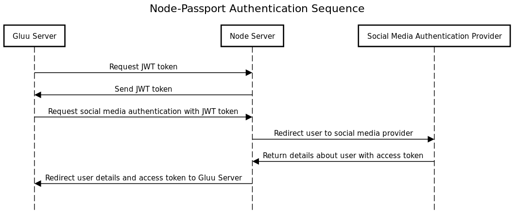
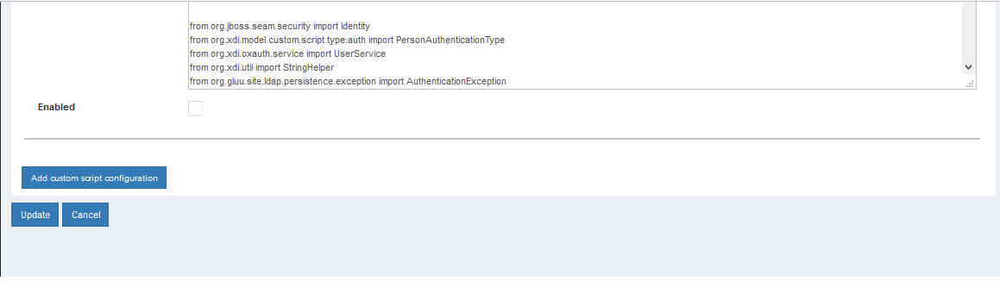
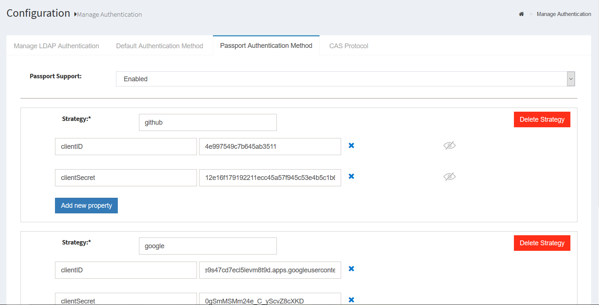

# Social Login using Passport.js 

## Overview

The Gluu Server uses [Passport.js](http://passportjs.org/) to enable social login. With over 300 existing
"strategies", Passport provides a crowd-sourced approach to offering users social login at popular consumer IDPs. Passport not only normalizes authentication, it also provides a standard mapping for user claims. 

After authentication at the external IDP, if there is no existing user record in Gluu, one will be created dynamically. Once personal data has been obtained and added to Gluu's local LDAP directory service, it can be used to offer SSO to all applications leveraging Gluu for authentication.

Passport is an MIT licensed, Express-based web application which Gluu has modified to call oxTrust APIs for its non-static configuration.

## Prerequisites
- A Gluu Server with Passport.js installed during setup ([Installation Instructions](../installation-guide/index.md));
- [Passport interception script](https://raw.githubusercontent.com/GluuFederation/oxAuth/master/Server/integrations/passport/PassportExternalAuthenticator.py) (included in the default Gluu Server distribution).

## Sequence Diagram

Below is a sequence diagram to help clarify the workflow for user
authentication and provisioning. 



1. Gluu server calls Node-Passport server for JWT token.
2. Node-Passport server generates a JWT token and provides it in response to Gluu server.
3. Gluu server requests Node-Passport server with JWT token to authenticate user for a social network provider.
4. Node-Passport server will redirect user to social media authentication provider.
5. After successful authentication of user, social network will callback Node-Passport server along with user details and access token.
6. Node-Passport server will redirect user back to Gluu server with user details and access token.
7. Gluu server’s interception script will check if the user exists in LDAP server. If the user exists then the user will be logged into the system. If not, the interception script will create a new user with the required details and log the user into the system.

## Setup Passport.js with Gluu

During installation of the Gluu Server select `yes` to install Passport.js when prompted.

1. Navigate to `Configuration` > `Manage Custom Scripts`.
2. Enable the passport_social script in `Person Authentication` Tab.
3. Click on `update` at the end of the page.
4. Enable the `uma_rpt_policy` in `UMA RPT Policies` tab.
5. Click on `update`.
6. To set the strategies navigate to `Configuration` > `Manage Authentication` > `Default Authenticaion`
7. Change the Default Authentication mode to `passport_social`
8. Click on `Passport Authentication Method` tab and `Passport Support` to enabled.
9. Add your desired strategies. The `Add Strategy` field values for common providers are:
	- `google` for GPlus Authentication
	- `twitter` for Twitter Authentication
	- `linkedin` for LinkedIn Authentication
	- `github` for Github Authentication
	- `facebook` for Facebook Authentication
10. Add the strategy details like clientID and clientSecret 
(obtained from the provider, after the app is created in the provider form). 
11. Once the configuration and settings have been entered, restart the 
passport service or Gluu Server by following the below instructions:
    
    a. Log into chroot.
    
    b. Enter the following command to stop: `service passport stop`
    
    c. Enter the following command to start: `service passport start`

!!! Warning
	Strategies names and field names are case sensitive.
	
## How to make a new app to use Passport

Every provider has different protocols and ways to create the app. We 
will look at one of the most common providers "facebook" and create a new app.

1. Login to https://developers.facebook.com
2. Click on Add a new App from My Apps dropdown
3. Fill the required details and click the create Create App ID button to create the app.
4. Click on the dashboard menu and get the clientID and clientSecret which can be used with the passport.
5. Click on settings menu and put the domain of your gluu server in the site url field.


Note: If there is a field for Authorized redirect URIs, make sure your apps list of Authorized redirect URIs contains the passport 
strategy's callback. For example, if your gluu server points to `https://example.gluu.org` and the strategy is `facebook`, the list of Authorized redirect URIs should contain `https://example.gluu.org/passport/auth/facebook/callback.` 
 
## How Passport is used in Gluu

Before starting the development it is recommended to switch to node user,
 you can switch to node user by following command.
```sh 
su - node
```
To use node js and npm execute following command.
```sh
export PATH=$PATH:/opt/node/bin
```

** All the paths in the following guide is relative to path: `/opt/gluu/node/passport/` ***

The best way to add new strategies to Passport is to find an applicable npm module for your desired strategy. Let's start with an example. In this example we will consider adding facebook strategy.

1. If you want to add facebook strategy, search for passport-facebook npm module where you can select the npm module and then add the module to passport server.
2. Let's say we found this module "passport-facebook" and want to use this module for facebook authentication. Install the module in passport by executing the following command: `npm install passport-facebook --save`.
3. Configure the strategy.
4. Configure routes for the strategy.
5. Call method to configure the strategy
6. Add button for the configured strategy in passport authentication UI.

### Configure the strategy using setup script

All strategies are configured in the folder `server/auth/*.js.` Next we need to create a file for the new strategy. Our strategy is facebook so we can create new file named `facebook.js` and configure the strategy. 
!!!Note:
	**All these configuration are performed during execution of setup script at the time of configuring Gluu. These steps are not required to be followed, these content are for your reference**

```javascript
var passport = require('passport');
var FacebookStrategy = require('passport-facebook').Strategy;

var setCredentials = function(credentials) {
    var callbackURL = global.applicationHost.concat("/passport/auth/facebook/callback");
    passport.use(new FacebookStrategy({
            clientID: credentials.clientID,
            clientSecret: credentials.clientSecret,
            callbackURL: callbackURL,
            enableProof: true,
            profileFields: ['id', 'name', 'displayName', 'email']
        },
        function(accessToken, refreshToken, profile, done) {
            var userProfile = {
                id: profile._json.id,
                name: profile.displayName,
                username: profile.username || profile._json.id,
                email: profile._json.email,
                givenName: profile._json.first_name,
                familyName: profile._json.last_name,
                provider: profile.provider,
                accessToken: accessToken
            };
            return done(null, userProfile);
        }
    ));
};

module.exports = {
    passport: passport,
    setCredentials: setCredentials
};
```

Here is an example of the facebook strategy configured. For facebook 
the required parameters are `clientID`, `clientSecret` and `callbackURL`. You 
can search for more configurations depending on the requirements and 
configure accordingly.

The function `setCredentials` is used to configure credentials of a strategy. 
Each strategy has a setCredentials method to configure the strategy. 
The parameter credentials holds the values that are stored in the oxTrust.

The parameter callbackURL should point to the callback route that we 
will configure in step 4. As we are configuring facebook strategy, the 
`callbackURL` can be set to `"/passport/auth/facebook/callback"` 
according the the convention of the app. You can customise the 
`callbackURL` but it is recommended not to change the convention.

The callback function of passport strategy has different number of parameters and the data in 
those parameters which are required to be mapped to the userProfile 
keys which are `id, name, username, email, givenName, familyName, provider, accessToken`. 
Here id and provider params are must. Provider param holds the value of 
the provider, i.e for facebook the provider value will be facebook etc. 
In most cases the value of provider is received in the user claims itself.

Then export the strategy that we configured and also the `setCredentials` 
method which will be used to set the details of the strategy.

### Configure routes for the strategy

We are going to set the routes for the strategy that we are going to configure.
The following changes are to be made in server/routes/index.js. 
First require the strategy that we configured in the previous step.

```javascript
var passportFacebook = require('../auth/facebook').passport;
```

Here ```require('../auth/facebook').passport``` will include the passport 
strategy that we have configured.

Then add the routes for the strategy. First we are going to register the 
callback route and then the authenticate route.

The authenticate route first validates the jwt token that is been sent by
Gluu Server to passport server. If the JWT is valid then the user is 
redirected to the strategy and user can be authenticated there and the 
response of the user authentication is redirected to callback route.

If the callback routes receives the user data then user is been 
redirected to Gluu.

```javascript
//==================== facebook ================
router.get('/auth/facebook/callback',
    passportFacebook.authenticate('facebook', {
        failureRedirect: '/passport/login'
    }),
    callbackResponse);

router.get('/auth/facebook/:token',
    validateToken,
    passportFacebook.authenticate('facebook', {
        scope: ['email']
    }));
```

scope value can be set from the strategy itself if the strategy supports that 
or you can set the scope value here too.

The callbackResponse method return the control to Gluu server and 
user is been enrolled in the system.

###  Call method to configure the strategy

In this step we are going to call the setCredentials method of the 
strategy that we have created.

Go to the file server/auth/configureStrategies.js and require the strategy that we have created.

```javascript
var FacebookStrategy = require('./facebook');
```

And then in setConfiguratins function, call the setCredentials 
method if the strategy data is received.

```javascript
//FacebookStrategy
if (data.passportStrategies.facebook) {
	logger.log('info', 'Facebook Strategy details received');
	logger.sendMQMessage('info: Facebook Strategy details received');
	FacebookStrategy.setCredentials(data.passportStrategies.facebook);
}
```

This will configure the passport strategy if the details of the 
strategy are received from passport API.

###  Add button for the configured strategy in passport authentication UI.

So far the passport server is ready with the new strategy that we have 
created, but to call the strategy we need to add a button which calls 
the new strategy.

```xhtml
<a data-p="facebook" class="provider" href="javascript:void(0);" style="height:40px; width:120px">
	</img>
</a>
```

Here the data-p and class="provider" are required to call the strategy. 
The data-p attribute should hold the value of the route that we created 
in routes.


```javascript
//==================== facebook ================
router.get('/auth/facebook/callback',
    passportFacebook.authenticate('facebook', {
        failureRedirect: '/passport/login'
    }),
    callbackResponse);

router.get('/auth/facebook/:token',
    validateToken,
    passportFacebook.authenticate('facebook', {
        scope: ['email']
    }));
```

In order to call the Strategy, the request URL to call the API must 
match the route that we configured.
