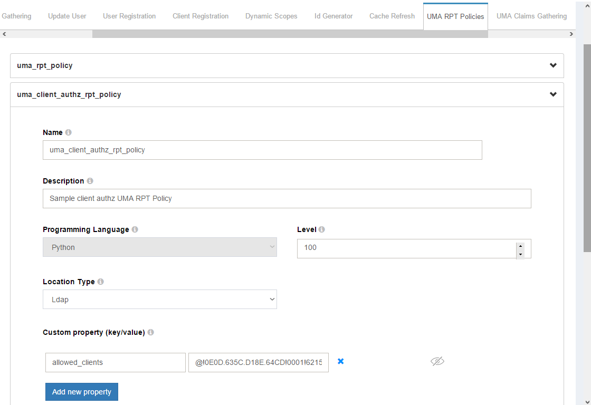

# Social Login using Passport.js 

## Overview

The Gluu Server uses [Passport.js](http://passportjs.org/) to enable social login. With over 300 existing
"strategies", Passport provides a crowd-sourced approach to offering users social login at popular consumer IDPs. Passport not only normalizes authentication, it also provides a standard mapping for user claims. 

After authentication at the external IDP, if there is no existing user record in Gluu, one will be created dynamically. Once personal data has been obtained and added to Gluu's local LDAP directory service, it can be used to offer SSO to all applications that leverage that Gluu Server for authentication.

Passport is an MIT licensed, Express-based web application which Gluu has modified to call oxTrust APIs for its non-static configuration.

## Prerequisites
- A Gluu Server with Passport.js installed during setup ([Installation Instructions](../installation-guide/index.md));
- [Passport interception script](https://raw.githubusercontent.com/GluuFederation/oxAuth/master/Server/integrations/passport/PassportExternalAuthenticator.py) (included in the default Gluu Server distribution).

## Sequence Diagram

Below is a sequence diagram to help clarify the workflow for user
authentication and provisioning. 


1. The Gluu Server calls the Node-Passport server to request a JWT token
1. The Node-Passport server generates a JWT token and sends it back in response
1. The Gluu Server then uses the JWT token to request the Node-Passport server authenticate the user with a social network provider
1. The Node-Passport server redirects the user to a social media authentication provider
1. After successful user authentication, the social network calls the Node-Passport server back an access token and details about the user
1. The Node-Passport server passes that information back to the Gluu Server
1. The Gluu Server's interception script checks if the user exists in the internal LDAP server. If so, the user will be logged into the system. If not, the interception script will first create a new user with the required details, then log the user into the system

## Set up Passport.js with Gluu

To install Passport.js as part of the Gluu Server installation process, select `yes` when prompted. To finish configuring it, follow these steps:

1. Navigate to `Configuration` > `Manage Custom Scripts`.
1. Enable the passport_social script in the `Person Authentication` Tab.
1. Click on `update` at the end of the page. 
1. Enable the `uma_client_authz_rpt_policy` in the `UMA RPT Policies` tab.
1. Click on `update`.
1. Click on the `Passport Authentication Method` tab and enable `Passport Support`.
1. Add your desired strategies. The `Add Strategy` field values for common providers are:
	- `google` for GPlus Authentication
	- `twitter` for Twitter Authentication
	- `linkedin` for LinkedIn Authentication
	- `github` for Github Authentication
	- `facebook` for Facebook Authentication
1. Add strategy details like clientID and clientSecret 
(obtained from the provider after the app is created in the provider form). 
1. To set the strategies, navigate to `Configuration` > `Manage Authentication` > `Default Authenticaion`, and set the Default Authentication mode to `passport_social`
1. Now your server configurations are prepared. Restart the passport service (or Gluu Server) to enable the changes:     
    1. Log into chroot.
    
    1. Enter the following command to stop: `service passport stop`
    
    1. Enter the following command to start: `service passport start`

!!! Warning
	Strategy names and field names are case sensitive.
	
## How to make a new app to use Passport

Every provider has different protocols and ways to create the app. We will look at one of the most common providers, Facebook, and create a new app.

1. Log into https://developers.facebook.com
1. Click on `Add a new App` from My Apps dropdown
1. Fill in the required details and click the `Create App ID` button to create the app
1. Click on the dashboard menu and get the clientID and clientSecret which can be used with Passport
1. Click on settings menu and put the domain of your Gluu Server in the site URL field


!!! Note:
    If there is a field for authorized redirect URIs, make sure your apps list of authorized redirect URIs contains the Passport strategy's callback. For example, if your Gluu Server points to `https://example.gluu.org` and the strategy is `facebook`, the list of authorized redirect URIs should contain `https://example.gluu.org/passport/auth/facebook/callback.` 
 
## How Passport is used in Gluu

Before starting the development, switch to the node user by using the following command:

```sh 
su - node
```

To use node with js and npm, execute the following command:

```sh
export PATH=$PATH:/opt/node/bin
```

** All paths in the following guide are relative to `/opt/gluu/node/passport/` **

The best way to add new strategies to Passport is to find an applicable npm module for your desired strategy. As an example, we will consider adding the Facebook strategy.

1. To add Facebook, search for the `passport-facebook` npm module and then add the module to your Passport server
1. Let's say we found a module called `passport-facebook` and want to use it for Facebook authentication. Install the module in passport by executing the following command: `npm install passport-facebook --save`
1. Configure the strategy
1. Configure routes for the strategy
1. Call the method to configure the strategy
1. Add a button for the configured strategy in the Passport authentication UI

### Configure the strategy using a setup script

All strategies are configured in the folder `server/auth/*.js.` Next we need to create a file for the new strategy. Our strategy is Facebook so we can create new file named `facebook.js` and configure the strategy. 

!!!Note:
	This configuration is performed during the execution of a setup script at the time of Gluu's installation. These steps are not required to be followed manually, they are for your reference.

```javascript
var passport = require('passport');
var FacebookStrategy = require('passport-facebook').Strategy;

var setCredentials = function(credentials) {
    var callbackURL = global.applicationHost.concat("/passport/auth/facebook/callback");
    passport.use(new FacebookStrategy({
            clientID: credentials.clientID,
            clientSecret: credentials.clientSecret,
            callbackURL: callbackURL,
            enableProof: true,
            profileFields: ['id', 'name', 'displayName', 'email']
        },
        function(accessToken, refreshToken, profile, done) {
            var userProfile = {
                id: profile._json.id,
                name: profile.displayName,
                username: profile.username || profile._json.id,
                email: profile._json.email,
                givenName: profile._json.first_name,
                familyName: profile._json.last_name,
                provider: profile.provider,
                accessToken: accessToken
            };
            return done(null, userProfile);
        }
    ));
};

module.exports = {
    passport: passport,
    setCredentials: setCredentials
};
```

Here is an example of the Facebook strategy configured. For Facebook, 
the required parameters are `clientID`, `clientSecret` and `callbackURL`. You 
can search for more configuration options depending on your requirements and 
configure accordingly.

The `setCredentials` function is used to configure credentials for a strategy. 
Each strategy has its own setCredentials method. 
The parameter credentials hold the values that are stored in oxTrust.

The callbackURL parameter should point to the callback route that we 
will configure in the next section. As we are configuring the Facebook strategy, the 
`callbackURL` can be set to `"/passport/auth/facebook/callback"` 
according to the convention of the app. You can customise the 
`callbackURL` but it is recommended not to change the convention.

The Passport strategy's callback function has a number of parameters that are required to be mapped to the userProfile 
keys, which are `id, name, username, email, givenName, familyName, provider, accessToken`. 
Here, `id` and `provider` parameters are a must. The `provider` parameter holds the value of 
the social network provider, i.e for Facebook, the `provider` value will be `facebook`. 
In most cases, the `provider` parameter is received in the user claims itself.

Then, export the strategy that we configured and also the `setCredentials` 
method that will be used to set the details of the strategy.

### Configure routes for the strategy

Now, we'll set the routes for the strategy that we are going to configure.
The following changes are to be made in server/routes/index.js. 
First require the strategy that we configured in the previous step.

```javascript
var passportFacebook = require('../auth/facebook').passport;
```

Here, `require('../auth/facebook').passport` will include the passport 
strategy that we have configured.

Then, add the routes for the strategy. First, register the 
callback route and then the authenticate route.

The authenticate route first validates the JWT token that has been sent from the
Gluu Server to the Passport server. If the JWT is valid, then the user is 
redirected to the strategy and the user can be authenticated there. The 
user authentication response is redirected to the callback route.

If the callback routes receive the user data, then the user has been 
redirected to the Gluu Server.

```javascript
//==================== facebook ================
router.get('/auth/facebook/callback',
    passportFacebook.authenticate('facebook', {
        failureRedirect: '/passport/login'
    }),
    callbackResponse);

router.get('/auth/facebook/:token',
    validateToken,
    passportFacebook.authenticate('facebook', {
        scope: ['email']
    }));
```

The scope value can be set from the strategy itself if the strategy supports that, 
or you can set the scope value here too.

The callbackResponse method returns the control to the Gluu Server, and the 
user has been enrolled in the system.

###  Call method to configure the strategy

In this step, we are going to call the setCredentials method of the 
strategy that we have created.

Go to the file server/auth/configureStrategies.js and require the strategy that we have created.

```javascript
var FacebookStrategy = require('./facebook');
```

Then in the `setConfigurations` function, call the setCredentials 
method if the strategy data is received.

```javascript
//FacebookStrategy
if (data.passportStrategies.facebook) {
	logger.log('info', 'Facebook Strategy details received');
	logger.sendMQMessage('info: Facebook Strategy details received');
	FacebookStrategy.setCredentials(data.passportStrategies.facebook);
}
```

This will configure the passport strategy if the details of the 
strategy are received from the Passport API.

###  Add button for the configured strategy in passport authentication UI.

So far, the Passport server is ready with the new strategy that we have 
created, but to call the strategy we need to add a button to call 
the new strategy.

```xhtml
<a data-p="facebook" class="provider" href="javascript:void(0);" style="height:40px; width:120px">
	</img>
</a>
```

Here, the `data-p` and `class="provider"` are required to call the strategy. 
The `data-p` attribute should hold the value of the route that we created 
in the previous step.


```javascript
//==================== facebook ================
router.get('/auth/facebook/callback',
    passportFacebook.authenticate('facebook', {
        failureRedirect: '/passport/login'
    }),
    callbackResponse);

router.get('/auth/facebook/:token',
    validateToken,
    passportFacebook.authenticate('facebook', {
        scope: ['email']
    }));
```

In order to call the Strategy, the request URL to call the API must 
match the route that we previously configured.
