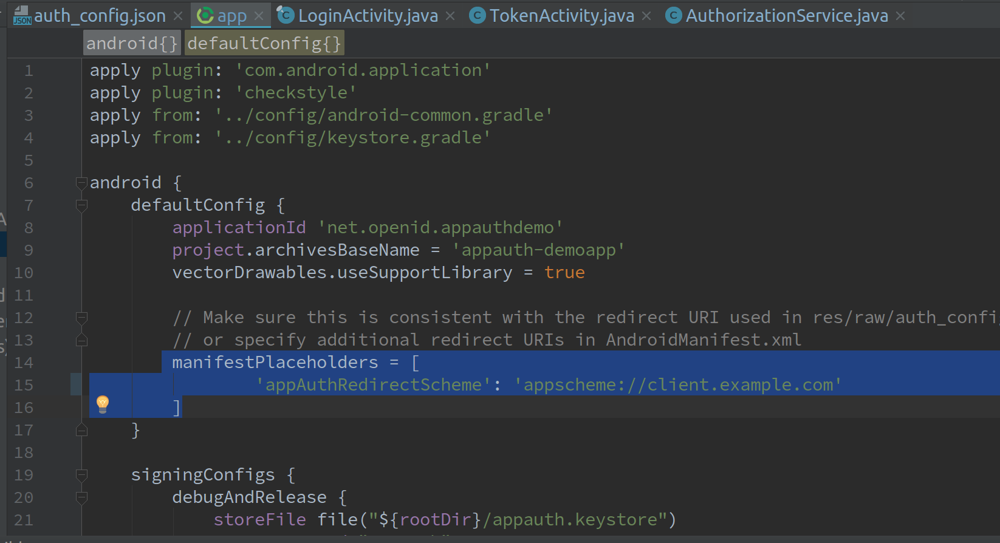
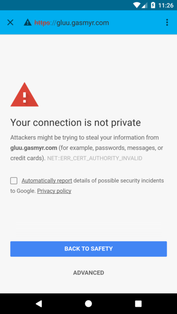
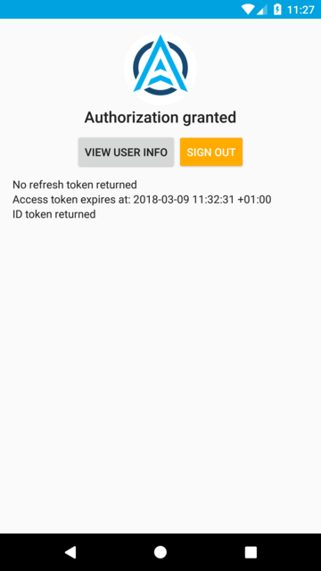

# AppAuth Android
 
## Overview

AppAuth for Android is a client SDK for communicating with OAuth 2.0 and OpenID Connect providers. It directly maps the requests and responses of those specifications while following the idiomatic style of the implementation language. In addition to mapping the raw protocol flows, convenience methods are available to assist with common tasks like performing an action with fresh tokens. More information can be found [here](https://appauth.io).
 
The Gluu Server is a certified OpenId Provider and supports
[Native Apps](https://tools.ietf.org/html/draft-ietf-oauth-native-apps)
either through custom URI scheme redirects or app links.

You can download (or clone) the project from [Github Repository](https://github.com/openid/AppAuth-Android).
The specification is also described there. It is recommended to read this specification.
  
This guide will follow these steps:

1. OpenId Client registration on the Gluu Server
1. Clone and customize the AppAuth Android demo
1. Demonstration

## Prerequisite
 
1. A Gluu Server up and running(installation doc is available [here](https://gluu.org/docs/ce/installation-guide/install/))
1. AndroidStudio with a virtual/real device(downloadable [here](https://developer.android.com/studio/index.html))
   

## Register an OpenID Client on the Gluu Server 

You can follow [this](https://gluu.org/docs/ce/admin-guide/openid-connect/#client-registration-configuration) documentation to add an OpenID client on the Gluu Server. The following are the required fields and their respective values:

   - Client Name: We use `AppAuthAndroidApp`, you can use what ever name you want here.
   - Application Type: `Native` or `Web` (choose as appropriate) 
   - Pre-Authorization: `False`
   - Persist client Authorizations: `True`
   - Authentication method for the Token Endpoint: `none`
   - Redirect Login URIs: make sure the value provide here is an hierarchical and absolute URI. We use `appscheme://client.example.com` for our testing purpose
   - Scopes: `openid`,`profile`,`email`
   - Grant types: `authorization_code`
   - Response Types: `code`

!!! Note
    Take note of the `client_id` value after registration. That value is required in the Android App Side and looks like this `@!ACCF.2BA5.0292.66A5!0001!6990.4C6C!0008!36B8.5CE5.24E2.91AD`.
  
If you still want to use a client secret in your app for  `Authentication method for the Token Endpoint`, 
you can check the official documentation by [AppAuth](https://github.com/openid/AppAuth-Android/blob/master/README.md#utilizing-client-secrets-dangerous)  

## Clone, configure and build the AppAuth Android Demo

### Clone the AppAuth Android Demo

 If you have git install on your computer you can clone the app using the below command:
 `#git clone https://github.com/openid/AppAuth-Android.git`. 
 
   Else you can download the demo app from [this](https://github.com/openid/AppAuth-Android) link.

   
 
### Configure the AppAuth Android Demo

You have to import the project in AndroidStudio before configuration

#### Import project

 The below screenshot showcases how that process works.
 
  

  
   
#### Configuration

Here you have to configure some settings like the Gluu Server client id, discovery url, etc.

- Replace following `auth_config.json` file of app located at `app/res/raw/auth_config.json` with following 
      content:
      
  ```
  {
  "client_id": "Put ClientId obtained from registration here",
  "redirect_uri": "your redirect_uri here. Example: appscheme://client.example.com",
  "authorization_scope": "openid email profile",
  "discovery_uri": "<IDP hostname>.well-known/openid-configuration",
  "authorization_endpoint_uri": "",
  "token_endpoint_uri": "",
  "registration_endpoint_uri": "",
  "https_required": true
  }
  ```
  

- Change this line in  `build.gradle` file of the app module:

```
   manifestPlaceholders = [
                'appAuthRedirectScheme': 'appscheme://client.example.com'
        ]
```
 

- Change this lines in `AndroidManifest.xml` for the app module:

 
 
### Build the project

A click on the **build** button present in AndroidStudio user interface will triger the build process.
 
#### Some tips

- For local testing your emulator will be able to resolve the gluu instance hostname. 
   That can be perform by adding an entry in `/etc/hosts` of the device.
   Look [here](https://stackoverflow.com/questions/41117715/how-to-edit-etc-hosts-file-in-android-studio-emulator-running-in-nougat/41134913) to see how you can do that.
   
- Certificate issue: 
If your idp url is https based, then you may need to make sure that the certificate is signed by a known CA.
For testing purpose you can write a code to disable certificate check(all certificates will be trusted).
  

###  Demonstration

- Make sure there is a user register in Gluu server that you can use to test the application.
Use Oxtrust Gui to do that.
- Launch the app from Android Studio:
  You will see this screen:

   

- Click the `START AUTHORIZATION` button:
  That will redirect you to your gluu instance login page

   
   
   

- Provide the user credentials and hit the `login` button
  The result is something like this:


 
