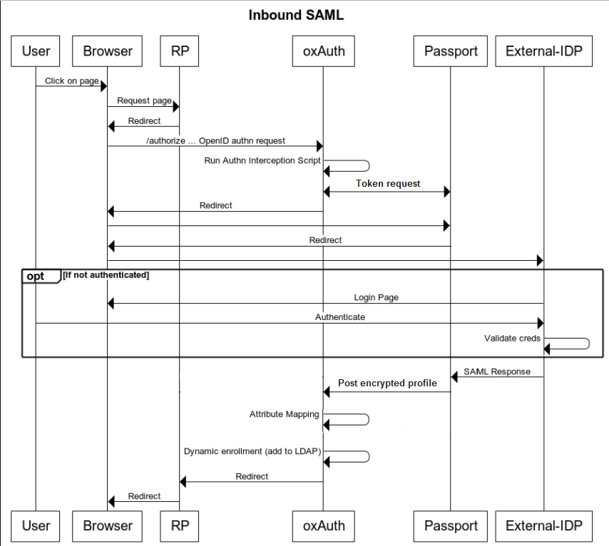

# Inbound SAML using Passport

## Overview

The Gluu Server can be configured to delegate user authentication to one or more external SAML IDPs using the Passport component. Passport is a MIT licensed Node.js web application that allows developers and administrators to delegate user authentication to one or more external identity providers. It normalizes the process of supporting external authentication and also provides a standard mapping for user claims to enable dynamic registration in your Gluu Server IDP. 

Passport is an Express-based application that leverages [Passport.js](http://www.passportjs.org/docs): a flexible and modular authentication middleware for Node.js with support for hundreds of "strategies". Popular strategies include Facebook, Twitter, Github, etc.

!!! Note:
    Passport can be used to support social login as well. Due to the prominent similarities in the process of setting up SAML and social external authentication, this page contains pointers to the ["Social Login using Passport"](./passport.md) page where applicable.
    
### User Provisioning

After authentication at an external IDP, if there is no existing user record in Gluu, one will be created dynamically. Once personal data has been obtained and added to Gluu's local LDAP directory service, it can be used to offer SSO to all applications leveraging Gluu for authentication. 

## Requisites

- [Gluu Server CE](https://gluu.org/docs/ce/3.1.4/installation-guide/) 3.1.4 with Passport. In an existing 3.1.4 instance, you can add Passport as described [here](./passport.md#add-passport-to-gluu-server-installation).

- Details of the IDPs you want to integrate, like ACS (assertion consumer service) URLs, SAML binding, certificates, etc.

## Authentication flow

The following depicts the authentication and user provisioning flow applicable for inbound SAML with Passport:



1. User attempts to access an application protected by Gluu. 

1. The RP (requesting party/application) generates and sends an authorization request. 

1. If a session doesn't exist in the authorization server yet, the Passport SAML custom script logic is triggered to initiate the flow. Depending on how the authorization request was built in previous step, the end-user will be sent to a page showing a list of external IDPs to choose one or directly to a specific IDP to initiate the login process. 

1. The script issues a call to Passport module requesting a token

1. The script sends a redirect to a URL (including the token) which will make Passport module delegate authentication to a previously selected IDP  

1. Passport validates the token and redirects the user to the specified external SAML IDP

1. After successful authentication the callback (redirect URL) endpoint is called. Personal data received within the SAML response is encrypted in a JWT which is posted to an endpoint that hands control back to the custom script

1. The custom script verifies whether the user exists in Gluu's local LDAP server. If so the profile is updated, otherwise a new user entry is created.

1. A session is created for the user at the authorization server. The user access the application.

## Setting up Inbound SAML with Passport

These are the steps for configuring Gluu Server for the inbound SAML scenario:

1. [Add Passport to your Gluu Server](add-passport-to-gluu-server-installation) (if you didn't include it upon installation).
1. [Enable Passport](#enable-passport).
1. [Configure trust](#configure-trust).
1. [Testing your setup](#testing-your-setup).

### Add Passport to your Gluu Server

You can skip this step if you chose Passport when you installed Gluu Server. Otherwise, follow [these instructions](./passport.md#add-passport-to-gluu-server-installation).

### Enable passport

You can follow the same steps used for enabling passport in [Passport for social login](./passport.md#enable-passport). Please ensure you enabled the `passport_saml` script instead of `passport_social`.

### Configure Trust

#### SSO between target application and Gluu

The target application needs to have an SSO relationship with your Gluu Server.

- If it is a SAML app, follow the instructions in the admin guide for configuring your [Gluu SAML IDP](https://gluu.org/docs/ce/admin-guide/saml/).

- If it is an OpenID Connect app, follow the instructions in the admin guide for configuring your [Gluu OP](https://gluu.org/docs/ce/admin-guide/openid-connect/).

#### Register external IDPs with home IDP

Passport expects to find information about supported SAML IDPs in configuration file at `/etc/gluu/conf/passport-saml-config.json`. Every supported external IDP should be added as a JSON object. No passport restarts are required when changes are made to this file.

A sample configuration containing entries for two external IDPs called "idp1" and "idpw" is provided below:
 
```
{
  "idp1": {
    "entryPoint": "https://idp.example.com/idp/profile/SAML2/POST/SSO",
    "issuer": "urn:test:example",
    "identifierFormat": "urn:oasis:names:tc:SAML:2.0:nameid-format:transient",
    "authnRequestBinding": "HTTP-POST",
    "additionalAuthorizeParams": "<Some additional params json>",
    "skipRequestCompression": "true",
    "logo_img": "../../ext/resources/ipd1.png",
    "enable": "true",
    "cert": "MIIDbDCCAlQCCQCuwqx2PNP...........YsMw==",
    "reverseMapping": {
      "email": "email",
      "username": "urn:oid:0.9.2342.19200300.100.1.1",
      "displayName": "urn:oid:2.16.840.1.113730.3.1.241",
      "id": "urn:oid:0.9.2342.19200300.100.1.1",
      "name": "urn:oid:2.5.4.42",
      "givenName": "urn:oid:2.5.4.42",
      "familyName": "urn:oid:2.5.4.4",
      "provider": "issuer"
    }
  },
  "idp2": {
    "entryPoint": "https://idp2.example.com/idp/profile/SAML2/POST/SSO",
    "issuer": "urn:test2:example",
    "identifierFormat": "urn:oasis:names:tc:SAML:2.0:nameid-format:transient",
    "authnRequestBinding": "HTTP-POST",
    "additionalAuthorizeParams": "",
    "skipRequestCompression": "true",
    "logo_img": "https://my.idp2.com/logo.jpg",
    "enable": "true",
    "cert": "AVDVfsgsdafkmiaAFJiasdfmpaf...........YsMw==",
    "reverseMapping": {
      "email": "email",
      "username": "urn:oid:0.9.2342.19200300.100.1.1",
      "displayName": "urn:oid:2.16.840.1.113730.3.1.241",
      "id": "urn:oid:0.9.2342.19200300.100.1.1",
      "name": "urn:oid:2.5.4.42",
      "givenName": "urn:oid:2.5.4.42",
      "familyName": "urn:oid:2.5.4.4",
      "provider": "issuer"
    }
  }
}
```

!!! Note:
    Except for `additionalAuthorizeParams`, all properties listed above must be included in the file for it to be validated by Passport.
    
Placeholder URLs like `https://idp.example.com` must be replaced with the URLs of actual remote IDPs. A description of properties is below:

* `entryPoint`: Endpoint URL where SAML requests must be sent to.

* `issuer`: A string specifying an `entityid` Passport must use when communicating with this specific external IDP. In particular, it allows usage of different `entityid` values for each of registered IDPs. If not needed, the same `entityid` can be used in all entries in the file.

* `identifierFormat`: URI specifying name identifier format ("nameid's") to request/expect from this remote IDP.

* `authnRequestBinding`. If set to "HTTP-POST", then authentication requests sent to `entryPoint` will use HTTP POST method (SAML's HTTP POST binding), otherwise defaults to HTTP method (HTTP Redirect binding).

* `additionalAuthorizeParams`: A JSON object of additional query parameters which can be added in order to 'authorize' requests.

* `skipRequestCompression`: If set to "true", the SAML request to this service provider will not be compressed.

* `logo_img`: Absolute or relative URL pointing to the IDP's logo used by the Gluu's Passport login page.

* `enable`: If set to "true", this IDP is allowed to be used by users that try to authenticate.

* `cert`: The IDP's PEM-encoded X.509 certificate with the `BEGIN CERTIFICATE` and `END CERTIFICATE` separator lines stripped and all line breaking characters (new line, carriage return, space etc) supressed. In other words, a base64-encoded string representing the body of a certificate. The following command can be used to transform an existing X.509, PEM-encoded certificate into string of the required format: `# cat ~/your_cert.crt | grep -v '^---' | tr -d '\n'`. The certificate supplied here is the one intended for signing. For example, if you are using Shibboleth bundled in a Gluu Server instance, visit `https://<gluu-host>/idp/shibboleth` and see the contents of XML tag `KeyDescriptor` where `use="signing"` inside `IDPSSODescriptor` tag.

* `reverseMapping` - An embedded JSON object defining how the SAML attributes' names must be mapped to attributes that are used internally by the Passport module:
    * `email` - the user's email
    * `username` - the user's username (uid) 
    * `displayName` - a display name for the user
    * `id` - the user's userid
    * `name` - the user's full name
    * `givenName` - the user's first name
    * `familyName` - the user's last name

#### Register home SP with external IDPs

Passport will generate SAML SP metadata for every IDP listed in the `passport-saml-config.json` file once it successfully validates configuration. After this is achieved, the next step is to register its SP at all remote external IDPs.

The metadata can be accessed at URLs that follow this format: `https://<hostname>/passport/auth/meta/idp/<IDP-id-from-passport-saml-config>`. In the filesystem, contents can also be found under `/opt/gluu/node/passport/server/idp-metadata` directory of Gluu chroot. You can copy this data your local machine and then upload to remote external IDPs.

The actual process of creating trust will differ across IDP implementations. For example, for cases when the remote IDP is another Gluu Server CE instance, the relevant [documentation page](https://gluu.org/docs/ce/3.1.3/admin-guide/saml/#create-a-trust-relationship) should be followed. In case of other SAML IDP implementations, consult the corresponding documentation.

!!! Note 
    When registering the Passport SP at each remote IDP, at least `username` will be required for each user.

### Testing your setup

### Passing an acr value

In an OIDC app, you can create an authorization request URL including `acr_value` in the parameters with a corresponding value of `passport_saml`. This suffices to trigger the standard flow (the one that shows the provider selection page). Note this requires having pre-registered an openid client and knowledge of redirect URI and scopes.

You can use the following Java snippet to quickly produce an authorization URL that you can paste in your browser:

```
import java.util.*;
import org.xdi.oxauth.client.AuthorizationRequest;
...

String clientid = "your_openid_client_id";
String redirect_uri = "redirect_uri"; 
String host = "your_gluu_host";
String state = UUID.randomUUID().toString();

AuthorizationRequest authorizationRequest = new AuthorizationRequest(
                Collections.singletonList(ResponseType.CODE)
                , clientid
                , Arrays.asList(("openid", "profile", "user_name")
                , redirect_uri, UUID.randomUUID().toString());

authorizationRequest.setRedirectUri(redirect_uri);
authorizationRequest.setAcrValues(Collections.singletonList("passport_saml"));
authorizationRequest.setScopes(Arrays.asList("openid", "profile", "email"));
authorizationRequest.setState(state);

return String.format("https://%s/oxauth/authorize?%s", host, authorizationRequest.getQueryString());
```

You have to place this [jar](https://ox.gluu.org/maven/org/xdi/oxauth-client/3.1.4.Final/oxauth-client-3.1.4.Final.jar) file in your classpath.

The code above should produce a String like:

```
https://<gluu_host>/oxauth/authorize?response_type=code+...&client_id=...scope=openid+...
   &redirect_uri=...&state=...&nonce=
   &acr_values=passport_saml
```

### Skipping the IPD selection page

You can programmatically compose an authorization URL where you can pass as parameter the name of IDP to which you can send your users directly. This requires adding a custom authorization parameter to your Gluu Server. Visit [this section](#altering-flow-behaviour) to learn more.

### Use the demo app

!!! Warning 
    Demo app is a minimalistic web application developed with the sole purpose of showcasing how inbound SAML can be achieved with Passport. It is strongly discouraged to leave this app running indefinitely on a production server.
    
The ["Proxy-client"](https://github.com/GluuFederation/Inbound-SAML-Demo) demo application is a small Node.js app that provides an easy way to test the Inbound SAML scenario. The project requires `node` to be installed on the machine where the app will run. Optionally, and for the sake of simplicity, we recommend re-using the `Node.js` setup of your Gluu Server where Passport is running.

Follow the guidelines below to install the Demo app in your Gluu Server host:

#### Web UI configuration steps

1. Log in to oxTrust web UI as an administrator user

1. Navigate to the `OpenID Connect` > `Clients` page, and register a new OIDC client to your Gluu Server with following required properties:

    - *Redirect login uri*: `http://passport-saml-demo-app.example.com:3000/profile/`    
    - *Grant types*: `authorization_code`   
    - *Response types*: `code` and `id_token`    
    - *Scopes*: `openid`, `email`, `user_name` and `profile`   
    - *Client secret* not to be empty    

1. Go to "Configuration" > "JSON configuration" > "oxAuth configuration"

    - Scroll down to "authorizationRequestCustomAllowedParameters" and click on the plus icon
    - Enter "preselectedExternalProvider"
    - Press on "Save configuration" at the bottom

#### Console configuration steps

1. Login to Gluu chroot container.

1. Ensure your VM has internet access and that incoming connections to TCP port 3000 are allowed to reach applications running on this machine.

1. Switch to "node" user: `# su - node`

1. Download and extract the [project files](https://github.com/GluuFederation/Inbound-SAML-Demo/archive/master.zip).

1. Copy your `passport-saml-config.json` file used during the [registering external IDPs](#register-external-idps-with-home-idp) step into the app's directory: `$ cp /etc/gluu/conf/passport-saml-config.json ~/Inbound-SAML-Demo/`

1. Edit the file `client-config.json` file and provide proper values for: `ClientID` (the `inum` of the client created in oxTrust), `clientSecret`, and `hostname` (FQDN of this Gluu Server instance)

1. Initialize the Demo app:      

    - `$ cd ~/Inbound-SAML-Demo/`
    
    - `$ npm install`
    
1. Run the application: `$ node server.js` You can stop the app by hitting `Ctrl + C`

!!! Note 
    Starting the demo app as described above will render your SSH session unusable while allowing to observe a useful debug output it will redirect to stdout. Consider starting another SSH session in a separate console window for other tasks.

### Test it!

1. In the machine where you will run this test, add a host entry so that the name `passport-saml-demo-app.example.come` resolves to the IP address of the machine where the demo app was installed.

1. Open a web browser and hit `http://passport-saml-demo-app.example.come:3000`.

1. Select one of the displayed IDPs to initiate external authentication.

            

1. After logging in at the IDP, you will be redirected back to Gluu Server where you might be prompted to authorize release of your personal data to the Demo app.

   
   
1. After consenting to release the requested claims, you'll be sent to the Demo app with an authorization code which is needed for retrieving your personal data.

1. The application will display retrieved claims on the "/profile" page   

      

See the Demo app in action in this [video](https://www.youtube.com/watch?v=ubhDgGU8C8s&feature=youtu.be).

## Altering flow behaviour

Similarly as in the case of [social login with passport](#altering-flow-behaviour), it's possible to slightly alter the flow: you can require [email to be present](./passport.md#requiring-email-in-profile) for enrollment, apply [email account linking](./passport.md#email-account-linking), or do [provider preselection](./passport.md#preselecting-an-external-provider) (so that the page listing IDPs is skipped).

In **all cases**, instead of adding a property via oxTrust, you have to manually add it to config file `/etc/gluu/conf/passport-saml-config.json`. Equivalently, if you need to alter properties of a custom script, apply those in the `passport_saml` script. Just wait for about 1 minute for changes to take effect (no restarts needed).

## Additional configuration details

### Log level

You can tweak the log level used in `passport-YYYYmmdd.log` files. Check [this](./passport.md#log-level) for more info.

### Custom script parameters

The Passport SAML script can be [parameterized](./passport.md#custom-script-parameters) for instance, to include more attributes in the mapping or work with provider pre-selection. 

## Implement IDP discovery ("WAYF")

IDP Discovery refers to process of determining which IDP users should be sent to for authentication (also known as: "Where Are You From", or WAYF). There are many ways to achieve this, but the following methods are most commonly used in practice.

### Discovery based on supplied email address

Email-based discovery, or "identifier-first" login, relies on an email address to discover where to send an user for authentication. It can be implemented as follows:

1. Users are asked for an email address which they usually use for logging in their home IDP.

1. The domain name part of the email address is parsed and evaluated; the domain name part is a sub-string of the email address following the "@" character.

1. Check if such IDP is allowed to be used with this application is done. The list of allowed IDPs will usually be derived from IDP entries in `passport-saml-config.json` file of target Gluu Server.

1. If found, an OpenID Connect authorization request URL can be buit by supplying the IDP id in a custom parameter (as describe [here](./passport.md#preselecting-an-external-provider).

1. The user is redirected to the URL of the previous step, triggering the Passport Inbound SAML scenario.

1. The Passport SAML authentication script parses the custom parameter, and the flow proceeds to the designated IDP.

### Landing page discovery

If you do not mind exposing the list of your external IDP partners, you can allow users to choose which IDP better suites their needs by displaying all IDPs you've established trust with. This is the standard behavior in Gluu Server with Passport.

###  Discovery based on sub-domain or sub-directory

If you provide a dedicated sub-domain or sub-path namespace to your customers or partners (URLs like `https://customer1.mydomain.com` or `https://mydomain.com/customer1` illustrate this approach), then you can perform discovery based on this as well. When an unauthenticated user tries to access any protected resources related to those dedicated namespaces, an appropriate IDP related to it can be looked up in a configuration file and its id encoded into a custom parameter of the authorization request before redirecting the user to Gluu Server.

## Troubleshooting tooltips

In case of issues during setup or tests, consider the following:

1. Make sure that the system clocks are synchronized between all the machines that participate in the flow (NTP is the way to go). When clocks are out of sync, it's known to cause a hard to troubleshoot state of an "infinite loop" (non-ending redirection across a given set of pages).

1. Some IDPs may choose to encrypt assertions in their SAML responses in a way that the Passport module is not able to understand. In case of any issues with the flow (especially the ones following the reception of SAML response from remote IDP by the Passport module) try to disable assertions' encryption at involved IDP in order to verify whether this is the cause (the response will still normally being passed over the encrypted channel via the SSL/TLS providing strong enough security).

1. [Log files](#log-level) can be a useful source of clues about what is going on deeper under the hood.

If you still have trouble, feel free to open a [support ticket](https://support.gluu.org) for further assistance. Please provide all related log entries to speed up the resolution process.