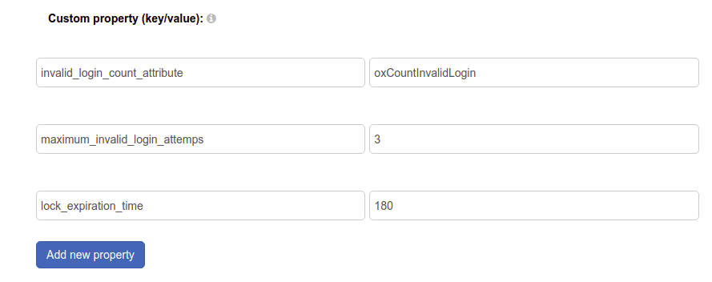

# Account Lockout

The default Gluu Server distribution includes an interception script to implement a basic account lockout policy which will deactivate a users account after a set number of consecutive failed login attempts. 

- View the [account lockout script](https://github.com/GluuFederation/oxAuth/blob/master/Server/integrations/basic.lock.account/BasicLockAccountExternalAuthenticator.py)

## How it Works
The script implements a basic username/password authentication flow using the local or backend LDAP server for auth, with a little enhancement to lock the user out after a specified number of failed authentication attempts. 

The script uses authentication settings provided in the `Manage LDAP Authentication` tab within `Configuration` > `Manage Authentication`. In case the set threshold of failed logins is reached, the `gluuStatus` attribute of the user in question will be set to `inactive` and login counter is reset to zero. 

The login counter will also be reset to zero if several unsuccessful login attempts are finally followed by a successful one (before exceeding the limit). 

## Configure Account Lockout
To configure this feature navigate to `Configuration` > `Manage custom scripts` and find `basic_lock` script on the `Person Authentication` tab. 

There are 3 configurable properties:

- `Invalid_login_count_attribute` sets the name of the attribute used to store the current amount of failed login attempts. It assumes your schema already allows such an attribute to appear in user entries. The default attribute is `oxCountInvalidLogin` and it’s already supported by Gluu’s LDAP schema.

- `Maximum_invalid_login_attemps` sets the threshold for number of failed login attempts before the user gets locked out.

- `lock_expiration_time` sets how long the user is locked out, in seconds. By default, it's set to 180 seconds.
 
   
  
2. After script is configured tick the `Enabled` checkbox 
3. Click the `Update` button 
4. Click on `Configuration` > `Manage Authentication` on the left menu and select `Default Authentication Method` tab. 
5. Select `basic_lock` authentication method for oxAuth and/or oxTrust.
6. Click the `Update` button there.
   
    

## Re-enable a Locked Account
You can re-enable a locked account by settings its `gluuStatus` attribute back to `active` via the web UI.
