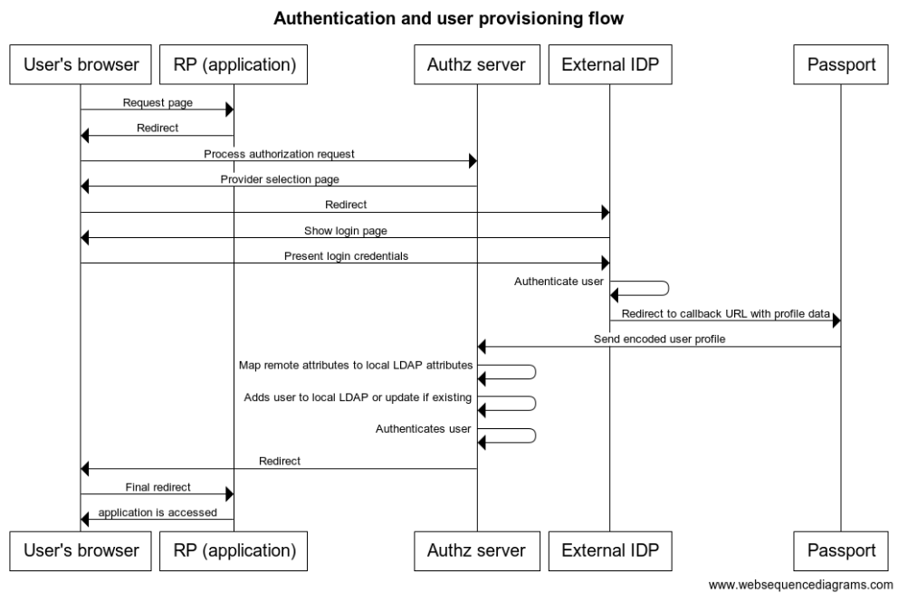
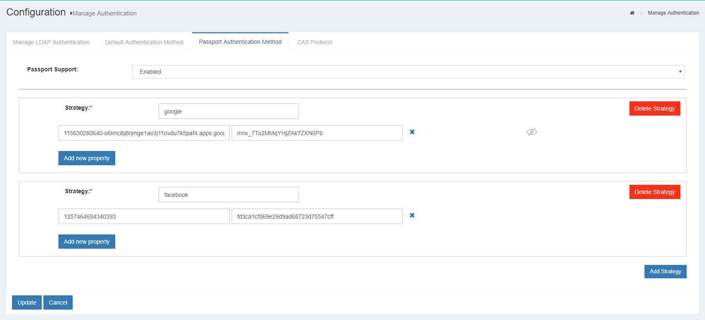
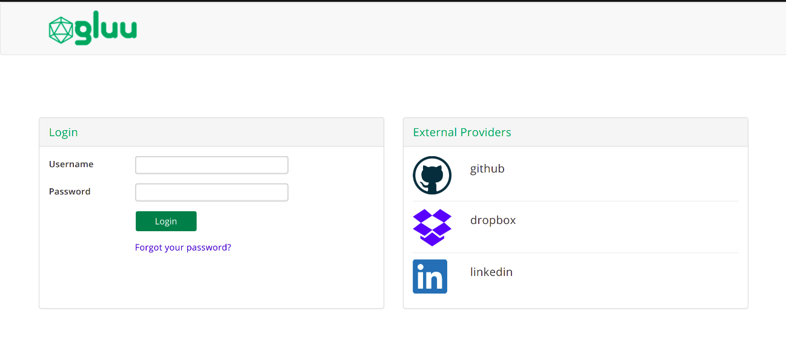

# Social Login using Passport

## Overview

Passport is a MIT licensed Node.js web application that allows developers and administrators to delegate user authentication to one or more external identity providers, such as popular social sites. Passport normalizes the process of supporting external authentication and also provides a standard mapping for user claims to enable dynamic registration in your Gluu Server IDP. 

Passport is an Express-based application that leverages [Passport.js](http://www.passportjs.org/docs) for social login. Passport.js is a flexible and modular authentication middleware for Node.js with support for hundreds of "strategies". Popular strategies are Facebook, Twitter, Github, etc.

!!! Note:
    In Gluu Server, passport is included as an optional component for [installation](https://gluu.org/docs/ce/installation-guide/).

## Sample authentication flow

The following is a high-level diagram depicting a representative authentication and user provisioning flow that can be achieved with Passport:

 

1. User attempts to access an application protected by Gluu 
1. Without a session, user's browser is redirected to a page showing a list where he can choose the social site he wants to use for login. 
1. User is taken to social site where he is asked for login credentials.
1. Upon successful authentication, a redirection is made to Passport with user's profile data.
1. Passport securely sends relevant profile data to Gluu authentication component
1. If the user does not exist already in local Gluu LDAP, it is created with the attributes found in profile (if already existing, the profile is updated)
1. A session is created for the user at the authorization server. The user access the application.

!!! Warning:
    To deploy an authentication flow like the one above, some configuration steps are required. Important tasks include enabling passport endpoints, creating OAuth clients at social sites you want to support, and supply strategies parameters to determine behaviour.

## Supported external providers 

Out of the box, Passport in Gluu Server 3.1.4 supports the following social sites:

- Dropbox
- Facebook
- Github
- Google
- Linkedin
- Tumblr
- Twitter
- Windowslive
- Yahoo

If you want to integrate a provider not found in the list, follow the instructions given [here](#supporting-a-new-strategy).

## Setting up social login for an app with Passport

This section describes the steps required to materialize the [sample workflow](#sample-authentication-flow) of above. In this particular case we will offer a couple of authentication choices. The application to protect will be oxTrust (the one used for Gluu administration!).

The following summarizes the steps needed:

1. Add Passport to your Gluu Server (if you didn't include it upon installation)
1. Enable Passport
1. Register for a (developer) account at social sites
1. Create applications (clients) in social sites
1. Fill strategy details
1. Make oxTrust be protected with Passport
1. Test

### Add Passport to Gluu Server installation

You can skip this step if you chose Passport when you installed Gluu Server. To add Passport to an existing Gluu Server installation do the following (needs Internet access):

1. Login to Gluu Server chroot

1. cd to `/install/community-edition-setup`

1. wget `https://github.com/GluuFederation/community-edition-setup/blob/master/post-setup-add-components.py`

1. `chmod +x post-setup-add-components.py` 

1. Run `./post-setup-add-components.py -addpassport`

1. Run `runuser -l node -c "cd /opt/gluu/node/passport/&&PATH=$PATH:/opt/node/bin npm install -P"`

### Enable passport

Enable the required custom scripts:

- Login to oxTrust and go to "Configuration" > "Custom scripts"
- In "Person Authentication" tab, collapse the script labelled "passport_social" and check "enabled".  
- In "UMA RPT Policies" tab, collapse the "uma_client_authz_rpt_policy" and check "enabled"
- Press "Update" at the bottom of the page

Enable passport support:

- Still in oxTrust go to "Configuration" > "Organization configuration" > "System configuration" 
- In "Passport support" choose "Enabled"
- Click on "Update"

 

### Register for a developer account at social sites

Every social site has its own procedure so you can join as a developer. Check on the internet how to proceed. The aim is being able to get to a page that allows creation of applications. For the sake of simplicity, we suggest adding at most two external providers to start.

### Create applications

If you already have a github account, this is very straightforward, just visit [https://github.com/settings/applications/new](https://github.com/settings/applications/new). For the case of Twitter, go to [https://apps.twitter.com](https://apps.twitter.com).

For Facebook visit [https://developers.facebook.com](https://developers.facebook.com) and click on "Add a new App" from "My Apps" dropdown. Fill the required details and click the "Create App ID" button.

To create an application you will be requested to fill data like an application name or ID, domain name of your application and authorization callback URLs.

For our example, you can use the domain name of your Gluu Server (e.g. `https://my.host.com`). For callback URL please follow the convention:

```
https://<domain-name>/passport/auth/<strategy>/callback
```

Where `<stragegy>` is the name of the Passport.js strategy you are integrating. For this particular case, the strategy is the identity provider name (e.g. twitter, facebook, google, linkedin, etc). More exactly, the portion after the domain name must match that found in the corresponding `js` file you can see in chroot folder `/opt/gluu/node/passport/server/auth` (search for `callbackURL`). This directory contains all providers supported out of the box.

In this example, callback URLs would be `https://<domain-name>/passport/auth/twitter/callback` for Twitter and `https://<domain-name>/passport/auth/github/callback` for Github.

Once the application is created you will be given two pieces of data: client ID and client secret. Terminology varies depending on provider, sometimes they are called consumer key and consumer secret, or app ID and app secret, etc. For instance, [here](../img/user-authn/passport/fb-addurl.png) is how it looks in Facebook.

### Fill strategy details

In oxTrust go to "Configuration" > "Manage Authentication" > "Passport Authentication Method". For every strategy to support do the following:

- Press the "Add Strategy" button
- Fill "strategy" field with the name of provider (e.g. "github"). Note this is a case sensitive field
- Paste the client ID and client secret details obtained in the previous step for the corresponding provider



Additional parameters can be supplied in the form. We will get into this [later](#altering-flow-behaviour).

### Protect oxTrust with passport

Navigate to "Configuration" > "Manage Authentication" > "Default Authentication". In the field labelled "oxTrust acr" choose "passport_social". This will force oxTrust use the Passport authentication flow instead of another already in use, like the standard user + password authentication. Finally, press the "Update button".

### Test

#### About passport logs

The location of passport logs is `/opt/gluu/node/passport/logs`. By default, severity of messages logged is `INFO`. You can tweak this by altering Passport's configuration file. For more information see [Log level](#log-level).

In addition to passport node logs, the log statements of the custom script are key. You can find those in file `/opt/gluu/jetty/oxauth/logs/oxauth_script.log`.

#### Provider selection page

Wait for 1 minute for passport to pick configuration changes. Open a separate browsing session (e.g incognito) and try accessing oxTrust: `https://<domain-name>/identity`. You will be presented a form like the one shown below:



On the right, a list of external identity providers will be populated. To start, simply check the user + password authentication is working (use the fields provided on the left only), then log out.

Proceed to click on the icons for social login, if your setup was correct, you'll be able to login after getting past the login form at the social site.

!!! Note:
    Once you have supplied login credentials at social site, you won't be requested for them more unless your session expires or you explicitly log out.
    
If you get an error page, for example, one like below, double check your configuration and check your Internet access.


If you still have trouble, feel free to open a [support ticket](https://support.gluu.org) for further assistance.

#### Check user profile

Once oxTrust login is successful, check user data: Go to "Personal" > "Profile". Alternatively you can use the browsing session you initially opened with administrator privileges and go to "Users" > "Manage people" to inspect the recently created entry.

To check the actual profile data received in Passport side, check this [section](#inspecting-profile-data).

If you modify some aspect of your profile in the social site and attempt to relogin, the attribute updates will also be applied in local Gluu LDAP.

## Making other applications use Passport authentication flow

For convenience, in previous section we experimented an authentication flow to access oxTrust. To make an application leverage your existing Gluu Passport configuration, adjust your code so the authorization request sends as `acr_value` the string `passport_social`, that is, the name of the custom interception script you enabled initially.

For more information on `acr_value` manipulation, check this [page](../admin-guide/openid-connect/index.md#authentication).

Additionally, you can bypass the provider selection page and force explicit usage of an existing provider by supplying a [custom authorization parameter](#preselecting-an-external-provider) with your authorization request.

## Inspecting profile data

For debugging purposes, you can print the contents of profile data you are receiving from the external provider. Follow these steps:

1. Locate the `js` file of the identity provider you are interested in. See folder `/opt/gluu/node/passport/server/auth` inside Gluu chroot.

1. If missing, add a line of code like this `var logger = require('../utils/logger')` at the very top of the file.

1. Find the line of code starting with `var userProfile...` and just **before** it, add this: `logger.log2('info', 'Profile data received was %s:', JSON.stringify(profile))`.

1. Find the line of code starting with `return done...` and just **before** it, add: `logger.log2('info', 'Profile data sent is: %s', JSON.stringify(userProfile))`.

1. Save the file.

1. Restart passport: issue `service passport restart` from within chroot command line.

The couple of log statements added print all profile data received from the external provider in JSON format, and the portion of that profile actually processed by Gluu, respectively.

Do a login attempt by choosing the external provider of your interest, then check the contents of [passport node logs](#about-passport-logs).


## Altering flow behaviour

There a couple of ways to modify the behavior of the authentication flow. These are slight flow changes though. If you want a tailored workflow to achieve needs not covered in this section, we suggest to open a [support ticket](https://support.gluu.org) to receive further assistance. Customization may demand programming skills in languages such as python, Java, and Node.js from your side.

For all modifications below you have to wait at least 1 minute before testing it. This is the time the server takes to pick your configuration changes.

### Requiring email in profile

Default implementation does not impose constraints around attributes requiredness with exception of `username`. If you want to flag `email` as required, you can add a property to the strategy this way:

- In oxTrust, go to "Configuration" > "Manage Authentication" > "Passport Authentication Method"
- Press the "Add new property" button for the strategy you want to manage
- Enter "requestForEmail" in the left field and "true" on the right
- Save your settings

With this setup, just after authentication at external site, a newcomer will be shown a page to enter his email (this won't be needed for subsequent logins) to complete the flow. The value entered is stored in LDAP `mail` attribute. However, if an existing user has such email assigned already authentication will fail.

Most social providers offer means for users to select which attributes can be exposed to external applications that read their profile data, so depending on user settings the value can be present or not. This means that even if *requestForEmail* is set to *true*, there might be cases in which users are not prompted.

### Email account linking

There are cases in which an external provider is trusted so you can change the default behavior of adding a new user entry locally, but binding an existing user to the one that is logging in. This linking can be done via email attribute.

As an example, suppose you have 3 users in your Gluu local LDAP: Larry (larry@acme.com), Moe (moe@acme.com), and Curly (curly@acme.com). When you enable email account linking for provider "XYZ" and certain user logs in through XYZ to access your application, he will be logged as Moe as long as his email is "moe@acme.com" at XYZ.

To do account linking proceed this way:

- In oxTrust, go to "Configuration" > "Manage Authentication" > "Passport Authentication Method"
- Press the "Add new property" button for the strategy you want to manage
- Enter "emailLinkingSafe" in the left field and "true" on the right
- Save your settings

!!! Note:
    Only enable this feature for trusted providers and do not set *requestForEmail* to *true* in this case since this opens a big security hole.

### Preselecting an external provider

In some cases you don't want to show the identity providers selection form, but have means to determine programatically where you would like to send users to. In this case, you need to customize the authorization request being sent to Gluu Server in order to pass the desired provider. For this purpose you just have to create a custom parameter for authorization requests and parameterize the passport script accordingly.

Please follow these steps:

1. Create a custom parameter for authorization request
    
    - Login to oxTrust and go to "Configuration" > "JSON configuration" > "oxAuth configuration"
    - Scroll down to "authorizationRequestCustomAllowedParameters" and click on the plus icon
    - Enter a name for the custom parameter you are adding, e.g. "preselectedExternalProvider"
    - Press on "Save configuration" at the bottom
    
1. Parameterize the passport custom script to read the custom parameter

    - Navigate to "Configuration" > "Custom scripts"
    - In "Person Authentication" tab, collapse the script labelled "passport_social" (or "passport_saml" if you are using inbound SAML)
    - Click on "Add new property" and enter "authz_req_param_provider" on the left
    - On the right enter the name of the custom parameter (e.g. "preselectedExternalProvider")

This way you can append a new query parameter to the request you issue to start the authorization process in your application:

```
https://<domain-name>/oxauth/authorize?response_type=code+...&client_id=...
   &scope=openid+...&redirect_uri=...&state=...
   &acr_values=passport_social
   &preselectedExternalProvider=<base64-url-encoded-provider-object>
```

Where `<base64-url-encoded-provider-object>` is the Base64-encoded representation of a small JSON content that must look like this:

```
{
   "provider" : <strategy-name>
}
```

In this case `<strategy-name>` is the name of an already registered strategy. Note this piece of data is case sensitive. 

The names of valid strategies are those defined at "Configuration" > "Manage Authentication" > "Passport authentication method" in oxTrust. When using SAML flavor of custom script, valid providers are those defined in file `/etc/gluu/conf/passport-saml-config.json`.

## Additional configuration details

### Log level

As mentioned [earlier](#about-passport-logs), there are two relevant logs: `oxauth_script.log` (where you will see statements about every step of the flow itself), and `passport-YYYYmmdd.log` which allows debugging certain aspects in the communication with external providers.

`oxauth_script.log` does not handle levels per se (all `print` statements of the custom script are sent to log) but passport logging level can be configured this way:

1. Login to Gluu chroot

1. `cd` to `/etc/gluu/conf`

1. Edit file `passport-config.json` so that property *logLevel* value is any of *error*, *warn*, *info*, *verbose*, *debug*. Some notes:
    - If your file does not contain *logLevel*, add a line like this `"logLevel": "info",` after the line starting with `"applicationEndpoint"...`
    - Ensure the file produced has valid JSON syntax
    
1. Save the file and preferably flush the contents of `/opt/gluu/node/passport/logs`

1. Restart passport: `service passport restart`.

### Custom script parameters

The interception script is the core piece that implements the authentication flow. In general terms, it implements a provider agnostic inbound identity authentication flow. Actually, the script used for social login and inbound SAML is the same. They only differ in the way they are parameterized.

The following describes the configuration properties of the passport script. We advise to login to oxTrust and go to "Configuration" > "Custom scripts" > "Person Authentication" tab, and collapse the script (whether social or saml version).

- *behaviour*: It dictates whether the script is intended to integrate SAML providers or not. Valid values are "saml" or "social". In the case of SAML behaviour, a separate configuration file is needed, see [this page](inbound-saml-passport.md#register-external-idps-with-home-idp).

- *generic_remote_attributes_list*: a comma-separated list of values in a one-to-one correlation with the values of the list *generic_local_attributes_list*. It contains the names of the attributes (of the remote profile) that will be mapped into local (Gluu) attributes when a user provisioned.

- *generic_local_attributes_list*: a comma-separated list of values in a one-to-one correlation with the values of the list *generic_remote_attributes_list*. They are the actual attributes that can be set (filled/updated) by the custom script when an user provisioned.

- *authz_req_param_provider*. This is used to programmatically pass an [external provider](#preselecting-an-external-provider).

### Provider's logo image

Strategies supported out of the box are already bundled with its corresponding logo images and they properly load in the provider selection list. If you want to change the image shown for an existing strategy simply do this:

1. Copy the image to chroot directory `/opt/gluu/jetty/oxauth/custom/static`.

1. In oxTrust go to "Configuration" > "Manage Authentication" > "Passport Authentication Method".

1. Press the "Add new property" button for the strategy you want to change.

1. Fill "logo_img" on the left, on the right enter `../../ext/resources/<image-name>` where `<image-name>` is the name of the file you copied on the first step. 

1. Wait 1 minute, then verify the image appears correctly by acessing your application in a browser.

Alternatively you can use an absolute URL for `logo_img` if the image is hosted elsewhere (e.g. `https://another.site.co/path/to/image`).

### OpenID connect providers

Besides common social sites support, OpenID Connect providers are also supported. More specifically, you can enable one OIDC provider and be up and running in a matter of minutes. 

1. In oxTrust go to "Configuration" > "Manage Authentication" > "Passport Authentication Method". 

1. Press the "Add Strategy" button and fill "strategy" field with value "openidconnect".

1. Fill the following fields according to the configuration of the external OP:
   
   - "clientID" and "clientSecret": The details of an OIDC client previously registered at the OP

   - "issuer": Location of the OP (e.g. "https://server.example.com")
   
   - "authorizationURL": The Authorization Endpoint (e.g "https://server.example.com/authorize")
   
   - "tokenURL": The endpoint used to obtain an access token, ID token, etc. (e.g. "https://server.example.com/token")
   
   - "userInfoURL": The endpoint that returns Claims about the authenticated end-user (e.g. "https://server.example.com/userinfo")

   - "acr_values" (optional): Space-separated string that specifies the `acr` values the OP will be requested to use for processing authentication requests.

1. Save the configuration and wait for about 1 minute

Integration of OIDC providers is achieved via `passport-openidconnect` Passport.js strategy which **only** supports the code flow (not hybrid or implicit). Additionally, comunication with the token endpoint is carried out via POST only. No support for secretless clients (just confidential oauth clients).

If you need to support a second OIDC provider, you have to duplicate the `openidconnect` strategy and proceed similarly as when [adding a new provider](#supporting-a-new-strategy).

#### Using an external Gluu Server as OP

Here we provide specific steps on how to configure your OIDC strategy when using a Gluu Server instance as external provider (here called "remote Gluu". Note this is **not** the same server in which Passport has been installed.

1. Create a client in your remote Gluu server. Login with admin credentials to `https://<remote-gluu-server>/identity` and go to "OpenId" > "Clients" > "Add". Provide the following settings:

    - client name: *any of your choosing*
    
    - client secret: *a password for this client*

    - application type: native

    - pre-authorization: false

    - persist client authorizations: true

    - subject type: pairwise

    - jws algorithm ID token: rs256

    - authentication method for token endpoint: client_secret_post

    - require auth time: false

    - scopes: openid, profile, user_name, email

    - grant types: authorization_code

    - logout session required: false

    - response types: code

    - redirect login uri: `https://<host-name>/passport/auth/openidconnect/callback`. Where `<host-name>` is the host of the Passport-enabled Gluu Server 

1. Follow the steps at the [beginning of this section](#openid-connect-providers). Particularly for step 3 provide:

   - "clientID" and "clientSecret": The details of client just created. Go to "OpenID Connect" > "Clients" and use for "clientID" the one appearing in the column "Inum" of the table.

   - "issuer": `https://<remote-gluu-server>`
   
   - "authorizationURL": `https://<remote-gluu-server>/oxauth/restv1/authorize`
   
   - "tokenURL": `https://<remote-gluu-server>/oxauth/restv1/token`
   
   - "userInfoURL": `https://<remote-gluu-server>/oxauth/restv1/userinfo`

<!--
## Customizing UI pages
-->

## Supporting a new strategy

This section describes the steps needed to add a new authentication provider to your Gluu Passport installation. 

!!! Note:
    Here we will use *reddit* integration as example, apply your changes according to the strategy you have choosen.

Passport.js - the authentication middleware Gluu leverages - supports hundreds of strategies. Onboarding a new one requires finding a proper `npm` package, creating a file, and editing some already existing.

### Install the strategy module

You can use Passport.js [search feature](http://www.passportjs.org/packages/) to locate the proper node package. In most cases you will get redirected to the github page of the project where you'll find installation instructions for the strategy. Normally a command like `npm install <strategy-id>`. Do not execute this command directly, but in the following manner:

1. Login to Gluu Server chroot.

1. Switch to `node` user: `su - node`.

1. Add `node` executable to path: `export PATH=$PATH:/opt/node/bin`.

1. `cd` to passport application: `cd /opt/gluu/node/passport`. Recommended: backup this folder before proceeding

1. Ensure your vm has Internet access and install the strategy: `npm install passport-reddit --save`

### Add strategy setup code

Now that you added *passport-reddit* strategy, next step is creating a file named `reddit.js` in `/opt/gluu/node/passport/server/auth` with contents like:

```
var passport = require('passport')
var RedditStrategy = require('passport-reddit').Strategy

var setCredentials = function(credentials) {
    var callbackURL = global.applicationHost.concat("/passport/auth/reddit/callback")
    passport.use(new RedditStrategy({
            clientID: credentials.clientID,
            clientSecret: credentials.clientSecret,
            callbackURL: callbackURL
        },
        function(accessToken, refreshToken, profile, done) {
            var userProfile = {
                id: profile._json.id || '',
                name: profile.displayName || '',
                username: profile.username || profile._json.id || '',
                email: profile._json.email || '',
                givenName: profile._json.first_name || '',
                familyName: profile._json.last_name || '',
                provider: 'reddit'
            }
            return done(null, userProfile)
        }
    ))
}

module.exports = {
    passport: passport,
    setCredentials: setCredentials
}
```

This resembles what most already existing `js` files in `/opt/gluu/node/passport/server/auth` have. Documentation of particular strategy will let you know if additional parameters can be supplied in the constructor call (`new RedditStrategy(...` in this case). For instance, certain strategies allow you to explicitly request the attributes needed from user profile. As an example:

```
   profileFields: ['id', 'name', 'displayName', 'email']
```

this is something that you would add after `callbackURL`. You can use more configuration options depending on your requirements.

Notice the function passed as second argument for `passport.use`: it fills variable `userProfile` with the actual data to be used by the custom script implementing the authentication flow. Parameter `profile` contains the representation of profile received directly from the external provider. Note that structure (properties) of `userProfile` is referenced in the attribute mapping established by *[generic_remote_attributes_list](#custom-script-parameters)* config property of custom script. This means all strategies must use the same names when building `userProfile`.

It is recommended to add ` || ''` for every field because data may be missing in the profile received. This ensures an empty string is parsed by the custom script instead of a string with the well-known javascript `undefined`.

Finally, note in variable function `setCredentials` the presence of parameter `credentials`. This holds the values filled in oxTrust for this particular strategy.

### Configure strategy routes

Edit `/opt/gluu/node/passport/server/routes/index.js` using the following instructions: 

1. Add this variable declaration `var passportReddit = require('../auth/reddit').passport` to require the file added in previous step. You will find a section at the top of the file where analog variables are defined for all supported strategies.

1. Add this couple of handlers at around line 250:

```
//=================== Reddit ===================
router.get('/auth/reddit/callback',
        passportReddit.authenticate('reddit', {
            failureRedirect: '/passport/login'
        }),
        callbackResponse)

router.get('/auth/reddit/:token',
	validateToken,
	passportReddit.authenticate('reddit'))
```

Second section of code triggers authentication against the external provider while the first one processes the redirection the provider does once authentication process is complete at their site. Here, `/auth/reddit/callback` is the redirect URL relative to `https://host/passport` that you will supply when [creating the application](???) with the external provider.

For more information about how routes work in Passport.js, check the docs of your strategy and Passport.js [docs](http://www.passportjs.org/docs/authenticate/).

### Call strategy's setCredentials

Edit file `/opt/gluu/node/passport/server/auth/configureStrategies.js` using these instructions:

1. Add this line of code `var RedditStrategy = require('./reddit')` to require the file we added previously. Place this variable declaration at the top of the file.

1. In the `setConfigurations` function, call the `setCredentials` of your strategy in the following manner:

```
//RedditStrategy
if (data.passportStrategies.reddit) {
	logger.log2('info', 'reddit details received')
	RedditStrategy.setCredentials(data.passportStrategies.reddit)
}
```

### Review your configuration

To finish, check you already have:

- [Enabled passport](#enable-passport)
- [Registered for a developer account](#register-for-a-developer-account-at-social-sites)
- [Created an application](#create-applications)
- [Filled strategy configurations in oxTrust](#fill-strategy-details), including a logo image as described [here](#providers-logo-image)

### Test the new strategy

You can follow the same instructions given in section ["Setting up social login for an app with Passport"](#test).
