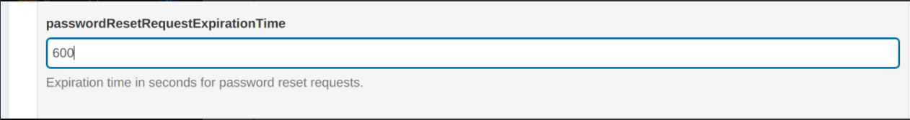
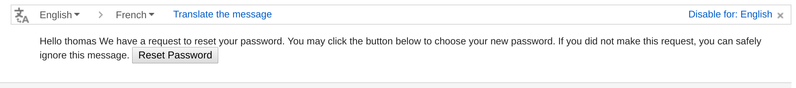

# Password Reset

## Overview

As a privileged user, the administrator can configure the password reset feature built into the Gluu Server.
This feature gives users the ability to reset their password.
Below are the steps to configure that feature:

1. Provide the SMTP Server configuration
1. Enable password reset on oxTrust admin UI
1. Test

## Prerequisites

The requirements are:  

1. A running Gluu Server instance  
1. A working SMTP Server  

## Provide the SMTP Server Configuration

The Gluu Server requires an SMTP server to be able to send password reset emails to the user's mailbox. 
A suitable UI is provided to gather the SMTP server configuation on Gluu oxTrust admin UI.

1. Log into the Gluu Server as a user with admin privileges

1. Navigate to `Configuration` > `Organization Configuration`

1. Select the `SMTP Server Configuration` tab
  

1. Fill the form with correct values according to your SMTP Server settings
  

1. Click the `Test Configuration` button to ensure the SMTP server is working: 
If the configuration is correct, then you will see a successful message like this:

1. Click the `Update` button to save changes
  
## Enable Password Reset on oxTrust 

1. Navigate to `Configuration` > `Organization Configuration`

1. Select the `System Configuration` tab

1. Enable `Self-Service Password Reset` 
  

1. Click the `Update` button to save changes

## Set link expiration
The password reset link has a default expiration of 600 seconds (10 minutes). This can be adjusted in oxTrust by navigating to `Configuration` > `JSON Configuration` > `oxTrust Configuration` and finding the field for `passwordResetRequestExpirationTime`. The desired expiration time value should be set in seconds, and then navigate to the bottom of the page and save your edits. 

## Test

1. Create a test user in the Gluu Server

1. Go to the Gluu Server login page

1. Click the `Forgot your Password?` link
  
  
1. Fill the form with the user email and click the `Send Mail` button
  
  
1. You'll get the following result:
  
  
1. Check the user's mailbox  
  

