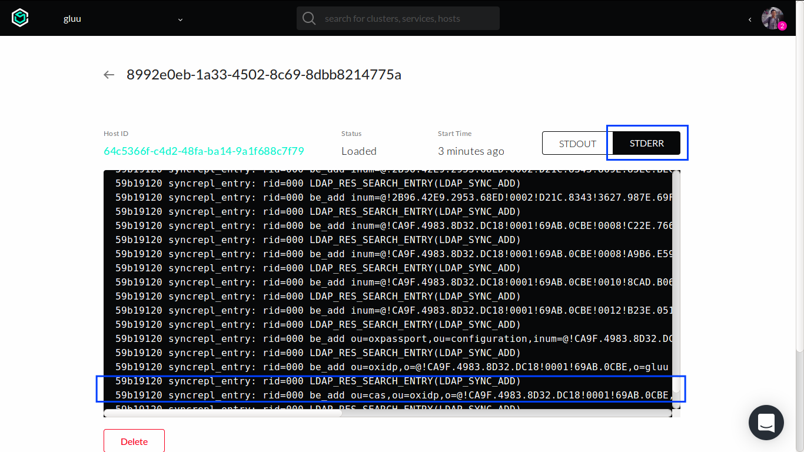
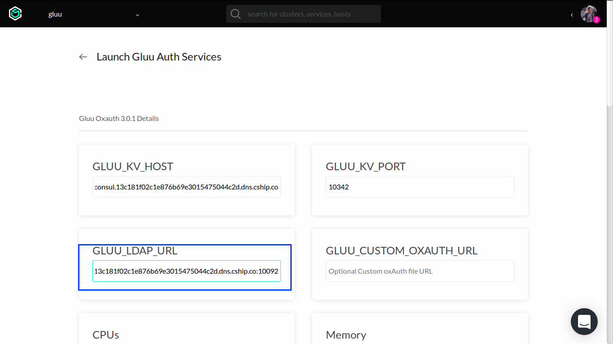

# Deploying the Gluu Server on Containership.io 

The following documentation provides instructions for deploying the Gluu Server on [Containership.io](https://containership.io).

Containership is a containers-as-a-service platform that makes it easy to deploy, manage and scale containerized applications on any public or private cloud. 

## Prepare Cluster

1.  Log into https://containership.io cloud dashboard.

2.  Create a new cluster by clicking `Create Cluster` button.

    

    A series of wizard forms will be displayed to help us configuring the cluster.

3.  Select a cloud provider to host the cluster. In this example, we will use DigitalOcean provider.

    

    Choose the DigitalOcean box and then click `CONTINUE` button at the bottom.

4.  Select Containership as the orchestrator and then click `CONTINUE` button at the bottom.

    

5.  Select region of hosts and then click `CONTINUE` button at the bottom.

    

6.  Select Ubuntu operating system.

    

    Choose any SSH keys (we can add more later).

    

    Afterwards, click `CONTINUE` button at the bottom.

7.  Create Leader, which has 1 CPU and 1 GB RAM, and then click `CONTINUE` button at the bottom.

    

7.  Create at least 2 Follower hosts which has 4 CPU and 8 GB RAM, and then click `CONTINUE` button at the bottom.

    

8.  The last step is to add name and environment. Use descriptive ones.

    

    Click `LAUNCH` button at the bottom to start provisioning the hosts.

After finishing the wizard forms, we will be redirected back to page that lists all of our clusters.


Please wait until cluster has been 100% provisioned.

For troubleshooting and other admin purposes, we need to add a firewall rule to allow SSH connection for admin users.
Click the newly created cluster which will redirect us to overview page.
Go to the cluster `Firewall` tab, and add a new rule for SSH connection by clicking `Add Firewall Rule` button.


Complete the forms shown below:


Make sure to enter a correct IP address of admin's machine (either manually or using `Use My IP` button) before clicking `Save Rule` button at the bottom.

`Congratulations`, we have completed first stage of our cluster setup.


## Custom Host Tags

1.  Go to `Host` tab.

    

2.  Click the first follower host and create the following user tags in `Tags` tab.

    `gluu.openldap.master-init = true`

    

    This mandatory tag will ensure one of OpenLDAP services that generate initial LDAP data, deployed only to this specific host.

3.  Back to `Host` tab and choose another follower host. Create the following tag in `Tags` tab.

    `gluu.openldap.master = true`

    

## Initialize Configuration

1.  Add Consul service using Containership Marketplace.

    

    Consul containers will be deployed to all follower hosts.

2.  Go to `Host` tag, choose one of the follower hosts. Overview page will be displayed.

    

    Copy the Public and Private IP, keep the values somewhere else for reference.

2.  In local machine, [install Docker](https://docs.docker.com/engine/installation/) and pull `config-init` image.

    ```
    docker pull gluufederation/config-init:3.1.3_rev1.0.0-beta3
    ```

    Consul service in Containership uses private IP and port 8314 to listen to client connection. Hence we need to do SSH tunneling to expose the port in our local machine.

    ```
    ssh -L 0.0.0.0:8500:<FOLLOWER-HOST-PRIVATE-IP>:8314 <SSH-USER>@<FOLLOWER-HOST-PUBLIC-IP>
    ```

    After tunneling established, in another terminal, we can start generating initial config in our local machine for our Gluu Server cluster.

    Prepare the following steps before generating initial config:

    - Use a resolvable public domain
    - Use an SSL certificate and key for the domain (create them if you don't have one yet; self-signed is possible)

    Here's an example on how to run `config-init` container:

```
docker run --rm \
    -v /path/to/org_ssl.crt:/etc/certs/gluu_https.crt \
    -v /path/to/org_ssl.key:/etc/certs/gluu_https.key \
    gluufederation/config-init:3.1.3_rev1.0.0-beta3 \
    --admin-pw my-password \
    --email 'my-email@my.domain.com' \
    --domain my.domain.com \
    --org-name 'My Organization' \
    --kv-host <LOCAL-IP> \
    --kv-port 8500 \
    --save
```
Wait until the process finished.

## Deploy Gluu Server Services

!!! Note 
    At the time this document is written, all Gluu's marketplace services are still in private mode.

### Deploy OpenLDAP Services

Go to `Services` tab and add another service from marketplace. Pick Gluu OpenLDAP item.


The Gluu OpenLDAP marketplace will deploy 2 services, `gluu-openldap-init` and `gluu-openldap`, with their own role:

1. `gluu-openldap-init`: to initialize LDAP data required to run Gluu Server.
2. `gluu-openldap`: a peer for multi-master topology where data is replicated to/from this instance (for high-availability purpose).

Upon the creation of services, a form will be displayed asking for configuration values.

1. `GLUU_KV_HOST`: DNS entry of existing Consul service.
2. `GLUU_KV_PORT`: discovery port of existing Consul service.
3. `GLUU_CUSTOM_SCHEMA_URL`: optional URL to downloadable archive (TAR format) of custom OpenLDAP schema.

For other configuration, we can leave it as is. We only need to focus on all configuration prefixed by `GLUU_` string for starting point.


To get the correct values for `GLUU_KV_HOST` and `GLUU_KV_PORT`, go to the overview page of Consul service.
Pick `consul` service in `Services` tab. Take a note of its DNS entry, as shown in the example below:


Note, the DNS entry shown above is consisting of the actual DNS entry and its discovery port.
Once we have entered the `GLUU_KV_HOST` and `GLUU_KV_PORT` for `gluu-openldap` service, scroll down to configure `gluu-openldap-init` service.


Repeat the process of entering `GLUU_KV_HOST` and `GLUU_KV_PORT` using same values when configuring `gluu-openldap` service.

Optionally, you can add redis service here, supported ENV variables are:

- `GLUU_CACHE_TYPE:` supported values are 'IN_MEMORY' and 'REDIS', default is 'IN_MEMORY'

- `GLUU_REDIS_URL:` URL of redis service, format is redis_host1:redis_port1,redis_host2:redis_port2

Finally, click `Add Service` button at the bottom of the page.

#### OpenLDAP Multi-Master Replication

OpenLDAP services take care of replicating data (using multi-master topology) automatically when a new instance is deployed (though the process started one minute after container successfully deployed).
Although the process is hidden from users, we can check it from container's log directly in web UI.
To check the log, select `gluu-openldap` service in `Services` tab.
Scroll down to bottom and click one of the container listed there.
Click the `STDERR` button, and then we can see its log messages.

Here's an example of log from successful replication process (note the `LDAP_RES_SEARCH_ENTRY(LDAP_SYNC_ADD)` lines):



### Deploy Auth Services

Once Gluu OpenLDAP services are deployed, we can deploy Auth services.

Go to `Services` tab and add another service from marketplace. Pick Gluu Auth item.


The Gluu Auth marketplace will deploy 3 services, `gluu-oxauth`, `gluu-oxtrust` and `gluu-keyrotation`:

1. `gluu-oxauth`: docker-based oxAuth app.
2. `gluu-oxtrust`: docker-based oxTrust app.
3. `gluu-keyrotation`: a daemon to rotate public and private keys for oxAuth.

Upon the creation of services, a form will be displayed asking for configuration values.

1. `GLUU_KV_HOST`: DNS entry of existing Consul service.
2. `GLUU_KV_PORT`: discovery port of existing Consul service.
3. `GLUU_LDAP_URL`: DNS entry and discovery port of existing OpenLDAP services (`gluu-openldap-init` and `gluu-openldap`);
   note we need to add all OpenLDAP DNS entries separated by comma (for example `gluu-openldap-init.xxx.dns.cship.co:10001,gluu-openldap.xxx.dns.cship.co:10002`) to achieve high-availability.
4. `GLUU_CUSTOM_OXAUTH_URL`: optional URL to downloadable archive (in TAR format) of files to modify oxAuth.
5. `GLUU_CUSTOM_OXTRUST_URL`: optional URL to downloadable archive (in TAR format) of files to modify oxTrust.

Let's start with `gluu-oxauth` configuration:



Enter the same `GLUU_KV_HOST` and `GLUU_KV_PORT` from previous process.
To get the correct values for `GLUU_LDAP_URL`, visit `gluu-openldap-init` and `gluu-openldap` overview pages and take note about their DNS entries.

Move on to `gluu-oxtrust` configuration and repeat similar steps when configuring `gluu-oxauth`:


The last step is to configure `gluu-keyrotation`:


Repeat similar things from previous steps.
Finally, click `Add Service` button at the bottom of the page.

### Deploy NGINX Services

Once Gluu Auth services are deployed, we can deploy NGINX services.

Go to `Services` tab and add another service from marketplace. Pick Gluu Nginx item.


The Gluu NGINX marketplace will deploy one service only, the `gluu-nginx`.

Upon the creation of services, a form will be displayed asking for configuration values.

1. `GLUU_KV_HOST`: DNS entry of existing Consul service.
2. `GLUU_KV_PORT`: discovery port of existing Consul service.
3. `GLUU_OXAUTH_BACKEND`: DNS entry and discovery port of existing oxAuth service (`gluu-oxauth`).
4. `GLUU_OXTRUST_BACKEND`: DNS entry and discovery port of existing oxTrust service (`gluu-oxtrust`).


To get correct value for `GLUU_OXAUTH_BACKEND`, go to overview page of `gluu-oxauth` service and take note about its DNS entry.
To get correct value for `GLUU_OXTRUST_BACKEND`, go to overview page of `gluu-oxtrust` service and take note about its DNS entry.
Finally, click `Add Service` button at the bottom of the page.

## Managing Public Domain

Add CNAME record to domain, the value should be the `gluu-nginx` DNS entry.

## Managing LDAP Authentication

As we have two services for OpenLDAP, we need to save the connection configuration using oxTrust UI:

1. Visit `https://<your-domain>/identity/authentication/configuration`
2. In `Server` form field, make sure we have `gluu-openldap-init`'s DNS entry
3. In same form field, click `Add server` link (a new form field will appear). Add `gluu-openldap`'s DNS entry
4. Click `Test LDAP Connection` button
5. If we have `LDAP Connection Test Succeeded` popup, click `Update` button


By having 2 services DNS entry listed in LDAP authentication, if one of the service is unavailable, we still have another one available for authentication.
