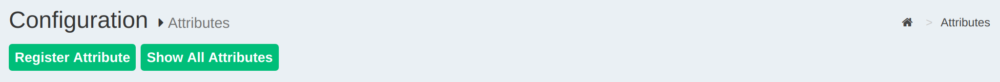
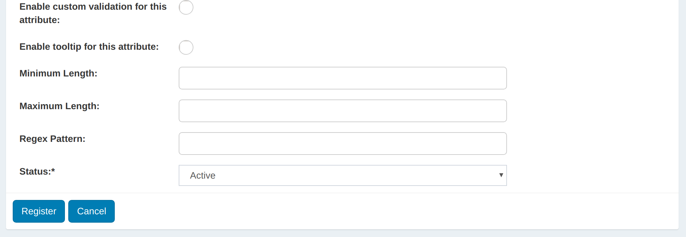

# Attributes

## Overview
Attributes are individual pieces of user data, like `uid` or `email`, that are required by applications in order to identify a user and grant access to protected resources. The user attributes that are available in your Gluu service can be found by navigating to `Configuration` > `Attributes`. 


The Gluu Server has a large LDAP tree which includes all standard attributes. It is not necessary for all of them to be *Active*. The
active LDAP trees can be sorted using the *Show only Active Attributes* link.



The Gluu Server administrator can make changes to attributes, such as changing their status to active/inactive, by clicking on a specific attribute.




## Custom Attributes
In order to create SSO to certain applications you may need to add custom attributes to your Gluu Server. Custom attributes can be added by following the instructions below: 

### Add the attribute to LDAP

#### OpenDJ

 - In OpenDJ, add custom attributes to `/opt/opendj/config/schema/77-customAttributes.ldif`
 - In the below example, `customTest` is our custom attribute :
 
    ```
    attributeTypes: ( 1.3.6.1.4.1.48710.1.3.1400 NAME 'customTest'
      DESC 'Custom Attribute' 
      EQUALITY caseIgnoreMatch 
      SUBSTR caseIgnoreSubstringsMatch 
      SYNTAX 1.3.6.1.4.1.1466.115.121.1.15 
      X-ORIGIN 'Gluu custom attribute' )
    ```

!!! Warning
    Spacing is extremely important here. There must be 2 spaces before and 1 after every entry (i.e. DESC), or your custom schema will fail to load properly.

  - Add custom attribute to the `gluuCustomPerson` objectClasses:
  
    ```
    objectClasses: ( 1.3.6.1.4.1.48710.1.4.101 NAME 'gluuCustomPerson'
     SUP ( top )
     AUXILIARY
     MAY ( customTest $ telephoneNumber $ mobile $ carLicense $ facsimileTelephoneNumber $ departmentNumber $ employeeType $ cn $ st $ manager $ street $ postOfficeBox $ employeeNumber $ preferredDeliveryMethod $ roomNumber $ secretary $ homePostalAddress $ l $ postalCode $ description $ title )
    ```

!!! Warning
    You cannot have line spaces between `attributeTypes:` or `objectClasses:`. This will cause failure in schema. Please check the error logs in /opt/opendj/logs/errors if you are experiencing issues with adding custom schema. This will help guide you on where there may be syntax errors.
    
 - [Restart](../operation/services.md#restart) the `opendj` service.
 
This creates the attribute in the local LDAP server. 

### Add the attribute to oxTrust
Now you need to register the new attribute in the Gluu Server GUI by navigating to `Configuration` > `Attributes`  and then click the `Register Attribute` button. 

The following screen will appear:


* _Name:_ This field defines the name of the custom attribute. The name must be unique in the Gluu Server LDAP tree.

* _SAML1 URI:_ This field can contain a SAML v1 supported nameformat for the new attribute. If this field is left blank the Gluu Server will automatically populate a value. 

* _SAML2 URI:_ This field can contain a SAML v2 supported nameformat for the new attribute. If this field is left blank the Gluu Server will automatically populate a value. 

* _Display Name:_ The display name can be anything that is human readable.

* _Type:_ Select what type of attribute is being added in this field. The Gluu Server supports four types of attributes: text, numeric, photo, and date. Choose the option that best applies. 

* _Edit Type:_ This field controls who can edit this attribute. If `user` is selected, this will enable each user to edit this attribute in their Gluu server user profile (assuming oxTrust is user facing, and the "User can edit own profile" feature has been enabled).

* _View Type:_ This field controls which type of user is allowed to view
  corresponding attribute at his/her "Profile" page of the web UI.

* _Multivalued:_ If the attribute contains more than one value, set this field to True. 

* _oxAuth claim name:_ If this attribute will be used as a 'claim' in your OpenID Connect service, add the name of the claim here. Generally, the name of the attribute == name of the claim.

* _SCIM Attributes:_ If the attribute is a part of your SCIM architecture, set this field to True.

* _Enable custom validation for this attribute:_ If you plan to set minimum and maximum lengths or a regex pattern, as described below, you will need to enable custom validation for this attribute. Otherwise you can leave this disabled. 

* _Enable tooltip for this attribute:_ This allows you to set a tool tip for the attribute. 

* _Minimum Length:_ This is the minimum length of a value associated with this attribute. 

* _Maximum Length:_ This is the maximum length of a value associated with this attribute. 

* _Regex Pattern:_ You can set a regex pattern to enforce proper formatting of an attribute. For example, you could set a regex expression for an email attribute like this: `^[A-Z0-9._%+-]+@[A-Z0-9.-]+\\.[A-Z]{2,6}$`. This would make sure that a value is added for the attribute only if it follows standard email formatting.

* _Status:_ Mark the attribute as Active so that it can be used in your federation service. Or leave choose Inactive to create the attribute and then you can activate it at a later date. 

Click register and now this new attribute should be available for release in your federation service. 

The default NameID for oxTrust generated SAML trust relationships is `transientID`. It's always a good idea to release the `transientID` as an attribute, as some SP's may not work otherwise. If there are other `NameID` requirements, a custom attribute must be created in oxTrust first before defining it as the `NameID`. Please review the [custom attributes](./attribute.md#custom-attributes) section of the docs to learn how to create custom attributes in oxTrust.

## SAML Attributes

In any SAML SSO transaction, your Gluu Server will need to release attributes about users to the target SP. Configuring your Gluu Server for SAML SSO is covered in the [SAML section of the documentation](./saml.md). 

## OpenID Connect Scopes

In OpenID Connect, scopes are used to group attributes and provide a human 
understandable description of the attributes. This improves usability when you need 
to prompt a person to approve the disclosure of attributes to a third party. Learn more about configuring your Gluu Server for OpenID Connect SSO in the [OpenID Connect section of the documentation](./openid-connect.md#scopes)
