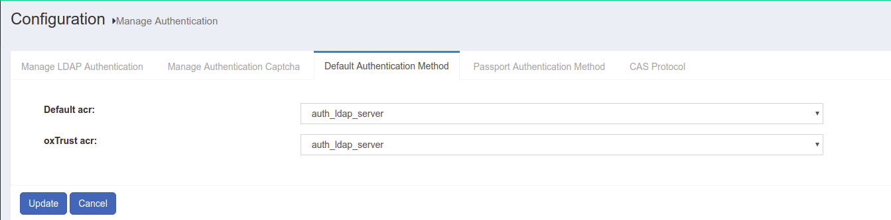

# Authentication Management
The Gluu Server includes a dedicated page where an adminstrator can define the backend LDAP/AD configuration for the organization. The `Manage Authentication` tab is accessible from the `Configuration` menu in the oxTrust GUI.

## Manage LDAP Authentication
The `Manage Authentication` page has two tabs: Manage LDAP Authentication 
and Default Authentication Method. 

|Field Name| Description|
-----------|-------------|
|Name|This field contains the name of the authentication server|
|Bind DN| The Username for the authentication server (local LDAP/remote LDAP/remote Active Directory) goes here|
|Max Connections| This option can be used to define the total number of simultaneous connections allowed for reading local LDAP/remote Active Directory/remote LDAP|
|Primary Key| This field contains the primary key to connect to the authentication server (i.e. SAMAccountName/uid/mail etc.)|
|Local Primary Key| This field contains the internal LDAP primary key of the Gluu Server. Generally the key is either the _uid_ or the _mail_|
|Server| The unique name of the authentication server and port number (i.e. auth.company.org:636) goes here|
|Base DN| Add base DNs in this field to allow the Gluu Server to connect and search the LDAP server. Every directory tree should be added separately using the _Add Base DN_ option|
|Use SSL| If the authentication server requires a secured port (i.e. 636) then this option should be activated using the check-box|
|Deactivate| This button _Deactivates/Activates_ the Gluu Server accessibility for authentication.|

## Default Authentication Method
This allows the Gluu Server administrator to select both the default authentication mode 
and level for person authentication. Both modes are set to "Default" until additional 
authentication mechanisms are enabled via [custom scripts](./custom-script.md).

Gluu Server uses oxAuth as the first step of authentication in all kind of SSO protocols ( OpenID Connect, SAML, CAS )

* Authentication mode: This mode defines the mode used for general authentication with Service Providers. The mode defined under this tab will not affect the users accessing the oxTrust administrator interface.
* oxTrust authentication mode: This mode is used when the user is accessing the oxTrust administrator interface using the gluu server hostname.
* Passport Support: This mode uses third-party authentication e.g. Google+, Twitter, Facebook to authenticate users in Gluu Server.
* Custom Script Authenticaiton: This mode uses custom script and enabled in the oxTrust Admin UI.
