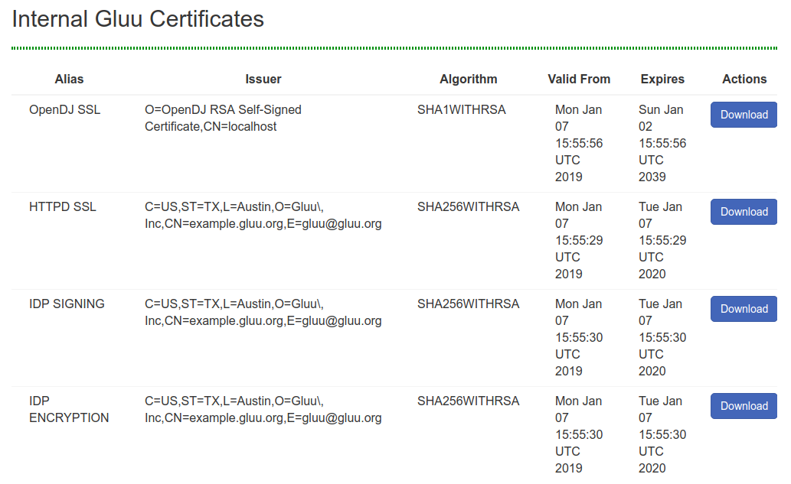

# Certificates 

Gluu Server components have cryptographic keys and X.509 certificates that are stored inside the
`chroot`. Details for certificates for each component are provided below. Certificates
are available in the `/etc/certs` folder.

|ASIMBA		    |Shibboleth	     |APACHE		 |OPENLDAP         |
|---------------|--------------- |---------------|---------------  |
|asimba.crt   	|shibIDP.crt	 |httpd.crt	     |openldap.crt	   |
|asimba.csr 	|shibIDP.csr	 |https.csr	     |openldap.csr	   |
|asimba.key 	|shibIDP.jks	 |httpd.key      |openldap.key	   |
|asimba.key.orig|shibIDP.key	 |httpd.key.orig |openldap.key.orig|
|asimba.pkcs12	|shibIDP.key.orig|		         |openldap.pem	   |
|asimbaIDP.jks	|shibIDP.pkcs  	 |               |		           |

The certificates for `Passport` authentication are `passport-rp.jks, passport-rp.pem, passport-rs.jks`. 

The SCIM certificate is named `scim-rs.jks` and the OTP certificate is named `otp_configuration.json`.

Additionally the following `json` files are available which are used in different custom scripts for multi-factor authentication.
 
* `cert_creds.json`    
* `duo_creds.json`    
* `gplus_client_secrets.json`     
* `otp_configuration.json`    
* `oxauth-keys.json`     
* `super_gluu_creds.json`   

## Certificates in oxTrust

Certificates commonly used for SSO typically have a short expiration date, and can now be easily viewed and downloaded in oxTrust. Navigate to `Configuration` > `Certificates` to access these certificates. 

The following are available:

- OpenDJ SSL   
- httpd SSL   
- IDP Signing   
- IDP Encryption   



# Updating Apache Certificate

The certificates must be manually updated from the `/etc/certs/` folder. 
    
There are many tools that can be used to update and renew certificates. By default Gluu uses OpenSSL. 
If you have questions about using other tools, like Let'sEncrypt, 
check the [Gluu support portal](http://support.gluu.org) for existing threads. 
If there is no existing information, sign up and open a ticket. 

!!! Warning
    The private key cannot be password protected, and the public key must be base64 X.509. 

!!! Note
    Please backup your full `/etc/certs` directory and `cacerts` file under `/opt/jdkx.y.z/jre/lib/security/` folder before updating certificates.

Please follow these steps shown below to update the Apache SSL cert:

- Save the latest SSL httpd key and certificate in the `/etc/certs` folder
- Rename them to `httpd.key` and `httpd.crt` respectively
- Import 'httpd.der' into the java keystore
/ Convertion to DER, command:<br/> `openssl x509 -outform der -in httpd.crt -out httpd.der`
    - Delete the existing certificate to avoid ambiguity due to presense of 2 different 
    certificates for the same entity after importing the new one:
       `/opt/jdkx.x.x.x/jre/bin/keytool -delete -alias <hostname_of_your_Gluu_Server>_httpd -keystore /opt/jdkx.x.x.x/jre/lib/security/cacerts -storepass changeit`
    - Import certificate in to Java Keystore(cacerts):
    <br/> `/opt/jdkx.x.x.x/jre/bin/keytool -importcert -file httpd.der -keystore /opt/jdkx.x.x.x/jre/lib/security/cacerts -alias <hostname_of_your_Gluu_Server>_httpd -storepass changeit`
- Restart LDAP server, apache2/httpd and Identity Services.
```
service solserver stop
service apache2/httpd stop
service oxauth stop
service identity stop
:
service solserver start
service apache2/httpd start
service oxauth start
service identity start
```

## Install Intermediate Certificates
Please follow the steps below to install intermediate certificates:

1. Log into your Gluu Server container.
2. Keep your intermediate certificate in the file `/etc/certs/`.
3. Modify `/etc/httpd/conf.d/https_gluu.conf`, and add<br/>
  `SSLCertificateChainFile /etc/certs/name_of_your_interm_root_cert.crt`.
4. Restart the service of the httpd server.
