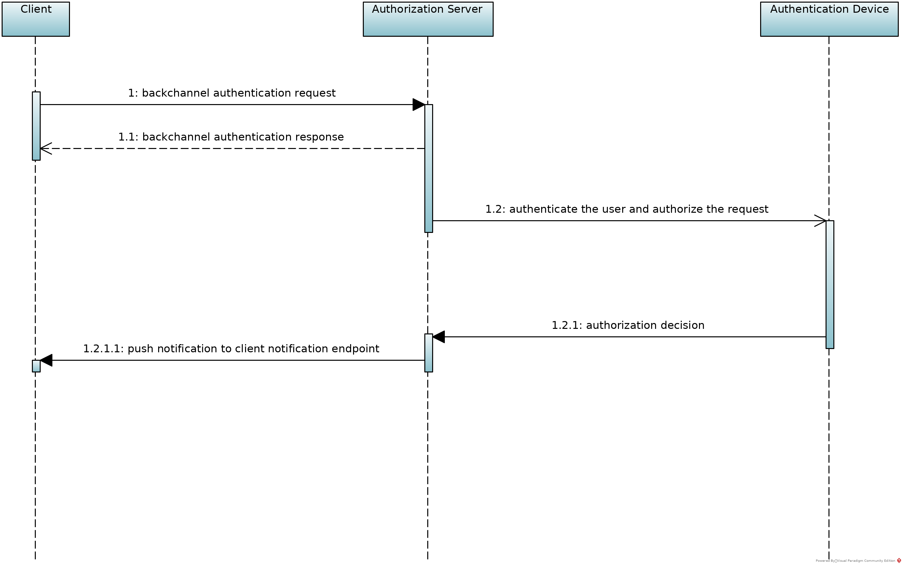
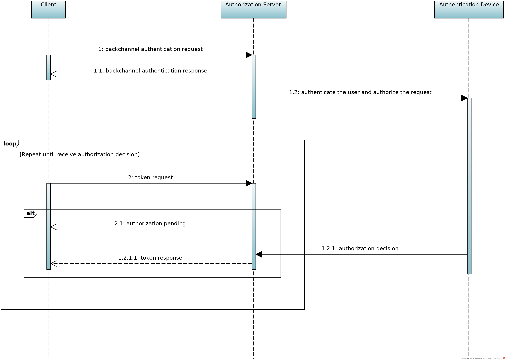

# OpenID Connect Client Initiated Backchannel Authentication Flow (CIBA)

OpenID Connect Client Initiated Backchannel Authentication Flow is an authentication flow
like OpenID Connect. However, unlike OpenID Connect, there is direct Relying Party to OpenID
Provider communication without redirects through the user's browser.

[OpenID Connect](https://openid.net/specs/openid-connect-core-1_0.html) allows Relying Parties
(RP) to authenticate their users for clients of all types, including browser-based JavaScript
and native mobile apps, to launch sign-in flows and receive verifiable assertions about the
identity of signed-in users.

In all of these flows initiated by the RP, the end-user interaction from the consumption
device is required and, they are based on HTTP redirection mechanisms. However, some use cases
not covered by these flows have been raised, where the RP needs to be the initiator of the
user authentication flow and end-user interaction from the consumption device is not needed.

Client Initiated Backchannel Authentication (CIBA) is a new authentication flow in which RPs,
that can obtain a valid identifier for the user they want to authenticate, will be able to
initiate an interaction flow to authenticate their users without having end-user interaction
from the consumption device. The flow involves direct communication from the Client to the
OpenID Provider without redirect through the user's browser (consumption device).

This specification does not change the semantics of the OpenID Connect Authentication flow.
It introduces a new endpoint to which the authentication request is posted. It introduces a
new asynchronous method for authentication result notification or delivery. It does not
introduce new scope values nor does it change the semantics of standard OpenID Connect
parameters.

As the user does not provide authentication credentials directly to the consumption device,
supporting this flow requires the to OP have some mechanism of initiating user authentication
out-of-band from the interaction with the consumption device.

For more information, see [https://openid.net/specs/openid-client-initiated-backchannel-authentication-core-1_0-ID1.html](https://openid.net/specs/openid-client-initiated-backchannel-authentication-core-1_0-ID1.html)

## Protocol Overview

Client Initiated Backchannel Authentication (CIBA) enables a Client to initiate the
authentication of an end-user by means of out-of-band mechanisms.

1. The Client makes an "HTTP POST" request to the Backchannel Authentication Endpoint to ask
for end-user authentication.

1. The OP will respond immediately with a unique identifier that identifies that
authentication while it tries to authenticate the user in the background.

1. The Client will receive the ID Token, Access Token and optionally Refresh Token by means
of either the Poll, Ping or Push modes, this choice must be established by the Client at
registration time.

    - *Poll Mode.* When configured in Poll mode, the Client will poll the token endpoint to
    get a response with the tokens.
    
    - *Ping Mode.* When configured in Ping mode, the OP will send a request to a callback URI
    previously registered by the Client with the unique identifier returned from the
    Backchannel Authentication Endpoint. Upon receipt of the notification, the Client makes a
    request to the token endpoint to obtain the tokens.
    
    - *Push Mode.* When configured in Push mode, the OP will send a request with the tokens
    to a callback URI previously registered by the Client.

It's handy to know some CIBA terminology:

- *Consumption Device (CD).* The Consumption Device is the device that helps the user consume
the service. In the CIBA use case, the user is not necessarily in control of the CD. For
example, the CD may be in the control of an RP agent (e.g. at a bank teller) or may be an RP
controlled device (e.g. a petrol pump).

- *Authentication Device (AD).* The device on which the user will authenticate and authorize
the request, often a smartphone.

## Discovery Metadata

- *Grant Type.* This specification introduces the CIBA grant type (an extension grant type
as defined by [Section 4.5 of OAuth 2.0](https://tools.ietf.org/html/rfc6749#section-4.5))
with the value: ```urn:openid:params:grant-type:ciba```

- *OpenID Provider Metadata.* The following authorization server metadata parameters are
introduced for OPs publishing their support of the CIBA flow:

    - *backchannel_authentication_endpoint*. URL of the OP's Backchannel Authentication
    Endpoint.
    
    - *backchannel_token_delivery_modes_supported.* JSON array containing one or more of the
    following values: poll, ping and push.
    
    - *backchannel_authentication_request_signing_alg_values_supported.* JSON array
    containing a list of the JWS signing algorithms (alg values) supported by the OP for
    signed authentication requests.
    
    - *backchannel_user_code_parameter_supported.* Boolean value specifying whether the OP
    supports use of the user_code parameter.

Example configuration request using oxauth-client:

``` 
OpenIdConfigurationClient client = new OpenIdConfigurationClient(configurationEndpoint);
OpenIdConfigurationResponse response = client.execOpenIdConfiguration();
```

Configuration Request:
 
```
GET /.well-known/openid-configuration HTTP/1.1
Host: ce.gluu.info
```

Configuration Response:

```
HTTP/1.1 200
Content-Length: 6758
Content-Type: application/json
Server: Jetty(9.4.11.v20180605)

{
  .....
  "backchannel_authentication_endpoint" : "https://ce.gluu.info:8443/restv1/bc-authorize",
  "backchannel_token_delivery_modes_supported" : [ "poll", "ping", "push" ],
  "backchannel_authentication_request_signing_alg_values_supported" : [
    "RS512",
    "ES256",
    "ES384",
    "ES512",
    "ES512",
    "PS256",
    "PS384",
    "PS512"
  ],
  "backchannel_user_code_parameter_supported" : true,
  "grant_types_supported" : [
    .....
    "urn:openid:params:grant-type:ciba"
  ],
  .....
}
```

## Dynamic Client Registration

Clients registering to use CIBA must indicate a token delivery mode. When using the *ping*
or *poll* mode, the Client must include the CIBA grant type in the *grant_types* field. When
using the *ping* or *push* mode, the Client must register a client notification endpoint.
Clients intending to send signed authentication requests must register the signature
algorithm that will be used.

The following parameters are introduced by this specification:

- *backchannel_token_delivery_mode.* One of the following values are required: poll, ping
or push.

- *backchannel_client_notification_endpoint.* Required if the token delivery mode is set to
ping or push. This is the endpoint to which the OP will post a notification after a
successful or failed end-user authentication. It must be an HTTPS URL.

- *backchannel_authentication_request_signing_alg.* The JWS algorithm alg value that the
Client will use for signing authentication request. When omitted, the Client will not send
signed authentication requests.

- *backchannel_user_code_parameter.* Boolean value specifying whether the Client supports
the user_code parameter. If omitted, the default value is false.

Example registration request using oxauth-client:

```
RegisterRequest registerRequest = new RegisterRequest(ApplicationType.WEB, "oxAuth test app", null);
registerRequest.setGrantTypes(Arrays.asList(GrantType.CIBA));

registerRequest.setBackchannelTokenDeliveryMode(BackchannelTokenDeliveryMode.PUSH);
registerRequest.setBackchannelClientNotificationEndpoint(backchannelClientNotificationEndpoint);
registerRequest.setBackchannelAuthenticationRequestSigningAlg(AsymmetricSignatureAlgorithm.RS256);
registerRequest.setBackchannelUserCodeParameter(true);

RegisterClient registerClient = new RegisterClient(registrationEndpoint);
registerClient.setRequest(registerRequest);
RegisterResponse registerResponse = registerClient.exec();
```

Registration Request:

```
POST /restv1/register HTTP/1.1
Content-Type: application/json
Accept: application/json
Host: ce.gluu.info

{
  "grant_types" : [ "urn:openid:params:grant-type:ciba" ],
  "application_type" : "web",
  "backchannel_client_notification_endpoint" : "https://ce.gluu.info:8443/oxauth-ciba-client-test/client-notification-endpoint",
  "backchannel_user_code_parameter" : true,
  "backchannel_authentication_request_signing_alg" : "RS256",
  "client_name" : "oxAuth test app",
  "backchannel_token_delivery_mode" : "push"
}
```

Registration Response:

```
HTTP/1.1 200
Cache-Control: no-store
Content-Length: 1561
Content-Type: application/json
Pragma: no-cache
Server: Jetty(9.4.11.v20180605)

{
    "application_type": "web",
    "registration_client_uri": "https://ce.gluu.info:8443/restv1/register?client_id=4251a8c4-69e3-4d3e-a807-758ecbc51118",
    "registration_access_token": "e9ecb1a1-001c-4d04-b2f2-b42e35664975",
    "client_id": "4251a8c4-69e3-4d3e-a807-758ecbc51118",
    "token_endpoint_auth_method": "client_secret_basic",
    "scope": "profile openid permission super_gluu_ro_session work_phone phone address org_name clientinfo email user_name test oxd uma_protection",
    "backchannel_user_code_parameter": true,
    "client_secret": "f101f27b-0f18-4bff-9470-c33361f28ff9",
    "client_id_issued_at": 1574831171,
    "backchannel_authentication_request_signing_alg": "RS256",
    "client_name": "oxAuth test app",
    "backchannel_token_delivery_mode": "push",
    "id_token_signed_response_alg": "RS256",
    "grant_types": ["urn:openid:params:grant-type:ciba"],
    "subject_type": "pairwise",
    "client_secret_expires_at": 1574917571,
    "backchannel_client_notification_endpoint": "https://ce.gluu.info:8443/oxauth-ciba-client-test/client-notification-endpoint",
    "access_token_signing_alg": "RS256",
}
```

## Poll, Ping and Push Modes

This specification allows the Client to get the authentication result in three ways: poll,
ping or push.

In the *Push* mode, the OP will post the full authentication result to the Client.



In the *Ping* mode, the OP will post the unique identifier of the authentication session to
the Client, the Client will then retrieve the authentication result from the token endpoint
using the new grant type.


In the *Poll* mode, the authentication result is retrieved by the Client by polling the OP's
token endpoint using the new grant type.

