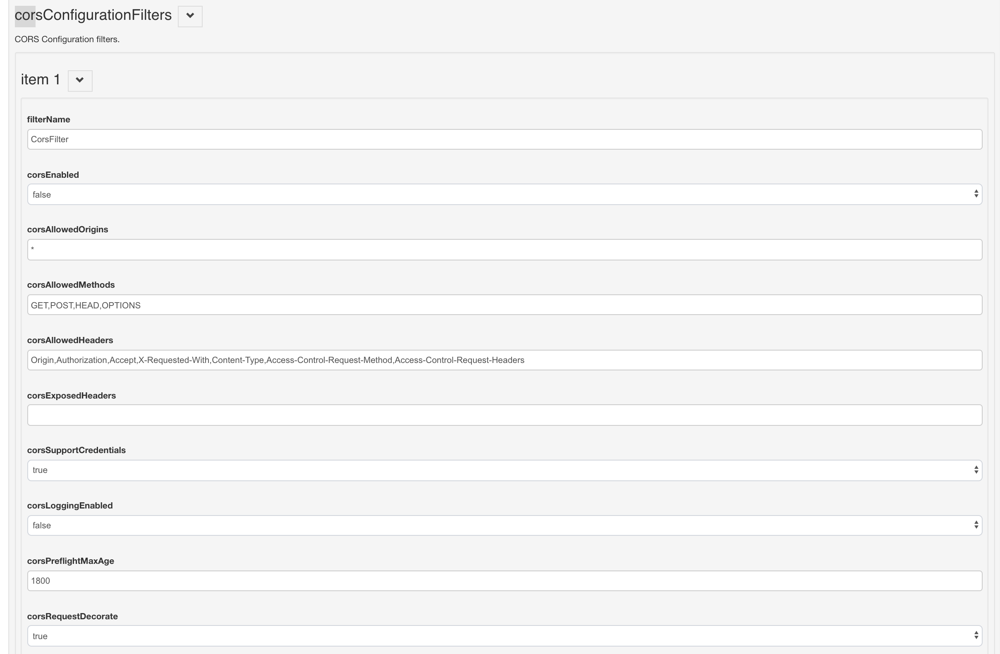

# CORS Filter

## Overview

CORS Filter is an implementation of the [W3C's Cross-Origin Resource Sharing (CORS) specification](http://www.w3.org/TR/cors/).

The CORS Filter works by adding required `Access-Control-*` headers to the `HttpServletResponse` object. The filter also protects against HTTP response splitting. If a request is invalid or not permitted, the request is rejected with HTTP status code 403 (Forbidden). 

This flowchart demonstrates request processing by this filter:

 

The minimal configuration required to use the CORS Filter is shown below, and is already added to the `web.xml` in `oxauth.war`. The filter name is `org.gluu.oxauth.filter.CorsFilter`.

```
    <filter>
        <filter-name>CorsFilter</filter-name>
        <filter-class>org.gluu.oxauth.filter.CorsFilter</filter-class>
    </filter>
    <filter-mapping>
        <filter-name>CorsFilter</filter-name>
        <url-pattern>/.well-known/*</url-pattern>
    </filter-mapping>
    <filter-mapping>
        <filter-name>CorsFilter</filter-name>
        <url-pattern>/seam/resource/restv1/oxauth/*</url-pattern>
    </filter-mapping>
    <filter-mapping>
        <filter-name>CorsFilter</filter-name>
        <url-pattern>/opiframe</url-pattern>
    </filter-mapping>
```

## Configure CORS

CORS can be configured in oxTrust. Follow these steps:  

1. Log in to oxTrust UI
1. Navigate to `Configuration` > `JSON Configuration` > `oxAuth Configuration`
1. Scroll down to find `corsConfigurationFilters`
1. If `corsConfigurationFilters` is hidden or collapsed, click the arrow to expand.

    

1. This will display the CORS Configuration Filter parameters, as shown below:

    

1. Define and configure the parameters

1. Click `save` at the bottom of the page.

1. [Restart](../operation/services.md) the `oxauth` service.

### Parameters supported by CORS Filters

CORS Filter supports the following initialization parameters:

| Attribute | Description |
| ----------| ------------|
| corsAllowedOrigins | A list of origins that are allowed to access the resource. A `*` can be specified to enable access to resource from any origin. Otherwise, a whitelist of comma separated origins can be provided. Eg: `http://www.w3.org, https://www.apache.org.` Defaults: `*` (Any origin is allowed to access the resource). |
| corsAllowedMethods | A comma separated list of HTTP methods that can be used to access the resource, using cross-origin requests. These are the methods which will also be included as part of Access-Control-Allow-Methods header in pre-flight response. Eg: `GET, POST`. Defaults: `GET, POST, HEAD, OPTIONS` |
| corsExposedHeaders | A comma separated list of request headers that can be used when making an actual request. These headers will also be returned as part of Access-Control-Allow-Headers header in a pre-flight response. Eg: `Origin,Accept`. Defaults: `Origin, Accept, X-Requested-With, Content-Type, Access-Control-Request-Method, Access-Control-Request-Headers` |
| corsSupportCredentials | A flag that indicates whether the resource supports user credentials. This flag is exposed as part of `Access-Control-Allow-Credentials` header in a pre-flight response. It helps browser determine whether or not an actual request can be made using credentials. Defaults: `true` |
| corsLoggingEnabled | Value to enable logging, Setting the value to `False` will disable logging. Defaults: `true`
| corsPreflightMaxAge | The duration in seconds the browser is allowed to cache the result of the pre-flight request. This will be included as part of the `Access-Control-Max-Age` header in the pre-flight response. A negative value will prevent  the CORS Filter from adding this response header to the pre-flight response. Defaults: `1800` |
| corsRequestDecorate | A flag to control if CORS specific attributes should be added to the HttpServletRequest object. Defaults: `true` |
