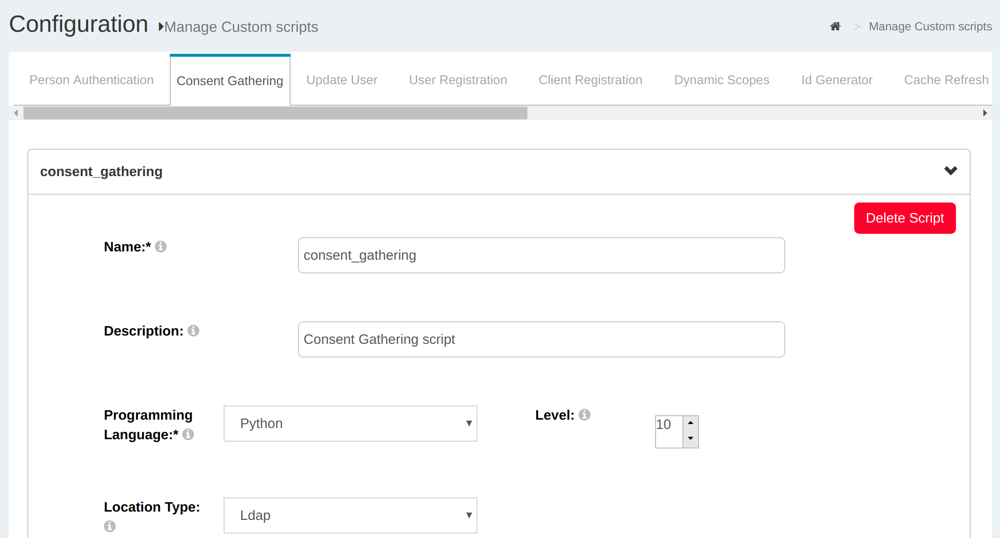
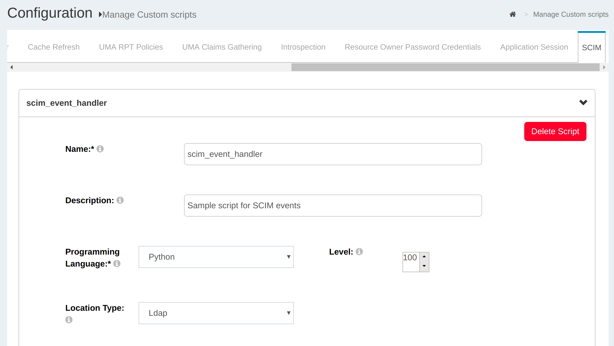

# Interception Scripts

## Overview
Interception scripts allow you to implement custom business logic without having to fork the code. Each type of interception script is described by an interface (i.e. which methods are required). These scripts give you quite a bit of flexibility to do things that are specific to your organizational requirements in a way that is upgrade-proof. 

One of the most most commonly used interception scripts is for person authentication.  These scripts enable you to implement a complex multi-step authentication workflow. You can call external API's, or adapt the number of steps based on the risk of the authentication event. For example, if you call a fraud detection API in step one that indicates unacceptable risk, you could add a second step (i.e. present another page that asks for a stronger authentication credential). 

In addition to person authentication, many interception scripts are available. Forking the code makes your instance hard to upgrade. If you need to fork the code to accomplish something, you should open a support ticket and suggest an interception script which would help you avoid the fork.  

The web interface for Custom Scripts can be accessed by navigating to `Configuration` > `Manage Custom Scripts`.

### Jython
Interception scripts are written in [Jython](http://www.jython.org).  An interpreted language was chosen because it's easier for system administrators to understand and modify. Java can be a black box for administrators--scripts help make the business logic more visible, which aids in troubleshooting. 

Jython enables developers to import either Java or Python classes. So if you really hate writing Python, while the syntax of the script requires Python, you can write most of the functionality in Java, keeping the Python code to a minimum. 

If you import Python classes, they must be "pure python." For example, you couldn't import a class that wraps C libraries.

### Methods
There are three methods that inherit a base interface:

|Inherited Methods|Method description|
|-----------------|------------------|
|`def init(self, configurationAttributes)` |This method is only called once during the script initialization. It can be used for global script initialization, initiate objects etc|
|`def destroy(self, configurationAttributes)` |This method is called once to destroy events. It can be used to free resource and objects created in the `init()` method|
|`def getApiVersion(self)` |The `getApiVersion` method allows API changes in order to do transparent migration from an old script to a new API. Currently all scripts should return `1`|

The `configurationAttributes` parameter is `java.util.Map<String, SimpleCustomProperty>` with properties specified in `oxConfigurationProperty` attributes.

The script manager only loads enabled scripts. Hence, after enabling or disabling a
script, the script manager should trigger an event to either load or
destroy a script, respectively. All scripts are stored in LDAP in the
`ou=scripts,o=<org_inum>,o=gluu` branch.

Here is a sample entry:

```
    dn: inum=@!1111!031C.4A65,ou=scripts,o=@!1111,o=gluu
    objectClass: oxCustomScript
    objectClass: top
    description: <custom_script_description>
    displayName: <display_name>
    gluuStatus: true
    inum: @!1111!031C.4A65
    oxLevel: <priority>
    oxModuleProperty: {"value1":"module_property_name","value2":"module_property_value","description":""}
    oxConfigurationProperty: {"value1":"configuration_property_name","value2":"configuration_property_value","description":""}
    oxRevision: <revision>
    oxScript: <custom_script>
    oxScriptType: <script_type>
    programmingLanguage: python
```

The script manager reloads scripts automatically without needing to
restart the application once `oxRevision` is increased.

### Script Naming
New custom scripts should be given a descriptive `displayName`, as that is how they are listed in oxTrust. The `displayName` is limited to 60 characters.  

### Logs
The log files regarding interception scripts are stored in the
`oxauth.log` file. The logs are separated according to the module they
affect. The oxAuth custom script logs are stored in `oxauth_script.log`
and the oxTrust custom script logs are stored in the
`oxtrust_script.log`. Please refer to these log files to troubleshoot errors in
the interception scripts or following the workflow of the script.

!!! Note 
    A `print` statement may not work on some environments if the `PYTHON_HOME` environment variable is not set. Make sure it points to a valid python installation.

More details about Logs can be found in the [Log Management](../operation/logs.md) portion of the docs.

## Person Authentication     
An authentication script enables you to customize the user experience for authentication. For example, you can write a script that
enables a two-factor authentication mechanism like Duo Security or FIDO U2F tokens. Or you could call external security services like fraud detection or DDoS protection.  

The authentication interception script extends the base script type with the `init`, `destroy` and `getApiVersion` methods but also adds the following methods:

|Method|`isValidAuthenticationMethod(self, usageType, configurationAttributes)`|
|---|---|
|**Description**|This method is used to check if the authentication method is in a valid state. For example we can check there if a 3rd party mechanism is available to authenticate users. As a result it should either return `True` or `False`|
|Method Parameter|`usageType` is `org.xdi.model.AuthenticationScriptUsageType`<br/>`configurationAttributes` is `java.util.Map<String, SimpleCustomProperty>`|

|Method|`def getAlternativeAuthenticationMethod(self, usageType, configurationAttributes)`|
|---|---|
|**Description**|This method is called only if the current authentication method is in an invalid state. Hence authenticator calls it only if `isValidAuthenticationMethod` returns False. As a result it should return the reserved authentication method name|
|Method Parameter|`uageType` is `org.xdi.model.AuthenticationScriptUsageType`<br/>`configurationAttributes` is `java.util.Map<String, SimpleCustomProperty>`|

|Method|`def authenticate(self, configurationAttributes, requestParameters, step)`|
|---|---|
|**Description**|This method is the key method within the person authentication script. It checks if the user has passed the specified step or not. As a result it should either return `True` or `False`|
|Method Parameter|`requestParameters` is `java.util.Map<String, String[]>`<br/>`step` is java integer<br/>`configurationAttributes` is `java.util.Map<String, SimpleCustomProperty>`|

|Method|`def prepareForStep(self, configurationAttributes, requestParameters, step)`|
|---|---|
|**Description**|This method can be used to prepare variables needed to render the login page and store them in an according event context. As a result it should either return `True` or `False`|
|Method Parameter|`requestParameters` is `java.util.Map<String, String[]>`<br/>`step` is a java integer<br/>`configurationAttributes` is `java.util.Map<String, SimpleCustomProperty>`|

|Method|`def getCountAuthenticationSteps(self, configurationAttributes)`|
|---|---|
|**Description**|This method should return an integer value with the number of steps in the authentication workflow|
|Method Parameter|`configurationAttributes` is `java.util.Map<String, SimpleCustomProperty>`|

|Method|`def getExtraParametersForStep(self, configurationAttributes, step)`|
|---|---|
|**Description**|This method provides a way to notify the authenticator that it should store specified event context parameters event in the oxAuth session. It is needed in a few cases, for example when an authentication script redirects the user to a 3rd party authentication system and expects the workflow to resume after that. As a result it should return a java array of strings|
|Method Parameter|`configurationAttributes` is `java.util.Map<String, SimpleCustomProperty>`<br/>`step` is a java integer|

|Method|`def getPageForStep(self, configurationAttributes, step)`|
|---|---|
|**Description**|This method allows the admin to render a required page for a specified authentication step. It should return a string value with a path to an XHTML page. If the return value is empty or null, the authenticator should render the default log in page `/login.xhtml`|
|Method Parameter|`configurationAttributes` is `java.util.Map<String, SimpleCustomProperty>`<br/>`step` is a java integer|

|Method|`def logout(self, configurationAttributes, requestParameters)`|
|---|---|
|**Description**|This method is not mandatory. It can be used in cases when you need to execute specific logout logic within the authentication script when oxAuth receives an end session request. Also, it allows oxAuth to stop processing the end session request workflow if it returns `False`. As a result it should either return `True` or `False`|
|Method Parameters|`configurationAttributes` is `java.util.Map<String, SimpleCustomProperty>`<br/>`requestParameters` is `java.util.Map<String, String[]>`|

Every deployment of the Gluu Server includes a number of pre-written authentication scripts out-of-the-box. Learn more in the [authentication guide](../authn-guide/intro.md). 

For a complete list of pre-written, open source authentication scripts, view our [server integrations](https://github.com/GluuFederation/oxAuth/tree/master/Server/integrations). 

- View a [sample Authentication Script](./sample-authentication-script.py).    

## Consent Gathering
OAuth 2.0 allows providers to prompt users for consent before releasing their personal information to a client (application). The standard consent process is binary: approve or deny. Using the consent gathering interception script, the consent flow can be customized to meet unique business requirements, for instance to support payment authorization, where you need to present transactional information, or where you need to step-up authentication to add security. 

Consent Gathering can be enabled via oxTrust UI as shown below 



Users will be prompted for consent as below.


- view a [sample Consent Gathering Script](https://github.com/GluuFederation/oxAuth/blob/master/Server/integrations/authz/ConsentGatheringSample.py)

## Update User     

oxTrust allows an admin to add and modify users which belong to groups. In order to simplify this process and apply repeating actions, oxTrust supports an Update User script. In this script it is possible to modify a person entry before it is stored in LDAP.

This script type adds only one method to the base script type:

|Method|`def updateUser(self, user, persisted, configurationAttributes)`|
|---|---|
|**Description**|This method updates the user|
|Method Parameter|`user` is `org.gluu.oxtrust.model.GluuCustomPerson`<br/>persisted is a boolean value to specify the operation type: add/modify<br/>`configurationAttributes` is `java.util.Map<String, SimpleCustomProperty>`|

This script can be used in an oxTrust application only.

- [Sample Update User Script](./sample-update-user-script.py)

## User Registration      

oxTrust allows users to perform self-registration. In order to control/validate user registrations there is the user registration script type.

This script type adds three methods to the base script type:

|Methods|`def initRegistration(self, user, requestParameters, configurationAttributes)`<br/>`def preRegistration(self, user, requestParameters, configurationAttributes)`<br/>`def postRegistration(self, user, requestParameters, configurationAttributes)`|
|---|---|
|**Description**|This method enables/disables user account based on the custom property's value|
|Method Parameters|`user` is `org.gluu.oxtrust.model.GluuCustomPerson`<br/>`requestParameters` is `java.util.Map<String, String[]>`<br/>`configurationAttributes` is `java.util.Map<String, SimpleCustomProperty>`|
|Custom Property|`enable_user`--> defaults to `false`|
|Description|It controls whether or not this user account will be ready for loggin into the Gluu Server CE instance|

The methods are executed in the following order:

|Order|Method|Expected Return|
|-----|------|-----------|
|First|`initRegistration()`|True/False|
|Second|`preRegistration()`|True/False|
|Third|`postRegistration()`|True/False|

First oxTrust executes the `initRegistration` method to do an initial
user entry update. The `preRegistration` method is called before storing
the user entry in LDAP. Hence in this script it is possible to validate
the user entry. The `postRegistration` method is called after
successfully storing the user entry in LDAP. In this method, for
example, the script can send an e-mail or send notifications to other
organization systems about the new user entry.

- [Sample User Registration Script](./sample-user-registration-script.py)

## Client Registration      

oxAuth implements the [OpenID Connect dynamic client
registration](https://openid.net/specs/openid-connect-registration-1_0.html)
specification. All new clients have the same default access scopes and
attributes except password and client ID. The Client Registration script
allows an admin to modify this limitation. In this script it is possible
to get a registration request, analyze it, and apply customizations to
registered clients. For example, a script can give access to specified
scopes if `redirect_uri` belongs to a specified service or domain.

This script type adds only one method to the base script type:

|Method|`def updateClient(self, registerRequest, client, configurationAttributes)`|
|---|---|
|**Method Parameter**|`registerRequest` is `org.xdi.oxauth.client.RegisterRequest`<br/>`client` is `org.xdi.oxauth.model.registration.Client`<br/>`configurationAttributes` is `java.util.Map<String, SimpleCustomProperty>`|

This script can be used in an oxAuth application only.

- [Sample Client Registration Script](./sample-client-registration-script.py)


## Dynamic Scopes      
The dynamic scope custom script allows to generate list of claims (and their values) on the fly, depending on cirtumstances like id of client requesting it, logged user's session parameters, values of other user's attributes, results of some caclucations implementing specific buisness logic and/or requests to remote APIs or databases. Claims are then returned the usual way in a response to a call to the `userinfo endpoint`. 

Two parameters are passed to the script:

- `dynamicScopeContext` is [org.xdi.oxauth.service.external.context.DynamicScopeExternalContext class](https://github.com/GluuFederation/oxAuth/blob/master/Server/src/main/java/org/xdi/oxauth/service/external/context/DynamicScopeExternalContext.java) 
- `configurationAttributes` is java.util.Map<String, SimpleCustomProperty> dictionary carring script's custom properties

In order to configure a dynamic scope next steps are required:

- Dynamic scope custom script must be configured and enabled at "Manage custom scripts" page, "Dynamic scopes" tab
- A scope has to be defined at the "OpenID Connect -> Scopes" page
  - Scope's type must be set to "Dynamic"
  - Corresponding dynamic script must be linked to that scope (Add dynamic script button)
- The scope must be added to the client which will be using it at the "OpenID Connect -> Clients" page (using the "Add Scope" button), and the scope must be included by the client in "scope=" url query parameter

More detailed explanation about adding scopes can be found under Openid [scopes](../admin-guide/openid-connect/#scopes)

- [Sample Dynamic Scope Script](./sample-dynamic-script.py)

## ID Generator       

By default oxAuth/oxTrust uses an internal method to generate unique
identifiers for new person/client, etc. entries. In most cases the
format of the ID is:

`'!' + idType.getInum() + '!' + four_random_HEX_characters + '.' + four_random_HEX_characters.`

The ID generation script enables an admin to implement custom ID
generation rules.

This script type adds only one method to the base script type:

|Method|`def generateId(self, appId, idType, idPrefix, configurationAttributes)`|
|---|---|
|**Method Parameter**|`appId` is application ID<br/>`idType` is ID Type<br/>`idPrefix` is ID Prefix<br/>`user` is `org.gluu.oxtrust.model.GluuCustomPerson`<br/>`configurationAttributes` is `java.util.Map<String, SimpleCustomProperty>`|

This script can be used in an oxTrust application only.

- [Sample ID Generation Script](./sample-id-generation-script.py)      

## Cache Refresh       

In order to integrate your Gluu instance with backend LDAP servers handling authentication in your existing network environment, oxTrust provides a mechanism called [Cache Refresh](../user-management/ldap-sync.md#ldap-synchronization) to copy user data to the Gluu Server's local LDAP server. During this process it is possible
to specify key attribute(s) and specify attribute name transformations.
There are also cases when it can be used to overwrite attribute values
or to add new attributes based on other attribute values.

This script type adds only one method to the base script type:

|Method|`def updateUser(self, user, configurationAttributes)`|
|---|---|
|**Method Parameter**|`user` is `org.gluu.oxtrust.model.GluuCustomPerson`<br/>`configurationAttributes` is `java.util.Map<String, SimpleCustomProperty>`|

This script can be used in an oxTrust application only.

- [Sample Cache Refresh Script](./sample-cache-refresh-script.py)

 
## UMA 2 RPT Authorization Policies     

This is a special script for UMA. It allows an admin to protect UMA
scopes with policies. It is possible to add more than one UMA policy to
an UMA scope. On requesting access to a specified resource, the
application should call specified UMA policies in order to grant or deny
access.

This script type adds only one method to the base script type:

|Method|`def authorize(self, authorizationContext, configurationAttributes)`|
|---|---|
|**Method Parameter**|`authorizationContext` is `org.xdi.oxauth.service.uma.authorization.AuthorizationContext`<br/>`configurationAttributes` is `java.util.Map<String, SimpleCustomProperty>`|

This script can be used in an oxAuth application only.

- [Sample RPT Authorization Policy Script](./sample-uma-authorization-script.py)

## UMA 2 Claims-Gathering     

This is a special script for UMA 2. It allows an admin to code logic for gathering additional claims (required by UMA RPT Authorization Policy).

This script can be used in an oxAuth application only.

- [Sample UMA2 Claims-Gathering Script](./sample-uma-claims-gathering.py)


## Application Session Management      

This script allows an admin to notify 3rd party systems about requests
to end an OAuth session. This method is triggered by an oxAuth call to
the `end_session` endpoint. It's possible to add multiple scripts with
this type. The application should call all of them according to the
level.

This script type adds only one method to the base script type:

|Method|`def endSession(self, httpRequest, authorizationGrant, configurationAttributes)`|
|---|---|
|**Method Parameter**|`httpRequest` is `javax.servlet.http.HttpServletRequest`<br/>`authorizationGrant` is `org.xdi.oxauth.model.common.AuthorizationGrant`<br/>`configurationAttributes` is `java.util.Map<String, SimpleCustomProperty>`|

This script can be used in an oxAuth application only.

- [Sample Application Session Management Script](./sample-application-session-script.py)

[pem]: https://en.wikipedia.org/wiki/Privacy-enhanced_Electronic_Mail "Privacy-enhanced Electronic Mail"

## SCIM

SCIM script allows you to execute custom logic when certain SCIM API operations are invoked. Particularly for create, update, and delete 
 users and groups, custom code can be called just before and after data is persisted to LDAP.

To enable this feature, SCIM script needs to be enabled from the SCIM tab:

1. Click on `Manage Custom Scripts` > `SCIM`

1. Click on `Enabled` check box

1. Click on `update` at the bottom of the page



More on SCIM can be found [here](../user-management/scim2.md)

- [SCIM sample script to extend default logic](https://github.com/GluuFederation/oxExternal/blob/master/scim_event_handler/sample/SampleScript.py)

## Introspection

Introspection scripts allows to modify response of Introspection Endpoint ([spec](https://tools.ietf.org/html/rfc7662)).

The introspection interception script extends the base script type with the `init`, `destroy` and `getApiVersion` methods but also adds the following method(s):

|Method|`def modifyResponse(self, responseAsJsonObject, context)`|
|---|---|
|**Method Parameter**|`responseAsJsonObject` is `org.codehaus.jettison.json.JSONObject`<br/>`context` is ` org.xdi.oxauth.service.external.context.ExternalIntrospectionContext`|

Snippet
```
    # Returns boolean, true - apply introspection method, false - ignore it.
    # This method is called after introspection response is ready. This method can modify introspection response.
    # Note :
    # responseAsJsonObject - is org.codehaus.jettison.json.JSONObject, you can use any method to manipulate json
    # context is reference of org.xdi.oxauth.service.external.context.ExternalIntrospectionContext (in https://github.com/GluuFederation/oxauth project, )
    def modifyResponse(self, responseAsJsonObject, context):
        responseAsJsonObject.put("key_from_script", "value_from_script")
        return True
```

Full version of introspection script example can be found [here](https://github.com/GluuFederation/community-edition-setup/blob/version_4.0/static/extension/introspection/introspection.py). 

It is also possible to run introspection script during `access_token` creation as JWT. It can be controlled by `run_introspection_script_before_access_token_as_jwt_creation_and_include_claims` client property which is set to false by default.

If `run_introspection_script_before_access_token_as_jwt_creation_and_include_claims` set to true and `access_token_as_jwt` set to true then introspection script will be run before JWT (`access_token`) is created and all json values will be transfered to JWT. Also `context` inside script has additional method which allows to cancel transfering of claims if needed `context.setTranferIntrospectionPropertiesIntoJwtClaims(false)` 

## Resource Owner Password Credentials

Resource Owner Password Credentials script allows to modify behavior of Resource Owner Password Credentials Grant.

Script is invoked after normal authentication and can either leave current result or change it - authenticate if not authenticated - it should return `True` and optionally set user (via `context.setUser(user)`) 

Script extends the base script type with the `init`, `destroy` and `getApiVersion` methods but also adds the following method(s):

|Method|`def authenticate(self, context)`|
|---|---|
|**Method Parameter**|`context` is `org.xdi.oxauth.service.external.context.ExternalResourceOwnerPasswordCredentialsContext`|

Snippet
```
    # Returns boolean, true - authenticate user, false - ignore script and do not authenticate user.
    # This method is called after normal ROPC authentication. This method can cancel normal authentication if it returns false and sets `context.setUser(null)`.
    # Note :
    # context is reference of org.xdi.oxauth.service.external.context.ExternalResourceOwnerPasswordCredentialsContext#ExternalResourceOwnerPasswordCredentialsContext (in https://github.com/GluuFederation/oxauth project, )
    def authenticate(self, context):
        if (context.getHttpRequest().getParameterValues("device_id")[0] == "device_id_1"):
            return True
        return False
```

Full version of script example can be found [here](https://github.com/GluuFederation/community-edition-setup/blob/version_4.0/static/extension/resource_owner_password_credentials/resource_owner_password_credentials.py). 
