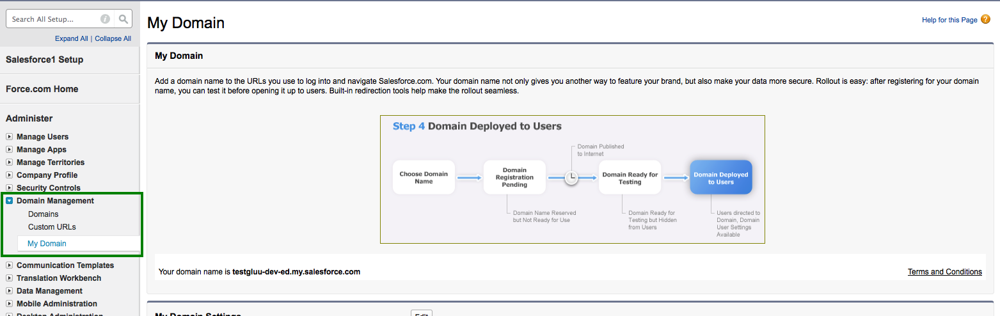

# Integration Guide

!!! Attention
    The official support end-of-life (EOL) date for Gluu Server 2.4.4 is December 31, 2018. Starting January 1, 2019, no further security updates or bug-fixes will be provided for Gluu Server 2.X. We strongly recommend [upgrading](https://gluu.org/docs/ce/upgrade/) to the newest version.

## Dropbox SSO with Gluu Server
This document is a step-by-step guide to setting up Dropbox SSO in Gluu Server.
This SSO requires setting a custom `nameid` called `emailnid`.

### Custom NameID
Please see [this doc](./attribute.md) on how to create custom attributes.

The new attribute screen should look like the screenshot below


The custom `nameid` needs to be defined in the `attribute-resolver` template file.

* Please edit the `attribute-resolver.xml.vm` file  under the `/opt/tomcat/conf/shibboleth2/idp` folder

* Add the `$attribute.name.equals('emailnid')` with the existing *#if( ! ($attribute.name.equals('transientId')* to look like the snippet below

```
#if( ! ($attribute.name.equals('transientId') or $attribute.name.equals('emailnid') ) ) 
```

* Add `nameid` definition 

```
 <resolver:AttributeDefinition id="emailnid"
                                xsi:type="Simple"
                                xmlns="urn:mace:shibboleth:2.0:resolver:ad"
                                sourceAttributeID="mail">
                        <resolver:Dependency ref="siteLDAP" />
                        <resolver:AttributeEncoder xsi:type="SAML2StringNameID"
                                xmlns="urn:mace:shibboleth:2.0:attribute:encoder"
                                nameFormat="urn:oasis:names:tc:SAML:1.1:nameid-format:emailAddress" />
</resolver:AttributeDefinition> 
```
* Add `emailAddress` in Principal Connector

```
 <resolver:PrincipalConnector xsi:type="pc:Transient" id="saml2Transient" nameIDFormat="urn:oasis:names:tc:SAML:1.1:nameid-format:emailAddress" /> 
```

* Restart Tomcat service

### Trust Relationship
Please see [this doc](./saml.md) to create trust relationship and fill up the form with the following info

The metadata for Dropbox is necessary to create trust relationship. Please use the following snippet so create the `dropbox_metadata.xml`.

```
 <EntityDescriptor entityID="Dropbox" xmlns="urn:oasis:names:tc:SAML:2.0:metadata">
    <SPSSODescriptor protocolSupportEnumeration="urn:oasis:names:tc:SAML:2.0:protocol">
        <NameIDFormat>urn:oasis:names:tc:SAML:1.1:nameid-format:emailAddress</NameIDFormat>
        <AssertionConsumerService index="1" Binding="urn:oasis:names:tc:SAML:2.0:bindings:HTTP-POST" Location="https://www.dropbox.com/saml_login" />
    </SPSSODescriptor>
</EntityDescriptor> 
```

*  Display Name: Dropbox
*  Description: External SP / File method
*  Metadata Type: File
*  SP Metadata File: Upload the 'dropbox_metadata.xml' which you just created
*  Configure Specific RelyiningParty: Yes
```
signResponses: conditional
signAssertions: never
signRequests: conditional
encryptAssertions: never
encryptNameIds: never
```


*  Released attribute: emailnid


### Configure Gluu Server as IdP in Dropbox

*  Log into Dropbox
*  Click on `Admin Console`
*  Click `Authentication`
*  Click on the checkbox labeled `Enable single-sign-on`
*  Optional/Required according to necessity

    - Sign in URL
    ```
 https://<hostname_of_Gluu_server>/idp/profile/SAML2/Redirect/SSO 
    ```

    - X.509 certificate 
```
    Get `shibIDP.crt` from Gluu Server `chroot` environment under `/etc/certs/` folder and upload it
```


*  Save configuration

### Test SSO
* Please go to https://www.dropbox.com and click on the `Sign In` button

* If the account is configured for SSO, then a screen similar to the screenshot below will appear after entering the email address.


* Click `Continue` and the website will redirect to Gluu Server for authentication.

## SAML SSO With Google Apps

Google Apps will work as a Service Provider (SP) and we need to
"introduce" Gluu Server with Google Apps as Gluu Server so that it can
work as an Identity Provider (IDP).

NOTE: It is highly recommended to use Google staging apps setup before
Google production migration. If you have any question or confusion,
please feel free to let us know.

We need to configure Google Apps and Gluu Server so that both parties
can talk to each other.

### Configuring Google Apps With Google Dashboard:

* Login to dashboard.


* From the list of options choose the "Security" tab.

* A new page will open. Select `Set up single sign-on(SSO)` from the
options.


* Finally, the Single Sign-On setting page will appear. 


  This page contains a number of selection, and entry fields.

   * __Setup SSO with third party Identity Provider__: This
     refers to your Gluu Server instance. Enable this box.

   * __Sign-in Page URL__: Enter the uri of the sign-in page, for
     example `https://idp_hostname/idp/profile/SAML2/Redirect/SSO`.

   * __Sign-out Page URL__: Enter the uri of the logout page, for
     example `https://idp_hostname/idp/logout.jsp`.

   * __Change Password URL__: The uri an user is redirected if he wants
     to change his password. It is recommended that an organization 
     provides such a link for its end users.

   * __Verification certificate__: Upload the SAML certificate of your
     Gluu Server. The SAML certificates are available in the `/etc/certs` folder inside the Gluu Server `chroot` environment.

   * __Use a domain specific issuer__: Enable this box to use a
     domain-specific issuer.

   * Save your data using the `Save changes` button on the lower right
     of the page.

If you want to know more about Google SSO,
[this](https://support.google.com/a/answer/60224?hl=en) helps you.

### Configuration In Gluu Server:

Now we need to create a Trust Relationship in Gluu Server. Trust
Relationships are created so that the IdP can authorize/authenticate the
user to the service provider (SP). In this specific case, the SP is
Google Apps, and the protocol used is SAML.

In order to create a Trust Relationship, we need to grab the metadata of
Google Apps. This metadata can be collected from Google. It's generally
specific to an organization account. The following is a template of the Google metadata.

```
<EntityDescriptor entityID="google.com/a/domain.com" xmlns="urn:oasis:names:tc:SAML:2.0:metadata">
<SPSSODescriptor protocolSupportEnumeration="urn:oasis:names:tc:SAML:2.0:protocol">
<NameIDFormat>urn:oasis:names:tc:SAML:1.1:nameid-format:unspecified</NameIDFormat>
<AssertionConsumerService index="1" Binding="urn:oasis:names:tc:SAML:2.0:bindings:HTTP-POST"
Location="https://www.google.com/a/domain.com/acs" ></AssertionConsumerService>
</SPSSODescriptor>
</EntityDescriptor>
```

Got the metadata? Great, we are ready to move forward. 

* Create Trust Relationship for Google Apps: 

   * How to create a trust relationship can be found [here](saml.md). We need to follow the "File" method for Google Apps trust relationship.
    * Required attributes: Generally a nameID attributes is required. 
    * Relying Party Configuration: Yes, SAML2SSO should be configured. 
        * includeAttributeStatement: check
        * assertionLifetime: default 
        * assertionProxyCount: default
        * signResponses: conditional
        * signAssertions: never
        * signRequests: conditional
        * encryptAssertions: never
        * encryptNameIds: never 

## SAML SSO with Hobsons Education Solutions Co

This guide has been prepared to connect the Hobsons Service Provider
(SP) with the Gluu Server for SP-initiated SSO. The connection is
established through the creation of a Trust Relationship using the Gluu
Server UI, oxTrust.

### Creating Trust Relationship

* Log in to your Gluu Server using your admin credentials.

* Next, click on the SAML tab, and select the option Trust
Relationships. Then, click on the `Add Relationship` button.


* The button `Add Relationship` will open the following page, the trust
relationship can be created easily using the following form.


	1. __Display Name__: This field contains the display name of the 
    Trust Relationship. In the example below we use “Test Hobsons-Radius TR”.

	2. __Description__: A small description of Hobsons can be input here.

	3. __Metadata Type__: Please select the uri from the dropdown menu.

	4. __SP Metadata URL__: The metadata uri provided by Hobsons goes here.

	5. __SP Logout URL__: This uri is meant to be supplied by the
    Hobsons staff. If you did not receiv any logout uri yet, leave it blank.

	6. __Released__: The two necessary attributes--`Transientid` and the
    `eduPersonPrincipalName`--were selected from the attribute list.


	7. Finally, click "Add" to finish creating the Trust Relationship.

### Configuring Trust Relationship

Please ensure that the new Trust Relationship status is "active".
Otherwise click on the Trust Relationship, and activate it before
configuring it.


The configuration screen opens by clicking on the Hobsons Trust Relationship.

1. __Configure Metadata Filters__: Do not make any changes.

2. __Configure specific Relying Party__: Check this option and a link "Configure Relying Party" will appear.

3. __Configure Relying Party__: Click on the link, and a new window opens:

	* Select SAML2SSO from the list and click on the "Add" button.

	* Set "signResponses", "signAssertions", "signRequests" and
    "encryptAssertions" to `Conditional` from the drop-down menu.

	* Set "encryptNameIds" to `Never` from the drop-down menu, and click
    "Save".


4. Click "Update" to finish the configuration of the Trust Relationship.


## OpenID Connect from JavaScript
See [OpenID Connect plugin for Passport](http://www.gluu.co/.qqh2) for further details.

## Office 365 Integration with Gluu Server
This guide is created to use Microsoft Office 365 Single-Sign-On with Gluu Server.
It is assumed that an Office 365 subscription is available/registered.

**Note:** The attributes `ObjectGUID` and `IDPEmail` are mandatory for O365 SSO. The domain of `IDPEmail` must match the registered domain as well.
### Office 365 Configuration

1. Please create a test user from Office365 Admin Panel<br/>
   Alternatively, use [this doc](https://azure.microsoft.com/en-us/documentation/articles/active-directory-aadconnect/) to connect backend Azure Active Directory (AD) 

2. Register the domain from the Office365 (O365) Admin Panel from **Settings --> Domains**

    * *Verify* the domain

3. Register Gluu Server in O365

    * Install/Use Windows Server 2012 R2

    * [Install and Configure](https://technet.microsoft.com/en-us/library/jj205464) Windows Powershell *cmdlets*

    * Create a script named `gluu1.ps1` with the following template changing domain, hostname of Gluu Server and Certificate
```
 Connect-MsolService

$dom = "company.org"
$url = "https://test.gluu.org/idp/profile/SAML2/POST/SSO"
$uri = "https://test.gluu.org/idp/shibboleth"
$logouturl = "https://test.gluu.org/idp/logout.jsp"
$cert = "Mx....SAML_cert_of_your_Gluu_Server...Tdsg9R0XO3AnBeHRtGmAA="

Set-MsolDomainAuthentication -DomainName $dom -FederationBrandName $dom -Authentication Federated  -PassiveLogOnUri $url -SigningCertificate $cert -IssuerUri $uri -LogOffUri $logouturl -PreferredAuthenticationProtocol SAMLP 
```

4. Run the `gluu.ps1` script from Windows Server 2012 R2

### Gluu Server Configuration
### Custom Attributes
The configuration begins by creating a few custom attributes named `IDPEmail`, `ImmutableID` and `objectguid`.
Please see [this doc](./attribute.md) to create custom attributes.

1. `IDPEmail` Custom Attribute


2. `ImmutableID` Custom Attribute


3. `objectguid` Custom Attribute


### OpenDJ Configuration

1. Edit the `100-user.ldif` file under `/opt/opendj/config/schema` folder.

    * Remove the `obhectGUID` entry from the file

    * Add the following new entry
```
attributeTypes: ( 1454676848732 NAME 'objectGUID' SYNTAX 1.3.6.1.4.1.1466.115.121.1.5 USAGE userApplications X-ORIGIN 'gluu' ) 
```
    * Restart OpenDJ

2. Edit the `attribute-resolver.xml.vm` file under `/opt/tomcat/conf/shibboleth2/idp` folder

    * Add `$attribute.name.equals('ImmutableID') ` with the existing *($attribute.name.equals('transientId')* to look like the snippet below
```
#if(!($attribute.name.equals('transientId')or$attribute.name.equals('ImmutableID'))) 
```

    * Add `IDPEmail` attribute definition
```
 <resolver:AttributeDefinition xsi:type="ad:Simple" id="UserId" sourceAttributeID="IDPEmail">
                        <resolver:Dependency ref="siteLDAP" />
                        <resolver:AttributeEncoder xsi:type="enc:SAML2String" name="IDPEmail" friendlyName="UserId" />
        </resolver:AttributeDefinition> 
```

    * Add `ImmutableID` attribute definition
```
 <resolver:AttributeDefinition id="ImmutableID" xsi:type="Simple"
                              xmlns="urn:mace:shibboleth:2.0:resolver:ad"
                              sourceAttributeID="objectguid">

        <resolver:Dependency ref="siteLDAP"/>
        <resolver:AttributeEncoder xsi:type="SAML2StringNameID"
                                xmlns="urn:mace:shibboleth:2.0:attribute:encoder"
                                nameFormat="urn:oasis:names:tc:SAML:2.0:nameid-format:persistent" />
</resolver:AttributeDefinition> 
```

### Identity Mapping
The cache refresh mechanism is used to populate the Gluu Server LDAP with data from a backend LDAP/AD. The `objectGUID` attribute must be pulled from the backend data source to Gluu Server.

* Edit the `ox-ldap.properties`, `oxauth-ldap.properties` and `oxidp-ldap.properties` files to add the following
```
binaryAttributes=objectGUID,objectguid 
```
**Note:**'objectGUID' (the first one) is the attribute which contains binary values in the backend AD and 'objectguid' (the second one) is the Gluu Server binary attribute name which will pull value from 'objectGUID' attribute

* Restart Tomcat

### Create Trust Relationship
Please see [this doc](./saml.md) to create trust relationships.

* Configure Relaying Party like the following screenshot


## Login with LifeRay

* Server Bootup
	* Once the LifeRay server is restarted, open your browser and
      navigate to the uri `http://localhost:8080`.

* Login uri
	* Once the LifeRay page successfully loaded navigate to the OpenID
      connect page at `http://localhost:8080/openidconnect/login`.

Note: you can edit the theme code, and link to the login uri as
`http://localhost:8080/openidconnect/login`. In result the user will
always redirect to the OAuth server for authentication.

* OAuth authentication
	* The LifeRay login uri will redirect users to the OAuth IdP server
      for user authentication. Internally, passing the oAuth client id 
      as the following screen:


* Request for permission
	* This screen can be configured depending upon your OAuth Server
      implementation.


* OAuth callback (user auto-login to LifeRay)
	* After a successful authentication with the OAuth server, IdP will
send a callback to LifeRay with a specific code as a parameter:

```
http://localhost:8080/openidconnect/callback?code=xxx`
```

This will be intercepted by our oxAuth LifeRay plugin. Upon validation
of the token with the Gluu IdP, it will result in a login of the user to
the LifeRay. The user will be redirected to his respective start page.


[ant]: https://en.wikipedia.org/wiki/Apache_Ant "Apache Ant, Wikipedia"

[liferay]: https://en.wikipedia.org/wiki/Liferay "LifeRay, Wikipedia"

[maven]: https://en.wikipedia.org/wiki/Apache_Maven "Apache Maven, Wikipedia"

[oxray]: https://github.com/Gluufederation/oxRay/6.2.x/maven "oxRay repository"

## SAML SSO with Salesforce.com

By default Salesforce suggest deployers to implement IDP-initiated SSO.
The initialization of IDP-initiated SSO is little bit complex as it
requires a big hostname which includes IDP's SSO link as well as SP's
login uri. So we prefer SP-initiated SSO and here in this documentation
we are presenting a very simple SP-initiated SSO steps with Salesforce
and Gluu Server. Still, you can go for IDP-initiated SSO if you prefer.
Further documentation is available at the Salesforce.com site.

### Prepare Salesforce.com

* Log into Salesforce.com with your administrative account.
* Click on _Setup_ in the right upper corner of the page.
* You need to add a custom domain name for your Salesforce.com site if
  you do not have any yet.
  * Go to _Domain Management_ –> _My Domain_
  * Add your custom domain
  * Wait for some time. Salesforce.com will register this domain name
  for you. As an example we use `testgluu-dev-ed.my.salesforce.com` here.

  

* Register your Gluu Server information in Salesforce.com
   * Go to _Security Controls_ –> _Single Sign On Settings_
   * Click _New_

  

   * Now you need to add the information of your Gluu Server here
     * _Name_: Anything, whichever is easier for you to recognize this
       setup, i.e. `Gluu Server`
     * _API Name_: Gluu Server.
     * _Issuer_: EntityID of your Gluu Server, i.e. `https://test.gluu.org/idp/shibboleth`
     * _EntityID_: Your Salesforce.com custom domain name as chosen
       above, i.e. `https://testgluu-dev-ed.my.salesforce.com`
     * _Identity Provider Certificate_: Grab your Gluu Server's SAML
       certificate. SAML certificate can be grabbed from your Gluu Sever's
       metadata. Save the certificate and upload it.
     * _Request Signing Certificate_: Default certificate
     * _Request Signature Method_: RSA-SHA1
     * _Assertion Decryption Certificate_: Assertion not encrypted.
     * _SAML Identity Type_: Assertion contains user's Salesforce.com username
     * _SAML Identity Location_: Identity is in an Attribute element
     * _Attribute Name_: Provide 'SAML2 URI' of your attribute. For our test case we are using Gluu Server's Email attribute. How to check the information of your attribute is available [here](http://www.gluu.org/docs/admin-guide/configuration/#attributes).
     * _NameID Format_: Leave this field empty.
     * _Identity Provider Login URL_: `https://test.gluu.org/idp/profile/SAML2/Redirect/SSO`
     * _Service Provider Initiated Request Binding_: HTTP-Redirect
     * Here is how our example setup looks like:

     

### Prepare Gluu Server

* How to create SAML trust relationship is available [here](./saml.md). 
* Grab Salesforce.com metadata from the Salesforce.com website. There is
  an option named 'Download Metadata':
  * Modify Salesforce.com metadata a bit:
    * Remove _AuthnRequestsSigned=“true”_ from metadata.
    * Save metadata
* Create Trust Relationship:
  * _Display Name_: Anything, whichever is easier for you to recognize this trust relationship.
  * _Description_: Anything, whichever is easier for you to recognize this trust relationship
  * _Metadata Type_: 'File'
  * Upload salesforce's metadata (your modified one)
  * Releases attributes: TransientID and Email
  * 'Add' this trust
  * Configure Specific Relying: It can be done from Gluu Server's GUI (named: oxTrust)
    * Select 'SAML2SSO'
        * includeAttributeStatement: Enabled
        * assertionLifetime: keep the default one
        * assertionProxyCount: keep the default one
        * signResponses: conditional
        * signAssertions: never
        * signRequests: conditional
        * encryptAssertions: never
        * encryptNameIds: never
        * Save it
  * 'Update' the trust relationship
  * Here is how it looks like in our example setup:

  

### Test SSO

* Go back to Salesforce.com setup
* Security Controls –> Single Sign On Settings
* Enable 'Federated Single Sign-On Using SAML'
* Go to 'Domain Management'
* Configure 'Authentication Configuration'
  * Select 'Gluu Server'
  * Save it
  * Here is how the 'Authentication Configuration' looks like:


* This is SP-initiate SSO. So hit your Salesforce.com website link to
initiate the SSO.

* [Here](https://www.youtube.com/watch?v=VehuRJr647E&feature=youtu.be)
is a video link of this SSO.


## Cisco WebEx SSO
### Attribute creation with oxTrust

- 'WebexNameID'
  - Name: webexnameid
  - SAML1 URI: urn:gluu:dir:attribute-def:webexnameid
  - SAML2 URI: urn:oid:webexnameid
  - DisplayName: WebexNameID
  - Type: Text
  - Edit Type: admin
  - View Type: admin + user
  - Usage Type: Not definte
  - Multivalue: False
  - SCIM Attribute: False
  - Description: Custom nameID for WebEx, takes value from uid (through Shibboleth's config files)
  - 
- 'wxemail'
  - Name: email_webex
  - SAML1 URI: email
  - SAML2 URI: email
  - DisplayName: wxemail
  - Type: Text
  - Edit type: admin
  - View type: admin + user
  - Usage type: Not defined
  - Multivalue: False
  - SCIM Attribute: False
  - Description: Custom attribute for WebEX SSO. Pulling email from backend. 
  - 
- 'wxfirstname'
  - Name: firstname_webex
  - SAML1 URI: firstname
  - SAML2 URI: firstname
  - Display Name: wxfirstname
  - Type: Text
  - Edit Type: admin
  - View Type: admin + user
  - Usage Type: Not defined
  - Multivalued: False
  - SCIM Attribute: False
  - Description: Custom attribute for WebEX SSO, pulling 'givenname' from backend. 
  - 
- 'wxlastname'
  - Name: lastname_webex
  - SAML1 URI: lastname
  - SAML2 URI: lastname
  - Display Name: wxlastname
  - Type: Text
  - Edit Type: admin
  - View Type: admin + user
  - Usage Type: Not defined
  - Multivalued: False
  - SCIM Attribute: False
  - Description: Custom attribute for WebEX SSO, pulling 'sn' from backend. 
  - 
- 'wxuid'
  - Name: uid_webex
  - SAML1 URI: uid
  - SAML2 URI: uid
  - Display Name: wxuid
  - Type: Text
  - Edit Type: admin
  - View Type: admin + user
  - Usage Type: Not defined
  - Multivalue: False
  - SCIM Attribute: False
  - Description: Custom attribute for WebEX SSO, pulling 'uid' from backend. 
  - 


### Configuring attribute resolver

Add below snippets in 'attribute-resolver.xml.vm' ( location: /opt/tomcat/conf/shibboleth2/idp )

- Attribute definition: 
```
#if( ! ($attribute.name.equals('transientId') or $attribute.name.equals('webexnameid') or $attribute.name.equals('webexnameidmail') or $attribute.name.equals('firstname_webex') or $attribute.name.equals('uid_webex') or $attribute.name.equals('lastname_webex') or $attribute.name.equals('email_webex')  ) )
```

- Attribute declaration: 

```
<resolver:AttributeDefinition xsi:type="ad:Simple" id="firstname_webex" sourceAttributeID="firstname_webex">
        <resolver:Dependency ref="siteLDAP" />
        <resolver:AttributeEncoder xsi:type="enc:SAML2String" nameFormat="urn:oasis:names:tc:SAML:2.0:attrname-format:unspecified" name="firstname" />
    </resolver:AttributeDefinition>

<resolver:AttributeDefinition xsi:type="ad:Simple" id="uid_webex" sourceAttributeID="uid_webex">
        <resolver:Dependency ref="siteLDAP" />
        <resolver:AttributeEncoder xsi:type="enc:SAML2String" nameFormat="urn:oasis:names:tc:SAML:2.0:attrname-format:unspecified" name="uid" />
    </resolver:AttributeDefinition>

<resolver:AttributeDefinition xsi:type="ad:Simple" id="lastname_webex" sourceAttributeID="lastname_webex">
        <resolver:Dependency ref="siteLDAP" />
        <resolver:AttributeEncoder xsi:type="enc:SAML2String" nameFormat="urn:oasis:names:tc:SAML:2.0:attrname-format:unspecified" name="lastname" />
    </resolver:AttributeDefinition>

<resolver:AttributeDefinition xsi:type="ad:Simple" id="email_webex" sourceAttributeID="email_webex">
        <resolver:Dependency ref="siteLDAP" />
        <resolver:AttributeEncoder xsi:type="enc:SAML2String" nameFormat="urn:oasis:names:tc:SAML:2.0:attrname-format:unspecified" name="email" />
    </resolver:AttributeDefinition>

    <resolver:AttributeDefinition id="webexnameid"
                                      xsi:type="Simple"
                                      xmlns="urn:mace:shibboleth:2.0:resolver:ad"
                                      sourceAttributeID="uid">
        <resolver:Dependency ref="siteLDAP" />
        <resolver:AttributeEncoder xsi:type="SAML2StringNameID"
                                   xmlns="urn:mace:shibboleth:2.0:attribute:encoder"
                                   nameFormat="urn:oasis:names:tc:SAML:1.1:nameid-format:unspecified"/>
    </resolver:AttributeDefinition>
```
- Restart tomcat
