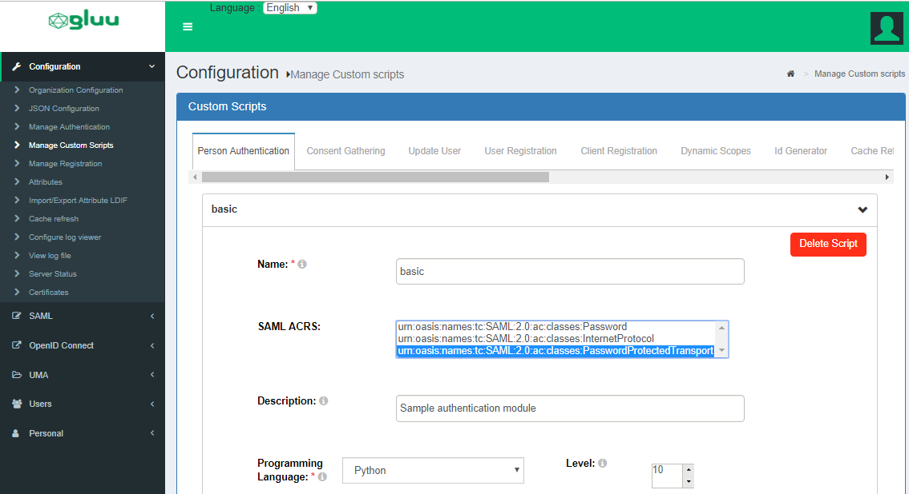

# SAML IDP 
## Overview
The Gluu Server can be deployed with the [Shibboleth SAML identity provider (IDP)](https://www.shibboleth.net/products/identity-provider/) to enable SAML single sign-on (SSO). 

In a standard outbound SAML transaction, a website or application (a.k.a. Service Provider, or "SP") redirects a user to a designated IDP for authentication and authorization. The IDP will authenticate the user and upon successful authentication, the user is sent back to the SP with an active session. 

!!! Note 
    To support an external SAML IDP for authentication, for instance the IDP of a customer or partner, review the [inbound SAML docs](../authn-guide/inbound-saml-passport.md) in the authentication guide. 

## Pre-requisites 

In order to support SAML SSO, the Gluu Server must include the Shibboleth SAML IDP. 

- During a fresh Gluu Server installation, simply opt in when prompted for Shibboleth. 

- To add Shibboleth to an existing Gluu Server deployment, follow [these instructions](../operation/faq.md/#adding-passportjs-andor-shibboleth-idp-post-installation). 

In addition, the target application must also support SAML. If the app doesn't already support SAML, see the section below about [SAML SP software](#saml-sp). 

## Trust Relationship Requirements     
In the Gluu Server, the SAML IDP's SSO configuration is called a Trust Relationship (TR). Trust must be pre-established between the Gluu Server and each target SP. 

Each TR requires the following infomation:

### Metadata of the SP             
Metadata is an XML file which has configuration data used to establish trust between the website (SP) and IDP (Gluu Server). Websites (SP) can provide metadata via a URL or as a separate file. Metadata can change, so a static URL typically requires the least amount of ongoing maintenance. 

### Metadata of the Gluu Server       
The Gluu Server's SAML metadata may be needed from time to time. It can be found at `https://hostname/idp/shibboleth`.
  
### Attribute Release      
Each SP may require one or more user attributes from the IDP in order to grant a person access to a protected resource. Required attributes vary depending on the application, and should be explicitly specified in the target application's documentation. The administrator can use the oxTrust interface to release the necessary attributes to the SP as described [below](#create-a-trust-relationship-in-the-gluu-server). 

## Create a Trust Relationship
Follow these instructions to create a SAML TR in your Gluu Server: 

1. Go to `SAML` > `Trust Relationships`    
2. Click on `Add Trust Relationship`     
3. A new page will appear where you can provide all the required information to create a Trust Relationship(TR).     


A description of each field follows:

- **Display Name**: Name of the Trust Relationship (it should be unique for every TR)       
- **Description**: Purpose of the TR and an SSO link can be added here         
- **Entity Type**: You have two options to choose for entity type.
    - *Single SP*
    - *Federation/Aggregate*
- **Metadata Type**: There are four available options to choose from. The correct Type depends on how the SP is delivering Metadata to your IDP.      

    - *File*: Choose `File` if the SP has provided an uploadable metadata document in XML format.
    - *URI*: Chose `URI` if the SP metadata is hosted on a URI that is accessible from the Internet. 
    - *Federation*: Choose this option if the target application (SP) is affiliated with a federation service (e.g. InCommon, NJEdge etc.). Federtion's TR must be created first for it to appear in this list. Learn more about working with a federation [below](#federation-configuration).   
      
- **Released**: The SPs required attributes must be added to this panel. The required attributes can be selected from the menu on the left with the heading “Release Additional Attributes”.     

- **Entity Type**: You have two options to choose for entity type.
    - *Single SP*: 
    - *Federation/Aggregate* 
    
The Trust Relationship (TR) can be added by clicking the `Add` button located in the lower left side of the page.     

## NameID

A Name Identifier or NameID is sent by the IDP to the SP to identify the "subject" of a SAML assertion, i.e. who is the person attempting to gain access. The format of nameID can be anything, but is typically `emailAddress`.

### Configure NameID in oxTrust

Here is how to configure NameID in oxTrust: 

 - Go to SAML -> 'Configure Custom NameID'

   - 'Enabled' `Create NameID`
   - 'Source Attribute': Attribute value to calculate name Identifier. 
   - 'Name': Custom attribute name which we created [earlier here.](https://gluu.org/docs/ce/admin-guide/attribute/#custom-attributes)
   - 'NameId Type': Type of name identifier (urn:oasis:names:tc:SAML:1.1:nameid-format:unspecified is deprecated by shibboleth, so not supported) 
 - [Restart](../operation/services.md#restart) the `identity` and `idp` services

!!! Note 
    If idp and identity services are on same host (non-cluster mode), then restart may not be required.
 
### Manual Configuration
It's also possible to configure `NameID` through configuration file / velocity templates. 

* Update /opt/shibboleth-idp/conf/saml-nameid.xml to generate SAML 2 NameID content

```
    <bean parent="shibboleth.SAML2AttributeSourcedGenerator" 
          p:format="urn:oasis:names:tc:SAML:1.1:nameid-format:emailAddress"
          p:attributeSourceIds="#{ {'mail'} }"/>
```
* [Restart](../operation/services.md#restart) the `identity` and `idp` services.

## AuthnContextClassRef Support

Gluu offers out-of-the-box support for the SAML parameter `AuthnContextClassRef`. Including `<saml:AuthnContextClassRef>` tag in the initial SAML request from the SP signals to the IDP that the user must reauthenticate with the specified authentication scheme/method.

    <samlp:AuthnRequest xmlns:samlp="urn:oasis:names:tc:SAML:2.0:protocol" xmlns:saml="urn:oasis:names:tc:SAML:2.0:assertion" ID="ONELOGIN_809707f0030a5d00620c9d9df97f627afe9dcc24" Version="2.0" ProviderName="SP test" IssueInstant="2014-07-16T23:52:45Z" Destination="http://idp.example.com/SSOService.php" ProtocolBinding="urn:oasis:names:tc:SAML:2.0:bindings:HTTP-POST" AssertionConsumerServiceURL="http://sp.example.com/demo1/index.php?acs">
      <saml:Issuer>http://sp.example.com/demo1/metadata.php</saml:Issuer>
      <samlp:NameIDPolicy Format="urn:oasis:names:tc:SAML:1.1:nameid-format:emailAddress" AllowCreate="true"/>
      <samlp:RequestedAuthnContext Comparison="exact">
        <saml:AuthnContextClassRef>urn:oasis:names:tc:SAML:2.0:ac:classes:PasswordProtectedTransport</saml:AuthnContextClassRef>
      </samlp:RequestedAuthnContext>
    </samlp:AuthnRequest>

Note: Allowed values must be defined under conf/authn/general-authn.xml under authn/oxAuth bean

    <bean id="authn/oxAuth" parent="shibboleth.AuthenticationFlow"
    		p:forcedAuthenticationSupported="true"
    		p:nonBrowserSupported="false" >
    	<property name="supportedPrincipals">
    		<list>
    			<bean parent="shibboleth.SAML2AuthnContextClassRef"
    				c:classRef="urn:oasis:names:tc:SAML:2.0:ac:classes:Password" />
    			<bean parent="shibboleth.SAML2AuthnContextClassRef"
    				c:classRef="urn:oasis:names:tc:SAML:2.0:ac:classes:PasswordProtectedTransport" />
    			<bean parent="shibboleth.SAML2AuthnContextClassRef"
    				c:classRef="urn:oasis:names:tc:SAML:2.0:ac:classes:InternetProtocol" />
    		</list>
    	</property>
    </bean>

### AuthnContextClassRef Extension
Custom `AuthnContextClassRef` attribute values can be defined as well. The recommeded format is either urn or uri. For example: 

    urn:oasis:names:tc:SAML:2.0:ac:classes:X509
    urn:oasis:names:tc:SAML:2.0:ac:classes:TLSClient
    urn:oasis:names:tc:SAML:2.0:ac:classes:PasswordProtectedTransport
    urn:oasis:names:tc:SAML:2.0:ac:classes:Password
    urn:oasis:names:tc:SAML:2.0:ac:classes:Kerberos
    urn:oasis:names:tc:SAML:2.0:ac:classes:InternetProtocol
    https://refeds.org/profile/mfa
    https://refeds.org/profile/sfa

### Enable AuthnContextClassRef in oxTrust

Gluu Authentication Schemes (basic, fido, mfa, ldap etc.) needs to be associated with AuthnContextClassRef values (one-to-one), This can be achieved by associating SAML ACRS attribute under Person Authentication.



## Relying Party Configuration     
Through the Relying Party configuration you can customize how different IDP profiles will respond to requests received from the SP, including encryption and digital signature options. The underlying IDPs functionality is described in [the Shibboleth wiki](https://wiki.shibboleth.net/confluence/display/IDP30/RelyingPartyConfiguration). 

The "Configure Relying Party" checkbox is accessible on the TR creation page and must be enabled with a specific profile(s) selected as active for this TR to generate a valid configuration. In most cases, just adding the SAML2SSO profile with default settings will suffice.

     

Setting the checkbox will result in a link which, if clicked, will summon a list of profiles currently available for customization. Each entry in the list has a brief description of its purpose and a selection of settings for which custom values may be chosen, as can be seen on image below.     

     
     
oxTrust allows you to tweak a limited subset of profiles mentioned in the Shibboleth wiki. The SAML2SSO profile is the most commonly used browser SSO profile.

| Profile  | Configuration Wiki Link |
| -------  | ----------------------- |
| SAML2SSO | [https://wiki.shibboleth.net/confluence/display/IDP30/SAML2SSOConfiguration](https://wiki.shibboleth.net/confluence/display/IDP30/SAML2SSOConfiguration) |
| SAML2Logout | [https://wiki.shibboleth.net/confluence/display/IDP30/SAML2LogoutConfiguration](https://wiki.shibboleth.net/confluence/display/IDP30/SAML2LogoutConfiguration) |
| SAML2AttributeQuery | [https://wiki.shibboleth.net/confluence/display/IDP30/SAML2AttributeQueryConfiguration](https://wiki.shibboleth.net/confluence/display/IDP30/SAML2AttributeQueryConfiguration) |
| SAML2ArtifactResolution | [https://wiki.shibboleth.net/confluence/display/IDP30/SAML2ArtifactResolutionConfiguration](https://wiki.shibboleth.net/confluence/display/IDP30/SAML2ArtifactResolutionConfiguration) |

## SAML Single Logout

Gluu Server supports SAML2 single logout (SLO) if enabled by the administrator. To enable, create a SAML2Logout RP profile with the following configuration:


Once enabled, the user can be directed to `https://[hostname]/idp/Authn/oxAuth/logout` when they wish to log out. The user will be directed to a confirmation page.


If the user clicks `Yes` or just waits a few seconds, the session will be killed and the user will be logged out.

## Force Authentication

The Gluu Server supports the SAML force authentication paramter out-of-the-box. Including `ForceAuthn=true` in the initial SAML request from the SP signals to the IDP that the user must be reauthenticated, even if they already have a valid session at the server. This feature can be used to verify the user's identity prior to granting them access to highly protected resources.

Upon receiving the SAML request with this flag, the IDP will invalidate its session for the user, then will issue a new OpenID Connect (OIDC) authorization request to oxAuth, including the `prompt=login` parameter. This parameter forces oxAuth to invalidate its session as well. The user will then follow the full authentication procedure.

## Federation Configuration     
If the SP is part of an identity federation such as [InCommon](https://www.incommon.org/participants/), the Gluu administrator has option to establish a Trust Relationship with it based on the federation's metadata. To achieve this he must add TR for the federation in the Gluu Server first. This will enable the administrator to more easily create TRs with SPs in the federation. 

The example below shows how an administrator would add a TR for the InCommon Federation.


Once a TR has been established with the federation, the Gluu Server administrator can easily create TRs with any SP included in the federation by selecting the federation from the `Federation Name` drop down menu and selecting the entity-id for the SP. 

In the example below we are creating a TR for the 'Internet2 Wiki', which is an InCommon Federation affiliated SP (meaning, the SPs entityID is available in InCommon metadata). 


## Customizing IDP pages

Many organizations will want to edit and customize the look and feel of IDP pages to match their own corporate branding. The Gluu Server includes a custom folder that will override existing IDP pages. The IDP pages use the `vm` file type. To customize the pages, follow these steps:

1. Copy and edit the desired file. Applicable files can be found [here](https://github.com/GluuFederation/oxShibboleth/tree/master/static/src/main/resources/shibboleth-idp/views).
1. Log in to the chroot
1. Move the file to `/opt/gluu/jetty/idp/custom/pages`

Now, the customized page will override the default one.

## SAML SP
If the target application (SP) does not already support SAML, we recommend using the [Shibboleth SP](../integration/sswebapps/saml-sp.md) web server filter to secure and integrate the application with your Gluu SAML IDP. 

