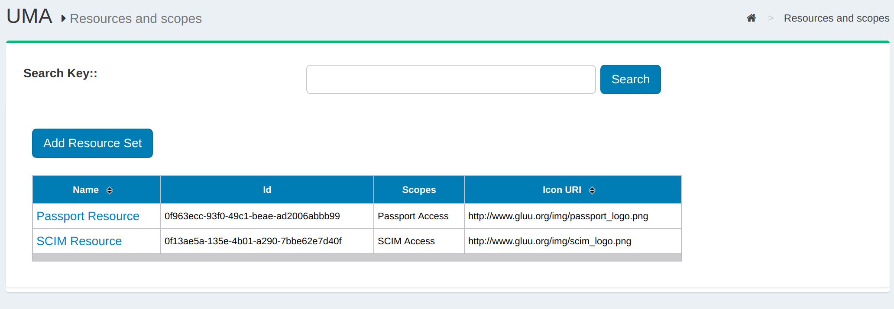
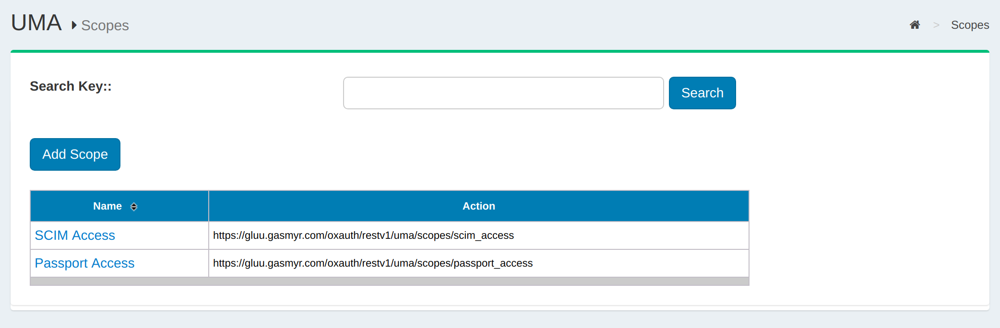
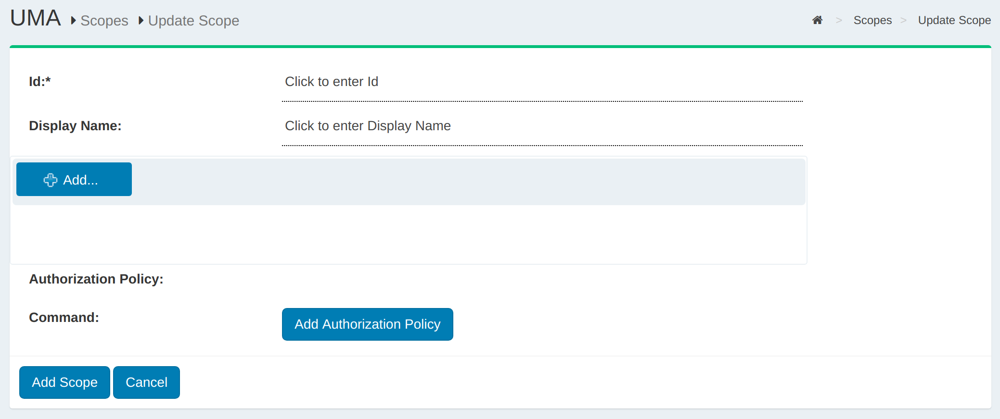
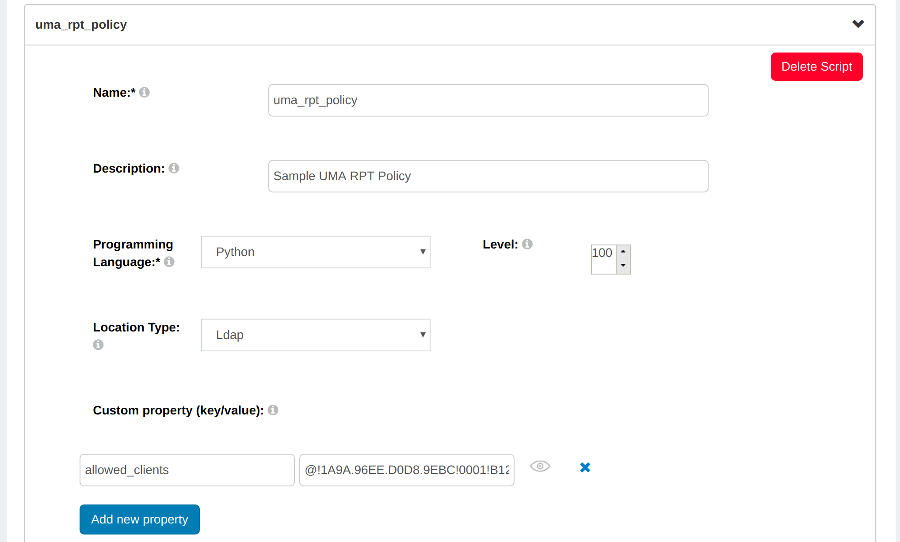

# UMA
## Overview
As a profile of OAuth 2.0 that is complementary to OpenID Connect, UMA defines RESTful, JSON-based, standardized flows and constructs for coordinating the protection of any API or web resource in a way that will be familiar to any developer already acquainted with OAuth.

UMA defines interfaces between authorization servers (AS) and resource servers (RS) that, by default, enable centralized policy decision-making for improved service delivery, auditing, policy administration, and accountability, even in a very loosely coupled "public API" environment. Custom profiles enable flexibility to move the decision-making line outward to distributed applications, to account for local preferences in API ecosystems. 

Learn more about the Gluu Server's [UMA-API](../api-guide/uma-api.md). 

Learn more about the [UMA specification](https://docs.kantarainitiative.org/uma/rec-uma-core.html) on Kantara's website.

!!! Note
    The Gluu Server functions as an UMA AS and provides an interface for scripting unique policies for access management. To secure and integrate your applications with the Gluu Server, we **strongly recommend** using our UMA client software, [oxd](http://oxd.gluu.org).

### Terminology
UMA introduces new terms and enhancements of OAuth term definitions. For a complete overview of UMA terminology, see the [specification](https://docs.kantarainitiative.org/uma/rec-uma-core.html#rfc.section.1.2).

### Authorization Policy Expression Language
UMA does not standardize a policy expression language, enabling flexibility in policy expression and evaluation through XACML, other declarative policy languages, or procedural code as warranted by conditions. 

### Authentication-Agnostic
UMA inherits authentication agnosticism from OAuth. It concentrates on authorization, not on authentication. 
It has been profiled to work with OpenID Connect to gather identity claims from whoever is attempting access, 
and enables true claims-based authorization (with simple group- or role-based policies a natural subset). 

## Resource Registration
The resources protected by UMA must be registered in oxTrust. The following propterties describe a resource:

- name
- scopes
- type
- icon\_uri

The resource type can be a string, URI or any other value type supported by the Gluu Server. The properties shown above are not concrete, and it is possible that a resource may contain custom properties. An example of the resource JSON is given beow:

```
{
"name":"scim_access",
"icon_uri":"https:\/\/<hostname>\/identity\/uma\/scope\/file\/scim_access"
}
```

!!! Note
    The resource JSON may contain custom properties.



The search bar can be used to find existing available resources. New resources can be added by clicking on the `Add Resource Set` button which will bring up the interface shown below:


The properties of a resource are visible on this page. There are two additional buttons that allow the administrator to add specific resources and/or scopes. By default, Gluu Server is shipped with SCIM resources protected by UMA.


## Scopes
UMA scopes are used to grant a client permission to do an action on a protected resource. Different scopes can grant access to the same action. For example, a "read" action can be allowed with scope "read" or "all". For some actions the Resource Server (RS) may want multiple scopes at the same time. For instance, a "read" action should only be allowed if the authorization request includes the "read" **and** "all" scopes. UMA scopes are bound to resource sets and are used to fetch policies that check whether the specified user or client should have access to the resource. 

The scopes are described in JSON and have the following properties:

- name
- icon\_uri

An example of the scope JSON is given below:

```
{
  "name": "Add photo",
  "icon_uri": "https://<hostname>/icons/add_photo_scope.png"
}
```

!!! Note
    The scope JSON may contain custom properties.

There are three (3) types of scopes in UMA:

1. `internal`: the scope is hosted within the Gluu Server;
2. `external`: the scope is hosted in a different server;
3. `external_auto`: the scope is hosted in a different server, but it is added to the Gluu Server during the resource registration.

There is no URI for an internal scope because it resides within the Gluu Server. In this case, the UMA URL is represented in the following format:

```
UMA URL=uma_scopes_endpoint+"/"+oxId;
```

The following is an example what an UMA URL may look like:

```
https://<hostname>/uma/scopes/view
```

!!! Note
    The scope endpoint has to be present in UMA configuration to make it discoverable.

The `ldif` for both an internal and external scope is given below:

**Internal sample ldif**
```
dn: inum=@!1111!8990!BF80,ou=scopes,ou=uma,o=@!1111,o=gluu
displayName: View
inum: @!1111!8990!BF80
objectClass: oxAuthUmaScopeDescription
objectClass: top
oxType: internal
oxId: View
oxIconUrl: http://<hostname>/uma/icons/view_scope.png
```

**External sample ldif**
```
dn: inum=@!1111!8990!BF80,ou=scopes,ou=uma,o=@!1111,o=gluu
displayName: View
inum: @!1111!8990!BF80
objectClass: oxAuthUmaScopeDescription
objectClass: top
oxType: external
oxUrl: http://<hostname>/dev/scopes/view
```

### Add Scopes
This section describes the process of adding UMA scopes in the Gluu Server GUI. Scopes are accessed by navigating to the `UMA` > `Scopes` in the right hand menu.



The search bar can be used to find existing available scopes. New scopes can be added by clicking on the `Add Scope Description` button which will bring up the interface shown below:



Additionally there is an option to add authorization policy with the new scope.

## UMA Policies
UMA policy's are associated with UMA scopes. An authorization request has a resource_id and scope(s). Each scope can point to one or more policies. If all policies associated with all scopes return `true`, then access is granted. 

For example, let's say we have the following resource, `GET /photo`. In order to access it the Resource Server (RS) requires the `read` scope to be present. If we have a policy that always return `true`, then any authorization request to `/photo` that includes the `read` scope will result in access granted. 

If we wish to have more sophisticated logic, for example to grant access only to a specific client, then we can add something like `client_id = "@1111"` to the policy. This means that an authorization request to `/photo` will only be granted if the scope includes `read` and is coming from `client_id = "@1111"`.

There are three (3) main properties of a policy:

1. scopes: policy protects resources by scopes; 
2. authorization script: script that is evaluated in order to grant/deny access; 
3. name: a human readable name to the UMA policy.

The following section outlines how to define UMA policies from the Custom Script menu. The Custom Script page is accessed by navigating to `Configuration` > `Custom Scripts`.



### UMA Policy Algorithm
The UMA policy algorithm has two rules that must be followed:

1. UMA policies protect resources based on scopes. If a scope is protected by a policy, then the policy script must reutrn `true` in order to authorize access during RPT authorization.

2. Multiple policies can protect a single scope. In such a case, all the policies must retun `true` to authorize access or else aceess will be denied.

 
