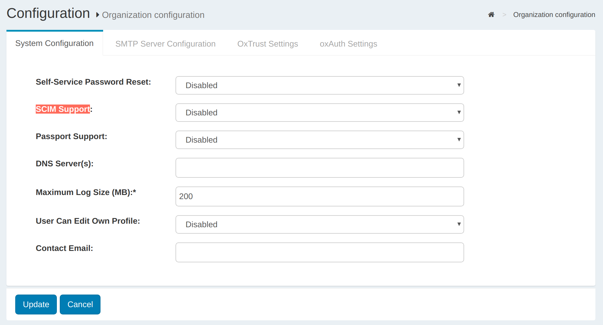

# SCIM API

Gluu Server Community Edition supports the System for Cross-domain Identity Management (SCIM) version 2.0 out of the box.

To enable SCIM open the oxTrust administration interface and navigate to `Organization Configuration` > `System Configuration`. Find `SCIM Support` and select `Enabled`.

Then enable the protection mode you want for your API, see details [here](../user-management/scim2.md#api-protection).

## HTTP verbs

As a summary, these are the verbs a compliant SCIM server implementation (like Gluu) speaks:

|HTTP Method|Description	|
|--------|------------------------------|
|GET|Retrieves one or more resources (e.g. Users/Groups)|
|POST|Creates new resources, executes searches, send bulk requests (batches)|
|PUT|Modifies resources by adding and replacing attributes|
|DELETE|Deletes a resource|
|PATCH|Modifies a resource using a client-provided specific set of changes (additions, removals, and updates)|

## Resource types

The following resources are supported:

|Resource|Schema URI|Notes|
|-|-|-|
|User|urn:ietf:params:scim:schemas:core:2.0:User|See [section 4.1](https://tools.ietf.org/html/rfc7643#section-4.1) of RFC 7643|
|Group|urn:ietf:params:scim:schemas:core:2.0:Group|See [section 4.2](https://tools.ietf.org/html/rfc7643#section-4.2) of RFC 7643|
|Fido u2f devices|urn:ietf:params:scim:schemas:core:2.0:FidoDevice|Represents a [fido u2f credential](../user-management/scim2.md#additional-features-of-scim-service) enrolled by a user|
|Fido 2.0 devices|urn:ietf:params:scim:schemas:core:2.0:Fido2Device|Represents a [fido 2.0 credential](../user-management/scim2.md#additional-features-of-scim-service) enrolled by a user|

Additionally the following resource extensions are defined:

|Resource|Schema URI|Attributes|
|-|-|-|
|User|urn:ietf:params:scim:schemas:extension:gluu:2.0:User|Attributes can be assigned dynamically via oxTrust|

In [this section](#conformance-matrix) we provide a conformance matrix where you can see which features from the spec are supported by Gluu implementation. 

To learn about the specific capabilities of the service, inspect your `/ServiceProvider`, `/ResourceTypes`,  and `/Schemas` endpoints (see [below](#service-provider-configuration-endpoints)). These endpoints are not protected so you can use a web browser to check. 

## SCIM Endpoints

The following table summarizes the available endpoints in Gluu implementation of SCIM service

|Endpoint|Resource			|HTTP methods		|Description	|
|-|-|-|-|
|[/Users](#identityrestv1scimv2users)|User|GET, POST, PUT, DELETE|Retrieve, add, modify and delete Users|
|[/Groups](#identityrestv1scimv2groups)|Group|GET, POST, PUT, DELETE|Retrieve, add, modify and delete Groups|
|[/FidoDevices](#identityrestv1scimv2fidodevices)|Fido devices|GET, PUT, DELETE|Retrieve, modify and delete Fido devices|
|[/Bulk](#identityrestv1scimv2bulk)||POST|Applies operations of different kind to a set of resources|
|[/.search](#identityrestv1scimv2search)||POST|Search resources of all kind|
|[/ServiceProvider](#identityrestv1scimv2serviceprovider)||GET|Retrieve service provider configuration|
|[/ResourceTypes](#identityrestv1scimv2resourcetypes)||GET|Retrieve supported resource types|
|[/Schemas](#identityrestv1scimv2schemas)||GET|Retrieve supported schemas info|

!!! Note
    Actual endpoint URLs are prefixed accordingly with the root URL of SCIM API. As an example, the user's endpoint URL to use in your applications should be `https://your.gluu-host.com/identity/restv1/scim/v2/Users`.

SCIM 2.0 is governed by the [SCIM:Core Schema](https://tools.ietf.org/html/rfc7643) and [SCIM:Protocol](https://tools.ietf.org/html/rfc7644) spec docs. The latter contains full details about the API structure, so use it as a reference in your development tasks. 

**Important notes:**

* Unless otherwise stated, all endpoints are protected via [UMA 2.0](../user-management/scim2.md#protection-using-uma) or [test mode](../user-management/scim2.md#protection-using-test-mode).

* All payloads sent to endpoints using POST or PUT should be supplied using *Content-Type:* `application/scim+json` or `application/json`, and using UTF-8 encoding. Liwewise, output is sent from server in UTF-8.

## Conformance matrix

The following table lists characteristics of SCIM protocol (see section 3 of RFC 7644) and correlates the level of support and conformance provided by Gluu Server implementation.

|Characteristic|Compliance|Available via methods|Notes on support|
|--------|--------|---------------|-------|
|Resource creation|Full|POST|Creation of Fido Devices not applicable|
|Resource retrieval by identifier|Full|GET||
|Resource(s) retrieval by query|Full|GET and POST|Supports searches from root endpoint too. Complex multi-valued attributes not supported in sortBy param|
|Resource attributes replacement|Partial|PUT|To avoid clients to accidentally clear data, only attributes found in payload are modified. No need to pass the whole resource nor required attributes|
|Resource attributes modification|Full|PATCH|All types of operations supported (add/remove/replace) for user and group resources|
|Resource removal|Full|DELETE||
|Bulk operations|Full|POST|Circular reference processing not supported. bulkIds can be used not only in "data" attribute of operations but in "path" too|
|Returned attributes control|Full|GET, POST, PUT, PATCH|Supports `attributes`/`excludedAttributes` params and attribute notation (sections 3.9/3.10)|
|"/me" URI alias|-|-|Not applicable: operations actually not executed on a user's behalf or other SCIM resource|
|Resource versioning|-|-|Feature may be available upon explicit customer demand|

### Known limitations with Couchbase as DB

!!! Warning
    **Attention Couchbase users**: there are a some minor behaviors that developers should account regarding SCIM searches.
 
- Non-deterministic order of results when no `sortBy` is specified: A query can return a different permutation of valid results every time is executed.

- Search filters should not contain backslash characters in comparison values: This is a Couchbase issue. N1QL queries with backslashes can lead to unexpected results or even runtime errors. An example of this can be the filter `name.familyName co "\"`

- Case sensitivity: Searching and sorting is by default case insensitive when in LDAP. In Couchbase setups the behavior is case sensitive with the only exception of equality/inequality filters (like `userName eq "JhonHoney"` or `userType ne "Employee"`). Recall case only matters for attributes of type string. This applies for both core and custom attributes.

- Operators (`le`, `lt`, `gt`, `ge`, `co`, `ew`, `sw`, `eq`) are not applicable for attributes with more than one value. When used, no results will be returned. As an example, users with more than one telephone number will not be returned when using `phoneNumbers.value sw "555"` even if one or more of their phones start with "555".

## `/identity/restv1/scim/v2/Users`

### GET

Search users based on filter criteria (see [section 3.4.2](https://tools.ietf.org/html/rfc7644#section-3.4.2) of RFC 7644). 

#### Query parameters

<table border="1">
    <tr>
        <th>Name</th>
        <th>Required</th>
        <th>Data type</th>
    </tr>
    <tr>
        <td>filter</td>
        <td>no</td>
        <td>string</td>
    </tr>
    <tr>
        <td>startIndex</td>
        <td>no</td>
        <td>string</td>
    </tr>
    <tr>
        <td>count</td>
        <td>no</td>
        <td>int</td>
    </tr>
    <tr>
        <td>sortBy</td>
        <td>no</td>
        <td>string</td>
    </tr>
    <tr>
        <td>sortOrder</td>
        <td>no</td>
        <td>string</td>
    </tr>
    <tr>
        <td>attributes</td>
        <td>no</td>
        <td>string (comma-separated list)</td>
    </tr>
    <tr>
        <td>excludedAttributes</td>
        <td>no</td>
        <td>string (comma-separated list)</td>
    </tr>
</table>

#### Response

Output data is in form of a [ListResponse](#/definitions/ListResponse). Resources returned belong to <a href="#/definitions/User">User</a>.

Status code 200 is returned for a successful response.

### POST

Creates a user (see [section 3.3](https://tools.ietf.org/html/rfc7644#section-3.3) of RFC 7644).

#### Parameters

<table border="1">
    <tr>
        <th>Name</th>
        <th>Required</th>
        <th>Located in</th>
        <th>Data type</th>
    </tr>
    <tr>
        <td>attributes</th>
        <td>no</td>
        <td>url</td>
        <td>string (comma-separated list)</td>
    </tr>
    <tr>
        <td>excludedAttributes</td>
        <td>no</td>
        <td>url</td>
        <td>string (comma-separated list)</td>
    </tr>
    <tr>
        <td> </td>
        <td>yes</td>
        <td>body (payload)</td>
        <td><a href="#/definitions/Group">Group</a></td>
    </tr>
</table>

#### Response

The representation of the <a href="#/definitions/User">user</a> created containing the attributes whose returnability is "default". This can be overriden by supplying **attributes** or **excludedAttributes** query parameters (see [section 3.4.2.5](https://tools.ietf.org/html/rfc7644#section-3.4.2.5) of RFC 7644).

Status code 201 is returned upon successful operation.

## `/identity/restv1/scim/v2/Users/.search`

Search groups based on filter criteria (see [section 3.4.3](https://tools.ietf.org/html/rfc7644#section-3.4.3) of RFC 7644). 

### POST

#### Parameters

<table border="1">
    <tr>
        <th>Name</th>
        <th>Required</th>
        <th>Data type</th>
    </tr>
    <tr>
        <td>filter</td>
        <td>no</td>
        <td>string</td>
    </tr>
    <tr>
        <td>startIndex</td>
        <td>no</td>
        <td>string</td>
    </tr>
    <tr>
        <td>count</td>
        <td>no</td>
        <td>int</td>
    </tr>
    <tr>
        <td>sortBy</td>
        <td>no</td>
        <td>string</td>
    </tr>
    <tr>
        <td>sortOrder</td>
        <td>no</td>
        <td>string</td>
    </tr>
    <tr>
        <td>attributes</td>
        <td>no</td>
        <td>string (comma-separated list)</td>
    </tr>
    <tr>
        <td>excludedAttributes</td>
        <td>no</td>
        <td>string (comma-separated list)</td>
    </tr>
</table>

#### Response
Output data is in form of a [ListResponse](#/definitions/ListResponse). Resources returned belong to <a href="#/definitions/User">User</a>.

Status code 200 is returned for a successful response.

## `/identity/restv1/scim/v2/Users/{id}`

### GET

Returns a user by id (see [section 3.4.1](https://tools.ietf.org/html/rfc7644#section-3.4.1) of RFC 7644).

#### Parameters

<table border="1">
    <tr>
        <th>Name</th>
        <th>Required</th>
        <th>Located in</th>
        <th>Data type</th>
    </tr>
    <tr>
        <td>attributes</th>
        <td>no</td>
        <td>url</td>
        <td>string (comma-separated list)</td>
    </tr>
    <tr>
        <td>excludedAttributes</td>
        <td>no</td>
        <td>url</td>
        <td>string (comma-separated list)</td>
    </tr>
</table>

#### Response

The <a href="#/definitions/User">user</a> requested containing the attributes whose returnability is "default". This can be overriden by supplying **attributes** or **excludedAttributes** query parameters (see [section 3.4.2.5](https://tools.ietf.org/html/rfc7644#section-3.4.2.5) of RFC 7644).

Status code 200 is returned upon successful operation. If the id supplied as part of the URL does not map to an existing user, then 404 is returned.

### PUT

Updates a user (see [section 3.5.1](https://tools.ietf.org/html/rfc7644#section-3.5.1) of RFC 7644).

#### Parameters

<table border="1">
    <tr>
        <th>Name</th>
        <th>Required</th>
        <th>Located in</th>
        <th>Data type</th>
    </tr>
    <tr>
        <td>attributes</th>
        <td>no</td>
        <td>url</td>
        <td>string (comma-separated list)</td>
    </tr>
    <tr>
        <td>excludedAttributes</td>
        <td>no</td>
        <td>url</td>
        <td>string (comma-separated list)</td>
    </tr>
    <tr>
        <td> </td>
        <td>yes</td>
        <td>body (payload)</td>
        <td><a href="#/definitions/User">User</a></td>
    </tr>
</table>

For payload data, it's not necessary to provide the whole User representation. Partial data suffices, that is, a Json object that contains the attributes to be replaced in the destination.

#### Response

The representation of the <a href="#/definitions/User">user</a> (after the update) containing the attributes whose returnability is "default". This can be overriden by supplying **attributes** or **excludedAttributes** query parameters (see [section 3.4.2.5](https://tools.ietf.org/html/rfc7644#section-3.4.2.5) of RFC 7644).

Status code 200 is returned upon successful operation. If the id supplied as part of the URL does not map to an existing user, then 404 is returned.

### PATCH

Modifies a user (see [section 3.5.2](https://tools.ietf.org/html/rfc7644#section-3.5.2) of RFC 7644).

#### Parameters

<table border="1">
    <tr>
        <th>Name</th>
        <th>Required</th>
        <th>Located in</th>
        <th>Data type</th>
    </tr>
    <tr>
        <td>attributes</th>
        <td>no</td>
        <td>url</td>
        <td>string (comma-separated list)</td>
    </tr>
    <tr>
        <td>excludedAttributes</td>
        <td>no</td>
        <td>url</td>
        <td>string (comma-separated list)</td>
    </tr>
    <tr>
        <td> </td>
        <td>yes</td>
        <td>body (payload)</td>
        <td><a href="#/definitions/PatchRequest">PatchRequest</a></td>
    </tr>
</table>

#### Response

The representation of the <a href="#/definitions/User">user</a> (after modification) containing the attributes whose returnability is "default". This can be overriden by supplying **attributes** or **excludedAttributes** query parameters (see [section 3.4.2.5](https://tools.ietf.org/html/rfc7644#section-3.4.2.5) of RFC 7644).

Status code 200 is returned upon successful operation. If the id supplied as part of the URL does not map to an existing user, then 404 is returned.

### DELETE

Deletes a user (see [section 3.6](https://tools.ietf.org/html/rfc7644#section-3.6) of RFC 7644).

#### Parameters
None 

#### Response
A no content response (status code 204) if the operation was a successful. If the id supplied as part of the URL does not map to an existing user, then 404 is returned.  

## `/identity/restv1/scim/v2/Groups`

### GET

Search groups based on filter criteria (see [section 3.4.2](https://tools.ietf.org/html/rfc7644#section-3.4.2) of RFC 7644). 

#### Query parameters

<table border="1">
    <tr>
        <th>Name</th>
        <th>Required</th>
        <th>Data type</th>
    </tr>
    <tr>
        <td>filter</td>
        <td>no</td>
        <td>string</td>
    </tr>
    <tr>
        <td>startIndex</td>
        <td>no</td>
        <td>string</td>
    </tr>
    <tr>
        <td>count</td>
        <td>no</td>
        <td>int</td>
    </tr>
    <tr>
        <td>sortBy</td>
        <td>no</td>
        <td>string</td>
    </tr>
    <tr>
        <td>sortOrder</td>
        <td>no</td>
        <td>string</td>
    </tr>
    <tr>
        <td>attributes</td>
        <td>no</td>
        <td>string (comma-separated list)</td>
    </tr>
    <tr>
        <td>excludedAttributes</td>
        <td>no</td>
        <td>string (comma-separated list)</td>
    </tr>
</table>

#### Response

Output data is in form of a [ListResponse](#/definitions/ListResponse). Resources returned belong to <a href="#/definitions/Group">Group</a>.

Status code 200 is returned for a successful response.

### POST

Creates a group (see [section 3.3](https://tools.ietf.org/html/rfc7644#section-3.3) of RFC 7644).

#### Parameters

<table border="1">
    <tr>
        <th>Name</th>
        <th>Required</th>
        <th>Located in</th>
        <th>Data type</th>
    </tr>
    <tr>
        <td>attributes</th>
        <td>no</td>
        <td>url</td>
        <td>string (comma-separated list)</td>
    </tr>
    <tr>
        <td>excludedAttributes</td>
        <td>no</td>
        <td>url</td>
        <td>string (comma-separated list)</td>
    </tr>
    <tr>
        <td> </td>
        <td>yes</td>
        <td>body (payload)</td>
        <td><a href="#/definitions/Group">Group</a></td>
    </tr>
</table>

#### Response

The representation of the <a href="#/definitions/Group">group</a> created containing the attributes whose returnability is "default". This can be overriden by supplying **attributes** or **excludedAttributes** query parameters (see [section 3.4.2.5](https://tools.ietf.org/html/rfc7644#section-3.4.2.5) of RFC 7644).

Status code 201 is returned upon successful operation.

## `/identity/restv1/scim/v2/Groups/.search`

Search groups based on filter criteria (see [section 3.4.3](https://tools.ietf.org/html/rfc7644#section-3.4.3) of RFC 7644). 

### POST

#### Parameters

<table border="1">
    <tr>
        <th>Name</th>
        <th>Required</th>
        <th>Data type</th>
    </tr>
    <tr>
        <td>filter</td>
        <td>no</td>
        <td>string</td>
    </tr>
    <tr>
        <td>startIndex</td>
        <td>no</td>
        <td>string</td>
    </tr>
    <tr>
        <td>count</td>
        <td>no</td>
        <td>int</td>
    </tr>
    <tr>
        <td>sortBy</td>
        <td>no</td>
        <td>string</td>
    </tr>
    <tr>
        <td>sortOrder</td>
        <td>no</td>
        <td>string</td>
    </tr>
    <tr>
        <td>attributes</td>
        <td>no</td>
        <td>string (comma-separated list)</td>
    </tr>
    <tr>
        <td>excludedAttributes</td>
        <td>no</td>
        <td>string (comma-separated list)</td>
    </tr>
</table>

#### Response
Output data is in form of a [ListResponse](#/definitions/ListResponse). Resources returned belong to <a href="#/definitions/Group">Group</a>.

Status code 200 is returned for a successful response.

## `/identity/restv1/scim/v2/Groups/{id}`

### GET

Returns a group by id (see [section 3.4.1](https://tools.ietf.org/html/rfc7644#section-3.4.1) of RFC 7644).

#### Parameters

<table border="1">
    <tr>
        <th>Name</th>
        <th>Required</th>
        <th>Located in</th>
        <th>Data type</th>
    </tr>
    <tr>
        <td>attributes</th>
        <td>no</td>
        <td>url</td>
        <td>string (comma-separated list)</td>
    </tr>
    <tr>
        <td>excludedAttributes</td>
        <td>no</td>
        <td>url</td>
        <td>string (comma-separated list)</td>
    </tr>
</table>

#### Response

The <a href="#/definitions/Group">group</a> requested containing the attributes whose returnability is "default". This can be overriden by supplying **attributes** or **excludedAttributes** query parameters (see [section 3.4.2.5](https://tools.ietf.org/html/rfc7644#section-3.4.2.5) of RFC 7644).

Status code 200 is returned upon successful operation. If the id supplied as part of the URL does not map to an existing group, then 404 is returned.

### PUT

Updates a group (see [section 3.5.1](https://tools.ietf.org/html/rfc7644#section-3.5.1) of RFC 7644).

#### Parameters

<table border="1">
    <tr>
        <th>Name</th>
        <th>Required</th>
        <th>Located in</th>
        <th>Data type</th>
    </tr>
    <tr>
        <td>attributes</th>
        <td>no</td>
        <td>url</td>
        <td>string (comma-separated list)</td>
    </tr>
    <tr>
        <td>excludedAttributes</td>
        <td>no</td>
        <td>url</td>
        <td>string (comma-separated list)</td>
    </tr>
    <tr>
        <td> </td>
        <td>yes</td>
        <td>body (payload)</td>
        <td><a href="#/definitions/Group">Group</a></td>
    </tr>
</table>

For payload data, it's not necessary to provide the whole Group representation. Partial data suffices, that is, a Json object that contains the attributes to be replaced in the destination.

#### Response

The representation of the <a href="#/definitions/Group">group</a> (after the update) containing the attributes whose returnability is "default". This can be overriden by supplying **attributes** or **excludedAttributes** query parameters (see [section 3.4.2.5](https://tools.ietf.org/html/rfc7644#section-3.4.2.5) of RFC 7644).

Status code 200 is returned upon successful operation. If the id supplied as part of the URL does not map to an existing group, then 404 is returned.

### PATCH

Modifies a group (see [section 3.5.2](https://tools.ietf.org/html/rfc7644#section-3.5.2) of RFC 7644).

#### Parameters

<table border="1">
    <tr>
        <th>Name</th>
        <th>Required</th>
        <th>Located in</th>
        <th>Data type</th>
    </tr>
    <tr>
        <td>attributes</th>
        <td>no</td>
        <td>url</td>
        <td>string (comma-separated list)</td>
    </tr>
    <tr>
        <td>excludedAttributes</td>
        <td>no</td>
        <td>url</td>
        <td>string (comma-separated list)</td>
    </tr>
    <tr>
        <td> </td>
        <td>yes</td>
        <td>body (payload)</td>
        <td><a href="#/definitions/PatchRequest">PatchRequest</a></td>
    </tr>
</table>

#### Response

The representation of the <a href="#/definitions/Group">group</a> (after modification) containing the attributes whose returnability is "default". This can be overriden by supplying **attributes** or **excludedAttributes** query parameters (see [section 3.4.2.5](https://tools.ietf.org/html/rfc7644#section-3.4.2.5) of RFC 7644).

Status code 200 is returned upon successful operation. If the id supplied as part of the URL does not map to an existing group, then 404 is returned.

### DELETE

Deletes a group (see [section 3.6](https://tools.ietf.org/html/rfc7644#section-3.6) of RFC 7644).

#### Parameters
None 

#### Response
A no content response (status code 204) if the operation was a successful. If the id supplied as part of the URL does not map to an existing group, then 404 is returned.  

## `/identity/restv1/scim/v2/FidoDevices`

### GET

Search fido devices based on filter criteria (see [section 3.4.2](https://tools.ietf.org/html/rfc7644#section-3.4.2) of RFC 7644). 

#### Query parameters

<table border="1">
    <tr>
        <th>Name</th>
        <th>Required</th>
        <th>Data type</th>
    </tr>
    <tr>
        <td>filter</td>
        <td>no</td>
        <td>string</td>
    </tr>
    <tr>
        <td>startIndex</td>
        <td>no</td>
        <td>string</td>
    </tr>
    <tr>
        <td>count</td>
        <td>no</td>
        <td>int</td>
    </tr>
    <tr>
        <td>sortBy</td>
        <td>no</td>
        <td>string</td>
    </tr>
    <tr>
        <td>sortOrder</td>
        <td>no</td>
        <td>string</td>
    </tr>
    <tr>
        <td>attributes</td>
        <td>no</td>
        <td>string (comma-separated list)</td>
    </tr>
    <tr>
        <td>excludedAttributes</td>
        <td>no</td>
        <td>string (comma-separated list)</td>
    </tr>
</table>

#### Response

Output data is in form of a [ListResponse](#/definitions/ListResponse). Resources returned belong to <a href="#/definitions/FidoDevice">FidoDevice</a>.

Status code 200 is returned for a successful response.

## `/identity/restv1/scim/v2/FidoDevices/.search`

Search FIDO devices based on filter criteria (see [section 3.4.3](https://tools.ietf.org/html/rfc7644#section-3.4.3) of RFC 7644). 

### POST

#### Parameters

<table border="1">
    <tr>
        <th>Name</th>
        <th>Required</th>
        <th>Data type</th>
    </tr>
    <tr>
        <td>filter</td>
        <td>no</td>
        <td>string</td>
    </tr>
    <tr>
        <td>startIndex</td>
        <td>no</td>
        <td>string</td>
    </tr>
    <tr>
        <td>count</td>
        <td>no</td>
        <td>int</td>
    </tr>
    <tr>
        <td>sortBy</td>
        <td>no</td>
        <td>string</td>
    </tr>
    <tr>
        <td>sortOrder</td>
        <td>no</td>
        <td>string</td>
    </tr>
    <tr>
        <td>attributes</td>
        <td>no</td>
        <td>string (comma-separated list)</td>
    </tr>
    <tr>
        <td>excludedAttributes</td>
        <td>no</td>
        <td>string (comma-separated list)</td>
    </tr>
</table>

#### Response
Output data is in form of a [ListResponse](#/definitions/ListResponse). Resources returned belong to <a href="#/definitions/FidoDevice">FidoDevice</a>.

Status code 200 is returned for a successful response.

## `/identity/restv1/scim/v2/FidoDevices/{id}`

### GET

Returns a fido u2f device by id (see [section 3.4.1](https://tools.ietf.org/html/rfc7644#section-3.4.1) of RFC 7644).

#### Parameters

<table border="1">
    <tr>
        <th>Name</th>
        <th>Required</th>
        <th>Located in</th>
        <th>Data type</th>
    </tr>
    <tr>
        <td>attributes</th>
        <td>no</td>
        <td>url</td>
        <td>string (comma-separated list)</td>
    </tr>
    <tr>
        <td>excludedAttributes</td>
        <td>no</td>
        <td>url</td>
        <td>string (comma-separated list)</td>
    </tr>
</table>

#### Response

The <a href="#/definitions/FidoDevice">FidoDevice</a> requested containing the attributes whose returnability is "default". This can be overriden by supplying **attributes** or **excludedAttributes** query parameters (see [section 3.4.2.5](https://tools.ietf.org/html/rfc7644#section-3.4.2.5) of RFC 7644).

Status code 200 is returned upon successful operation. If the id supplied as part of the URL does not map to an existing fido u2f device, then 404 is returned.

### PUT

Updates a fido u2f device (see [section 3.5.1](https://tools.ietf.org/html/rfc7644#section-3.5.1) of RFC 7644).

#### Parameters

<table border="1">
    <tr>
        <th>Name</th>
        <th>Required</th>
        <th>Located in</th>
        <th>Data type</th>
    </tr>
    <tr>
        <td>attributes</th>
        <td>no</td>
        <td>url</td>
        <td>string (comma-separated list)</td>
    </tr>
    <tr>
        <td>excludedAttributes</td>
        <td>no</td>
        <td>url</td>
        <td>string (comma-separated list)</td>
    </tr>
    <tr>
        <td> </td>
        <td>yes</td>
        <td>body (payload)</td>
        <td><a href="#/definitions/FidoDevice">FidoDevice</a></td>
    </tr>
</table>

For payload data, it's not necessary to provide the whole FidoDevice representation. Partial data suffices, that is, a Json object that contains the attributes to be replaced in the destination.

Take into account the mutability of attributes for this resource (check the `/Schemas` endpoint). For security reasons only a few attributes are allowed to be modified.

#### Response

The representation of the <a href="#/definitions/FidoDevice">FidoDevice</a> (after the update) containing the attributes whose returnability is "default". This can be overriden by supplying **attributes** or **excludedAttributes** query parameters (see [section 3.4.2.5](https://tools.ietf.org/html/rfc7644#section-3.4.2.5) of RFC 7644).

Status code 200 is returned upon successful operation. If the id supplied as part of the URL does not map to an existing fido u2f device, then 404 is returned.

### DELETE

Deletes a fido u2f device (see [section 3.6](https://tools.ietf.org/html/rfc7644#section-3.6) of RFC 7644).

#### Parameters
None 

#### Response
A no content response (status code 204) if the operation was a successful. If the id supplied as part of the URL does not map to an existing fido u2f device, then 404 is returned.  
## `/identity/restv1/scim/v2/Fido2Devices`

### GET

Search fido 2.0 devices based on filter criteria (see [section 3.4.2](https://tools.ietf.org/html/rfc7644#section-3.4.2) of RFC 7644). 

#### Query parameters

<table border="1">
    <tr>
        <th>Name</th>
        <th>Required</th>
        <th>Data type</th>
    </tr>
    <tr>
        <td>filter</td>
        <td>no</td>
        <td>string</td>
    </tr>
    <tr>
        <td>startIndex</td>
        <td>no</td>
        <td>string</td>
    </tr>
    <tr>
        <td>count</td>
        <td>no</td>
        <td>int</td>
    </tr>
    <tr>
        <td>sortBy</td>
        <td>no</td>
        <td>string</td>
    </tr>
    <tr>
        <td>sortOrder</td>
        <td>no</td>
        <td>string</td>
    </tr>
    <tr>
        <td>attributes</td>
        <td>no</td>
        <td>string (comma-separated list)</td>
    </tr>
    <tr>
        <td>excludedAttributes</td>
        <td>no</td>
        <td>string (comma-separated list)</td>
    </tr>
</table>

#### Response

Output data is in form of a [ListResponse](#/definitions/ListResponse). Resources returned belong to <a href="#/definitions/Fido2Device">Fido2Device</a>.

Status code 200 is returned for a successful response.

## `/identity/restv1/scim/v2/Fido2Devices/.search`

Search fido 2.0 devices based on filter criteria (see [section 3.4.3](https://tools.ietf.org/html/rfc7644#section-3.4.3) of RFC 7644). 

### POST

#### Parameters

<table border="1">
    <tr>
        <th>Name</th>
        <th>Required</th>
        <th>Data type</th>
    </tr>
    <tr>
        <td>filter</td>
        <td>no</td>
        <td>string</td>
    </tr>
    <tr>
        <td>startIndex</td>
        <td>no</td>
        <td>string</td>
    </tr>
    <tr>
        <td>count</td>
        <td>no</td>
        <td>int</td>
    </tr>
    <tr>
        <td>sortBy</td>
        <td>no</td>
        <td>string</td>
    </tr>
    <tr>
        <td>sortOrder</td>
        <td>no</td>
        <td>string</td>
    </tr>
    <tr>
        <td>attributes</td>
        <td>no</td>
        <td>string (comma-separated list)</td>
    </tr>
    <tr>
        <td>excludedAttributes</td>
        <td>no</td>
        <td>string (comma-separated list)</td>
    </tr>
</table>

#### Response
Output data is in form of a [ListResponse](#/definitions/ListResponse). Resources returned belong to <a href="#/definitions/Fido2Device">Fido2Device</a>.

Status code 200 is returned for a successful response.

## `/identity/restv1/scim/v2/Fido2Devices/{id}`

### GET

Returns a fido 2.0 device by id (see [section 3.4.1](https://tools.ietf.org/html/rfc7644#section-3.4.1) of RFC 7644).

#### Parameters

<table border="1">
    <tr>
        <th>Name</th>
        <th>Required</th>
        <th>Located in</th>
        <th>Data type</th>
    </tr>
    <tr>
        <td>attributes</th>
        <td>no</td>
        <td>url</td>
        <td>string (comma-separated list)</td>
    </tr>
    <tr>
        <td>excludedAttributes</td>
        <td>no</td>
        <td>url</td>
        <td>string (comma-separated list)</td>
    </tr>
</table>

#### Response

The <a href="#/definitions/Fido2Device">Fido2Device</a> requested containing the attributes whose returnability is "default". This can be overriden by supplying **attributes** or **excludedAttributes** query parameters (see [section 3.4.2.5](https://tools.ietf.org/html/rfc7644#section-3.4.2.5) of RFC 7644).

Status code 200 is returned upon successful operation. If the id supplied as part of the URL does not map to an existing fido 2 device, then 404 is returned.

### PUT

Updates a fido 2 device (see [section 3.5.1](https://tools.ietf.org/html/rfc7644#section-3.5.1) of RFC 7644).

#### Parameters

<table border="1">
    <tr>
        <th>Name</th>
        <th>Required</th>
        <th>Located in</th>
        <th>Data type</th>
    </tr>
    <tr>
        <td>attributes</th>
        <td>no</td>
        <td>url</td>
        <td>string (comma-separated list)</td>
    </tr>
    <tr>
        <td>excludedAttributes</td>
        <td>no</td>
        <td>url</td>
        <td>string (comma-separated list)</td>
    </tr>
    <tr>
        <td> </td>
        <td>yes</td>
        <td>body (payload)</td>
        <td><a href="#/definitions/Fido2Device">Fido2Device</a></td>
    </tr>
</table>

For payload data, it's not necessary to provide the whole Fido2Device representation. Partial data suffices, that is, a Json object that contains the attributes to be replaced in the destination.

Take into account the mutability of attributes for this resource (check the `/Schemas` endpoint). For security reasons only a few attributes are allowed to be modified.

#### Response

The representation of the <a href="#/definitions/Fido2Device">Fido2Device</a> (after the update) containing the attributes whose returnability is "default". This can be overriden by supplying **attributes** or **excludedAttributes** query parameters (see [section 3.4.2.5](https://tools.ietf.org/html/rfc7644#section-3.4.2.5) of RFC 7644).

Status code 200 is returned upon successful operation. If the id supplied as part of the URL does not map to an existing fido 2 device, then 404 is returned.

### DELETE

Deletes a fido 2 device (see [section 3.6](https://tools.ietf.org/html/rfc7644#section-3.6) of RFC 7644).

#### Parameters
None 

#### Response
A no content response (status code 204) if the operation was a successful. If the id supplied as part of the URL does not map to an existing fido 2 device, then 404 is returned.

## `/identity/restv1/scim/v2/Bulk` 

Applies bulk operations (see [section 3.7](https://tools.ietf.org/html/rfc7644#section-3.7) of RFC 7644).

### POST

#### Parameters

<table border="1">
    <tr>
        <th>Name</th>
        <th>Located in</th>
        <th>Required</th>
        <th>Data type</th>
    </tr>
    <tr>
        <th> </th>
        <td>body (payload)</td>
        <td>yes</td>
        <td><a href="#/definitions/BulkRequest">BulkRequest</a></td>
    </tr>
</table>

#### Response

A <a href="#/definitions/BulkResponse">BulkResponse</a> with details of every attempted operation. The shape and size of the response depends heavily on the value of "failOnErrors" found in <a href="#/definitions/BulkRequest">BulkRequest</a> (see spec).

Status code 200 is returned upon successful operation. Every operation result in <a href="#/definitions/BulkResponse">BulkResponse</a> contains at the same time its own status code.

## `/identity/restv1/scim/v2/.search`

Search resources based on filter criteria (see [section 3.4.3](https://tools.ietf.org/html/rfc7644#section-3.4.3) of RFC 7644). 

### POST

#### Parameters

<table border="1">
    <tr>
        <th>Name</th>
        <th>Required</th>
        <th>Data type</th>
    </tr>
    <tr>
        <td>filter</td>
        <td>no</td>
        <td>string</td>
    </tr>
    <tr>
        <td>startIndex</td>
        <td>no</td>
        <td>string</td>
    </tr>
    <tr>
        <td>count</td>
        <td>no</td>
        <td>int</td>
    </tr>
    <tr>
        <td>sortBy</td>
        <td>no</td>
        <td>string</td>
    </tr>
    <tr>
        <td>sortOrder</td>
        <td>no</td>
        <td>string</td>
    </tr>
    <tr>
        <td>attributes</td>
        <td>no</td>
        <td>string (comma-separated list)</td>
    </tr>
    <tr>
        <td>excludedAttributes</td>
        <td>no</td>
        <td>string (comma-separated list)</td>
    </tr>
</table>

#### Response

Output data is in form of a [ListResponse](#/definitions/ListResponse). Resources returned belong to <a href="#/definitions/Resource">Resource</a>.

Status code 200 is returned for a successful response.

## Service Provider Configuration Endpoints

There are three endpoints that facilitate discovery of features of the service itself and about the schema used; in other words, service metadata. Please check section 4 of RFC 7644 for more information.

### `/identity/restv1/scim/v2/ServiceProvider`

#### Security
This endpoint is not protected

#### GET

##### Parameters

None (no query params).

#### Response

Information about the capabilities of the server in Json format as decribed in section 5 of RFC 7643.

Status code 200 is returned for a successful response.
   
### `/identity/restv1/scim/v2/ResourceTypes`

#### Security
This endpoint is not protected

#### GET

##### Parameters

None (no query params).

#### Response

Information about the types of resources available in the service (e.g., Users and Groups) in form of a [ListResponse](#/definitions/ListResponse). 

It's possible to request the information for a single resource type by adding a resource name suffix to the URL, for instance `/ResourceTypes/User` for users. In this case, a json is returned according to section 6 of RFC 7643.

Status code 200 is returned for a successful response.
   
### `/identity/restv1/scim/v2/Schemas`

#### Security
This endpoint is not protected

#### GET

##### Parameters

None (no query params).

#### Response

Retrieves the schemas in use by available resources (and which are accepted by the service provider).

Output data is in form of a [ListResponse](#/definitions/ListResponse), however it's possible to request the information for a single resource type by adding a schema URI suffix to the URL, for instance `/Schemas/urn:ietf:params:scim:schemas:core:2.0:Group` for schema info about groups. In this case, a json is returned according to section 7 of RFC 7643.

Status code 200 is returned for a successful response.

## Definitions

This section summarizes data model definitions useful to understand what values to supply when interacting with the different endpoints of the API. For more detailed information please:

* See [SCIM:Core Schema](https://tools.ietf.org/html/rfc7643)
* Inspect the contents of the `/Schemas` endpoint. Use a browser for this (none of the service provider configuration endpoints are protected).

#### General

<a name="/definitions/Meta">Meta</a>

<table border="1">
    <tr>
        <th>name</th>
        <th>type</th>
        <th>required</th>
    </tr>
    <tr>
        <td>created</td>
        <td> string (date-time) </td>
        <td>no</td>
    </tr>
    <tr>
        <td>lastModified</td>
        <td> string (date-time) </td>
        <td>no</td>
    </tr>
    <tr>
        <td>location</td>
        <td> string </td>
        <td>no</td>
    </tr>
    <!--tr>
        <td>version</td>
        <td> string </td>
        <td>no</td>
    </tr-->
    <tr>
        <td>resourceType</td>
        <td> string </td>
        <td>no</td>
    </tr>
</table>

<a name="/definitions/ListResponse">ListResponse</a>

<table border="1">
    <tr>
        <th>name</th>
        <th>type</th>
        <th>required</th>
    </tr>
    <tr>
        <td>schemas</td>
        <td>array[string]</td>
        <td>yes</td>
    </tr>
    <tr>
        <td>totalResults</td>
        <td>integer</td>
        <td>no</td>
    </tr>
    <tr>
        <td>startIndex</td>
        <td>integer</td>
        <td>no</td>
    </tr>
    <tr>
        <td>itemsPerPage</td>
        <td>integer</td>
        <td>no</td>
    </tr>
    <tr>
        <td>resources</td>
        <td>array[<a href="#/definitions/Resource">Resource</a>]</td>
        <td>yes</td>
    </tr>
</table>

<a name="/definitions/Resource">Resource</a>

<table border="1">
    <tr>
        <th>name</th>
        <th>type</th>
        <th>required</th>
    </tr>
    <tr>
        <td>schemas</td>
        <td>array[string]</td>
        <td>required</td>
    </tr>
    <tr>
        <td>id</td>
        <td>string</td>
        <td>no</td>
    </tr>
    <tr>
        <td>externalId</td>
        <td>string</td>
        <td>no</td>
    </tr>
    <tr>
        <td>meta</td>
        <td><a href="#/definitions/Meta">Meta</a></td>
        <td>no</td>
    </tr>
</table>

#### Bulks

<a name="/definitions/BulkRequest">BulkRequest</a>

<table border="1">
    <tr>
        <th>name</th>
        <th>type</th>
        <th>required</th>
    </tr>
    <tr>
        <td>schemas</td>
        <td> array[string] </td>
        <td>yes</td>
    </tr>
    <tr>
        <td>failOnErrors</td>
        <td> integer </td>
        <td>no</td>
    </tr>
    <tr>
        <td>operations</td>
        <td> array[<a href="#/definitions/BulkOperation">BulkOperation</a>] </td>
        <td>yes</td>
    </tr>
</table>

<a name="/definitions/BulkResponse">BulkResponse</a>

<table border="1">
    <tr>
        <th>name</th>
        <th>type</th>
        <th>required</th>
    </tr>
    <tr>
        <td>schemas</td>
        <td> array[string] </td>
        <td>yes</td>
    </tr>
    <tr>
        <td>operations</td>
        <td> array[<a href="#/definitions/BulkOperation">BulkOperation</a>] </td>
        <td>yes</td>
    </tr>
</table>

<a name="/definitions/BulkOperation">BulkOperation</a>

<table border="1">
    <tr>
        <th>name</th>
        <th>type</th>
        <th>required</th>
    </tr>
    <tr>
        <td>bulkId</td>
        <td> string </td>
        <td>no</td>
    </tr>
    <!--tr>
        <td>version</td>
        <td> string </td>
        <td>no</td>
    </tr-->
    <tr>
        <td>method</td>
        <td> string </td>
        <td>yes</td>
    </tr>
    <tr>
        <td>path</td>
        <td> string </td>
        <td>no</td>
    </tr>
    <tr>
        <td>location</td>
        <td> string </td>
        <td>no</td>
    </tr>
    <tr>
        <td>data</td>
        <td> object </td>
        <td>no</td>
    </tr>
    <tr>
        <td>status</td>
        <td> string </td>
        <td>no</td>
    </tr>
    <tr>
        <td>response</td>
        <td> object </td>
        <td>no</td>
    </tr>
</table>

#### Patches

<a name="/definitions/PatchRequest">PatchRequest</a>

<table border="1">
    <tr>
        <th>name</th>
        <th>type</th>
        <th>required</th>
    </tr>
    <tr>
        <td>schemas</td>
        <td> array[string] </td>
        <td>yes</td>
    </tr>
    <tr>
        <td>Operations</td>
        <td> array[<a href="#/definitions/PatchOperation">PatchOperation</a>] </td>
        <td>yes</td>
    </tr>
</table>

<a name="/definitions/PatchOperation">PatchOperation</a>

<table border="1">
    <tr>
        <th>name</th>
        <th>type</th>
        <th>required</th>
    </tr>
    <tr>
        <td>op</td>
        <td> string </td>
        <td>yes</td>
    </tr>
    <tr>
        <td>path</td>
        <td> string </td>
        <td>no</td>
    </tr>
    <tr>
        <td>value</td>
        <td> Object </td>
        <td>no</td>
    </tr>
</table>

#### Users-related

<a name="/definitions/User">User</a>

<table border="1">
    <tr>
        <th>name</th>
        <th>type</th>
        <th>required</th>
    </tr>
    <tr>
        <td>schemas</td>
        <td> array[string] </td>
        <td>yes</td>
    </tr>
    <tr>
        <td>meta</td>
        <td> <a href="#/definitions/Meta">Meta</a> </td>
        <td>no</td>
    </tr>
    <tr>
        <td>id</td>
        <td> string </td>
        <td>no</td>
    </tr>
    <tr>
        <td>externalId</td>
        <td> string </td>
        <td>no</td>
    </tr>
    <tr>
        <td>userName</td>
        <td> string </td>
        <td>no</td>
    </tr>
    <tr>
        <td>name</td>
        <td> <a href="#/definitions/Name">Name</a> </td>
        <td>no</td>
    </tr>
    <tr>
        <td>displayName</td>
        <td> string </td>
        <td>no</td>
    </tr>
    <tr>
        <td>nickName</td>
        <td> string </td>
        <td>no</td>
    </tr>
    <tr>
        <td>profileUrl</td>
        <td> string </td>
        <td>no</td>
    </tr>
    <tr>
        <td>title</td>
        <td> string </td>
        <td>no</td>
    </tr>
    <tr>
        <td>userType</td>
        <td> string </td>
        <td>no</td>
    </tr>
    <tr>
        <td>preferredLanguage</td>
        <td> string </td>
        <td>no</td>
    </tr>
    <tr>
        <td>locale</td>
        <td> string </td>
        <td>no</td>
    </tr>
    <tr>
        <td>timezone</td>
        <td> string </td>
        <td>no</td>
    </tr>
    <tr>
        <td>active</td>
        <td> boolean </td>
        <td>no</td>
    </tr>
    <tr>
        <td>password</td>
        <td> string </td>
        <td>no</td>
    </tr>
    <tr>
        <td>emails</td>
        <td> array[<a href="#/definitions/Email">Email</a>] </td>
        <td>no</td>
    </tr>
    <tr>
        <td>phoneNumbers</td>
        <td> array[<a href="#/definitions/PhoneNumber">PhoneNumber</a>] </td>
        <td>no</td>
    </tr>
    <tr>
        <td>ims</td>
        <td> array[<a href="#/definitions/Im">Im</a>] </td>
        <td>no</td>
    </tr>
    <tr>
        <td>photos</td>
        <td> array[<a href="#/definitions/Photo">Photo</a>] </td>
        <td>no</td>
    </tr>
    <tr>
        <td>addresses</td>
        <td> array[<a href="#/definitions/Address">Address</a>] </td>
        <td>no</td>
    </tr>
    <tr>
        <td>entitlements</td>
        <td> array[<a href="#/definitions/Entitlement">Entitlement</a>] </td>
        <td>no</td>
    </tr>
    <tr>
        <td>roles</td>
        <td> array[<a href="#/definitions/Role">Role</a>] </td>
        <td>no</td>
    </tr>
    <tr>
        <td>x509Certificates</td>
        <td> array[<a href="#/definitions/X509Certificate">X509Certificate</a>] </td>
        <td>no</td>
    </tr>
    <tr>
        <td>groups</td>
        <td> array[<a href="#/definitions/GroupRef">GroupRef</a>] </td>
        <td>no</td>
    </tr>
</table>

<a name="/definitions/Name">Name</a>

<table border="1">
    <tr>
        <th>name</th>
        <th>type</th>
        <th>required</th>
    </tr>
    <tr>
        <td>formatted</td>
        <td> string </td>
        <td>no</td>
    </tr>
    <tr>
        <td>familyName</td>
        <td> string </td>
        <td>no</td>
    </tr>
    <tr>
        <td>givenName</td>
        <td> string </td>
        <td>no</td>
    </tr>
    <tr>
        <td>middleName</td>
        <td> string </td>
        <td>no</td>
    </tr>
    <tr>
        <td>honorificPrefix</td>
        <td> string </td>
        <td>no</td>
    </tr>
    <tr>
        <td>honorificSuffix</td>
        <td> string </td>
        <td>no</td>
    </tr>
</table>

<a name="/definitions/Address">Address</a>

<table border="1">
    <tr>
        <th>name</th>
        <th>type</th>
        <th>required</th>
    </tr>
    <tr>
        <td>primary</td>
        <td>boolean</td>
        <td>no</td>
    </tr>
    <tr>
        <td>formatted</td>
        <td>string</td>
        <td>no</td>
    </tr>
    <tr>
        <td>streetAddress</td>
        <td>string</td>
        <td>no</td>
    </tr>
    <tr>
        <td>locality</td>
        <td>string</td>
        <td>no</td>
    </tr>
    <tr>
        <td>region</td>
        <td>string</td>
        <td>no</td>
    </tr>
    <tr>
        <td>postalCode</td>
        <td>string</td>
        <td>no</td>
    </tr>
    <tr>
        <td>country</td>
        <td>string</td>
        <td>no</td>
    </tr>
    <tr>
        <td>type</td>
        <td>string</td>
        <td>no</td>
    </tr>
</table>

<a name="/definitions/Email">Email</a>

<table border="1">
    <tr>
        <th>name</th>
        <th>type</th>
        <th>required</th>
    </tr>
    <tr>
        <td>value</td>
        <td> string </td>
        <td>yes</td>
    </tr>
    <tr>
        <td>display</td>
        <td> string </td>
        <td>no</td>
    </tr>
    <tr>
        <td>primary</td>
        <td> boolean </td>
        <td>no</td>
    </tr>
    <tr>
        <td>type</td>
        <td>string</td>
        <td>no</td>
    </tr>
</table>

<a name="/definitions/PhoneNumber">PhoneNumber</a>

<table border="1">
    <tr>
        <th>name</th>
        <th>type</th>
        <th>required</th>
    </tr>
    <tr>
        <td>value</td>
        <td> string </td>
        <td>yes</td>
    </tr>
    <tr>
        <td>display</td>
        <td> string </td>
        <td>no</td>
    </tr>
    <tr>
        <td>primary</td>
        <td> boolean </td>
        <td>no</td>
    </tr>
    <tr>
        <td>type</td>
        <td> string </td>
        <td>no</td>
    </tr>
</table>

<a name="/definitions/Entitlement">Entitlement</a>

<table border="1">
    <tr>
        <th>name</th>
        <th>type</th>
        <th>required</th>
    </tr>
    <tr>
        <td>value</td>
        <td> string </td>
        <td>yes</td>
    </tr>
    <tr>
        <td>display</td>
        <td> string </td>
        <td>no</td>
    </tr>
    <tr>
        <td>primary</td>
        <td> boolean </td>
        <td>no</td>
    </tr>
    <tr>
        <td>type</td>
        <td>string</td>
        <td>no</td>
    </tr>
</table>

<a name="/definitions/Photo">Photo</a>

<table border="1">
    <tr>
        <th>name</th>
        <th>type</th>
        <th>required</th>
    </tr>
    <tr>
        <td>value</td>
        <td> string </td>
        <td>yes</td>
    </tr>
    <tr>
        <td>display</td>
        <td> string </td>
        <td>no</td>
    </tr>
    <tr>
        <td>primary</td>
        <td> boolean </td>
        <td>no</td>
    </tr>
    <tr>
        <td>type</td>
        <td> string </td>
        <td>no</td>
    </tr>
</table>

<a name="/definitions/Role">Role</a>

<table border="1">
    <tr>
        <th>name</th>
        <th>type</th>
        <th>required</th>
    </tr>
    <tr>
        <td>value</td>
        <td> string </td>
        <td>yes</td>
    </tr>
    <tr>
        <td>display</td>
        <td> string </td>
        <td>no</td>
    </tr>
    <tr>
        <td>primary</td>
        <td> boolean </td>
        <td>no</td>
    </tr>
    <tr>
        <td>type</td>
        <td> string </td>
        <td>no</td>
    </tr>
</table>

<a name="/definitions/Im">Im</a>

<table border="1">
    <tr>
        <th>name</th>
        <th>type</th>
        <th>required</th>
    </tr>
    <tr>
        <td>value</td>
        <td> string </td>
        <td>yes</td>
    </tr>
    <tr>
        <td>display</td>
        <td> string </td>
        <td>no</td>
    </tr>
    <tr>
        <td>primary</td>
        <td> boolean </td>
        <td>no</td>
    </tr>
    <tr>
        <td>type</td>
        <td>string</td>
        <td>no</td>
    </tr>
</table>

<a name="/definitions/X509Certificate">X509Certificate</a>

<table border="1">
    <tr>
        <th>name</th>
        <th>type</th>
        <th>required</th>
    </tr>
    <tr>
        <td>value</td>
        <td>string</td>
        <td>yes</td>
    </tr>
    <tr>
        <td>display</td>
        <td>string</td>
        <td>no</td>
    </tr>
    <tr>
        <td>primary</td>
        <td>boolean</td>
        <td>no</td>
    </tr>
    <tr>
        <td>type</td>
        <td>string</td>
        <td>no</td>
    </tr>
</table>

<a name="/definitions/GroupRef">GroupRef</a>

<table border="1">
    <tr>
        <th>name</th>
        <th>type</th>
        <th>required</th>
    </tr>
    <tr>
        <td>value</td>
        <td> string </td>
        <td>yes</td>
    </tr>
    <tr>
        <td>display</td>
        <td> string </td>
        <td>no</td>
    </tr>
    <tr>
        <td>type</td>
        <td>string</td>
        <td>no</td>
    </tr>
    <tr>
        <td>$ref</td>
        <td> string </td>
        <td>no</td>
    </tr>
</table>

#### Groups-related

<a name="/definitions/Group">Group</a>

<table border="1">
    <tr>
        <td>schemas</td>
        <td> array[string] </td>
        <td>yes</td>
    </tr>
    <tr>
        <td>meta</td>
        <td> <a href="#/definitions/Meta">Meta</a> </td>
        <td>no</td>
    </tr>
    <tr>
        <td>id</td>
        <td> string </td>
        <td>no</td>
    </tr>
    <tr>
        <td>externalId</td>
        <td> string </td>
        <td>no</td>
    </tr>
    <tr>
        <th>name</th>
        <th>type</th>
        <th>required</th>
    </tr>
    <tr>
        <td>displayName</td>
        <td> string </td>
        <td>no</td>
    </tr>
    <tr>
        <td>members</td>
        <td> array[<a href="#/definitions/MemberRef">MemberRef</a>] </td>
        <td>no</td>
    </tr>
</table>

<a name="/definitions/MemberRef">MemberRef</a>

<table border="1">
    <tr>
        <th>name</th>
        <th>type</th>
        <th>required</th>
    </tr>
    <tr>
        <td>value</td>
        <td> string </td>
        <td>yes</td>
    </tr>
    <tr>
        <td>display</td>
        <td> string </td>
        <td>no</td>
    </tr>
    <tr>
        <td>type</td>
        <td> string </td>
        <td>no</td>
    </tr>
    <tr>
        <td>$ref</td>
        <td> string </td>
        <td>no</td>
    </tr>
</table>

#### Fido u2f devices-related

<a name="/definitions/FidoDevice">FidoDevice</a>

<table border="1">
    <tr>
        <th>name</th>
        <th>type</th>
        <th>required</th>
    </tr>
    <tr>
        <td>schemas</td>
        <td> array[string] </td>
        <td>yes</td>
    </tr>
    <tr>
        <td>meta</td>
        <td> <a href="#/definitions/Meta">Meta</a> </td>
        <td>no</td>
    </tr>
    <tr>
        <td>id</td>
        <td> string </td>
        <td>no</td>
    </tr>
    <tr>
        <td>userId</td>
        <td> string </td>
        <td>no</td>
    </tr>
    <tr>
        <td>creationDate</td>
        <td> string (date-time) </td>
        <td>no</td>
    </tr>
    <tr>
        <td>application</td>
        <td> string </td>
        <td>no</td>
    </tr>
    <tr>
        <td>counter</td>
        <td> string </td>
        <td>no</td>
    </tr>
    <tr>
        <td>deviceData</td>
        <td> string </td>
        <td>no</td>
    </tr>
    <tr>
        <td>deviceHashCode</td>
        <td> string </td>
        <td>no</td>
    </tr>
    <tr>
        <td>deviceKeyHandle</td>
        <td> string </td>
        <td>no</td>
    </tr>
    <tr>
        <td>deviceRegistrationConf</td>
        <td> string </td>
        <td>no</td>
    </tr>
    <tr>
        <td>lastAccessTime</td>
        <td> string (date-time)</td>
        <td>no</td>
    </tr>
    <tr>
        <td>status</td>
        <td> string </td>
        <td>no</td>
    </tr>
    <tr>
        <td>displayName</td>
        <td> string </td>
        <td>no</td>
    </tr>
    <tr>
        <td>description</td>
        <td> string </td>
        <td>no</td>
    </tr>
    <tr>
        <td>nickname</td>
        <td> string </td>
        <td>no</td>
    </tr>
</table>

#### Fido 2.0 devices-related

<a name="/definitions/Fido2Device">Fido2Device</a>

<table border="1">
    <tr>
        <th>name</th>
        <th>type</th>
        <th>required</th>
    </tr>
    <tr>
        <td>schemas</td>
        <td> array[string] </td>
        <td>yes</td>
    </tr>
    <tr>
        <td>meta</td>
        <td> <a href="#/definitions/Meta">Meta</a> </td>
        <td>no</td>
    </tr>
    <tr>
        <td>id</td>
        <td> string </td>
        <td>no</td>
    </tr>
    <tr>
        <td>userId</td>
        <td> string </td>
        <td>no</td>
    </tr>
    <tr>
        <td>creationDate</td>
        <td> string (date-time) </td>
        <td>no</td>
    </tr>
    <tr>
        <td>counter</td>
        <td> integer </td>
        <td>no</td>
    </tr>
    <tr>
        <td>status</td>
        <td> string </td>
        <td>no</td>
    </tr>
    <tr>
        <td>displayName</td>
        <td> string </td>
        <td>no</td>
    </tr>
</table>
