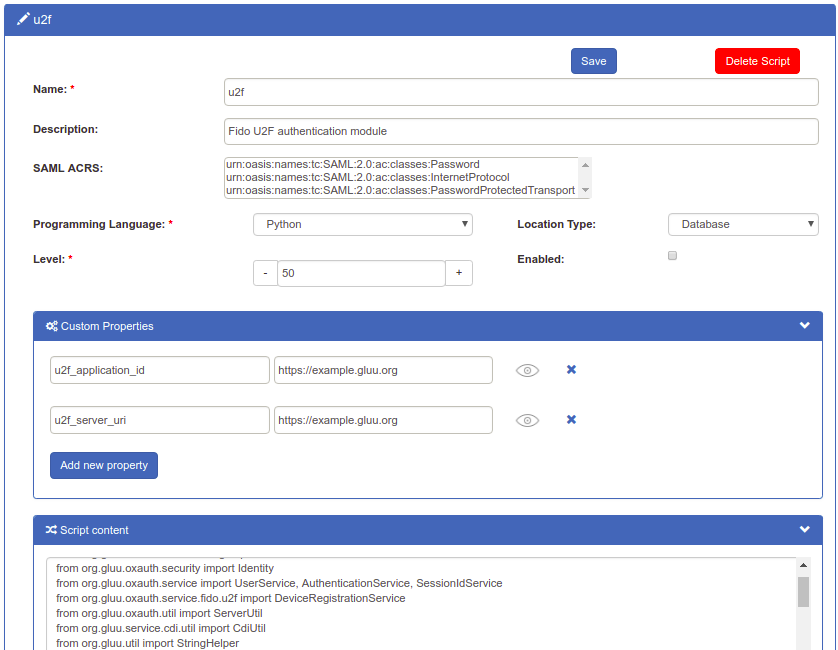

# FIDO U2F

## Overview
FIDO Universal 2nd Factor (U2F) is an open authentication standard that strengthens and simplifies two-factor authentication using specialized USB or NFC devices. 

This document explains how to use the Gluu Server's included 
[U2F interception script](https://raw.githubusercontent.com/GluuFederation/oxAuth/master/Server/integrations/u2f/U2fExternalAuthenticator.py) 
to implement a two-step, two-factor authentication (2FA) process with username / password as the first step, and any U2F device as the second step. 

!!! Note 
    For more background on U2F, including a discussion of its security advantages, visit the [Yubico blog](https://www.yubico.com/solutions/fido-u2f/). 

## Prerequisites
- A Gluu Server ([installation instructions](../installation-guide/index.md));      
- [U2F interception script](https://github.com/GluuFederation/oxAuth/blob/master/Server/integrations/u2f/U2fExternalAuthenticator.py) (included in the default Gluu Server distribution);     
- At least one U2F device for testing, like one of the devices [listed below](#u2f-devices). 
- For Linux based operating system, a little modification required in udev rule, that is stated [below](#u2f-linux).

### U2F Devices
Some well known U2F devices and manufacturers include:           

- [Yubico](https://www.yubico.com/)      
- [Vasco DIGIPASS SecureClick](https://www.vasco.com/products/two-factor-authenticators/hardware/one-button/digipass-secureclick.html)   
- [HyperFIDO](http://hyperfido.com/)       
- [Feitian Technologies](http://www.ftsafe.com/)      

[Purchase U2F devices on Amazon](https://www.amazon.com/s/ref=nb_sb_noss/146-0120855-4781335?url=search-alias%3Daps&field-keywords=u2f). Or, check [FIDO's certified products](https://fidoalliance.org/certification/fido-certified-products/) for a comprehensive list of U2F devices (sort by `Specification` == `U2F`). 

## Properties
The script has the following properties

|	Property	|	Description		|	Example	|
|-----------------------|-------------------------------|---------------|
|u2f_application_id		|Unique Identifer, normally url of IDP		|`https://idp.mycompany.com`|
|u2f_server_uri		|URL of the oxAuth U2F server|`https://idp.mycompany.com`|

## Enable U2F

Follow the steps below to enable U2F authentication:

1. Navigate to `Configuration` > `Manage Custom Scripts`.    

1. Click on the `Person Authentication` tab       

1. Find the U2F script       

1. Enable the script by checking the box       

1. Scroll to the bottom of the page and click `Update`

Now U2F is an available authentication mechanism for your Gluu Server. This means that, using OpenID Connect `acr_values`, applications can now request U2F authentication for users. 

!!! Note 
    To make sure U2F has been enabled successfully, you can check your Gluu Server's OpenID Connect 
    configuration by navigating to the following URL: `https://<hostname>/.well-known/openid-configuration`. 
    Find `"acr_values_supported":` and you should see `"u2f"`. 

## Make U2F the Default

If U2F should be the default authentication mechanism, follow these instructions: 

1. Navigate to `Configuration` > `Manage Authentication`. 

1. Select the `Default Authentication Method` tab. 

1. In the Default Authentication Method window you will see two options: `Default acr` and `oxTrust acr`. 

 - `oxTrust acr` sets the authentication mechanism for accessing the oxTrust dashboard GUI (only managers should have acccess to oxTrust).    

 - `Default acr` sets the default authentication mechanism for accessing all applications that leverage your Gluu Server for authentication (unless otherwise specified).    

If U2F should be the default authentication mechanism for all access, change both fields to U2F.  

!!! Note
    If U2F is set as a default authentication mechanism users will **not** be able to access the protected resource(s) while using a mobile device or a browser that does not support U2F (e.g. Internet Explorer).  

## U2F Login Page
Below is an illustration of the Gluu Server's default U2F login page:

The design is being rendered from the [U2F xhtml page](https://github.com/GluuFederation/oxAuth/blob/master/Server/src/main/webapp/auth/u2f/login.xhtml). To customize the look and feel of this page, follow the [customization guide](../operation/custom-design.md). 

## Using U2F Tokens 

### Credential Enrollment
U2F device enrollment happens during the first authentication attempt. 

### Subsequent Authentications
All subsequent U2F authentications for that user account will require the enrolled U2F key. 

### U2F Credential Management
A users FIDO U2F devices can be removed by a Gluu administrator either via the oxTrust UI in `Users` > `Manage People`, or in LDAP under the user entry as shown in the below screenshot. 

## U2F Discovery Endpoint
A discovery document for U2F is published by the Gluu Server at: `https://<hostname>/.well-known/fido-configuration` This document specifies the URL of the registration and authentication endpoints. The endpoint was `https://<hostname>/.well-known/fido-2fa-configuration` in previous versions, but has been deprecated in version 3.1.6.

## U2F SCIM APIs
For a discussion of how to manage FIDO devices using the SCIM protocol, see the [SCIM documentation](../user-management/scim2.md#fido-devices). 

## U2F Linux 

From your terminal run below commands and reboot your computer. 

  - `sudo curl https://hypersecu.com/downloads/files/configurations/70-u2f.rules > /etc/udev/rules.d/70-u2f.rules`
  - `chmod +x /etc/udev/rules.d/70-u2f.rules`

## Self-service account security

To offer end-users a portal where they can manage their own account security preferences, including two-factor authentication credentials like U2F keys, check out our new app, [Gluu Casa](https://casa.gluu.org). 
