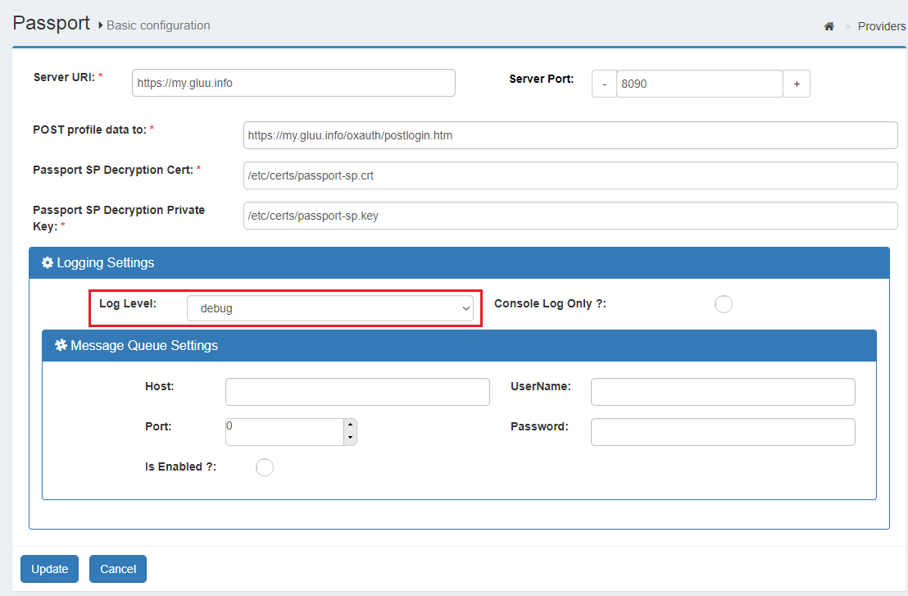
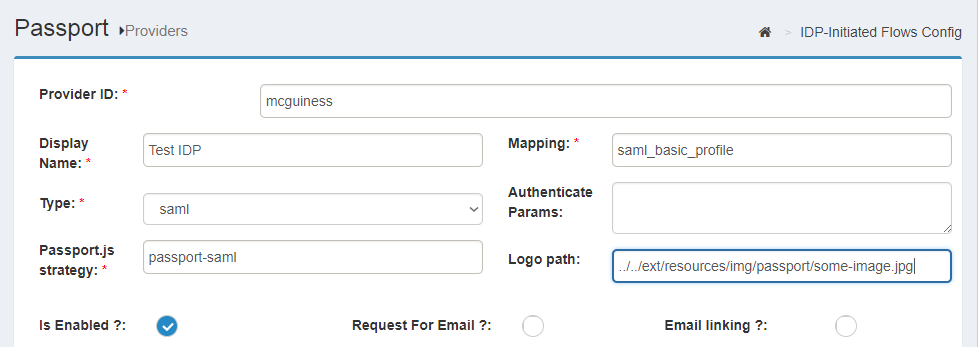

# Inbound identity using Passport

## Overview

The Gluu Server bundles the [Passport.js authentication middleware](https://passportjs.org) project to support "inbound identity" from external SAML, OAuth, and OpenID Connect providers. With inbound identity, users can be sent to external identity providers (where they presumably already have user accounts) for authentication and dynamic registration. 

The integration consists of the Passport Node.js application and a couple of custom interception scripts and pages for oxAuth, which together coordinate the flows and interfaces required to configure the Gluu Server to support inbound identity with a range of external providers.

!!! Note
    From Gluu Server CE 4.0 onwards, all inbound identity configurations can be made in the oxTrust admin UI.
 
## Passport setup

Passport is available as an optional component during [Gluu Server installation](https://gluu.org/docs/ce/installation-guide/). After installation, Passport can be added to an existing Gluu Server installation by performing the following actions (requires Internet access):

1. Log in to the Gluu Server chroot

1. cd to `/install/community-edition-setup`

1. wget `https://raw.githubusercontent.com/GluuFederation/community-edition-setup/master/post-setup-add-components.py`

1. `chmod +x post-setup-add-components.py` 

1. Run `./post-setup-add-components.py -addpassport`

1. Run `runuser -l node -c "cd /opt/gluu/node/passport/&&PATH=$PATH:/opt/node/bin npm install -P"`


## Sample authentication flow

The following is a high-level diagram depicting a typical inbound identity user authentication and provisioning workflow:

 

1. User attempts to access an application protected by Gluu 
1. Without a session, the user's browser is redirected to a page showing a list where he can choose the identity provider he wants to use for login (eg. a SAML IDP or a OIDC OP). 
1. User is taken to the external site, where he is asked for login credentials.
1. Upon successful authentication, a redirection is made to the Passport Node app where user's profile data is gathered.
1. Attribute mapping is performed upon profile data so it is suitable for LDAP insertion
1. Passport securely sends relevant profile data to Gluu's authentication component (oxAuth)
1. If the user does not exist already in local Gluu LDAP, it is created with the attributes present in profile data (if already existing, the profile is updated)
1. A session is created for the user at the authorization server. The user access the application.

Later, in the [Inbound flow revisited](#inbound-flow-revisited) section, more specific details are provided. Methods to alter the standard flow are also presented.

## Supported providers

Out of the box, the following external identity providers can be integrated:

- SAML IDPs
- OpenId Connect OPs (with standard communication or via Gluu's mediator [oxd server](https://gluu.org/docs/oxd/))
- OAuth (v1.0 or v2.0) Authorization Servers

A typical usage of OAuth inbound identity is for supporting social login, ie. making your users log in to your application by using their existing accounts at popular sites like Facebook, Twitter, Github, etc.

### Identifiers

When adding a provider, administrators will be asked to assign an ID to it. Instead of automatically generate one, we decided to let admins enter a value explicitly. This is for convenience since IDs end up being part of URLs and even ldap data such as the `oxExternalUid` attribute used to correlate external accounts with local accounts. Ideally IDs should be short, compact, and self explanatory instead of random obscure strings.

### Strategies

Gluu Passport is built upon the popular authentication middleware [Passport.js](http://www.passportjs.org/), which supports plugins (AKA "*Strategies*") that allow integration of identity providers easily. There are hundreds of strategies available in [npm](https://www.npmjs.com/) (the Node.js Package Registry). You can integrate any strategy as long as it is under the OAuth umbrella.


## Passport configuration

For most inbound identity needs, we provide an easy point-and-click solution to configure setup. To learn how to integrate and configure inbound identity for **SAML providers** visit [this](./inbound-saml-passport.md) page. For **OpenID connect and OAuth providers** find the relevant contents [here](./inbound-oauth-passport.md).

At a high level the following can be performed directly via the admin UI:

- Enabling passport
- Setting global configuration parameters, such as [logging](#logging) behavior
- Adding identity providers (specifying underlying Passport.js strategy, parameterization, and attribute mapping/transformation file)
- Managing identity providers (disabling, removal, etc.)
- Setting configuration parameters for [IDP-initiated flows](./inbound-saml-passport.md#idp-initiated-inbound-flow) (SAML IDPs only)
 
### Logging

#### Files and severity level

In Gluu chroot, Passport logs can be found in directory `/opt/gluu/node/passport/logs`. By default, severity of messages logged is `INFO`. You can change this by using the steps below:

1. In oxTrust, navigate to `Passport` > `Basic Configuration`

1. Set the log level in the  "Logging settings" section

1. Press the `update` button

 

!!! Note
    The `console log only` option sends all messages to `stdout` and prevents messages from being written to log files or the message queue. 

In addition to Passport logs, the log statements of the custom script are key (they contain statements about every step of the [flow](#sample-authentication-flow)). You can find them in the `/opt/gluu/jetty/oxauth/logs/oxauth_script.log` file.
    
#### Logging to a messaging system

Besides log files, administrators can send log statements to a messaging server that support the [STOMP](http://stomp.github.io/) protocol such as [Apache ActiveMQ](http://activemq.apache.org). To do so, simply enter the required data in `Message Queue settings` panel and tick the "Is enabled" checkbox.

Ensure the host and port are accessible from the machine running your Passport instance, finally press update. Messages will be sent to a queue named "oauth2.audit.logging".

You can disable forwarding of messages at any time by unchecking the "Is enabled" form field.

## Attribute mapping and transformation

Attribute mapping is the process of taking the user's attributes released by the external identity provider and assign those to internal Gluu attributes (LDAP attributes in this case). 

In previous Passport versions (3.1.x), specifying attribute mapping required a series of manual tasks in different places. We revamped this process to make it more streamlined:

- Attribute mapping is specified at a single place
- Out of the box, includes several mappings to choose from
- Mappings can be added at will with no restriction
- Every provider configured can use any existing mapping
- Attribute transformations can take place in the attribute mapping itself (this is useful to solve formatting mismatches or generating values based on the original profile data or from an external source)

See our tutorial for [attribute mapping and transformation](../tutorials/passport-attributes-mapping.md) to learn the new process.

### Default mappings

Passport already bundles several mappings by default. Most of them are targeted at social login and are proven to work for most use cases. `saml_basic_profile` and `saml_ldap_profile` are generic mappings inspired on the SAML basic and SAML X.500 attribute profiles, respectively. `oxd-default` and `opendidconnect-default` are intended for use when the `passport-oxd` and `passport-openidconnect` strategies are employed to integrate OPs.

!!! Warning
    Do not edit out-of-the-box mappings. Instead, create your own versions based on existing files. See the [tutorial](../tutorials/passport-attributes-mapping.md).

## Inbound flow revisited

!!! Note
    This section assumes you have already onboarded (integrated) one or more external providers in Passport. If you haven't done so, visit [this page](./inbound-saml-passport.md) (for SAML providers) or visit [this page](./inbound-oauth-passport.md) (for OpenID connect and OAuth providers).

### How user onboarding works

As stated in the [sample flow](#sample-authentication-flow), after a user has logged in at an external provider a new record is added in local LDAP - or updated if the user is known. 

To determine if a user was already added, a string is composed with the provider name and the user ID. For example, if user "MrBrown123" has logged in at Twitter, the string would look like `passport-twitter:mrbrown123`. An LDAP search is performed for a match in the people branch for an entry where attribute `oxExternalUid` equals `passport-twitter:mrbrown123`.

If there are no matches, an entry is added using the values received from the external provider (after having applied the corresponding attribute mapping) attaching the computed value for `oxExternalUid`. The user profile can contain single or multivalued attributes.

### Altering flow behavior

There are a couple of ways to modify the behavior of the authentication flow. However, these are minor flow changes. For changes not covered in this section, open a [support ticket](https://support.gluu.org) for further assistance. Customization may require programming skills in languages such as Python, Java, and Node.js.

!!! Warning
    Wait at least 1 minute before testing all modications to give the server time to pick up configuration changes.

#### Requiring email in profile

The default implementation does not impose constraints around attributes requiredness other than `uid`. To flag `mail` as required, you can specify so in your registered provider:

- In oxTrust, navigate to `Passport` > `Providers` and click on the provider of interest
- Tick the `Request For Email` checkbox
- Hit Update button

After this change, to complete the login flow, a newcomer will be shown a page to enter their email after authenticating at the external provider (this won't be needed for subsequent logins.) The value entered is stored in the LDAP `mail` attribute. However, if an existing user has the same email assigned already, authentication will fail.  

External providers may prompt users to authorize the release of personal attributes to applications, so depending on user settings the value may be present or not. This means that even if `requestForEmail` is enabled, there may be cases where users are not prompted because this piece of data is already known.

#### Email account linking

There are cases in which an external provider is trusted, so you can change the default behavior of adding a new user entry locally, but binding an existing account to the person logging in. This linking can be done via `mail` attribute.

For example, suppose you have 3 users in your Gluu local LDAP: Larry (`larry@acme.com`), Moe (`moe@acme.com`), and Curly (`curly@acme.com`). When you enable email account linking for provider "XYZ" and certain user logs in through XYZ to access your application, he will be logged as Moe as long as his email is "moe@acme.com" at XYZ.

To enable account linking, follow these steps:

- In oxTrust, navigate to `Passport` > `Providers` and click on the provider of interest
- Tick the `Email Linking` checkbox
- Hit Update button

!!! Note
    Only enable this feature for trusted providers and do not enable `Request For Email` at the same time since this opens a big security hole.

#### Preselecting an external provider

In some cases, administrators might not want to show a selection list of external identity providers, instead directing a user to a specific external provider. In this case, a customized OIDC authorization request has to be sent to Gluu in order to pass the desired provider. For this purpose a custom parameter for authorization requests has to be added and the corresponding passport script should be parameterized accordingly.

1. Create a custom parameter for authorization request
    
    - Log into oxTrust and navigate to `Configuration` > `JSON configuration` > `oxAuth configuration`
    - Scroll down to `authorizationRequestCustomAllowedParameters` and click the plus icon
    - Enter a name for the custom parameter you are adding, e.g. `preselectedExternalProvider`
    - Save the configuration     
    
1. Parameterize the Passport custom script to read the custom parameter

    - Navigate to `Configuration` > `Custom scripts`   
    - In the `Person Authentication` tab, expand the script labelled `passport_social` (or `passport_saml` if you are using inbound SAML)   
    - Click `Add new property` and enter `authz_req_param_provider` in the left field      
    - In the right field, enter the name of the custom parameter (e.g. `preselectedExternalProvider`)

Now applications can send a request to start the authorization process the following way (acquaintance with OpenID connect authorization requests is assumed):

```
https://<domain-name>/oxauth/authorize.htm?response_type=code+...&client_id=...
   &scope=openid+...&redirect_uri=...&state=...
   &acr_values=passport_social
   &preselectedExternalProvider=<base64-url-encoded-provider-object>
```

Where `<base64-url-encoded-provider-object>` is the Base64-encoded representation of a small JSON content that looking like this:

```
{ "provider" : <provider-ID> }
```

In this case, `<provider-ID>` is the identifier assigned to the provider already added in Passport:

- In oxTrust, navigate to `Passport` > `Providers` 
- Check column ID for the row that represents the provider of interest


#### IDP-initiated inbound flow

This feature is specific to SAML providers. Check [here](./inbound-saml-passport.md#idp-initiated-inbound-flow) to learn more.

### Implementing discovery ("WAYF")

External provider discovery or IDP Discovery refers to the process of determining which identity provider users should be sent to for authentication (also known as: "Where Are You From", or WAYF). There are many ways to achieve this, but the following methods are most commonly used in practice.

#### Discovery based on supplied email address

Email-based discovery, or "identifier-first" login, relies on an email address to discover where to send an user for authentication. It can be implemented as follows:

1. Users are asked for an email address which they usually use for logging in their home IDP/OP.

1. The domain name part of the email address is parsed and evaluated; the domain name part is a sub-string of the email address following the "@" character.

1. Check if such IDP/OP is known. If so, an OpenID Connect authorization request URL can be built by supplying the IDP ID in a custom parameter (as described [here](#preselecting-an-external-provider)).

1. The user is redirected to the URL triggering the Inbound flow.

1. In oxAuth, the `passport_saml` or `passport_social` authentication script parsesthe custom parameter, and the flow proceeds to the designated provider.

#### Landing page discovery

If you do not mind exposing the list of your external identity provider partners, you can allow users to choose which provider suits their needs best by displaying all providers you trust. This is the standard behavior in Gluu Server with Passport.

####  Discovery based on sub-domain or sub-directory

If you provide a dedicated sub-domain or sub-path namespace to your customers or partners (URLs like `https://customer1.mydomain.com` or `https://mydomain.com/customer1` illustrate this approach), then you can perform discovery based on this as well. When an unauthenticated user tries to access any protected resources related to those dedicated namespaces, an appropriate IDP/OP related to it can be looked up in a configuration file and its ID encoded into a custom parameter of the authorization request before redirecting the user to Gluu Server.

## About logo images

Out of the box the providers selection page will show on the right pane a list of the currently enabled configured providers. Only their logo and display name are visualized. The instructions below explain how to specify/change a logo image for an identity provider:

1. Log in to the Gluu chroot

1. `cd` to  `/opt/gluu/jetty/oxauth/custom/static`

1. Create a directory to store images, eg. `mkdir img` (if not existing)

1. Create a Passport directory, eg. `mkdir passport` (if not existing)

1. Copy the image to `passport` directory, eg. `/opt/gluu/jetty/oxauth/custom/static/img/passport`

1. In oxTrust, navigate to `Passport` > `Providers` and click on the row for the provider of interest

1. In the logo field supply `../../ext/resources/img/passport/<image-name>` where `<image-name>` is the name of the file you transfered to your Gluu VM.

1. Wait 1 minute, then verify the image appears correctly by acessing your application in a browser.

Alternatively you can use an absolute URL for logo if the image is hosted elsewhere (e.g. `https://another.site.co/path/to/image`).

 

