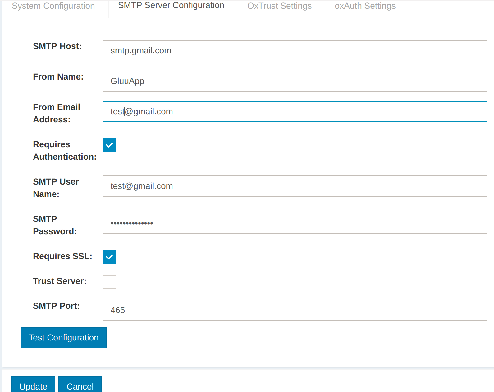
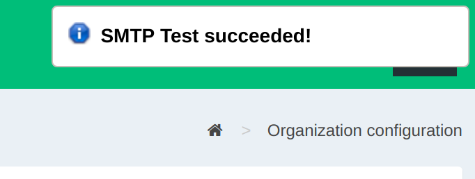
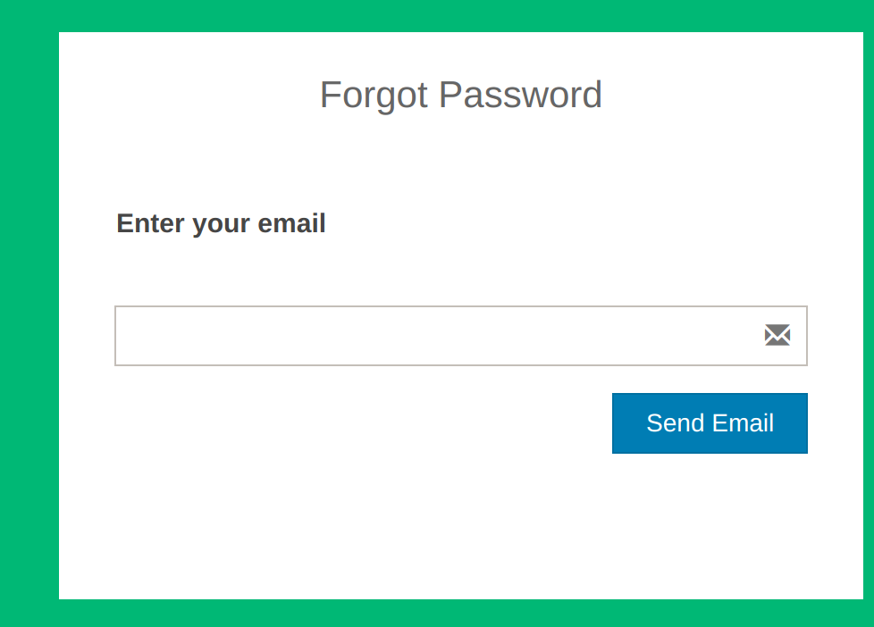

# Forgot Password

## Overview

An administrator can configure the Gluu Server's built-in Forgot Password feature by following these steps:

1. Provide the SMTP Server configuration
1. Enable password reset on OxTrust adminUI
1. Test

### Security concerns

Forgot Password is a feature of oxTrust, the admin GUI for the Gluu Server. In most production deployments, oxTrust should **not** be accessible via the Internet. It's simply too powerful. Because so, under most circumstances we instead recommend following the [Forgot Password using SCIM tutorial](../tutorials/forgot-pw.md). 

For more information on oxTrust security recommendations, visit the [security tips doc](../operation/security.md#securing-oxtrust)

## Prerequisites

The following are requirements to use this feature:  

1. An active Gluu Server instance with oxTrust accessible via the web
1. A working SMTP Server  

## Provide the SMTP Server Configuration

The Gluu Server requires an SMTP server to be able to send password reset emails to the user's mailbox. 
A suitable UI is provided to gather the SMTP server configuation on Gluu OxTrust AdminUI.

1. Log into the Gluu Server as a user with admin privileges

1. Navigate to `Configuration` > `Organization Configuration`

1. Select the `SMTP Server Configuration` tab
  

1. Fill the form with correct values according to your SMTP Server settings
  

1. Click the `Test Configuration` button to ensure the SMTP server is working: 
If the configuration is correct, then you will see a successful message like this:

1. Click the `Update` button to save changes
  
## Enable Password Reset on OxTrust 

1. Navigate to `Configuration` > `Organization Configuration`

1. Select the `System Configuration` tab

1. Enable `Self-Service Password Reset` 
  

1. Click the `Update` button to save changes

## Test

1. Create a test user in the Gluu Server

1. Go to the Gluu Server login page

1. Click the `Forgot your Password?` link
  
  
1. Fill the form with the user email and click the `Send Mail` button
  
  
1. You'll get the following result:
  
  
1. Check the user's mailbox  
  

