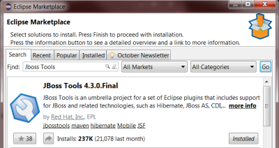
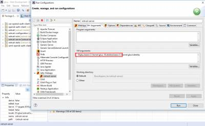

# How to Build oxTrust with Eclipse

## Overview

This section of the document discusses how to build oxTrust using Eclipse. This guide can be followed by developers and architects to code and customize oxTrust.

## Building oxTrust With Eclipse
!!! Note 
    this installation procedure assumes you have a local VM running an instance of the Gluu Server CE. 

Gluu CE installation is discussed in the [Installation Guide](../installation-guide/install/#install-gluu-server-package).

Testing and Beta release can be found here: [Beta Release](https://ox.gluu.org/doku.php?id=qa:platforms )

### Summary
Here is a quick summary: 

We will be building latest branch 

```
# wget https://repo.gluu.org/centos/Gluu-centos7.repo -O /etc/yum.repos.d/Gluu.repo 

# wget https://repo.gluu.org/centos/RPM-GPG-KEY-GLUU -O /etc/pki/rpm-gpg/RPM-GPG-KEY-GLUU 

# rpm –import /etc/pki/rpm-gpg/RPM-GPG-KEY-GLUU 

# yum clean all 

# yum install gluu-server

# /sbin/gluu-serverd start 

# /sbin/gluu-serverd enable 

# /sbin/gluu-serverd login 
```
!!! Note: 
    This documentation is prepared based on CentOS, follow the appropriate installation guide based on your OS.
    
Gluu Server will run in chroot

```
# cd /install/community-edition-setup/ 

# ./setup.py 
```
You can mostly go with default values, however I suggest you make sure that oxTrust and LDAP servers 
are installed, and oxAuth is not. 

Install oxAuth OAuth2 Authorization Server? [Yes] : no 

Install oxTrust Admin UI? [Yes] : 

Install LDAP Server? [Yes] : 

Install Apache HTTPD Server [Yes] : no 

Now we need to collect critical configuration files and test data need for development environment: 
```
# mkdir /root/configs/ 

# /opt/opendj/bin/ldapsearch -h localhost -p 1636 -D “cn=directory manager,o=gluu” -w “<LDAP superuser password>” -ZXT -b “o=gluu” “objectclass=*” > /root/configs/everything.ldif 

# cp /etc/gluu/conf/ox-ldap.properties /root/configs/ 

# cp /etc/gluu/conf/salt /root/configs/ 

# cp /opt/gluu/schema/openldap/*.schema /root/configs/

# tar -czf /root/configs.tgz /root/configs 
```
Now leave chroot 
```
# logout 
```

root directory of gluu chroot jail is `/opt/gluu-server/` 

download `/opt/gluu-server/root/configs.tgz` to your machine. 

## Download Software
Download below mentioned required softwares. And this assumes you're using Windows 64-bit operating sytsem. 
If you're using Mac or 32-bit Windows, adjust accordingly. 

### Java
Download [Java 1.8](http://www.oracle.com/technetwork/java/javase/downloads/jdk7-downloads-1880260.html),
When you install it, make sure you install both the JDK and the JRE in `c:\java` (not Program Files). 
Each of these software distributions should just be unzipped under `C:\java\jdk1.8.0_112` on my system. 

Updates your JAVA_HOME environment variable to point to the folder of your jdk, for example 

### Eclipse
Download [Eclipse IDE](http://www.eclipse.org/downloads/packages/eclipse-ide-java-ee-developers/mars1) 
for Java EE Developers 

### Maven
Download the latest [Maven](https://maven.apache.org/download.cgi)binary zip 

### Jetty
Download latest zip of [Jetty 9](http://www.eclipse.org/jetty/download.html) 

### Jython
Download [Jython](http://www.jython.org/downloads.html) and install in `c:\jython2.7.0` 

### Keystore Explorer
This is optional, but convenient. You can find it on [SorceForge](http://keystore-explorer.sourceforge.net/). 

### Memchached
This is optional and for unix is provided, [memchached](https://github.com/memcached).

## Configure Eclipse
### Install JBoss Tools Plugin

In the Help / Eclipse Marketplace menu add “JBoss Tools” 

  

### Set Perspective to Web Development

In the upper right hand corner, select the Web Development perspective from the pop-up menu. 
  

### Set Java 1.8 as JDK

From the Window / Preferences menu, just check the Java / Installed JRE's tab and 
make sure you see your 1.8 JDK (not JRE). 

  

### Add External Maven

Use the external maven you installed, not the built in maven. 
In Window / Preferences, there is a section for Maven. 
Under the Installations section, add the Maven folder you installed in `c:\java`

   

### Install Eclipse Jetty Launcher

You should be able to install Jetty Launcher using either of the methods

If You want to run jetty in Eclipse, you can download and install 
Jetty Launcher from [eclipse marketplace](https://marketplace.eclipse.org/content/eclipse-jetty)

Or Jetty Launcher can be installed directly from eclipse marketplace 

  

### Turn off Validation
Document validation throws a lot of errors, and its better to see these as Warnings. 

   
 
### Import Projects
For each of these sections, you will have to use File / Import and then 
provide the Github URL 

   

And then specify the github url 

   

You can find this URL on github 

 

- [oxTrust](https://github.com/GluuFederation/oxTrust.git)
- [oxAuth](https://github.com/GluuFederation/oxAuth.git)
- [oxCore](https://github.com/GluuFederation/oxCore.git)
- [SCIM Client](https://github.com/GluuFederation/SCIM-Client.git)

After importing all the projects, it will take some time to download and compile all the code. 
When everything is done building, you can set up run configuration for oxTrust to launch using Jetty:

   

Select m2e-wtp webapp folder for deployment in Jetty 

   

Add VM arguments to jetty to specify location of oxTrust configuration. 
You can just create two empty directories for now. 

Those directories will contain gluu configuration and logs: 

   
 
Change jetty version in eclipse plugin to the one you downloaded earlier: 

   

Add configuration listener to oxtrust-server/src/main/webapp/WEB-INF/web.xml: 

   

> ** OxTrust styles are packaged in a separate project oxtrust-static. 
In order for jetty to correcty serve those styles close the oxtrust-static 
project in eclipse and by updating the project under `Maven` >` Update Project` on `oxtrust` > `server project`. **  

## Configuration

To get your oxTrust running, you'll need to copy some file from your Gluu 
Server Community Edition (CE) installation. 

This assumes you've deployed CE, and run `setup.py`, and that its working. 
Add conf subdirectory to the one you referenced in gluu.base VM argument (e.g. `C:\home\gluu\conf\`) 

From the configs.tgz you downloaded earlier extract these files: 

 - configs/ox-ldap.properties
 - configs/salt

into the conf subdirectory you created (e.g. C:\home\gluu\conf\ox-ldap.properties) 

### Install and configure Symas OpenLDAP

1\. Download Silver Edition from [Symas Download](https://downloads.symas.com/products/symas-openldap-directory-silver-edition/)

2\. Create folder for custom Gluu schema: `C:\Program Files (x86)\symas-openldap\etc\openldap\schema`

3\. Copy into custom Gluu schema folder 2 files from CE `/opt/gluu-server/opt/gluu/schema/openldap`

4\. Copy `C:\Program Files (x86)\symas-openldap\etc\openldap\slapd.conf.default` into `C:\Program Files (x86)\symas-openldap\etc\openldap\slapd.conf`

5\. Edit file `C:\Program Files (x86)\symas-openldap\etc\openldap\slapd.conf`
 - Uncommnet next lines:
```
   include		`etc/openldap/schema/ppolicy.schema`
   include		`etc/openldap/schema/cosine.schema`
   include		`etc/openldap/schema/inetorgperson.schema`
   include		`etc/openldap/schema/eduperson.schema`
```
 - Add next include lines:
```
   include		`etc/openldap/gluu/gluu.schema`
   include		`etc/openldap/gluu/custom.schema`
```

 - Uncomment modules:
```
   moduleload	ppolicy.la
   moduleload	unique.la
```

 - Copy from CE file /opt/gluu-server-4.1/opt/symas/etc/openldap/slapd.conf sections into `C:\Program Files (x86)\symas-openldap\etc\openldap\slapd.conf`:
```
   #######################################################################
   # Main Database housing all the o=gluu info
   #######################################################################
   ...
   #######################################################################
   # Site database housing o=site information
   #######################################################################
```
   Hint:
   End last section is after line:
   index	gluuStatus


  - Replace in sections `Main Database` and `Site database`:
     1. `database	mdb` with `database	hdb`
     2. rootpw with your clear text password.
     3. directory location `/opt/gluu/data` with `var/openldap-data`.
  - Remove in sections `Main Database` and `Site database` maxsize option.

6\. Create new DB folders:
  - `C:\Program Files (x86)\symas-openldap\var\openldap-data\main_db`
  - `C:\Program Files (x86)\symas-openldap\var\openldap-data\site_db`

7\. Copy default DB settings (rename DB_CONFIG.default to DB_CONFIG during copy):
  - `C:\Program Files (x86)\symas-openldap\etc\openldap\DB_CONFIG.default` into `C:\Program Files (x86)\symas-openldap\var\openldap-data\main_db\DB_CONFIG`
  - `C:\Program Files (x86)\symas-openldap\etc\openldap\DB_CONFIG.default` into `C:\Program Files (x86)\symas-openldap\var\openldap-data\site_db\DB_CONFIG`

8\. Verify OpenLDAP settings:
```
   slaptest.bat -u -f `C:\Program Files (x86)\symas-openldap\etc\openldap\slapd.conf`
   ...
   config file testing succeeded
```

9\. Now we can try to run OpenLDAP service and connect to LDAP server localhost:389

### Import data from CE into dev LDAP

1\. Export `o=gluu` tree in CE into gluu.ldif
```
export OPENDJ_JAVA_HOME=/opt/jre; /opt/opendj/bin/ldapsearch -h localhost -p 1636  -Z -X -w secret -D `cn=directory manager,o=gluu` -b `o=gluu` objectClass=* > gluu.ldif
```

2\. Load gluu.ldif into dev LDAP and update to conform new environemt

3\. All Gluu applications store setting in LDAP. Hence we need to update their configuration in LDAP

3.1\. We need to change authentication setting: `inum=<appliance_inum>,ou=appliances,o=gluu`. We need to remove IDPAuthentication attribute from this entry.

3.2\. Fix invalid cache setting JSON format in: `inum=<appliance_inum>,ou=appliances,o=gluu`. We need to remove do:
  - Replace IN_MEMORY with `IN_MEMORY`
  - Replace DEFAULT with `DEFAULT`

3.3\. We need to change oxAuth settings: `ou=oxauth,ou=configuration,inum=<appliance_inum>,ou=appliances,o=gluu`. We need to apply next changes to oxAuthConfDynamic attribute value.
  - Replace `https://<ce_host_name>/oxauth` with `https://localhost:8443/oxauth`
  - Replace  `issuer`:`https://<ce_host_name>` with `oxAuthIssuer`:`https://localhost:8443`

3.4\. We need to change oxTrust settings: `ou=oxtrust,ou=configuration,inum=<appliance_inum>,ou=appliances,o=gluu`. We need to apply next changes to oxTrustConfApplication attribute value.
  - Replace `https://<ce_host_name>/identity` with `https://localhost:8453/identity`
  - Replace `https://<ce_host_name>/oxauth` with `https://localhost:8443/oxauth`
  - Replace  `oxAuthIssuer`:`https://<ce_host_name>` with `oxAuthIssuer`:`https://localhost:8443/oxauth`
  - Replace  `umaIssuer`:`https://<ce_host_name>` with `umaIssuer`:`https://localhost:8443/oxauth`

3.5\. Fix oxTrust oxAuth client settings: `inum=<org_inum>!0008!8CF0.83A5,ou=clients,o=<org_inum>,o=gluu`. We need to add next attribute values:
  - oxAuthRedirectURI: https://localhost:8453/identity/authentication/authcode
  - oxAuthPostLogoutRedirectURI: https://localhost:8453/identity/authentication/finishlogout

### Start oxAuth under Jetty in Eclipse

1\. We need to create new Jetty Webapp configuration run oxAuth under Jetty on HTTPS port 8443

2\. We need to create new Jetty Webapp configuration run oxTrus under Jetty on HTTPS port 8453

3\. Before running both application we new to add VM argument (on Arguments tab): `-Dgluu.base=<path_to_folder_with_ox_conf_folder>`. It should specify path with 'conf' folder which contains 'ox-ldap.properties' and 'salt' files

4\. Start applications in next order: oxAuth, oxTrust

5\. Open in browser: `https://localhost:8453/identity`
