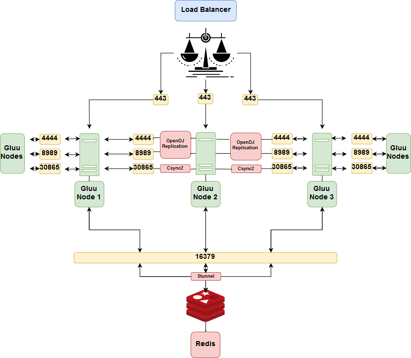

# Manual Gluu Server Clustering

## Introduction
If you require high availability (HA) or failover, follow the instructions below to manually configure multi-master replication (MMR) across multiple Gluu Servers.

Gluu also offers a tool to automate the steps below, called [Cluster Manager](https://gluu.org/docs/cm). Cluster Manager is licensed under the [Gluu Support license](https://github.com/GluuFederation/cluster-mgr/blob/master/LICENSE), which requires a Gluu support contract for use in production. All organizations may use Cluster Manager for development purposes.  

## Concept

Clustering uses OpenDJ replication and configuration changes to greatly improve Gluu Server availability, via a proxy.



## Prerequisites

### Ports
The following ports are used by different components to communicate with their peers at other nodes of a cluster. Additional configuration may be needed to ensure they can be reached by incoming connections.

|Port| Application| Relation |
-----|------------- | ---
| 22 | SSH | Utility |
| 443| SSL/TLS | Load-balancer to oxAuth |
|4444| OpenDJ Replication| Between Gluu Servers |
|16379| Redis Server through stunnel | From oxAuth to stunnel to Redis |
|8989| OpenDJ Replication|  Between Gluu Servers |
|30865| Csync2 Default |  Between Gluu Servers |

### Software

- For the purpose of this tutorial, the server configurations are as follows:
      
```bash
45.55.232.15    loadbalancer.example.org (NGINX server)
159.203.126.10  cluster.example.org (Gluu Server 3.1.6 on Ubuntu 16.04 ) (Node -1 )
138.197.65.243  cluster.example.org (Gluu Server 3.1.6 on Ubuntu 16.04 ) (Node -2 )
All server nodes will have the same hostname
197.122.32.421  redis.example.org (Redis Server)
```
     
Some prerequisites are necessary for setting up Gluu with delta-syncrepl MMR:   

- A minimum of four (4) servers or VMs: two (2) for Gluu Servers, one (1) for load balancing (in our example, NGINX), and one for redis.

- A separate NGINX server is necessary because replicating a Gluu server to a different hostname breaks the functionality of the Gluu web page when using a hostname other than what is in the certificates. For example, if you use cluster.example.com as the host and copy that to a second server (e.g. 138.197.65.243), the process of accessing the site on cluster.example.com, even with replication, will fail authentication due to a hostname conflict. So if node 1 fails, you won't be able to use Gluu Server effectively.

- To create the following instructions we used Ubuntu 16.04 ( Ubuntu 18.04 is supported)     

- To create the following instructions we used an NGINX load balancer/proxy, however if you have your own load balancer, like F5 or Cisco, you should use that instead and disregard the instructions about configuring NGINX   

- Gluu Server 3.1.6 using OpenDJ 

- Redis-server for caching short-lived tokens   

- JXplorer or a similar LDAP browser for editing LDAP   

## Instructions

### Install Gluu

- First, [install Gluu](https://gluu.org/docs/ce/installation-guide/install/) on one of the servers, node 1. It will be referred to as the "primary" for the sake of simplification. Once everything is configured, there will be no primary in the multi-master configuration.

- On all of the non-primary Gluu Cluster members (not the NGINX server, or the redis server), [download the Gluu packages](https://gluu.org/docs/ce/installation-guide/install/) but **don't run `setup.py` yet**!   

- On the primary Gluu Server, log in to the chroot and cd to `/install/community-edition-setup/`

- After setup was completed on the primary server, node 1, a file named "setup.properties.last" was created in the same directory. Copy the `/install/community-edition-setup/setup.properties.last` file from the first install to the other server, node 2, as `setup.properties`. This will allow same configuration to be maintained across all nodes. Here, SSH access allows copying the file to other servers outside the Gluu chroot.

If the `scp` command is not yet on the server, install `openssh-client`:

```bash
apt-get install openssh-client
```

!!! Note
    Make sure that all hosts files are configured to point the IPs of all IDPs and the loadbalancer to the corresponding hostnames.
 
#### Loadbalancer `/etc/hosts`
    
```bash
45.55.232.15    loadbalancer.example.org (NGINX server) -- for us this has not been setup yet
197.122.32.421  redis.example.org (Redis Server) -- for us this has not been setup yet
```
    
#### Redis `/etc/hosts`
    
```bash
45.55.232.15    loadbalancer.example.org (NGINX server) -- for us this has not been setup yet
197.122.32.421  redis.example.org (Redis Server) -- for us this has not been setup yet
```
    
#### Node 1 `/etc/hosts`
    
```bash
45.55.232.15    loadbalancer.example.org (NGINX server) -- for us this has not been setup yet
197.122.32.421  redis.example.org (Redis Server) -- for us this has not been setup yet
159.203.126.10  cluster.example.org (Gluu Server 3.1.6 on Ubuntu 16.04) (Node 1)
```
    
#### Node 2 `/etc/hosts`
    
```bash

45.55.232.15    loadbalancer.example.org (NGINX server) -- for us this has not been setup yet
197.122.32.421  redis.example.org (Redis Server) -- for us this has not been setup yet
138.197.65.243  cluster.example.org (Gluu Server 3.1.6 on Ubuntu 16.04) (Node 2)
```
    
!!! Warning
    **Do not add the nodes' IPs in the `/etc/hosts` file of your Gluu container**. They are configured automatically.
        
Otherwise, continue to the following command changing `myuser@138.197.65.243` to the login credentials for each Gluu node your sending it to :

```bash
scp /opt/gluu-server-3.1.6/install/community-edition-setup/setup.properties.last myuser@138.197.65.243:/opt/gluu-server-3.1.6/install/community-edition-setup/setup.properties
```

If this throws a `Permission denied` error, that means the user, here `myuser`, does not have permission to write in the directory. Use the following command at the node you are trying to send the file to, here that is `138.197.65.243`. Change `<user>` to the user used in the command above, here `myuser`.

```bash
chown <user> /opt/gluu-server-3.1.6/install/community-edition-setup/
```

For security, the `<user>` should always be set back to `root`, so after finishing the file transfer, run the command again with `root` as `<user>`.

```bash
chown root /opt/gluu-server-3.1.6/install/community-edition-setup/
```

- If the Gluu server has not been started, start it and log in. Once the `setup.properties` file is in place on the **other** node(s), modify the IP to the current node. In the example, there is only one, so we changed our `ip=159.203.126.10` of node 1 to the IP of node 2 server which is `ip=138.197.65.243.

```bash
service gluu-server-3.1.6 start
service gluu-server-3.1.6 login
Gluu.Root # vi /install/community-edition-setup/setup.properties
setup.properties

...
passport_rs_client_jks_pass=xmQNp8RRuP0P
cmd_jar=/opt/jre/bin/jar
oxauth_openid_jks_pass=t1j5ykEaHFs1
idp3WebappFolder=/opt/shibboleth-idp/webapp
countryCode=US
ip=138.197.65.243						<------ changed this from 159.203.126.10 to the current server IP
opendj_ldap_binddn=cn\=directory manager
installSaml=False
sysemProfile=/etc/profile
ldap_setup_properties=./templates/opendj-setup.properties
default_openid_jks_dn_name=CN\=oxAuth CA Certificates
oxtrust_config_json=./output/oxtrust-config.json
openldapTLSCACert=/etc/certs/openldap.pem
installJce=True
ldapPassFn=/home/ldap/.pw
...
```

- Now run `setup.py`.   

```bash
cd /install/community-edition-setup
./setup.py
```

- The rest of the configuration for the install should be automatically loaded, as shown below. Just press `Enter`.

```bash
Installing Gluu Server...
Detected OS  :  ubuntu
Detected init:  systemd
Detected Apache:  2.4

Installing Gluu Server...

For more info see:
  ./setup.log
  ./setup_error.log


** All clear text passwords contained in ./setup.properties.last.


hostname                                             cluster.example.org
orgName                                                 Example Inc.
os                                                         ubuntu
city                                                       Austin
state                                                          Tx
countryCode                                                    US
support email                                    support@example.org
Applications max ram                                         3072
Admin Pass                                                   test
Install oxAuth                                               True
Install oxTrust                                              True
Install LDAP                                                 True
Install Apache 2 web server                                  True
Install Shibboleth SAML IDP                                 False
Install oxAuth RP                                           False
Install Passport                                            False


Proceed with these values [Y|n]
```

### Replication

- Run the commands below in the Gluu container for all **Nodes**, here that would be for `159.203.126.10` and `138.197.65.243`:

  Any attempts to log in to the LDAP in any form might result in an instant timeout error, due to Java enabling Endpoint Identification, which disrupts LDAPS connections. Set the default value to `true` by explicitly stating it in the `java.properties` file.

```bash
sed -i 's/dsreplication.java-args=-Xms8m -client/dsreplication.java-args=-Xms8m -client -Dcom.sun.jndi.ldap.object.disableEndpointIdentification=true/g' /opt/opendj/config/java.properties
```
  
To set the new properties, run the command in the Gluu container.

```bash
/opt/opendj/bin/dsjavaproperties
```
   
You should recieve an operation successful message:
   
```bash
The operation was successful.  The server commands will use the java arguments and java home specified in the properties file located in /opt/opendj/config/java.properties
```

We need to make all nodes accessible to each other by setting the listening address to `0.0.0.0`. In your command you may have to change `cn=directory manager` to your CN ( by default `cn=directory manager` unless changed ), and  `<password>` to the password set in the first installation of Gluu on node 1. If the below commands are not connecting, try changing `localhost` to the nodes' explicit IP addresss, here that would be `159.203.126.10` and `138.197.65.243`.
   
**Restart all nodes**
   
Run the following two commands:
   
```bash
/opt/opendj/bin/dsconfig -h localhost -p 4444 -D 'cn=directory manager' -w <password> -n set-administration-connector-prop --set listen-address:0.0.0.0 -X
```
   
```bash
/opt/opendj/bin/dsconfig -h localhost -p 4444 -D 'cn=directory manager' -w <password> -n set-connection-handler-prop --handler-name 'LDAPS Connection Handler' --set enabled:true --set listen-address:0.0.0.0 -X
```
   
**This is the end of commands that had to be initiated in all nodes**
   
- Run the commands below in the Gluu container on the first "primary" Gluu server installed, here that would be `159.203.126.10`:   
 
Utilize this command inside the Gluu container to enable replication changing `<password>`'s to the password of your first installed Gluu server. **You must add all your nodes to this command, here we only have two**

```bash
/opt/opendj/bin/dsreplication enable --host1 159.203.126.10 --port1 4444 --bindDN1 "cn=directory manager" --bindPassword1 <password> --replicationPort1 8989 --host2 138.197.65.243 --port2 4444 --bindDN2 "cn=directory manager" --bindPassword2 <password> --replicationPort2 8989 --adminUID admin --adminPassword <password> --baseDN "o=gluu" -X -n
```

If successful, you'll get a message like this: 

```bash
Establishing connections ..... Done.
Checking registration information ..... Done.
Configuring Replication port on server 159.203.126.10:4444 ..... Done.
Configuring Replication port on server 138.197.65.243:4444 ..... Done.
Updating replication configuration for baseDN o=gluu on server
159.203.126.10:4444 .....Done.
Updating replication configuration for baseDN o=gluu on server
138.197.65.243:4444 .....Done.
Updating registration configuration on server 159.203.126.10:4444 ..... Done.
Updating registration configuration on server 138.197.65.243:4444 ..... Done.
Updating replication configuration for baseDN cn=schema on server
159.203.126.10:4444 .....Done.
Updating replication configuration for baseDN cn=schema on server
138.197.65.243:4444 .....Done.
Initializing registration information on server 138.197.65.243:4444 with the
contents of server 159.203.126.10:4444 .....Done.
Initializing schema on server 138.197.65.243:4444 with the contents of server
159.203.126.10:4444 .....Done.

Replication has been successfully enabled.  Note that for replication to work
you must initialize the contents of the base DNs that are being replicated
(use dsreplication initialize to do so).


See /tmp/opendj-replication-8219363385622666180.log for a detailed log of this
operation.
```

Now initialize replication. Change <password> to the password of the first installed Gluu server. **All nodes must be added to this command** :

```bash
/opt/opendj/bin/dsreplication initialize --baseDN "o=gluu" --adminUID admin --adminPassword <password> --hostSource 159.203.126.10 --portSource 4444  --hostDestination 138.197.65.243 --portDestination 4444 -X -n
```

If successful, it'll look like this: 

```bash
Initializing base DN o=gluu with the contents from 159.203.126.10:4444:
3202 entries processed (23 % complete).
1233321 entries processed (100 % complete).
Base DN initialized successfully.

See /tmp/opendj-replication-7940848656437845148.log for a detailed log of this
operation.
```

Secure communication to all nodes. **Add all nodes to this command**:

```bash
/opt/opendj/bin/dsconfig -h 159.203.126.10 -p 4444 -D "cn=Directory Manager" -w <password> --trustAll -n set-crypto-manager-prop    --set ssl-encryption:true
/opt/opendj/bin/dsconfig -h 138.197.65.243 -p 4444 -D "cn=Directory Manager" -w <password> --trustAll -n set-crypto-manager-prop --set ssl-encryption:true
```

Now archive the OpenDJ keystore:

```bash
cd /opt/opendj/config
   
tar -cf opendj_crts.tar keystore keystore.pin truststore
```
   
Transfer it to the other nodes. The `scp` command will most likely not be installed in the Gluu container, so exit out by typing `exit`. Then transfer `opendj_crts.tar` to all the other nodes.  
   
```bash
scp /opt/gluu-server-3.1.6/opt/opendj/config/opendj_crts.tar  myuser@138.197.65.243:/opt/gluu-server-3.1.6/opt/opendj/config/
```
   
!!! Note
    If you want to check the status of OpenDJ replication run the following command:

```bash
/opt/opendj/bin/dsreplication status -n -X -h 159.203.126.10  -p 4444 -I admin -w <password>
```
           
**This is the end of commands that had to be initiated in the first "primary" node**
   
Run the following commands in all the Gluu container nodes where the archive of OpenDK keystore was sent to:

```bash
cd /opt/opendj/config/
   
tar -xf opendj_crts.tar
```

Next, [install Csync2](https://linuxaria.com/howto/csync2-a-filesystem-syncronization-tool-for-linux) for file system replication on all nodes outside the Gluu container.

```bash
apt-get install csync2
```

- On the "primary" node, here `159.203.126.10`, do the following:
  
  -Generate the key file:
  
```bash
csync2 -k /etc/csync2.key
```
  
- Create an SSL certificate Csync2:
  
```bash
openssl genrsa -out /etc/csync2_ssl_key.pem 1024
openssl req -batch -new -key /etc/csync2_ssl_key.pem -out /etc/csync2_ssl_cert.csr
openssl x509 -req -days 3600 -in /etc/csync2_ssl_cert.csr -signkey /etc/csync2_ssl_key.pem -out /etc/csync2_ssl_cert.pem
```
  
  - Create a `csyn2.conf` file and place all directories to be replicated as in the `csync2.conf` file:
  
```bash
vi /etc/csync2.conf
```
  
  - Add more `host <hostname>` entries, according to the number of nodes you have.
  
**`csync2.conf`**
  
```bash
group gluucluster
{
host 159.203.126.10;
host 138.197.65.243;
 
key /etc/csync2.key;
include /opt/gluu-server-3.1.6/opt/gluu/jetty/identity/conf/shibboleth3/idp/;
include /opt/gluu-server-3.1.6/opt/gluu/jetty/identity/conf/shibboleth3/sp/;
include /opt/gluu-server-3.1.6/opt/shibboleth-idp/conf;
include /opt/gluu-server-3.1.6/opt/shibboleth-idp/metadata/;
include /opt/gluu-server-3.1.6/opt/shibboleth-idp/sp/;
include /opt/gluu-server-3.1.6/opt/shibboleth-idp/temp_metadata/;
include /opt/gluu-server-3.1.6/etc/gluu/conf/;
 
exclude *~ .*;
}
```
  
Copy the contents of `csync2.conf` into the file `csync2.cfg`.
  
```bash
cp /etc/csync2.conf /etc/csync2.cfg
```
  
Copy the Csync2 configuration file, certifications and keys to the all the other nodes, here only `138.197.65.243`. **Make sure you have permission to move all the files, especially `csync2.cfg`**
  
```bash
scp /etc/csync2* user@138.197.65.243:/etc/
```
  
Restart `inetd` on all nodes:
  
```bash
/etc/init.d/openbsd-inetd restart
```
  
You can test the connection at each node by running:
 
```bash
csync2 -T
```
  
- Run the following on **Node 1** `primary`:
  
  - Force files to win conflicts
  
```bash
csync2 -fr /
```
      
  - Start the synchronization process :
      
```bash
csync2 -xvvv
```
 
- Run the following on **All other nodes** :
  
  - Force files to win conflicts
  
```bash
csync2 -fr /
```
      
  - Start the synchronization process :
      
```bash
csync2 -xvvv
```
      
- Add a cron on **all nodes** to sync using `crontab -e`:
  
  - Add a regular cron that runs every 5 mins at all nodes like this :
    
```bash
*/5 * * * * csync2 -x
```
  - For a more complex method, add syncronized crons that run in a near-continuous environment. For example, the first node starts syncing one minute, then the other starts the next, and so forth. With the two-node example, we would do the following: (**This is a very effective way to sync data securely. However, you must know the size of data being moved and program the cron accordingly**) 
  
**Node 1** “At every 10th minute from 0 through 59.”
    
```bash
0-59/10 * * * * csync2 -x
```
    
**Node 2** “At every 10th minute from 5 through 59.” 
    
```bash
5-59/10 * * * * csync2 -x
```
    
Reload cron:
    
```bash
service cron reload
```
  
### Install NGINX

**If you have your own load balancer, use the following NGINX configuration documentation as a guide for how to proxy with the Gluu Server.**

On the load balancer server, install NGINX: 

```bash
apt-get install nginx -y
```

- On the NGINX server, create a directory for the httpd `key` and `crt`:  

```bash
mkdir /etc/nginx/ssl/
```

- Send the `httpd.crt` and `httpd.key` certs from one of the Gluu servers over to the NGINX server. 
  
  - From the first Gluu Server installed, do the following:

```bash
scp /opt/gluu-server-3.1.6/etc/certs/httpd.key user@loadbalancer.example.org:/etc/nginx/ssl/
scp /opt/gluu-server-3.1.6/etc/certs/httpd.crt user@loadbalancer.example.org:/etc/nginx/ssl/
```

  - On the NGINX server in any editor, open `nginx.conf` and edit:

```bash
vi /etc/nginx/nginx.conf
```

  - The following is a working `nginx.conf` example template for a Gluu cluster. Change all marked lines that correspond to your Gluu nodes and NGINX server. 

```bash
events {
        worker_connections 6500;
}

http {
  upstream backend_id {
  ip_hash;
  server 159.203.126.10:443 max_fails=2 fail_timeout=10s;         ---> Change this
  server 138.197.65.243:443 max_fails=2 fail_timeout=10s;         ---> Change this
  }
  upstream backend {
  server 159.203.126.10:443 max_fails=2 fail_timeout=10s;         ---> Change this
  server 138.197.65.243:443 max_fails=2 fail_timeout=10s;         ---> Change this
  }
  server {
    listen       80;
    server_name  loadbalancer.example.org;                          ---> Change this
    return       301 https://loadbalance.example.org$request_uri;   ---> Change this
   }
  server {
    listen 443;
    server_name loadbalancer.example.org;                           ---> Change this

    ssl on;
    ssl_certificate         /etc/nginx/ssl/httpd.crt;
    ssl_certificate_key     /etc/nginx/ssl/httpd.key;

    location ~ ^(/)$ {
      proxy_pass https://backend;
      proxy_redirect          off;
      proxy_next_upstream     error timeout invalid_header http_500;
      proxy_connect_timeout   2;
      proxy_set_header        Host            $host;
      proxy_set_header        X-Real-IP       $remote_addr;
      proxy_set_header        X-Forwarded-For $proxy_add_x_forwarded_for;
    }
    location /.well-known {
        proxy_pass https://backend/.well-known;
        proxy_redirect          off;
        proxy_next_upstream     error timeout invalid_header http_500;
        proxy_connect_timeout   2;
        proxy_set_header        Host            $host;
        proxy_set_header        X-Real-IP       $remote_addr;
        proxy_set_header        X-Forwarded-For $proxy_add_x_forwarded_for;
    }
    location /oxauth {
        proxy_pass https://backend/oxauth;
        proxy_redirect          off;
        proxy_next_upstream     error timeout invalid_header http_500;
        proxy_connect_timeout   2;
        proxy_set_header        Host            $host;
        proxy_set_header        X-Real-IP       $remote_addr;
        proxy_set_header        X-Forwarded-For $proxy_add_x_forwarded_for;
    }
    location /identity {
        proxy_pass https://backend_id/identity;
        proxy_redirect          off;
        proxy_next_upstream     error timeout invalid_header http_500;
        proxy_connect_timeout   2;
        proxy_set_header        Host            $host;
        proxy_set_header        X-Real-IP       $remote_addr;
        proxy_set_header        X-Forwarded-For $proxy_add_x_forwarded_for;
    }
    location /cas {
        proxy_pass https://backend/cas;
        proxy_redirect          off;
        proxy_next_upstream     error timeout invalid_header http_500;
        proxy_connect_timeout   2;
        proxy_set_header        Host            $host;
        proxy_set_header        X-Real-IP       $remote_addr;
        proxy_set_header        X-Forwarded-For $proxy_add_x_forwarded_for;
    }
    location /asimba {
        proxy_pass https://backend/asimba;
        proxy_redirect          off;
        proxy_next_upstream     error timeout invalid_header http_500;
        proxy_connect_timeout   2;
        proxy_set_header        Host            $host;
        proxy_set_header        X-Real-IP       $remote_addr;
        proxy_set_header        X-Forwarded-For $proxy_add_x_forwarded_for;
    }
    location /passport {
        proxy_pass https://backend/passport;
        proxy_redirect          off;
        proxy_next_upstream     error timeout invalid_header http_500;
        proxy_connect_timeout   2;
        proxy_set_header        Host            $host;
        proxy_set_header        X-Real-IP       $remote_addr;
        proxy_set_header        X-Forwarded-For $proxy_add_x_forwarded_for;
    }

  }
}
```

### Install and configure Redis on a separate Ubuntu 18.04 server

!!! Warning
    This **cannot** be configured on your NGINX server, or you'll get routing issues when attempting to cache
    
Redis-server is a memory caching solution created by redis-labs. It's ideal for clustering solutions but needs additional encryption.    

- Now install and configure redis-server on a separate Ubuntu 18.04 server .**You can set up a Redis cluster model and have them installed on all nodes.**

- On the Redis server, here `197.122.32.421  redis.example.org (Redis Server)`, do the following :
  
  
```bash
apt-get update
apt-get install redis-server
```
  
- Edit the Redis binding IP to the localhost IP of the Redis server , that is `127.0.0.1`:
  
```bash
vi /etc/redis/redis.conf
```
  
```bash
# ~~~ WARNING ~~~ If the computer running Redis is directly exposed to the
# internet, binding to all the interfaces is dangerous and will expose the
# instance to everybody on the internet. So by default we uncomment the
# following bind directive, that will force Redis to listen only into
# the IPv4 lookback interface address (this means Redis will be able to
# accept connections only from clients running into the same computer it
# is running).
#
# IF YOU ARE SURE YOU WANT YOUR INSTANCE TO LISTEN TO ALL THE INTERFACES
# JUST COMMENT THE FOLLOWING LINE.
# ~~~~~~~~~~~~~~~~~~~~~~~~~~~~~~~~~~~~~~~~~~~~~~~~~~~~~~~~~~~~~~~~~~~~~~~~
bind 127.0.0.1 ::1
```
 
- While editing the Redis configuration file, add your `password` for more secure communication to the server. Uncomment `requirepass` and place your password:
  
```bash
requirepass chooseyourpasswordcarefully
```
  
- Now restart redis-server:

```bash
/etc/init.d/redis-server restart
```
  
- Check Redis status:

```bash
/etc/init.d/redis-server status
```

The status should be running : 

```
redis-server.service - Advanced key-value store
Loaded: loaded (/lib/systemd/system/redis-server.service; enabled; vendor preset: enabled)
Active: active (running) since Wed 2018-06-27 18:48:52 UTC; 12s ago
  Docs: http://redis.io/documentation,
        man:redis-server(1)
```
  
- Install stunnel to encrypt the redis communications:
  
```bash
apt-get update

apt-get install stunnel4
```
  
- Start the stunnel service by changing `ENABLED=0` to `ENABLED=1` in the `/etc/default/stunnel4` file :
  
```bash
vi /etc/default/stunnel4
```
  
- Create a certificate that will be used across all nodes and Redis server:
  
```bash
openssl genrsa -out /etc/stunnel/key.pem 1024
openssl req -new -x509 -key /etc/stunnel/key.pem -out /etc/stunnel/cert.pem -days 365
```
  
- Combine `key.pem` and `cert.pem` into one file `secureredis.pem`:
  
```bash
cat /etc/stunnel/key.pem /etc/stunnel/cert.pem > /etc/stunnel/secureredis.pem
```
  
- For security, change the file permissions:
  
```bash
chmod 640 /etc/stunnel/key.pem /etc/stunnel/cert.pem /etc/stunnel/secureredis.pem
```
  
- Configure the stunnel redis server configuration file, we will create files for the nodes later:
  
```bash
vi /etc/stunnel/redis-server.conf
```
  
Place the configuration inside this file. `accept` from your external IP and `connect` to the binding IP you placed in the `redis.conf` file. Here we are unifying the connections inside the Redis server, accepting from the external IP and connecting to the `localhost`. This is important for the nodes to easily communicate to the Redis server. **It's a good time to check all servers, ensuring that the `/etc/hosts` file has all the IPs and hostnames as described in the beginning of this file. Remember for the nodes, it's the `/etc/hosts` file outside your Gluu container.
  
```bash
cert = /etc/stunnel/secureredis.pem
pid = /var/run/stunnel.pid
[redis]
accept = 197.122.32.421:16379
connect = 127.0.0.1:16379
```
  
- Start Stunnel service :
  
```bash
/etc/init.d/stunnel4 start
```
  
**This is the end of the commands that had to be done inside the redis server**
  
- On **Node 1** and **Node 2**, here `159.203.126.10` and `138.197.65.243` do the following :

  - Install `redis-tools :
  
```bash
apt-get install redis-tools
```
  
  - Install Stunnel to encrypt the redis communications to the server:
  
```bash
apt-get update

apt-get install stunnel4
```
  
  - Start the Stunnel service by changing `ENABLED=0` to `ENABLED=1` in `/etc/default/stunnel4` file:
  
```bash
vi /etc/default/stunnel4
```
  
  - Copy the `secureredis.pem` created in the redis server to the nodes. From your redis server:
  
```bash
scp /etc/stunnel/secureredis.pem root@159.203.126.10 /etc/stunnel/
 
scp /etc/stunnel/secureredis.pem root@138.197.65.243 /etc/stunnel/
```
  
  - For security, change the file permissions:
  
```bash
chmod 640 /etc/stunnel/secureredis.pem
```
  
  - Configure the Stunnel redis client configuration file:
  
```bash
vi /etc/stunnel/redis-client.conf
```
  
 - Place the configuration files inside this file. `accept` from your external IP and `connect` to the **redis server IP**.
  
**Node 1**
  
```bash
cert = /etc/stunnel/secureredis.pem
pid = /var/run/stunnel.pid
[redis]
accept = 159.203.126.10:16379
connect = 197.122.32.421:16379
```
  
**Node 2**
  
```bash
cert = /etc/stunnel/secureredis.pem
pid = /var/run/stunnel.pid
[redis]
accept = 138.197.65.243:16379
connect = 197.122.32.421:16379
```
  
  - Start the Stunnel service:
  
```bash
/etc/init.d/stunnel4 start
```
  
  - Test that the server is talking to the clients and vice versa:

```bash
redis-cli -h <hostname> -a <password> 
```
  
In the `<hostname>`, both IP (`197.122.32.421`) and hostname (`redis.example.org`) have to be working on all clients and the main redis server. Try to `Ping`, and you should get a `PONG`.

**This is the end of the commands that had to be done on both nodes**
 
!!! Info
    For more information or if you're having trouble, please see [this redis how-to guide.](https://redislabs.com/blog/using-stunnel-to-secure-redis/)

!!! Note
    Redis can also be configured for HA and failover with multiple methods, utilizing [Sentinel](https://redis.io/topics/sentinel) or [Redis-cluster](https://redis.io/topics/cluster-tutorial)

### Modify JSON Entries 

Use JXplorer (or a similar LDAP browser) to modify some of the JSON entries in LDAP for handling accessible caching and multiple authorization servers.      

- In JXplorer, you can connect to your LDAP server using your credentials you configured with setup.py. For example:     


- Open "Gluu" -> "appliances" -> the first inum here will be where all the attributes needing modification will be

- Modify the "oxCacheConfig" attribute to include the redis-server FQDN. Here, I installed redis-server outside of one of my Gluu chroots


- Change "cacheProviderType" from "IN_MEMORY" to "REDIS". After that, in the "redisConfiguration" portion of "servers", I added "cluster.example.org:16379" which is the server I installed redis-server.

- Make sure that all LDAP servers are utilized for authorization by modifying the "oxIDPAuthentication" attribute.


- Here, change the servers from localhost:1636 to the FQDNs of my servers

```
"servers\": [\"cluster.example.org:1636\"],
```

- Click `Submit` on the bottom after all changes 

### Transfer Certificates

Transfer certificates from the first server to the other servers. To do so:

- Copy certificates from the primary server Gluu is installed on and replace the certificates in `/etc/certs/` on the other servers.       

- From the primary server:

```
scp /opt/gluu-server-3.1.6/etc/certs/* root@138.197.65.243:/opt/gluu-server-3.1.6/etc/certs/
```

- Change ownership of the certificates to Gluu, with the exception of `oxauth-keys.j*` which need to be owned by Jetty

- On the server, the certificates were just transferred to:

```
Gluu.Root # cd /etc/certs/
Gluu.Root # chown .gluu *
Gluu.Root # chown jetty.jetty oxauth-keys.j*
```

- Next, update the keystores in all Gluu instances, including the primary server 

- Download this script to **every** server, which automatically removes and adds the necessary certificates to the keystore:

```
Gluu.Root # wget https://raw.githubusercontent.com/GluuFederation/cluster-mgr/master/manual_install/keystore_Config.py
```

- Modify the `hostname` to the NGINX/Load-balancer's FQDN

```
import os.path
import subprocess

cmd_keytool = '/opt/jre/bin/keytool'
hostname = "loadbalancer.example.org"
```

- Run the script:

```
Gluu.Root # python keystore_Config.py
```

This error is fine if OpenLDAP is not installed, and vice versa for OpenDJ.

```
keytool error: java.io.FileNotFoundException: /etc/certs/openldap.crt (No such file or directory)
```

- Restart Identity and oxAuth on all servers, then restart all your Gluu servers

```
Gluu.Root # service identity stop && service oxauth restart && service identity start
Gluu.Root # logout
service gluu-server-3.1.6 restart
```

- Now, the administrator web UI and oxAuth have some failover redundancy. There is obviously more configuration necessary on the network layer of the topology for true HA failover, but that is outside of the scope of this documentation.          

## Support
If you have any questions or run into any issues, please open a ticket on [Gluu Support](https://support.gluu.org).
