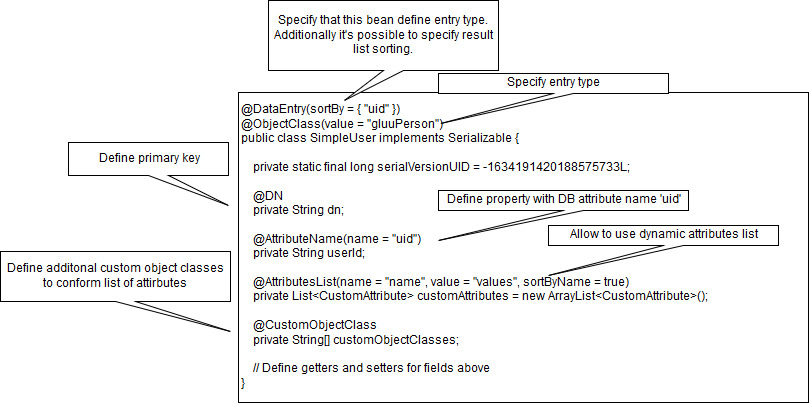
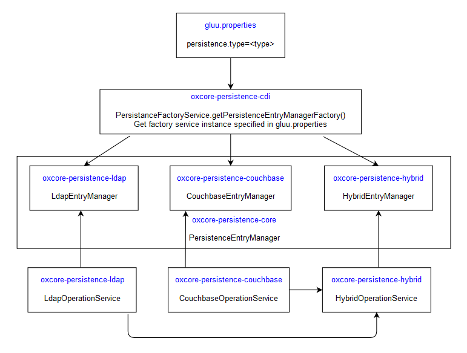
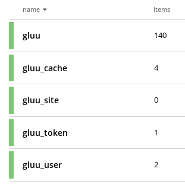

# Persistence Mechanisms

!!! Info
    This page is under construction. There will be some formatting issues, broken links, and other mistakes while it's being finalized.

## Overview

In previous versions, the Gluu Server used LDAP for its persistence layer. In CE 4.0, the persistence mechanism has been reviewed and extended new functionalities:

- The Gluu Server no longer has a dependency on specific DB persistence module.

- New persistence plugins can be added.

- Data can be split between multiple persistence modules.

In 4.0, CE comes with three persistence modules:

1. [LDAP](https://github.com/GluuFederation/oxCore/tree/master/persistence-ldap), the default persistence method in CE.

1. [Couchbase](https://github.com/GluuFederation/oxCore/tree/master/persistence-couchbase), supporting either local or remote installation with a pre-installed Couchbase server.
 
1. [Hybrid](https://github.com/GluuFederation/oxCore/tree/master/persistence-hybrid), a meta module that allows mapping data to different persistence modules. For example, a company can use LDAP for users and groups entries, but a different layer to store all other entries.

The internal data model is the same for all persistence modules. This consistency is based on generic annotations, the filters API, the persistence API, entry type (objectClass) and persistence key (Domain Name). Here is a sample persistence bean:


    
The persistence entry manager API provides CRUID operations, which works with persistence beans. The base API is defined in [PersistenceEntryManager](https://github.com/GluuFederation/oxCore/blob/master/persistence-core/src/main/java/org/gluu/persist/PersistenceEntryManager.java) in the oxcore-persistence-core library.

## Persistence Layer Dependencies

This diagram shows the EntryManager dependencies and type resolutions based on persistence.type specified in gluu.properties:



## Persistence Layer Modules

### LDAP

This module uses an LDAP server to store data. The module code is in the [oxcore-persistence-ldap](https://github.com/GluuFederation/oxCore/tree/master/persistence-ldap) project.

There are few major data structure changes in the 4.0 data model:

- Dropped `o=<inumOrg>` sub level
- Dropped `ou=appliances` sub level
- Moved configuration to `ou=configuration,o=gluu`
- Moved `ou=tokens` and `ou=authoriztions` from client sub-entries to `o=gluu`

In CE 4.0, there is a migrator to convert an existing data set to the new model.

<!-- More detail on the migrator to come -->

The following is an example of a typical LDAP tree after CE installation:


This module uses the configuration specified in `/etc/gluu/conf/gluu-ldap.properties`:

```
bindDN: <ldap_binddn>
bindPassword: <encoded_ ldap_pw>
servers: <ldap_hostname>:<ldaps_port>

useSSL: true
ssl.trustStoreFile: <ldapTrustStoreFn>
ssl.trustStorePin: <encoded_ldapTrustStorePass>
ssl.trustStoreFormat: pkcs12

maxconnections: 10

# Max wait 20 seconds
connection.max-wait-time-millis=20000

# Force to recreate polled connections after 30 minutes
connection.max-age-time-millis=1800000

# Invoke connection health check after checkout it from pool
connection-pool.health-check.on-checkout.enabled=false

# Interval to check connections in pool. Value is 3 minutes. Not used when onnection-pool.health-check.on-checkout.enabled=true
connection-pool.health-check.interval-millis=180000

# How long to wait during connection health check. Max wait 20 seconds
connection-pool.health-check.max-response-time-millis=20000

binaryAttributes=objectGUID
certificateAttributes=userCertificate
```

The default settings are suitable for most environments.

### Couchbase

[Couchbase](https://www.couchbase.com/) is a newly supported persistence layer option introduced in CE 4.0. Its data model is very similar to the LDAP layer, so an existing DB can be converted from LDIF to Couchbase. Here is sample data entry with key `scopes_10B2`:

```
{
  "dn": "inum=10B2,ou=scopes,o=gluu",
  "objectClass": "oxAuthCustomScope",
  "defaultScope": false,
  "description": "View your local username in the Gluu Server.",
  "inum": "10B2",
  "oxAuthClaim": [
    "inum=42E0,ou=attributes,o=gluu"
  ],
  "oxId": "user_name",
  "oxScopeType": "openid"
}
```


    
The list of buckets is not hardcoded and can be changed via the `gluu-couchbase.properties` configuration file.

The following is an example of the default mapping configuration:

```
buckets: gluu, gluu_client, gluu_cache, gluu_site, gluu_token, gluu_authorization, gluu_user, gluu_statistic

bucket.default: gluu
bucket.gluu_user.mapping: people, groups
bucket.gluu_cache.mapping: cache
bucket.gluu_statistic.mapping: statistic
bucket.gluu_site.mapping: cache-refresh
bucket.gluu_authorization.mapping: authorizations
bucket.gluu_token.mapping: tokens
bucket.gluu_client.mapping: clients
```

There are two mandatory keys in this configuration, `buckets` and `bucket.default`. `buckets` provides information about all available buckets. `bucket.default` is the main bucket that applications should use if other mapping rules were not applied.

The optional third type of line, `bucket.<>.mapping: <comma_separated_second_level_names>` gives instructions for which bucket should store specified entries. The value here is the RDN value of the second level in the LDAP tree.

The table below specifies the list of entry types that applications store in buckets:

| Bucket | Entry Type |
| --- | --- |
|gluu | gluuOrganization |
| | gluuConfiguration |  
| | oxAuthConfiguration |
| | oxTrustConfiguration |
| | oxPassportConfiguration |
| | oxApplicationConfiguration |
| | gluuAttribute |
| | oxCustomScript |
| | oxAuthCustomScope |
| | oxSectorIdentifier |
| | oxUmaResource |
| | oxUmaResourcePermission |
| | oxAuthUmaRPT |
| | oxAuthUmaPCT |
| | oxDeviceRegistration |
| | oxU2fRequest |
| gluu_client | oxAuthClient |
| gluu_cache | oxCacheEntity |
| gluu_site | gluuInumMap |
| gluu_authorization | oxClientAuthorization |
| gluu_token | oxAuthToken |
| gluu_user | gluuPerson |
| | gluuGroup|
| | pairwiseIdentifier |
| | oxDeviceRegistration |
| | oxFido2AuthenticationEntry |
| | oxFido2RegistrationEntry |
| gluu_statistic | oxMetric |

Both LDAP and Couchbase persistence layers use the [Gluu Filter API](https://github.com/GluuFederation/oxCore/blob/master/persistence-filter/src/main/java/org/gluu/search/filter/Filter.java) to minimize the Gluu Server's dependency on a specific DB. At runtime, the Couchbase persistence layer converts them to the N1QL query language.

This module uses the configuration specified in `/etc/gluu/conf/gluu-couchbase.properties`:

```
servers: <hostname>

connection.connect-timeout:10000
connection.connection-max-wait-time: 20000
connection.operation-tracing-enabled: false

# If mutation tokens are enabled, they can be used for advanced durability requirements,
# as well as optimized RYOW consistency.
connection.mutation-tokens-enabled: false

# Sets the pool size (number of threads to use) for all non blocking operations in the core and clients
# (default value is the number of CPUs).
# connection.computation-pool-size: 5

# Default scan consistency. Possible values are: not_bounded, request_plus, statement_plus
connection.scan-consistency: not_bounded

auth.userName: <couchbase_server_user>
auth.userPassword: <encoded_couchbase_server_pw>

buckets: gluu, gluu_client, gluu_cache, gluu_site, gluu_token, gluu_authorization, gluu_user, gluu_statistic

bucket.default: gluu
bucket.gluu_user.mapping: people, groups
bucket.gluu_cache.mapping: cache
bucket.gluu_statistic.mapping: statistic
bucket.gluu_site.mapping: cache-refresh
bucket.gluu_authorization.mapping: authorizations
bucket.gluu_token.mapping: tokens
bucket.gluu_client.mapping: clients

password.encryption.method: <encryption_method>

ssl.trustStore.enable: <ssl_enabled>
ssl.trustStore.file: <couchbaseTrustStoreFn>
ssl.trustStore.pin: <encoded_couchbaseTrustStorePass>
ssl.trustStore.format: pkcs12

binaryAttributes=objectGUID
certificateAttributes=userCertificate
```

### Hybrid

The hybrid persistence mechanism is a meta-DB persistence layer. Its main role is to add an abstraction layer to help split data between DBs. For example, it could be used to resolve these and other issues:

1. Store expired entries separately to reduce the main DB's size. For example, an id_token needed for the end_session endpoint
1. Store modification history
1. Use LDAP to store users data

This module combines other persistence layers, so all layers used should be correctly configured. This module uses the configuration specified in `/etc/gluu/conf/gluu-hybrid.properties`. The following is a sample file:

```
storages: couchbase, ldap
storage.default: couchbase
storage.ldap.mapping: people, groups
storage.couchbase.mapping: clients, cache, site, tokens, statistic, authorization
```

In this example, CE applications will use LDAP for `ou=people` and `ou=groups`. All other data will be stored in the Couchbase DB.

## Generic configuration properties

In 4.0, the base configuration details is stored in the `/etc/gluu/conf/gluu.properties` file.

The following is a self-explanatory sample configuration:

```
persistence.type=couchbase

oxauth_ConfigurationEntryDN=ou=oxauth,ou=configuration,o=gluu
oxtrust_ConfigurationEntryDN=ou=oxtrust,ou=configuration,o=gluu
oxidp_ConfigurationEntryDN=ou=oxidp,ou=configuration,o=gluu
oxcas_ConfigurationEntryDN=ou=oxcas,ou=configuration,o=gluu
oxpassport_ConfigurationEntryDN=ou=oxpassport,ou=configuration,o=gluu
oxradius_ConfigurationEntryDN=ou=oxradius,ou=configuration,o=gluu

certsDir=/etc/certs
confDir=
pythonModulesDir=/opt/gluu/python/libs
```
