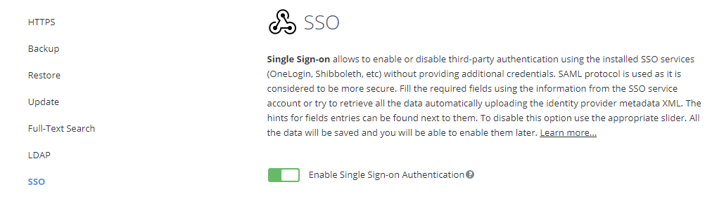
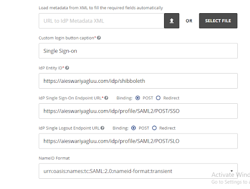
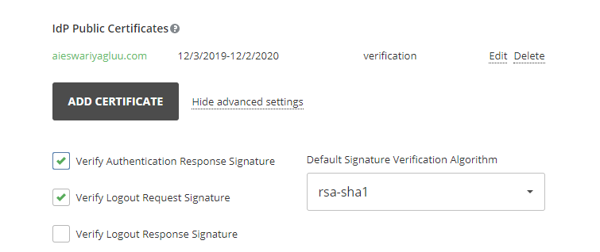
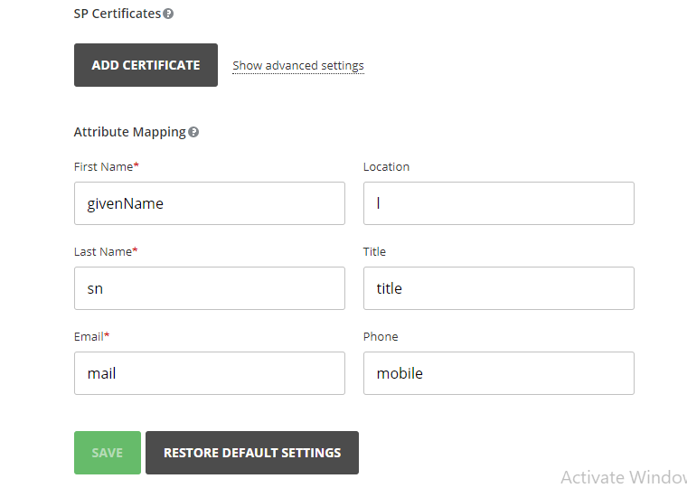
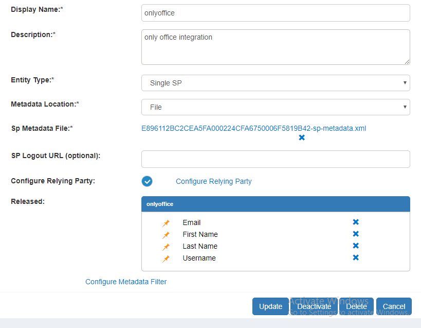
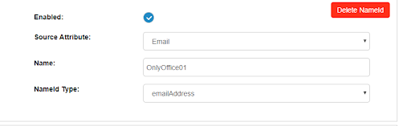

# Single Sign-On (SSO) to OnlyOffice

Follow these instructions to configure the Gluu Server and OnlyOffice for SSO. 

## Configure OnlyOffice

!!! Note
    Review the docs for [configuring OnlyOffice SSO](https://helpcenter.onlyoffice.com/server/controlpanel/enterprise/sso-description.aspx). 

1. Sign in to the OnlyOffice portal with an administrative account

1. Navigate to the Control Panel 

    

1. Click SSO (on the left menu), and select `Enable Single Sign-on Authentication`

    

1. Load metadata to fill the required fields automatically. Shibboleth provides the IdP metadata file at `https://{shibboleth-idp-domain}/idp/shibboleth`. Store the `shibboleth.xml` filein the local machine and upload it with the `SELECT FILE` button.

    

1. The Name ID format must be `Transient` <!--Check this, might be Persistent-->

1. In the Public Certificates section, check the box for both `Verify Authentication Response Signature` and `Verify Logout Request Signature` 

    

1. Inside the SP Certificates section, keep the default values for Attribute Mapping

    

1. Click the `Save` button 
     
1. Click `DOWNLOAD SP METADATA XML`

## Configure Gluu Server

Now, follow the instructions below to create a SAML Trust Relationship (TR) for OnlyOffice in the Gluu Server.

!!! Note
    Review the docs for [creating SAML TRs](../../admin-guide/saml.md). 

### Trust Relationship
1. Create a TR by clicking `Saml`, then `Add Trust Relationship`. Use the following fields:
    - `Display Name`: Name the TR (e.g. OnlyOffice SSO)
    - `Description`: Provide a description for the TR (e.g. SAML SSO TR for OnlyOffice)
    - `Metadata Type`: Select File
1. Upload the OnlyOffice metadata (downloaded during OnlyOffice configuration)
1. Release the following attributes: `TransientID` and `Email`
1. Add the TR
1. Select `Configure Relying Party` 
1. Add the following configurations: 
    - Select `SAML2SSO`
    - `includeAttributeStatement`: Enabled
    - `assertionLifetime`: keep the default
    - `assertionProxyCount`: keep the default
    - `signResponses`: conditional
    - `signAssertions`: never
    - `signRequests`: conditional
    - `encryptAssertions`: conditional
    - `encryptNameIds`: never
    - Save  
1. Click `Update` 
1. Click `Activate` 

    

### NameID

Now, configure the NameID: 

1. Navigate to `Configure custom NameID`
1. Click `Add NameID Configuration`
    - Check `Enabled`
    - For Source Attribute, select `Email` for the Source Attribute
    - For NameId Type, select `emailAddress` 

    
    
1. Click `Update`  

### Finishing configuration

1. Enable the PASSPORT_SAML
    - Go to configuration
    - Click on manage custom scripts
    - Click  passport_saml
    - Click on enable option 

1. Enable PASSPORT_SUPPORT
    - Go  to configuration
    - Click on organization Configuration option
    - Enable on Passport Support

1. Update Configuration
    - Go to Manage Authentication
    - Click on Default authentication method
    - Keep Passport_Saml inside Default acr
    - Click on `Update`
    - Click on `Manage LDAP Authetication`
        - `Active` LDAP connection
        - Click the `Update` button
