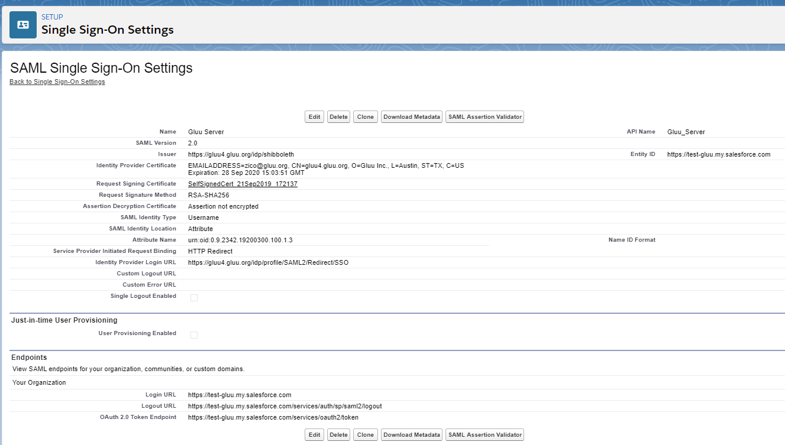

# Single Sign-On (SSO) to ONLYOffice

## Prepare ONLYOffice

- Log into ONLYOffice Portal with your administrative account.
- Click on Control Panel on the page.
 
- Click on SSO Option (on Left), And Select Enable Single Sign-on Authentication
  
   * Now you need to add the information of your Gluu Server here, And Click Save
     
  * Click DOWNLOAD SP METADATA XML
     
     
     ********************************************************************************************

## Prepare Gluu Server

* How to create SAML trust relationship is available [here](../../admin-guide/saml.md). 
* Grab ONLYOffice metadata from the ONLYOffice website. There is
  an option named `Download Metadata`. 
* Create Trust Relationship:
  * _Display Name_: Anything, whichever is easier for you to recognize this trust relationship.
  * _Description_: Anything, whichever is easier for you to recognize this trust relationship
  * _Metadata Type_: 'File'
  * Upload salesforce's metadata
  * Releases attributes: TransientID and Email
  * 'Add' this trust
  * Configure Specific Relying: It can be done from Gluu Server's GUI (named: oxTrust)
    * Select `SAML2SSO`
        * includeAttributeStatement: Enabled
        * assertionLifetime: keep the default one
        * assertionProxyCount: keep the default one
        * signResponses: conditional
        * signAssertions: never
        * signRequests: conditional
        * encryptAssertions: never
        * encryptNameIds: never
        * Save it
  * `Update` the trust relationship

