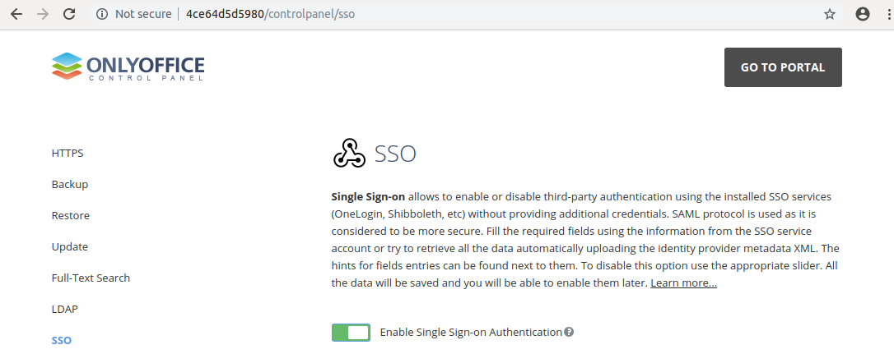
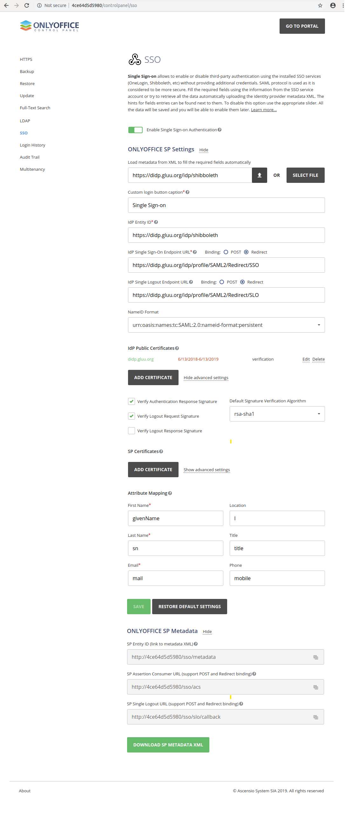

# Single Sign-On (SSO) to OnlyOffice

Follow these instructions to configure the Gluu Server and OnlyOffice for SSO. 

## Configure OnlyOffice
Follow the instructions below to configure OnlyOffice for SSO.

!!! Note
    Review the docs for [configuring OnlyOffice SSO](https://helpcenter.onlyoffice.com/server/controlpanel/enterprise/sso-description.aspx). 

- Sign in to the OnlyOffice portal with an administrative account

- Navigate to the Control Panel 
 

- Click SSO, and select `Enable Single Sign-on Authentication`
 

- Add your Gluu Server's SAML IDP metadata 

!!! Note
    The required fields can be filled automatically by uploading your SAML IDP metadata file. Download the `shibboleth.xml` file from your IDP endpoint (`https://<hostname>/idp/shibboleth`) and upload it using the `Select File` button.  

- Name ID format must be `Transient` 

- In the public Certificates section, check the box for both `Verify Authentication Response Signature` and `Verify Logout Request Signature` 

- Inside the SP Certificates section, keep the default values for Attribute Mapping

- Click `Save` 

  
     
- Click `DOWNLOAD SP METADATA XML`

## Configure Gluu Server

Now, follow the instructions below to create a SAML Trust Relationship (TR) for OnlyOffice in the Gluu Server.

!!! Note
    Review the docs for [creating SAML TR's](../../admin-guide/saml.md). 

Create a TR with the following fields:

- Display Name: Name the TR (e.g. OnlyOffice SSO)
- Description: Provide a description for the TR (e.g. SAML SSO TR for OnlyOffice)
- Metadata Type: Select File
- Upload your OnlyOffice metadata (downloaded during OnlyOffice configuration)
- Release the following attributes: TransientID and Email
- 'Add' the TR
- Select `Configure Relying Party` 
- Add the following configurations: 
  - Select `SAML2SSO`
  - `includeAttributeStatement`: Enabled
  - `assertionLifetime`: keep the default
  - `assertionProxyCount`: keep the default
  - `signResponses`: conditional
  - `signAssertions`: never
  - `signRequests`: conditional
  - `encryptAssertions`: never
  - `encryptNameIds`: never
  - Save  
- Click `Update` 
- Click `Activate` 

Now, configure the NameID: 

- Navigate to `Configure custom NameID`
- Click `Add NameID Configuration`
- Check `Enabled`
- For Source Attribute, select `Email` for the Source Attribute
- For NameId Type, select `urn:oasis:names:tc:SAML:1:1:nameid-format:emailAddress` 
- Click `Update`  

