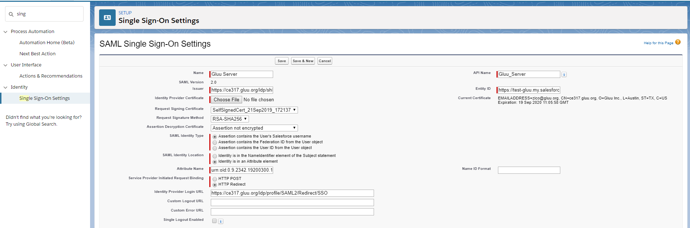
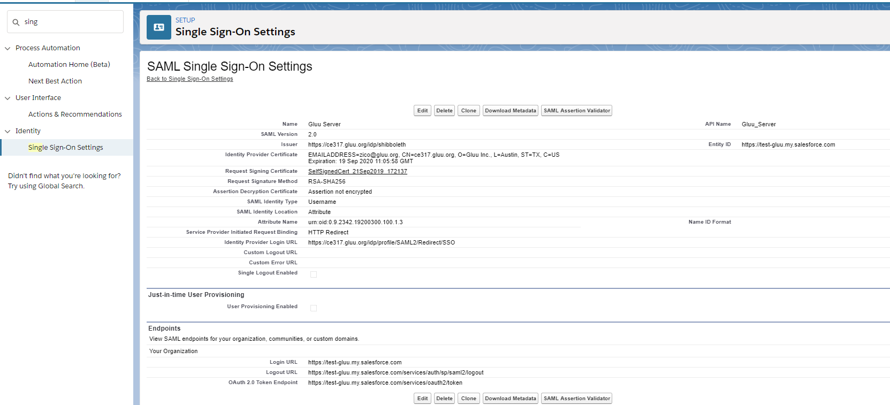
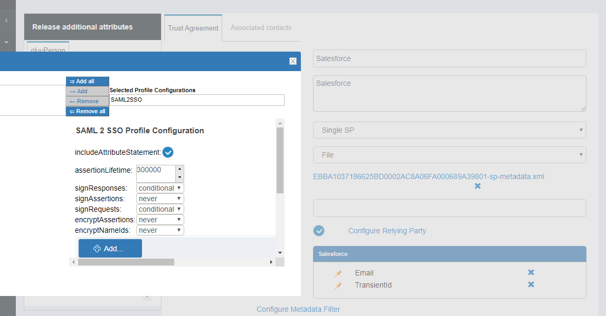
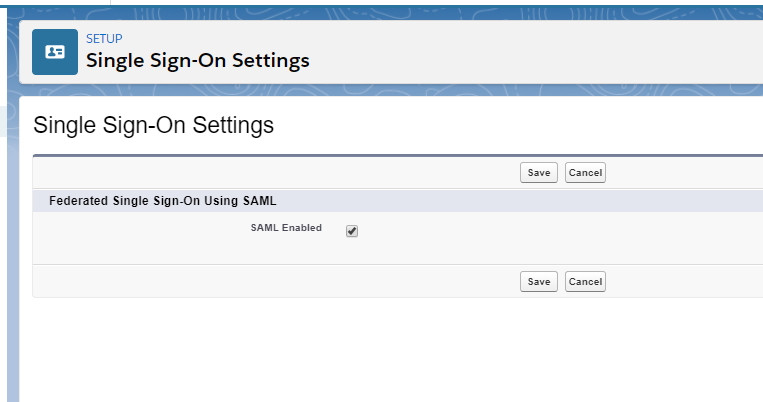
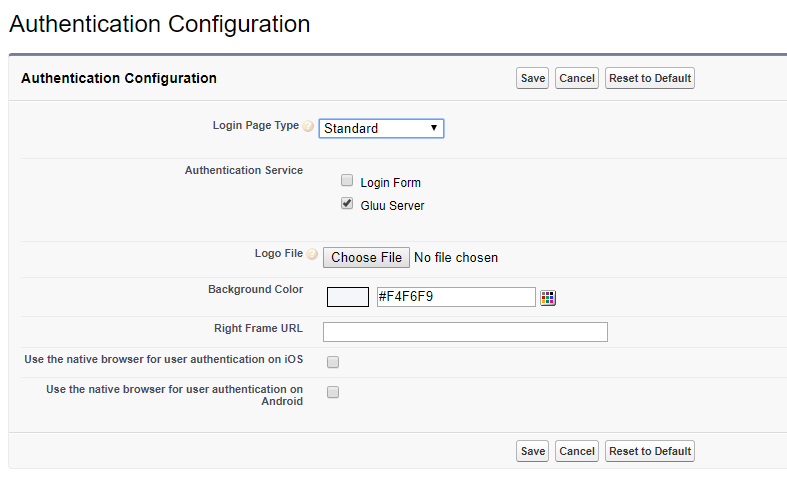

# Single Sign-On (SSO) to Salesforce.com

By default Salesforce suggest deployers to implement IDP-initiated SSO. The initialization of IDP-initiated SSO is little bit complex as it requires a big hostname which includes IDP's SSO link as well as SP's login uri. So we prefer SP-initiated SSO and here in this documentation we are presenting a very simple SP-initiated SSO steps with Salesforce and Gluu Server. Still, you can go for IDP-initiated SSO if you prefer. Further documentation is available at the Salesforce.com site.

## Prepare Salesforce.com

- Log in to Salesforce.com with your administrative account.
- Click on _Setup_ in the right upper corner of the page.
- You need to add a custom domain name for your Salesforce.com site if
  you do not have any yet.
  - Go to `Company Settings` > `My Domain`
  - Add your custom domain or use Salesforce issued domain for testing purpose. 
  - Wait for some time. Salesforce.com will register this domain name
  for you. As an example we use `test-gluu.my.salesforce.com` here.

  

* Register your Gluu Server information in Salesforce.com
   * Go to `Identity` > `Single Sign On Settings`
   * Click `New`

  

   * Now you need to add the information of your Gluu Server here
     * _Name_: Anything, whichever is easier for you to recognize this
       setup, i.e. `Gluu Server`
     * _API Name_: Gluu Server.
     * _Issuer_: EntityID of your Gluu Server, i.e. `https://ce317.gluu.org/idp/shibboleth`
     * _EntityID_: Your Salesforce.com custom domain name as chosen
       above, i.e. `https://test-gluu.my.salesforce.com`
     * _Identity Provider Certificate_: Grab your Gluu Server's "idp-signing"
       certificate. SAML certificate can be grabbed from your Gluu Sever's
       metadata or from `/etc/certs` location. Save the certificate and upload it.
     * _Request Signing Certificate_: Default certificate
     * _Request Signature Method_: RSA-SHA256
     * _Assertion Decryption Certificate_: Assertion not encrypted.
     * _SAML Identity Type_: Assertion contains user's Salesforce.com username
     * _SAML Identity Location_: Identity is in an Attribute element
     * _Attribute Name_: Provide 'SAML2 URI' of your attribute. For our test case we are using the urn value of Gluu Server's Email attribute. How to check the information of your attribute is available [here](http://www.gluu.org/docs/admin-guide/configuration/#attributes).
     * _NameID Format_: Leave this field empty.
     * _Identity Provider Login URL_: `https://ce317.gluu.org/idp/profile/SAML2/Redirect/SSO`
     * _Service Provider Initiated Request Binding_: HTTP-Redirect
     * Here is how our example setup looks like:
     
     

  * After confirmation you should get a page like below
  
     
     
     ********************************************************************************************

## Prepare Gluu Server

* How to create SAML trust relationship is available [here](../../admin-guide/saml.md). 
* Grab Salesforce.com metadata from the Salesforce.com website. There is
  an option named `Download Metadata`:
* Create Trust Relationship:
  * _Display Name_: Anything, whichever is easier for you to recognize this trust relationship.
  * _Description_: Anything, whichever is easier for you to recognize this trust relationship
  * _Metadata Type_: 'File'
  * Upload Salesforce's metadata
  * Releases attributes: TransientID and Email
  * 'Add' this trust
  * Configure Specific Relying: It can be done from Gluu Server's GUI (named: oxTrust)
    * Select `SAML2SSO`
        * includeAttributeStatement: Enabled
        * assertionLifetime: keep the default one
        * assertionProxyCount: keep the default one
        * signResponses: conditional
        * signAssertions: never
        * signRequests: conditional
        * encryptAssertions: never
        * encryptNameIds: never
        * Save it
  * `Update` the trust relationship
  
  * Here is how it looks like in our example setup:

  

## Test SSO

- Log in to Salesforce.com setup
- Create a sample user. You need to make sure that this user is also available in Gluu Server. 
- Click `Identity` > `Single Sign On Settings`
- Enable `Federated Single Sign-On Using SAML`: 
   - 
- Go to `Company Settings` > `My Domain`
- Configure `Authentication Configuration`
  - Hit `Edit`
  - Select `Gluu Server`
  - Save it
  - Here is how the `Authentication Configuration` looks like:
  
    

!!! Note
     This is an SP-initiated SSO, so it needs to be initiated from Salesforce.com.

## Salesforce Demo Video
You can watch a video demo of this SSO [Here](https://youtu.be/h8vd6hs4Xtc) 
