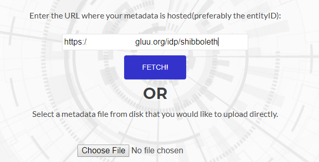
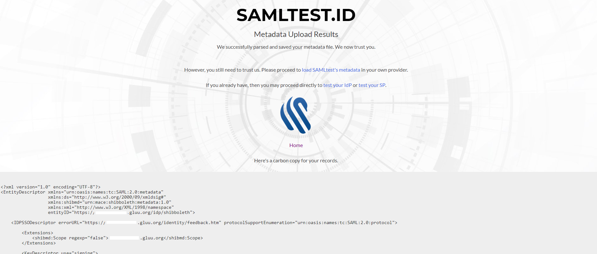
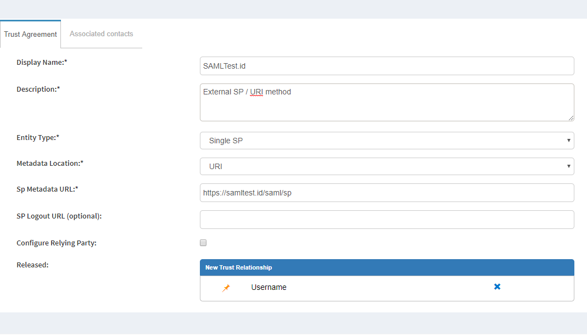
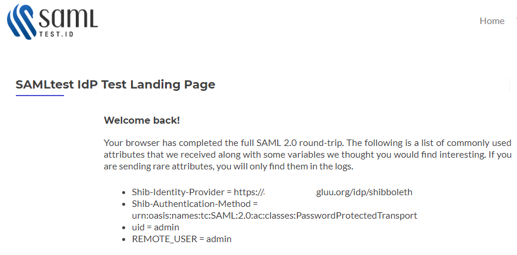
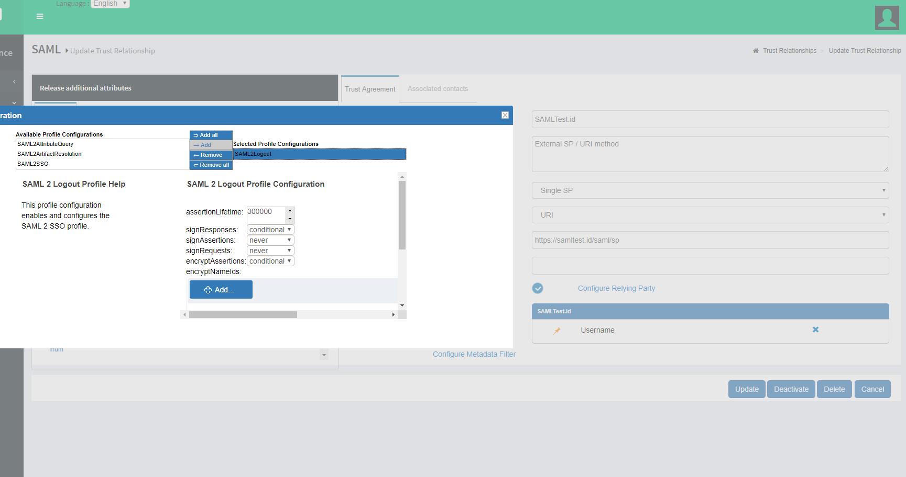
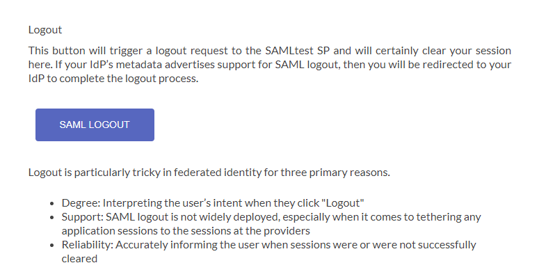

# Test Gluu Server with SAMLTest.id

## Configuration in SAMLTest.ID website

  - Navigate to the SAMLTest website: `https://samltest.id`
  - Upload or Fetch your Gluu Server Shibboleth metadata with the following link: `https://[hostname_of_gluu_server]/idp/shibboleth` 
  
  
  
  - After successful upload, you will see the following confirmation: 
  
  

## Configuration in Gluu Server

 - From `https://samltest.id/download/`, grab the SAMLTest.ID SP link: `https://samltest.id/saml/sp`
 - Move to create Trust Relationship in Gluu Server. [Here](../../admin-guide/saml.md#trust-relationship-requirements) is how you can create SAML Trust Relationship in Gluu Server.
 

## Test

 - Go to `https://samltest.id/start-idp-test/`
 - Login Initiator: `https://[hostname_of_gluu_server]/idp/shibboleth`
 - If everything goes well, you will your Gluu Server's login page
 - Log in there
 - You will be redirected to the SAMLTest.ID page.
 
 
 
### Logout Testing

 - To test logout from SAMLTest.ID, you need to enable the `SAML2Logout` Profile from the Trust Relationship like below. 
 
 
 
 - Update it, then test after 5 mins from SAMLTest.ID 
 
 
