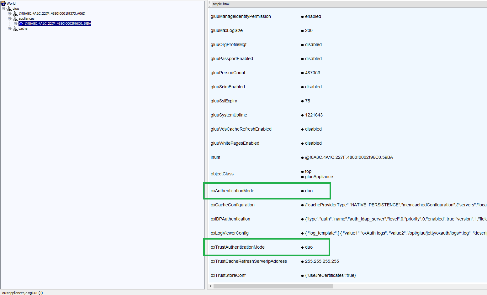

# FAQ

## Logs
When it comes to troubleshooting issues in the Gluu Server--from service hiccups to outages--your [server logs](./logs.md) are the best place to gather relevant information.

See what's going on by tailing the `identity` and `oxauth` logs:

```
tail -f /opt/gluu-server-4.0/opt/gluu/jetty/identity/logs/* \
        /opt/gluu-server-4.0/opt/gluu/jetty/oxauth/logs/*
```       

Logs can be lengthy and difficult to search. As needed, all logs inside the container can be cleared by using the clear-log feature explained in [clear-logs](./logs.md#clearing-logs).

## Running out of disk space 

Run the following commands if you find your instance running out of disk space:

```
/etc/init.d/gluu-server-4.0 stop
rm -rf /opt/gluu-server-4.0/opt/jetty-9.3/temp/*
/etc/init.d/gluu-server-4.0 start
```

## Adding Passport.js and/or Shibboleth IDP post installation

The `post-setup-add-components.py` script enables you to install the Shibboleth SAML IDP and Passport.js authentication middleware to your Gluu Server *post* installation. To add/install these components follow these steps:

1. Log in to your Gluu chroot container    
1. Change working directory to `/install/community-edition-setup/`: 

    ```
    cd /install/community-edition-setup/
    ```
          
1. Download the script:     

    ```
    wget https://raw.githubusercontent.com/GluuFederation/community-edition-setup/master/post-setup-add-components.py
    ```
          
1. Run the script with arguments either `-addshib` or `-addpassport`  

    ```
    python post-setup-add-components.py -addshib -addpassport
    ```

## Connect a remote debugger
Connecting your local debugger up to Gluu can help with troubleshooting. 

### Enable remote debugging 

Change the configuration of the `init.d` scripts for the `identity` and `oxauth` processes:

```
/etc/init.d/gluu-server-4.0 login
vim /etc/default/identity
```

Change:

```
JAVA_OPTIONS="-server -Xms256m -Xmx858m -XX:MaxMetaspaceSize=368m
-XX:+DisableExplicitGC -Dgluu.base=/etc/gluu
-Dserver.base=/opt/gluu/jetty/identity
-Dlog.base=/opt/gluu/jetty/identity -Dpython.home=/opt/jython
-Dorg.eclipse.jetty.server.Request.maxFormContentSize=50000000"
```

To: 

```
JAVA_OPTIONS="
  -server -Xms256m -Xmx858m 
  -XX:MaxMetaspaceSize=368m 
  -XX:+DisableExplicitGC 
  -Dgluu.base=/etc/gluu 
  -Dserver.base=/opt/gluu/jetty/identity 
  -Dlog.base=/opt/gluu/jetty/identity 
  -Dpython.home=/opt/jython 
  -Dorg.eclipse.jetty.server.Request.maxFormContentSize=50000000 
  -Xrunjdwp:transport=dt_socket,server=y,suspend=n,address=6005
"
```

The important bit is the last line starting with `-Xrunjdwp`. 

[Restart](./services.md#restart) the `identity` service

Do the same in `/etc/default/oxauth`, but choose a different port for the debugger to connect to:

```
-Xrunjdwp:transport=dt_socket,server=y,suspend=n,address=5005"
```

[Restart](./services.md#restart) the `oxauth` service.

Now, if you're running the gluu system inside a virtual machine (or just a different machine than your host machine), forward the ports `6005` and `5005` to your local machine. Type this command on your local machine, where you forward these two ports as you `ssh` into the Gluu machine:

```
ssh -L 5005:localhost:5005 -L6005:localhost:6005 user@gluu
```

As long as you keep this `ssh` connection open, you can access the debug ports `5005` and `6005` as if they were running locally.

Now, you can open up your favorite IDE like IntelliJ IDEA, Eclipse or Emacs and set up the debugger to connect to `5005` for `oxauth` and `6005` for `identity`.

### Grab the source
For remote debugging to make sense, you must have the source code checked out locally and you must check out the Git tag corresponding to the gluu server you're running.

For `oxAuth`:

```
git clone https://github.com/GluuFederation/oxAuth.git
cd oxAuth
git checkout version_4.0
```

For `identity`:

```
git clone https://github.com/GluuFederation/oxTrust.git
cd oxTrust
git checkout version_4.0
```

## Find your Gluu Server version

The Gluu Server version can be found in the oxTrust dashboard. Alternatively:

1. SSH into VM
2. Log in to Gluu-Server container. 

    a. Use the below command
    
     `service gluu-server-4.0 login`
     
3. To find oxTrust version

    `unzip -q -c /opt/gluu/jetty/identity/webapps/identity.war META-INF/MANIFEST.MF`  

4. oxAuth version can be found using below command 
  
    `unzip -q -c /opt/gluu/jetty/oxauth/webapps/oxauth.war META-INF/MANIFEST.MF`  

Version numbers for included software like IDP, oxAuth-rp, etc., can be viewed in the same directory. These apps can be identified with the [port number](./ports.md) after the localhost.

## Connect an external LDAP browser

Sooner or later you will probably want to peek at what is stored in the Gluu Server's local LDAP. This means connecting something like Apache Directory Studio to the `ldap` process running inside the chroot container.

You can find the configuration you need in `/opt/gluu-server-4.0/etc/gluu/conf/ox-ldap.properties`, e.g.:

```
bindDN: cn=directory manager
bindPassword: foobar
servers: localhost:1636
```

Forward the `1636` the same way as you did with the debug ports above. You can then see full details like how OpenID Connect clients are stored and how user objects are mapped in the LDAP tree.


## Changing hostnames/IP addresses/listening ports
It is not recommended to change the hostname or IP address or the listening port of any installed Gluu Server instance. The hostname and the IP address is used in many settings stored in LDAP configuration entries, Apache/Jetty configuration and into the custom authentication script. It is strongly recommended to use a fresh install in a new VM. 

!!! Note
    Please use static IP address with reverse proxy or load balancer or simple port forwarding.

## Setting the port to something other than 443
Ports other than 443 are not supported as the port is used by Apache Web Server. In theory, the change must reflect in the SAML and OpenID Connect metadata and still there might be errors.

!!! Note
    Please use a virtual ethernet interface and a different IP address on your server

## Request email instead of username for login
In oxTrust navigate to the Manage Authentication tab within the Configuration section. By default the Primary Key and Local Key are set to `uid`. Set those va    lues to `mail` and now your Gluu Server will expect email as the identifier instead of username.


Now you will want to update your IDP login page to display `Email Address` as the requested identifier. In order to do that you need to modify the `login.xhtm    l` file, which is located in `/opt/jetty-x.x/temp/jetty-localhost-xxxx-oxauth.war-_oxauth-any-1234.dir/webapp`. Insert `Email Address` as the value for `outputLabel`; this snippet is under the `dialog` class. S    ee the screenshot below. Alternative solution is to put customized `login.xhtml` into /opt/gluu/jetty/oxauth/custom/pages and [restart](./services.md#restart) `oxauth` service.


!!! Warning
    oxTrust is a tool for administrators and it must not be used as a user facing application.

## Installing a patch
Follow the documentation for [updating a .war file](../upgrade/index.md#updating-war-and-schema-manually). 


## Adding admin users

Please follow these steps to restore your Gluu admin account (you will probably need to substitute actual port, bind names and hostnames with ones used by your installation):

1. Log in to Gluu's chroot environment with the command below:

    ```
    service gluu-server-4.0 login
    ```

1. Run this command:

    ```
    /opt/opendj/bin/ldapsearch -p 1636 -Z -X -D 'cn=directory manager' -w 'YOUR_BIND_PASSWORD' -b o=gluu gluuGroupType=gluuManagerGroup 1.1
    ```

    and remember the displayed dn of the Gluu Manager Group for future use.

1. Run this command:

    ```
    /opt/opendj/bin/ldapsearch -p 1636 -Z -X -D 'cn=directory manager' -w 'YOUR_BIND_PASSWORD' -b o=gluu ou=people 1.1
    ```

    and remember the displayed dn of the People ou for future use.

1. While staying in the chrooted environment, create the file `~/add_user.ldif` using your favorite text editor, and copy the following lines to it:

    ```
    dn: inum=tempadmin,ou=people,o=@!F9CC.D762.4778.1032!0001!2C72.BB87,o=gluu
    changetype: add
    uid: tempadmin
    objectClass: gluuPerson
    objectClass: top
    givenName: tempadmin
    sn: tempadmin
    inum: tempadmin
    gluuStatus: active
    userPassword: 1q2w3e
    ```

    Please note the string's segment marked with bold: you will have to substitute it with dn of your own People ou which you've acquired in step 3.

1. Run this command:

    ```
    /opt/opendj/bin/ldapmodify -p 1636 -Z -X -D 'cn=directory manager' -w 'YOUR_BIND_PASSWORD' -f ~/add_user.ldif
    ```

    This will create new user tempadmin with attributes provided via file created in step 4).

1. Now create file `add_2_group.ldif` in your home ("~/") directory and copy the following lines to it:

    ```
    dn: inum=@!F9CC.D762.4778.1032!0001!2C72.BB87!0003!60B7,ou=groups,o=@!f9cc.d762.4778.1032!0001!2c72.bb87,o=gluu
    changetype: modify
    add: member
    member: inum=tempadmin,ou=people,o=@!f9cc.d762.4778.1032!0001!2c72.bb87,o=gluu
    ```

    Again, please note the strings' segment marked with bold: you will have to substitute contents of the "dn:" string with dn of your own Gluu Manager Group which you've acquired in step 2, and for "member:" string you will have to use the dn of tempadmin user (the one you already specified in the 1st line of the file in step 4).

1. Run this command:

    ```
    /opt/opendj/bin/ldapmodify -p 1636 -Z -X -D 'cn=directory manager' -w 'YOUR_BIND_PASSWORD' -f ~/add_2_group.ldif
    ```

This will add tempadmin user to the IdP managers group and you can then login and assign another user to act as admin.

## DNS errors
It is possible that even after configuring everything there is a `DNS` resolve error in Gluu Server.
The reason is the `DNS` used inside the chroot container; the `dns` used by the container is the Google DNS servers 
and the `DNS` for the host OS is not used. Therefore to fix this issue:

- Change the DNS inside the container by editing the `/etc/resolv.conf` file and adding the DNS used by your organization

## How to recover an admin password 
The Gluu Server stores the admin password in the file `/install/community-edition-setup/setup.properties.last` under the
property `ldapPass`. Retrieve the data using the following command:

```
grep ldapPass= /install/community-edition-setup/*.last
```

!!! Warning
    It is strongly recommended to remove the file from any production environment or encrypt the file

## Revert an authentication method
You should always test new authentication methods in a different browser to reduce the chance of lockout. However, while testing authentication scripts and mechanisms it is not unlikely that you will find yourself locked out of the Gluu Server admin GUI. 

In such a situation, you can use the following methods to revert back to the previous authentication method:

### Manual Method: 

This method rely on ldif file to change the authentication mode in LDAP server directly.

- Run the following command to collect the `inum` for the Gluu Server installation:   
    
    ```
    /opt/opendj/bin/ldapsearch -h localhost -p 1636 -Z -X -D "cn=directory manager" -w 'yourPassword' -b "ou=appliances,o=gluu" -s one "objectclass=*" dn
    ```
    
- Create an `LDIF` file with the contents below:
 
    `dn: inum=@!1E3B.F133.14FA.5062!0002!4B66.CF9C,ou=appliances,o=gluu`
    
    `changetype: modify`
    
    `replace: oxAuthenticationMode` (Add `replace: oxAuthenticationMode` if you move to change oxTrust login method)
    
    `oxAuthenticaitonMode: auth_ldap_server` (Add `oxTrustAuthenticaitonMode: auth_ldap_server` if you move to change oxTrust login method)
    
    As an example, we shall call this file `changeAuth.ldif`.
    
!!! Note
    Replace the `inum` from the example above with the `inum` of your Gluu Server from the `ldapsearch` command.

- Replace the authentication mode using `ldapmodify` command.

    ```
    ./ldapmodify -h localhost -p 1636 -D "cn=directory manager" -w "{password provided during setup}" -f revert.ldif
    ```
    
### Graphical method:

The idea here is to use an LDAP browser, hence this method is much more simple.

You have to update one or both oxAuthenticationMode and OxTrustAuthenticationMode values to match the desired authentication method value. For example for ldap which is the default authentication mode for Gluu, the value is `auth_ldap_server`. Below are the steps:

- Open LDAP in a LDAP Browser (JXplorer is used here and recommended).
- Navigate to "gluu > appliances > {GUID or appliance number}".
- Search for "oxAuthenticationMode"  and "oxTrustAuthenticationMode" attribute and replace values (i.e. duo) with 'auth_ldap_server'. 
    - OxAuthenticationMode attribute is used for Login pages, which stores the name of the custom script used.
    - OxTrustAuthenticationMode is used for OxTrust Admin UI page.
- Submit the changes.
- Try to access the login page or Gluu Admin UI.

One more option, InPrivate or Incognito or Private Browser from various Browsers can be used.

    
## No admin access after Cache Refresh?
Add the password for your admin account to `~/.pw` and then use the commands below to add yourself as an admin.

```bash
# set this to your actual user name
export newgluuadmin='myusername'

# this is the file that will hold the info to be imported
export ldiffile='addManagers.ldif'

# run this and verify that the output is for your account
/opt/opendj/bin/ldapsearch -h localhost -p 1636 -D "cn=directory manager" -j ~/.pw -Z -X -b "o=gluu" "uid=$newgluuadmin" uid givenName sn cn

dn: inum=@!134D.3C3D.796E.FECE!0001!E022.CC3C!0000!A8F2.DE1E.D7FB,ou=people,o=@!134D.
 3C3D.796E.FECE!0001!E022.CC3C,o=gluu
uid: myusername
givenName: John
sn: Doe
cn: John Doe
```

Now you can run these commands to make the file above:

```bash
head -n1 /opt/opendj/ldif/groups.ldif > $ldiffile
echo 'changetype: modify' >> $ldiffile
echo 'add: member' >> $ldiffile
echo "member: $(/opt/opendj/bin/ldapsearch -h localhost -p 1636 -D "cn=directory manager" -j ~/.pw -Z -X -b "o=gluu" "uid=$newgluuadmin" uid givenName sn cn |grep -A1 dn |cut -d ' ' -f 2- | sed 'N;s/\n//')" >> $ldiffile
```

The resulting LDIF will look like this:

```bash
dn: inum=@!134D.3C3D.796E.FECE!0001!E022.CC3C!0003!60B7,ou=groups,o=@!134D.3C3D.796E.FECE!0001!E022.CC3C,o=gluu
changetype: modify
add: member
member: inum=@!134D.3C3D.796E.FECE!0001!E022.CC3C!0000!A8F2.DE1E.D7FB,ou=people,o=@!134D.3C3D.796E.FECE!0001!E022.CC3C,o=gluu
```

Once the LDIF looks right, run this to grant your account admin rights in Gluu:

```bash
/opt/opendj/bin/ldapmodify -h localhost -p 1636 -D "cn=directory manager" -j ~/.pw -Z -X -f addManagers.ldif
```

Log in to the web interface and pick up where you left off.

## How do I present a different login page depending on where the user came from (i.e. based on the SP/RP)?

### SAML
The SAML IDP sends an authorization request to oxAuth for user authentication.. In the request there is a JWT state parameter which contains a claim called `relyingPartyId`. You can use this `relyingPartyId` to render the proper form based on the SP... so `SP=relyingPartyId`. 
 
## How to redirect your Gluu hostname to a URL other than /identity
By default, when you hit your Gluu Server hostname it will redirect to `<hostname>/identity` and you will login to your oxTrust GUI. As oxTrust is primarily an admin tool, you might want to change this default behavior so that users are not able to access oxTrust without specifically requesting the `<hostname>/identity` URL. Follow the below steps to adjust your web server configuration:

**Ubuntu / Debian:** 
 
1. Open: `/etc/apache2/sites-enabled/https_gluu.conf`
1. Search for: `RedirectMatch ^(/)$ /identity/`
1. Change `/identity/` to a different URL
1. [Reload](./services.md#reload) the `apache2` service

**CentOS / RHEL:** 

1. Open: `/etc/httpd/conf.d/https_gluu.conf`
1. Search for: `RedirectMatch ^(/)$ /identity/`
1. Change `/identity/` to a different URL
1. [Reload](./services.md#reload) the `httpd` service

## Concurrent login of the same user (same session). Got `retry` error.

When user is trying to login to multiple RP but do not finish login process then `retry` error can be returned which indicates that RP has to re-send authorization request. 
