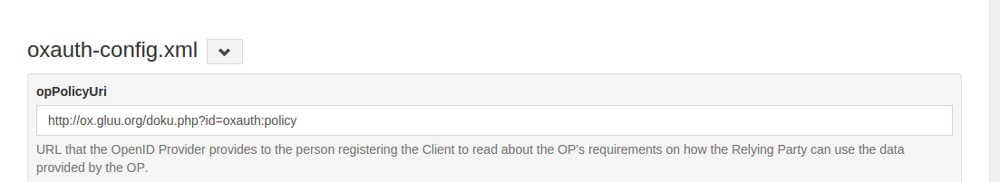

# oxAuth Configurations

!!! Attention
    The official support end-of-life (EOL) date for Gluu Server 2.4.4 is December 31, 2018. Starting January 1, 2019, no further security updates or bug-fixes will be provided for Gluu Server 2.X. We strongly recommend [upgrading](https://gluu.org/docs/ce/upgrade/) to the newest version.

## Overview
This page explains the JSON Configuration which can be accessed by navigating to `Configuration` > `JSON Configuration` > `oxAuth Configuration`. 

## oxAuth.properties

The descriptions for the oxAuth JSON configurations are given under the fields. 

[OxAuth Config JSON description](../reference/oxauth-config-json.json)
