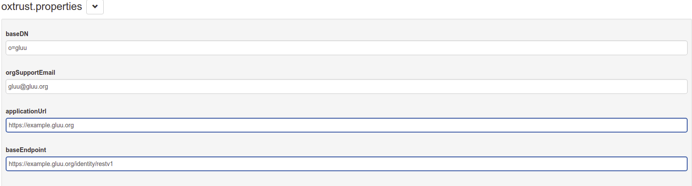

# oxAuth Configurations
## Overview
This page explains the JSON Configuration which can be accessed by navigating to `Configuration` > `JSON Configuration` > `oxAuth Configuration`. 

## oxAuth.properties


The following tables include the name and description of each configurable oxAuth property:

### General Configuration

Name                          |Description
---------------------------------------------------|-----------
sessionAsJwt                                       | Experimental feature. This saves session data as a JWT
Issuer                                             | URL using the https scheme that OP asserts as Issuer identifier
baseEndpoint                                       | The base URL for endpoints
authorizationEndpoint                              | The authorization endpoint URL
tokenEndpoint                                      | The token endpoint URL
tokenRevocationEndpoint                            | The URL for the access_token or refresh_token revocation endpoint
userInfoEndpoint                                   | The User Info endpoint URL
clientInfoEndpoint                                 | The Client Info endpoint URL
checkSessionIFrame                                 | URL for an OP IFrame that supports cross-origin communications for session state information with the RP Client using the HTML5 postMessage API
endSessionEndpoint                                 | URL at the OP to which an RP can perform a redirect to request that the end user be logged out at the OP
jwksUri                                            | URL of the OP's JSON Web Key Set (JWK) document. This contains the signing key(s) the RP uses to validate signatures from the OP
registrationEndpoint                               | Registration endpoint URL
openIdDiscoveryEndpoint                            | Discovery endpoint URL
idGenerationEndpoint                               | ID Generation endpoint URL
introspectionEndpoint                              | Introspection endpoint URL
introspectionAccessTokenMustHaveUmaProtectionScope | If True, rejects introspection requests if access_token does not have the uma_protection scope in its authorization header
umaConfigurationEndpoint                           | UMA Configuration endpoint URL
sectorIdentifierEndpoint                           | Sector Identifier endpoint URL
oxElevenGenerateKeyEndpoint                        | oxEleven Generate Key endpoint URL
oxElevenSignEndpoint                               | oxEleven Sign endpoint URL
oxElevenVerifySignatureEndpoint                    | oxEleven Verify Signature endpoint URL
oxElevenDeleteKeyEndpoint                          | oxEleven Delete Key endpoint URL
oxElevenJwksEndpoint                               | oxEleven JWKS endpoint URL
openidSubAttribute                                 | Specifies which LDAP attribute is used for the subject identifier claim
responseTypesSupported                             | This list details which OAuth 2.0 response_type values are supported by this OP. By default, every combination of `code`, `token` and `id_token` is supported.
grantTypesSupported                                | This list details which OAuth 2.0 grant types are supported by this OP
dynamicGrantTypeDefault                            | This list details which OAuth 2.0 grant types can be set up with the client registration API
subjectTypesSupported                              | This list details which Subject Identifier types that the OP supports. Valid types include pairwise and public.
defaultSubjectType                                 | The default subject type used for dynamic client registration
userInfoSigningAlgValuesSupported                  | This JSON Array lists which JWS signing algorithms (alg values) [JWA] can be used by for the UserInfo endpoint to encode the claims in a JWT
userInfoEncryptionAlgValuesSupported               | This JSON Array lists which JWS encryption algorithms (alg values) [JWA] can be used by for the UserInfo endpoint to encode the claims in a JWT
userInfoEncryptionEncValuesSupported               | This JSON Array lists which JWS encryption algorithms (enc values) [JWA] can be used by for the UserInfo endpoint to encode the claims in a JWT
idTokenSigningAlgValuesSupported                   | A list of the JWS signing algorithms (alg values) supported by the OP for the ID Token to encode the Claims in a JWT
idTokenEncryptionAlgValuesSupported                | A list of the JWE encryption algorithms (alg values) supported by the OP for the ID Token to encode the Claims in a JWT
idTokenEncryptionEncValuesSupported                | A list of the JWE encryption algorithms (enc values) supported by the OP for the ID Token to encode the Claims in a JWT
requestObjectSigningAlgValuesSupported             | A list of the JWS signing algorithms (alg values) supported by the OP for Request Objects
requestObjectEncryptionAlgValuesSupported          | A list of the JWE encryption algorithms (alg values) supported by the OP for Request Objects
requestObjectEncryptionEncValuesSupported          | A list of the JWE encryption algorithms (enc values) supported by the OP for Request Objects
tokenEndpointAuthMethodsSupported                  | A list of Client Authentication methods supported by this Token Endpoint
tokenEndpointAuthSigningAlgValuesSupported         | A list of the JWS signing algorithms (alg values) supported by the Token Endpoint for the signature on the JWT used to authenticate the Client at the Token Endpoint for the private_key_jwt and client_secret_jwt authentication methods
dynamicRegistrationCustomAttributes                | This list details the custom attributes for dynamic registration
displayValuesSupported                             | A list of the display parameter values that the OpenID Provider supports
claimTypesSupported                                | A list of the Claim Types that the OpenID Provider supports
serviceDocumentation                               | URL of a page containing human-readable information that developers might want or need to know when using the OpenID Provider
claimsLocalesSupported                             | This list details the languages and scripts supported for values in the claims being returned
idTokenTokenBindingCnfValuesSupported              | Array containing a list of the JWT Confirmation Method member names supported by the OP for Token Binding of ID Tokens. The presence of this parameter indicates that the OpenID Provider supports Token Binding of ID Tokens. If omitted, the default is that the OpenID Provider does not support Token Binding of ID Tokens
uiLocalesSupported                                 | This list details the languages and scripts supported for the user interface
persistIdTokenInLdap                               | Specifies whether to persist id_token into LDAP (otherwise saves into cache)
persistRefreshTokenInLdap                          | Specifies whether to persist refresh_token into LDAP (otherwise saves into cache)
claimsParameterSupported                           | Specifies whether the OP supports use of the claims parameter
requestParameterSupported                          | Boolean value specifying whether the OP supports use of the request parameter
requestUriParameterSupported                       | Boolean value specifying whether the OP supports use of the request_uri parameter
requireRequestUriRegistration                      | Boolean value specifying whether the OP requires any request_uri values used to be pre-registered using the request_uris registration parameter
opPolicyUri                                        | URL that the OpenID Provider provides to the person registering the Client to read about the OP's requirements on how the Relying Party can use the data provided by the OP
opTosUri                                           | URL that the OpenID Provider provides to the person registering the Client to read about OpenID Provider's terms of service
authorizationCodeLifetime                          | The lifetime of the Authorization Code
refreshTokenLifetime                               | The lifetime of the Refresh Token
idTokenLifetime                                    | The lifetime of the ID Token
accessTokenLifetime                                | The lifetime of the short lived Access Token
umaRptLifetime                                     | UMA RPT lifetime
umaTicketLifetime                                  | UMA ticket lifetime
umaPctLifetime                                     | UMA PCT lifetime
umaResourceLifetime                                | UMA Resource lifetime
umaAddScopesAutomatically                          | Add UMA scopes automatically if it is not registered yet
umaGrantAccessIfNoPolicies                         | Specify whether to grant access to resources if there is no any policies associated with scopes
umaRestrictResourceToAssociatedClient              | Restrict access to resource by associated client
umaKeepClientDuringResourceSetRegistration         | Save client information during resource registration
umaRptAsJwt                                        | Issue RPT as JWT or as random string
cleanServiceInterval                               | Time interval for the Clean Service in seconds
cleanServiceBatchChunkSize                         | Clean service chunk size which is used during clean up.
cleanServiceBaseDns                                | Array of base DNs where clean service will look up for expired entities.
keyRegenerationEnabled                             | Boolean value specifying whether to regenerate keys
keyRegenerationInterval                            | The interval for key regeneration in hours
defaultSignatureAlgorithm                          | The default signature algorithm to sign ID Tokens
oxOpenIdConnectVersion                             | OpenID Connect Version
organizationInum                                   | The Organization Inum
oxId                                               | URL for the Inum generator Service
dynamicRegistrationEnabled                         | Boolean value specifying whether to enable Dynamic Registration
dynamicRegistrationExpirationTime                  | Expiration time in seconds for clients created with dynamic registration, 0 or -1 means never expire
dynamicRegistrationPersistClientAuthorizations     | Boolean value specifying whether to persist client authorizations
trustedClientEnabled                               | Boolean value specifying whether a client is trusted and no authorization is required
dynamicRegistrationScopesParamEnabled              | Boolean value specifying whether to enable scopes parameter in dynamic registration
dynamicRegistrationCustomObjectClass               | LDAP custom object class for dynamic registration
personCustomObjectClassList                        | This list details LDAP custom object classes for dynamic person enrollment
authenticationFiltersEnabled                       | Boolean value specifying whether to enable user authentication filters
clientAuthenticationFiltersEnabled                 | Boolean value specifying whether to enable client authentication filters
authenticationFilters                              | This list details filters for user authentication
clientAuthenticationFilters                        | This list details filters for client authentication
sessionIdUnusedLifetime                            | The lifetime for unused session states
sessionIdUnauthenticatedUnusedLifetime             | The lifetime for unused unauthenticated session states
sessionIdLifetime                                  | The lifetime of session id in seconds. If 0 or -1 then expiration is not set. `session_id` cookie expires when browser session ends.
serverSessionIdLifetime                            | Dedicated property to control lifetime of the server side OP session object in seconds. Overrides `sessionIdLifetime`. By default value is 0, so object lifetime equals `sessionIdLifetime` (which sets both cookie and object expiration). It can be useful if goal is to keep different values for client cookie and server object.
sessionIdEnabled                                   | Boolean value specifying whether to enable session ID parameter
sessionIdRequestParameterEnabled                   | Boolean value specifying whether to enable session_id HTTP request parameter
sessionIdPersistOnPromptNone                       | Boolean value specifying whether to persist session ID on prompt none
fapiCompatibility                                  | Boolean value specifying whether turn on FAPI compatibility mode. If true AS behaves in more strict mode.
spontaneousScopeLifetime                           | The lifetime of spontaneous scope in seconds.
configurationUpdateInterval                        | The interval for configuration update in seconds
cssLocation                                        | The location for CSS files
jsLocation                                         | The location for JavaScript files
imgLocation                                        | The location for image files
metricReporterInterval                             | The interval for metric reporter in seconds
metricReporterKeepDataDays                         | The days to keep metric reported data
metricReporterEnabled                              | Boolean value specifying whether to enable Metric Reporter
pairwiseIdType                                     | the pairwise ID type
pairwiseCalculationKey                             | Key to calculate algorithmic pairwise IDs
pairwiseCalculationSalt                            | Salt to calculate algorithmic pairwise IDs
shareSubjectIdBetweenClientWithSameSectorId        | When `true`, clients with the same Sector ID also share the same Subject ID.
webKeysStorage                                     | Web Key Storage Type
dnName                                             | DN of certificate issuer
keyStoreFile                                       | The Key Store File (JKS)
keyStoreSecret                                     | The Key Store password
endSessionWithAccessToken                          | Choose whether to accept access tokens to call end_session endpoint
сookieDomain                                       | Sets cookie domain for all cookies created by OP
clientWhiteList                                    | This list specifies which client redirection URIs are white-listed
clientBlackList                                    | This list specified which client redirection URIs are black-listed
legacyIdTokenClaims                                | Choose whether to include claims in ID tokens
customHeadersWithAuthorizationResponse             | Choose whether to enable the custom response header parameter to return custom headers with the authorization response
frontChannelLogoutSessionSupported                 | Choose whether to support front channel session logout
useCacheForAllImplicitFlowObjects                  | Choose whether to persist all objects into the cache during implicit flow
invalidateSessionCookiesAfterAuthorizationFlow     | Boolean value to specify whether to invalidate `session_id` and `consent_session_id` cookies right after successful or unsuccessful authorization
updateUserLastLogonTime                            | Choose if application should update oxLastLogonTime attribute upon user authentication
updateClientAccessTime                             | Choose if application should update oxLastAccessTime/oxLastLogonTime attributes upon client authentication
enableClientGrantTypeUpdate                        | Choose if client can update Grant Type values
loggingLevel                                       | Specify the logging level for oxAuth loggers
corsConfigurationFilters                           | This list specifies the CORS configuration filters
logClientIdOnClientAuthentication                  | Choose if application should log the Client ID on client authentication
logClientNameOnClientAuthentication                | Choose if application should log the Client Name on client authentication
authorizationRequestCustomAllowedParameters        | This list details the allowed custom parameters for authorization requests
legacyDynamicRegistrationScopeParam                | Choose whether to allow legacy dynamic registration JSON array parameters
openidScopeBackwardCompatability                   | Set to false to only allow token endpoint request for openid scope with grant type equals to authorization_code, restrict access to userinfo to scope openid and only return id_token if scope contains openid
skipAuthorizationForOpenIdScopeAndPairwiseId       | Choose whether to skip authorization if a client has an OpenId scope and a pairwise ID
allowPostLogoutRedirectWithoutValidation           | Allows post-logout redirect without validation for the End Session endpoint
httpLoggingEnabled                                 | Enable/disable request/response logging filter
httpLoggingExcludePaths                            | This list details the base URIs for which the request/response logging filter will not record activity
externalLoggerConfiguration                        | The path to the external log4j2 logging configuration
disableU2fEndpoint                                 | Choose whether to disable U2F endpoints
disableJdkLogger                                   | Choose whether to disable JDK loggers
errorHandlingMethod                                | A list of possible error handling methods
useLocalCache                                      | Cache in local memory cache attributes, scopes, clients and organization entry with expiration 60 seconds

### Brute Force Protection

The Gluu Server comes with a feature to help protect against brute force attacks by periodically delaying login requests that occur too frequently in too short a period of time. The following parameters are listed under the `authenticationProtectionConfiguration` header:

Name                                  | Description
--------------------------------------|------------
attemptExpiration                     | How long, in minutes, to store a login attempt. 
maximumAllowedAttemptsWithoutDelay    | How many attempts the application allows before delaying
delayTime                             | How long, in seconds, to delay a login attempt that exceeds the maximum allowed
bruteForceProtectionEnabled           | Choose whether to enable this feature

All parameters except `bruteForceProtectionEnabled` require a server restart for changes to take effect.

For example, the following parameters:

```
attemptExpiration: 15
maximumAllowedAttemptsWithoutDelay: 4
delayTime: 2
bruteForceProtectionEnabled: true
```

... will insert a 2 second delay after every fourth login attempt within 15 minutes of each other.

### fido2Configuration

Name                                  | Description
--------------------------------------|------------
authenticatorCertsFolder              | Location of authenticator certificate folder
mdsAccessToken                        | MDS Access Token
mdsCertsFolder                        | Location of MDS TOC root certificate folder
mdsTocsFolder                         | Location of MDS TOC files folder
userAutoEnrollment                    | Select whether to enroll users on enrollment/authentication requests
unfinishedRequestExpiration           | Expiration time in seconds for pending enrollment/authentication requests
authenticationHistoryExpiration       | Expiration time in seconds for approved authentication requests
serverMetadataFolder                  | Location of authenticator metadata in JSON format, such as virtual devices
disableFido2                          | Enable/disable Fido2 endpoints
