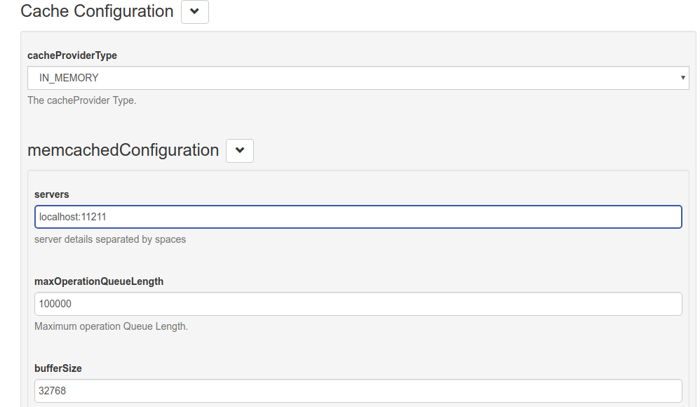

# Cache Provider Configuration
## Overview
This page explains the Cache Provider configuration that can be accessed by navigating to `Configuration` > `JSON Configuration` > `Cache Provider Configuration`. 

The following cache providers are now supported and can be selected via the cacheProviderType combo box field (see screenshot below):

[In Memory](#in-memory-configuration) - recommended for small deployments only   
[Memcached](#memcached-configuration) - recommended for single cache server deployment  
[Redis](#redis-configuration) - recommended for cluster deployments  
[Native Persistence](#native-persistence-configuration) - recommended to avoid additional components installation. All cache entries are saved in persistence layers.  

## Cache Provider Properties

The following tables include the name and description of each configurable oxAuth property:

### Cache Configuration

Name                          | Description
------------------------------| -----------
cacheProviderType             | The cache provider type

#### Memcached Configuration

Name                           | Description
------------------------------ | -----------
servers                        | Server details separated by spaces (e.g. `server1:8080 server2:8081)
maxOperationQueueLength        | Maximum number of operations that can be queued
bufferSize                     | Buffer size in bytes
defaultPutExpiration           | Expiration timeout value in seconds
MemcachedConnectionFactoryType | Is the Connection Factory in memory or memcached

#### In-Memory Configuration

Name                          | Description
------------------------------| -----------
defaultPutExpiration          | defaultPutExpiration timeout value in seconds

#### Redis Configuration

Name                          | Description
------------------------------|-----------
redisProviderType             | Type of connection: standalone, clustered, sharded, sentinel
Servers                       | Server details separated by commas (e.g. 'server1:8080,server2:8081')
password                      | Redis password
defaultPutExpiration          | Default expiration time for the object put into cache in seconds
useSSL                        | Enable SSL communication between Gluu Server and Redis cache
sslTrustStoreFilePath         | Directory Path to Trust Store
sentinelMasterGroupName       | Sentinel Master Group Name (required if SENTINEL type of connection is selected)
maxIdleConnections            | The cap on the number of \"idle\" instances in the pool. If maxIdle is set too low on heavily loaded systems it is possible you will see objects being destroyed and almost immediately new objects being created. This is a result of the active threads momentarily returning objects faster than they are requesting them, causing the number of idle objects to rise above maxIdle. The best value for maxIdle for heavily loaded system will vary but the default is a good starting point.
maxTotalConnections           | The number of maximum connection instances in the pool.
connectionTimeout             | Connection time out.
soTimeout                     | With this option set to a non-zero timeout, a read() call on the InputStream associated with this Socket will block for only this amount of time. If the timeout expires, a java.net.SocketTimeoutException is raised, though the Socket is still valid. The option must be enabled prior to entering the blocking operation to have effect. The timeout must be > 0. A timeout of zero is interpreted as an infinite timeout.
maxRetryAttempts              | Max retry attepts in case of failure. 

#### Native Persistence Configuration

Name                          | Description
------------------------------|-----------
defaultPutExpiration          | Default expiration time for the object put into cache in seconds
