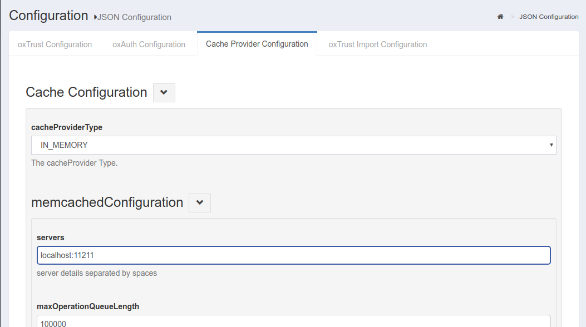

# Cache Provider Configuration
## Overview
This page explains the Cache Provider configuration that can be accessed by navigating to `Configuration` > `JSON Configuration` > `Cache Provider Configuration`. 

The following cache providers are now supported and can be selected via the cacheProviderType combo box field (see screenshot below):

[In Memory](#in-memory-configuration) - recommended for small deployments only   
[Memcached](#memcached-configuration) - recommended for single cache server deployment  
[Redis](#redis-configuration) - recommended for cluster deployments  
[Native Persistence](#native-persistence-configuration) - recommended to avoid additional components installation. All cache entries are saved in persistence layers.  

## Cache Provider Properties

The following tables include the name and description of each configurable oxAuth property:

### Cache Configuration

Name                          | Description
------------------------------| -----------
cacheProviderType             | The cache provider type

#### Memcached Configuration

Name                           | Description
------------------------------ | -----------
servers                        | Server details separated by spaces (e.g. `server1:8080 server2:8081)
maxOperationQueueLength        | Maximum number of operations that can be queued
bufferSize                     | Buffer size in bytes
defaultPutExpiration           | Expiration timeout value in seconds
MemcachedConnectionFactoryType | Is the Connection Factory in memory or memcached

#### In-Memory Configuration

Name                          | Description
------------------------------| -----------
defaultPutExpiration          | defaultPutExpiration timeout value in seconds

#### Redis Configuration

Name                          | Description
------------------------------|-----------
redisProviderType             | Type of connection: standalone, clustered, or sharded
Servers                       | Server details separated by commas (e.g. 'server1:8080,server2:8081')
password                      | Redis password
defaultPutExpiration          | Default expiration time for the object put into cache in seconds
useSSL                        | Enable SSL communication between Gluu Server and Redis cache
sslTrustStoreFilePath         | Directory Path to Trust Store

#### Native Persistence Configuration

Name                          | Description
------------------------------|-----------
defaultPutExpiration          | Default expiration time for the object put into cache in seconds
